# 编写优雅的 React 代码

> 原文：<https://javascript.plainenglish.io/the-elegance-of-react-1aa393a7d0f4?source=collection_archive---------5----------------------->

> 作为一名 React 开发人员，我们需要知道如何让我们的代码更简单、更易读。今天我会给你一些关于 react 的提示和技巧，帮助你优雅地编写代码。这只是 React 上的基本优雅，我会试着写更多关于这个神奇的库的帖子。
> 
> Pd:这是一篇关于如何在 React 上有一个好的代码的文章，如果你感兴趣，我会给你一些有更多信息的文章。

SEUNGWON HONG

我们已经知道，成为一名优秀的程序员会有一点困难，如果你不知道任何关于 JavaScript 的好的实践，困难会更大。因此，在这篇短文中，我们将讨论 React 和一些我们需要保持的良好实践，**让我们开始吧！**

# 索引

1.  纯组件或组件
2.  为什么我们需要在 React 上使用析构？
3.  学习正确使用 setState 方法。

# 纯组件或组件

当我们使用一个类组件时，我们有两种不同的选择:使用一个**纯组件**或**组件**那么，有什么不同呢？

如果我们在 **React** 文档中对生命周期进行研究，我们会发现我们有一个名为 s **houldComponentUpdate** 的方法，这里有一个例子:

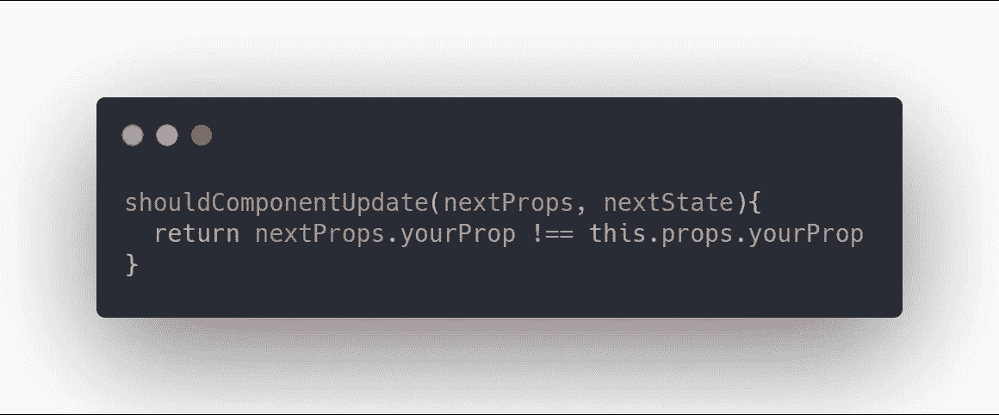

因此，这个函数将在下一个属性值和你的组件的实际属性值之间进行比较(记住 **React 是异步的**),所以，如果这个函数返回 true，你的组件将会用新的属性值重新渲染。

最大的区别在于你是否使用了 **React。PureComponent** 你不需要编写这个方法，因为 React 知道它需要自己进行比较，但是，如果你真的需要使用这个方法，你需要使用 **React。组件**。

> 是的，在这里你可以了解更多关于 React 的生命周期👋

# 为什么我们需要在 React 上使用析构？

在 ES6 中，我们有析构功能，如果你不知道析构是如何工作的，我们可以使用 Mozilla 的始终可靠的 [*MDN 来搜索它，以了解它是如何工作的。*](https://developer.mozilla.org/en-US/docs/Web/JavaScript/Reference/Operators/Destructuring_assignment)

通过析构，我们可以更容易地提取数组或对象内部的信息，因此我们可以通过观察这两幅图像的不同来解释析构:

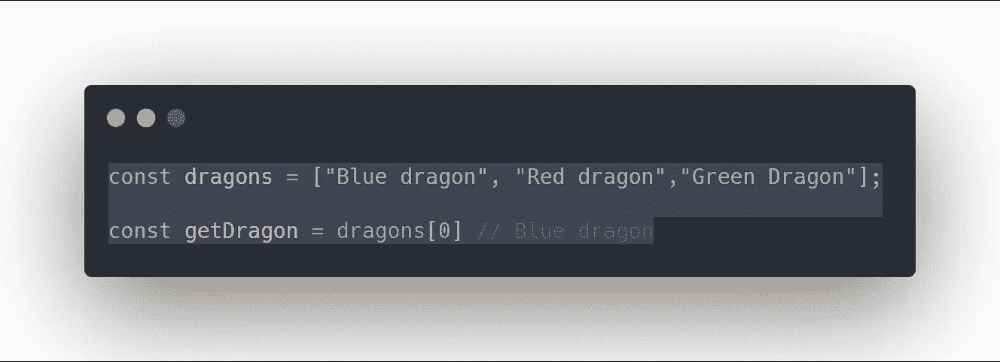

如你所见，我正试图用正常的方法得到一条龙来得到数组中的一个元素，没什么特别的

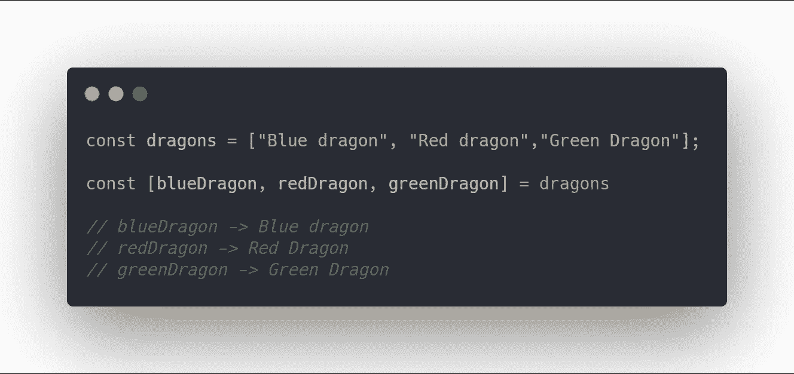

所以，这就是毁灭。通过析构，我们可以提取数组或对象内部的一些值或属性。

## 反应时析构

当我们使用 **React** 时，有时我们需要创建许多道具，我们有两个选择，第一个是使用 **this.props.propName** (如果我们使用的是类组件)或一个简单的参数叫做 **props** (在功能组件中)并使用析构。

我将展示两个例子，一个没有析构，另一个有析构

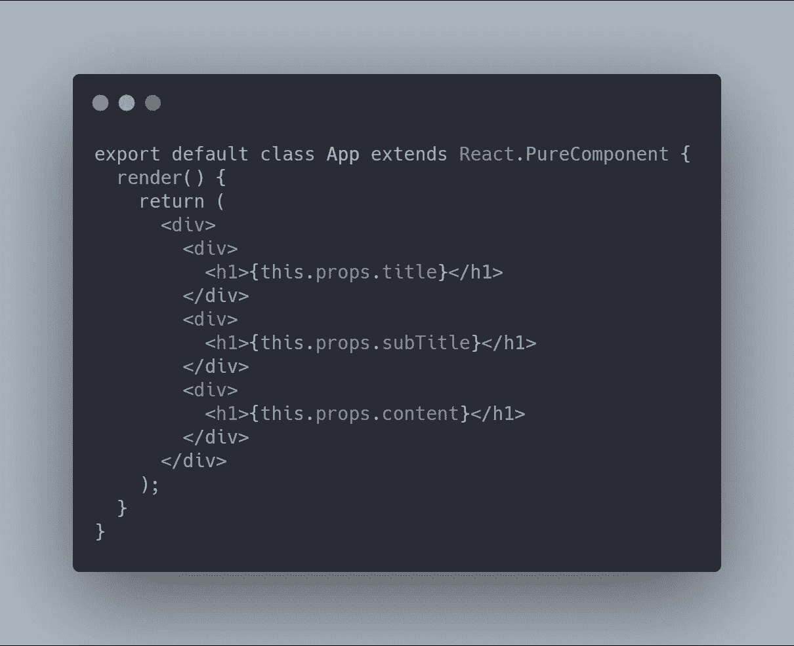

如果你不需要很多道具，你可以使用它，但是，如果你需要创造很多道具，你需要遵循的最好的方法就是解构

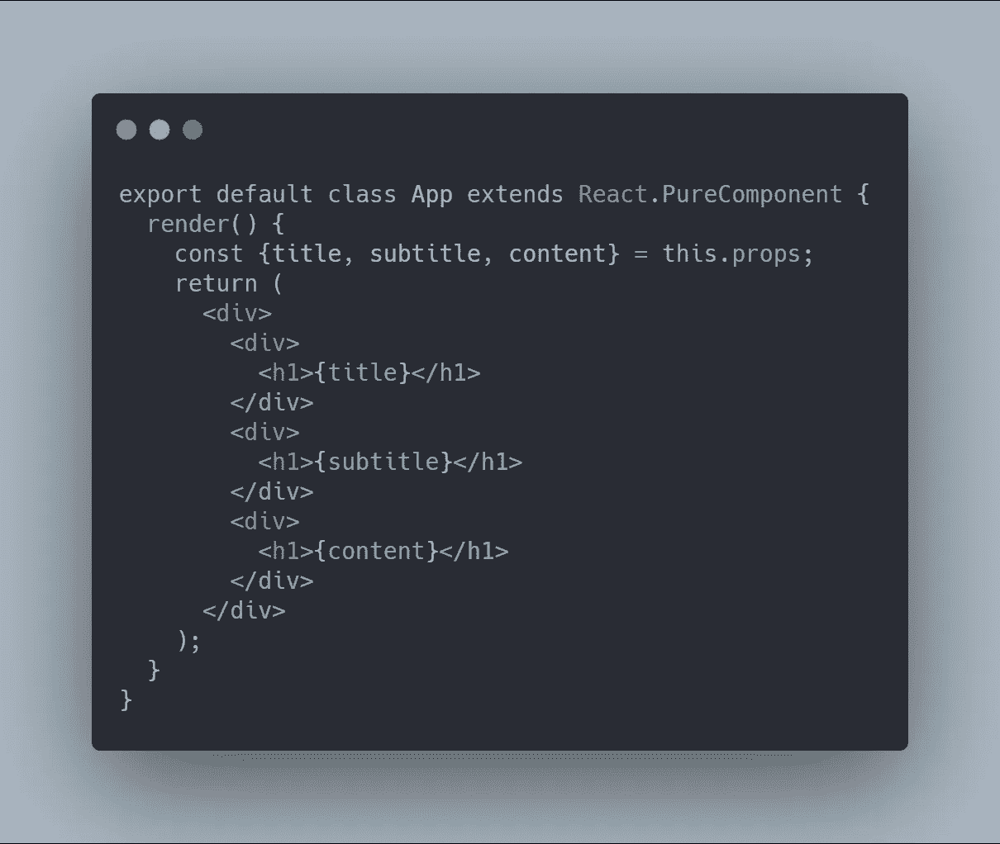

正如你所看到的，我们使用析构来创建一些我们将要使用的道具，这样更容易阅读和保存，你也可以在函数组件中使用它。

这里有一些例子来说明区别，但是使用函数组件，有时我们需要很多道具，所以当我们使用钩子时，了解更多的析构是至关重要的。

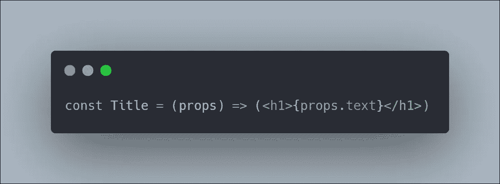

当我们使用函数组件时，我们需要创建一个名为 **props** 的参数来创建属性，但是我们可以使用析构来简化它

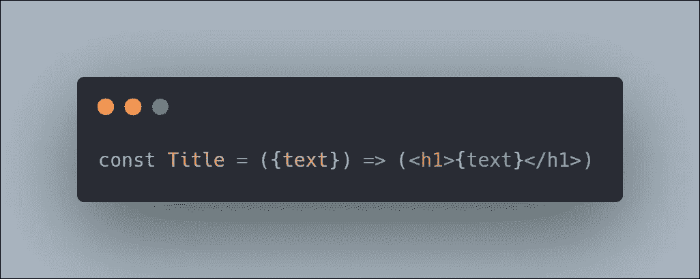

记住，一个函数组件将接收一个对象作为参数，所以我们可以使用析构来创建新的属性，而不用使用正常的方法。

# 学习正确使用 setState 方法

首先，我们需要知道 **React 组件**是如何工作的。实际上，我们知道我们在**上使用的每个组件都反应**它就像一个纯函数，这意味着相同的道具会给我们相同的结果。

如果你记得我说过 **React** 是基于函数式编程范例编写的，所以我们不能直接改变组件的状态。

因此，理解 **setState** 是如何工作的，这是我们需要一直保持的，例如:

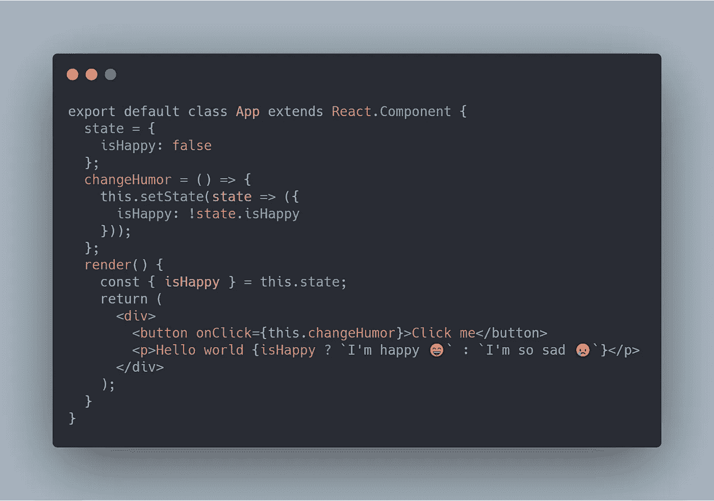

让我解释一下这段代码，我正在尝试更改 **isHappy** 的实际值，正如你所看到的，我没有尝试直接更改它，这将返回一个带有新值的新状态。

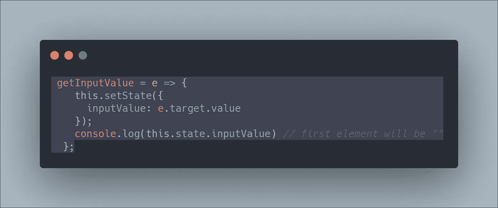

如何避免这种情况？正如我们所知，setState 有一个回调函数，所以我们可以用它来获取 **inputValue** 的实际值。

如果你对回调一无所知，那就是 [***“只是一个在另一个函数之后执行的函数”***](https://codeburst.io/javascript-what-the-heck-is-a-callback-aba4da2deced) *。*因此，我们需要在更改后生成控制台日志，这将为我们提供 **inputValue** 的实际值:

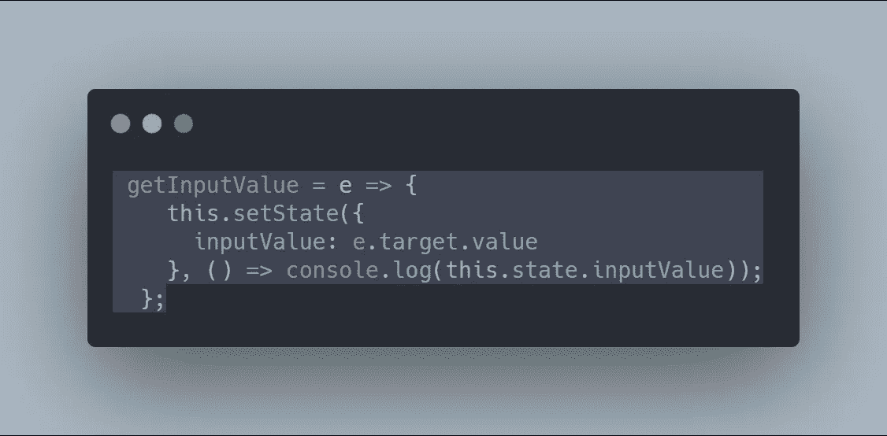

现在，我们可以使用 setState 回调来显示 **inputValue** 的实际值。

如果您想采取比控制台日志更多的操作，您可以创建一个新的作用域。

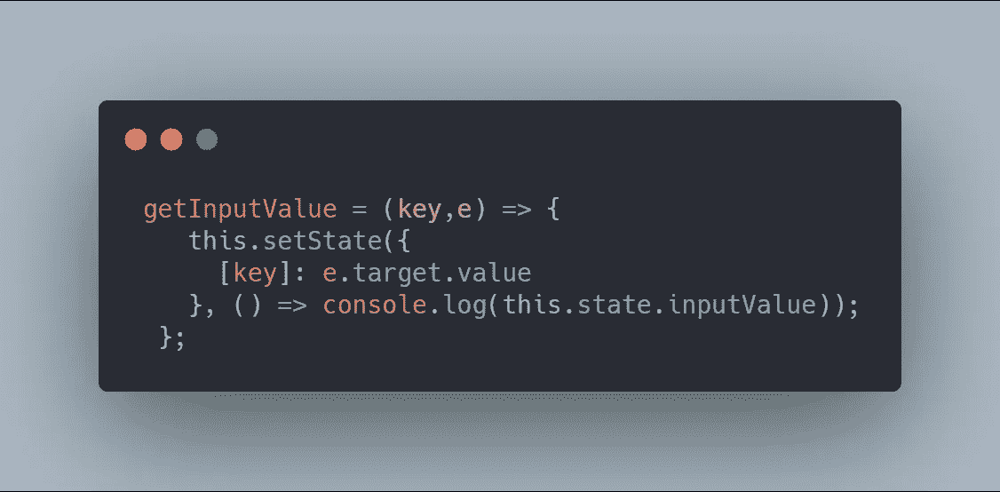

有时候你需要对不同的道具使用相同的功能。所以，我们可以创建动态键。

> [可以在这里了解更多信息](https://medium.com/@lcriswell/destructuring-props-in-react-b1c295005ce0) ✌️

> “给我一些掌声，如果这有助于你。嘿，我有另外一篇文章，也许你会感兴趣

 [## 初级前端开发人员的建议

### 当你开始从事 web 开发时，你必须掌握的所有东西。

medium.com](https://medium.com/javascript-in-plain-english/tips-from-a-junior-front-end-developer-aa0080781367)  [## 在 React 中解构道具

### 当我第一次学习用 JavaScript 进行析构时，我很犹豫要不要把它整合到我的 React 应用程序中。我发现…

medium.com](https://medium.com/@lcriswell/destructuring-props-in-react-b1c295005ce0)  [## 做出反应。成分-反应

### 该页面包含 React 组件类定义的详细 API 参考。它假设您熟悉…

reactjs.org](https://reactjs.org/docs/react-component.html#setstate)