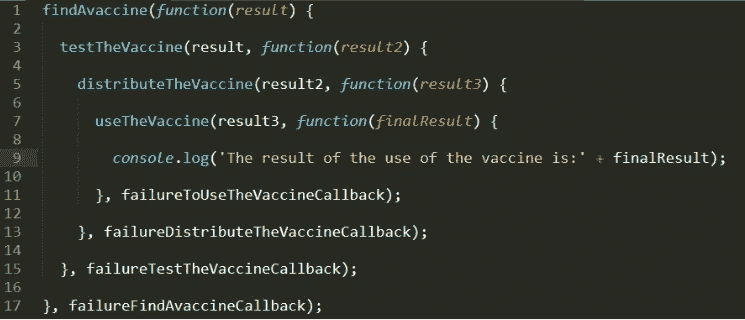
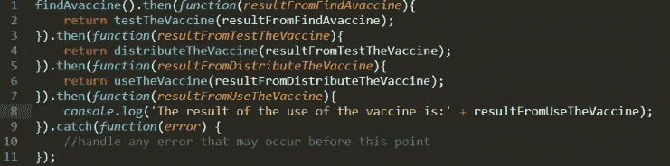
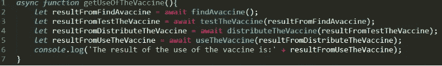

# 您应该理解的基本 JavaScript 概念

> 原文：<https://javascript.plainenglish.io/the-essential-javascript-concepts-that-you-should-understand-ff2b8546c868?source=collection_archive---------8----------------------->

## 为了成功发展和通过工作面试


作为任何级别的 JavaScript 开发人员，您都需要理解它的基本概念和一些帮助我们开发代码的新想法。在本文中，我们将回顾 16 个基本概念。所以事不宜迟，让我们开始吧。

## 索引

核心概念

*   动态的
*   参考值与值
*   相等运算符(==)与相同运算符(===)
*   范围
*   提升
*   关闭
*   IIEF
*   复试
*   高阶函数

ES6+

*   扩展语法
*   解构
*   Rest 语法
*   班级
*   承诺
*   异步等待
*   箭头功能

## 核心概念

## 动态的

我们认为 JavaScript 是一种动态语言，因为它有动态的方面。在 JavaScript 中，几乎所有东西都是动态的，例如，所有变量都是动态的，甚至代码也是动态的。动态类型化意味着变量的类型是在运行时确定的，不需要在使用变量之前显式声明变量。在 JavaSCript 中，你也可以在运行时用 eval()函数创建新的变量。但是，eval()是一个危险的函数，完全不鼓励使用。

## 参考与价值

在 JS 中，我们有对象(函数、数组)和原始数据类型(字符串、数字、布尔、空和未定义)。基本数据类型总是通过值传递，对象通过引用传递。

原始值是不可变的，这意味着一旦创建，它们就不能被修改，我们创建了原始对象的副本。相反，通过引用，我们创建了一个到原文的链接。

阅读更多关于不变性的重要性:[理解 JavaScript 中的不变性](https://medium.com/javascript-in-plain-english/understanding-immutability-in-javascript-b10b0345086e)。

按值:

```
const value= 'Hello world!';
value[0] = 'P';console.log(value); 
//Hello world, not Pello world!
```

通过引用:

```
const car1 = {
  brand: 'Ford',
  model: 'Mustang W-Code'
}**const car2 = car1;**car2.model= '**Thunderbird**';console.log(car1 === car2); 
//trueconsole.log(car1);
//{brand: 'Ford', model: '**Thunderbird**'}
```

## 相等运算符(==)与相同运算符(===)

“==”和“===”运算符之间的主要区别在于，“==”通过类型强制来比较变量，而===使用严格相等来比较变量，并且我们比较的类型和值必须相同。

例子

```
10 === 10
//true10 == "10"
//true (Although 10 is a number and the "10" a string)
```

## 范围

这个概念是许多新开发人员最难理解的概念之一。几乎所有编程语言最基本的范例之一是在变量中存储值的能力。

但是这些变量存在于哪里呢？它们存放在哪里？我们的程序如何得到它们？最后，什么是范围？

“范围”是我们代码中标识符有效的区域。

在 JavaScript 中，我们有四种类型的作用域:

*   全局范围范围:对所有对象可见(变量)
*   函数作用域:在函数中可见(var)
*   块范围(ES6+):在块内可见(let，const)
*   模块(ES6+):在模块内可见

## 提升

提升是一种机制，其中变量和函数声明在代码执行之前被移动到它们的“作用域”的顶部，因此，变量可能在它们的声明之前实际上是可用的。

示例:

```
a = 10; 
//Assign 10 to "a"console.log(a);
//10var a;
//Declare the "a" variable
```

## 关闭

闭包是一个函数的混合体，它被捆绑在一起(封闭在一起),并引用其周围的状态，这使您可以从内部函数访问外部函数的作用域。

示例:

```
function foo() {
  let myVar = 'Hello!!'; 
  //myVar is a local variable created by foo
  function alertMyVar() { 
    //alertMyVar() is the closure
    alert(name); 
    //Alert use the variable declared in the parent function
  }
  alertMyVar();
}
foo();
```

foo()函数创建一个名为 myVar 的局部变量和一个名为 alertMyVar()的函数。alertMyVar()函数是一个**内部函数**，它定义在 foo()函数内部，并且只在 foo()函数体中可用。alertMyVar() **可以访问外部函数**的变量，所以 alertMyVar()可以访问父函数中声明的变量 MyVar。

## 生活

立即调用的函数表达式(IIFE)是一个在函数创建后立即运行函数的过程。IIFEs 非常有用，因为它们防止污染全局环境，允许公共访问方法，同时维护函数内部定义的变量的隐私。

示例:

```
(function() {
   let name= "Hello world!";
   alert(name);
  }
)();//Hello world!
```

总之，我们使用生命主要是因为隐私。在 IIFE 函数中声明的任何变量都不能从外界获得。

## 复试

在 JavaScript 中，回调是作为参数传递给其他函数的函数，然后在外部函数中调用。回调也是闭包，传递给它的函数是在另一个函数内部执行的函数，就好像回调是在包含函数中定义的一样。

```
function runAsyncFunction(param1, callback) {
  //Do some stuff, 
  //for example download
  //data for a externan URL.
  //After a while...
  result = 100;
  callback(result);
}runAsyncFunction(10, (r) => {...}));//..
//Execute other tasks
//while the runAsyncFunction
//is running asynchronously.
```

回调的问题是代码有很多回调，很难直观地得到正确的结果，代码最终看起来如下例所示:



Callbacks-Hell

## 高阶函数

高阶函数是接收其他函数作为参数或返回函数作为结果的函数。它们在 JavaScript 中被广泛使用，如。filter()，。map()，。减少()或。forEach()函数。

考虑下面的例子:

```
const myArray = [1,2,3,4];
const myMultiplyFuncion = (n) => n*2;newArray = myArray.map(myMultiplyFuncion);
console.log(newArray);
//[2, 4, 6, 8]
```

**这里的高阶函数是。map(** ) **函数**接受 myMultiplyFuncion 并返回一个新数组，其中的值乘以 2。

此外，JavaScript 允许函数返回其他函数作为结果。记住函数只是简单的对象，它们可以像任何附加值一样被返回。

虽然这个例子有点傻，因为您可以直接使用 str.toUpperCase()，但它展示了一个函数如何返回另一个函数:

```
const myToUpperCasse = function(str) {
  return str.toUpperCase();
};console.log(myToUpperCasse("hello world!"));
//HELLO WORLD!
```

## ES6+

## 扩展语法

我们使用扩展操作符“…”将单个元素从数组中取出。

语法:some function(…iterable obj)；

考虑下一个例子:

```
const myArray = [1,2,3,4,5,6,7,8];
const min = Math.min(...myArray);
console.log(min);
//1
```

我们不能用 myArray 直接应用 Math.min，因为它不接受数组作为参数；它将单个元素作为参数。使用 spread 语法，我们可以这样做。

在下一个示例中，我们使用数组元素作为函数的参数:

```
function sum(a, b, c) {
  return a + b + c;
}const numbers = [1, 2, 3];console.log(sum(...numbers));
//6
```

串联数组:

```
let myArray1 = [1, 2, 3];
let myArray2 = [4, 5, 6];concatenatedArray = [...arr1, ...arr2];
console.log(concatenatedArray);
//[1,2,3,4,5,6]
```

组合对象:

```
const myObj1= { name: "Rick" };
const myObj2= { age:40, year: 1980 };const mergedObj = { ...myObj1, ...myObj2 };console.log(mergedObj);
//{name: "Rick", age: 40, year: 1980}
```

## 解构

析构是一个 JavaScript 表达式，它可以将对象或数组中的值属性提取到不同的变量中:

```
let var1, var2;
[var1, var2] = [1, 2];console.log(var1);
//1console.log(var2);
//2...const myConst= ['1', '2', '3'];
const [n1, n2, n3] = myConst;console.log(n1); 
//"1"
console.log(n2);
//"2"
console.log(n3);
//"3"
```

我们也可以很容易地交换变量:

```
let var1 = 1;
let var2 = 2;[var1, var2] = [var2, var1];
console.log(var1); 
//3
console.log(var2); 
//1
```

## Rest 语法

rest 语法允许我们将几个参数表示为一个数组。

语法:function f(a，b，…theArgs){
//做一些事情。
}

```
function sum(...theArgs) {
  return theArgs[0] + theArgs[5];
}sum(**1**, 2, 3, 4, 5, **6**);
//7
```

只有最后一个参数可以是“rest 参数”:

```
function sum(a, b, ...theArgs) {
  console.log(a);//1 
  console.log(b);//2return theArgs[0] + theArgs[3];
}sum(1**,** 2, 3, 4, 5, 6);//a:1,b:2
//9 -> (theArgs[0]:3 + theArgs[3]:6)
```

## 班级

Javascript 类是现有的基于原型的继承和构造函数之上的**语法糖**。

使用构造器模式:

```
function ConstructorCar (brand, model) {
    this.brand = brand;
    this.model = model;
}ConstructorCar.prototype.isFord = function (brand) {   
   return this.brand === "Ford";
};myCar = new ConstructorCar("Ford", "Sierra");
console.log(myCar.isFord("Ford"));
//true
```

用 isBMW()方法扩展我们的构造函数:

```
ConstructorCar.**prototype**.isBMW = function (brand) {   
   return this.brand === "BMW";
};myCarBWM = new ConstructorCar("BMW", "505");
console.log(myCarBWM.isBMW("BMW"));
//true
```

使用类别语法的对等用法:

```
class Car {
  constructor(brand, model) {
    this.brand = brand;
    this.model = model;
  }isFord(brand){
    return this.brand === "Ford";
  }}myCar = new Car("Ford", "Sierra");
console.log(myCar.isFord("Ford"));
//true
```

用 isBmw()方法扩展该类:

```
class CarBMW **extends** Car{
  constructor(brand, model) {
     super(brand,model);
  }
  isBMW(brand){
    return this.brand === brand;
 }
}myCar1 = new CarBMW("Ford", "Sierra");
console.log(myCar1.isFord("Ford"));
//truemyCar2 = new CarBMW("BMW", "505");
console.log(myCar2.isBMW("BMW"));
//true
```

## 承诺

承诺是一个值的代理，代表解决或拒绝的未来操作的结果。它允许您将处理程序与异步操作相关联，并且是避免使用回调的替代方法。

Promises 立即返回一个 promise 对象，您使用“Then”方法传递异步函数完成时要采取的操作。

使用他们的<then>方法，承诺可以被连锁。每个链接的函数返回一个新的承诺，表示链中另一个异步步骤的完成。</then>

承诺总是处于这些状态之一:

*   “待定”:初始状态。
*   “已完成”:表示操作成功完成。
*   “拒绝”:表示操作失败。

与我们使用承诺回调的例子一样:



Promises example image

## 异步等待

Async/Await 是 ES2017 中的新功能，它可以帮助我们为异步任务编写完全同步的代码。

与 promises 相比，它的主要优点是带有“异步函数”的代码的语法和结构与使用标准同步函数相似，并且与我们顺序思考的方式相当。

异步函数可以包含<awaits>表达式，用于暂停异步函数的执行，并等待传递的承诺的解析。当承诺被解析后，将恢复异步函数的执行并返回结果值。</awaits>

相同的 promises 示例，但是使用了 Async/await:

注意:您需要将包含它的函数定义为 async。



Async/await example image.

Promises 和 Async/Await 实现了同样的事情，但是 Async/Await 使得处理异步代码更加自然。两者都消除了回调的需要和著名的回调地狱。

你可以阅读我的关于 JavaScript 异步代码的完整文章，见:“[JavaScript 中从回调到异步等待的旅程。](https://medium.com/javascript-in-plain-english/javascript-a-fast-trip-for-dummies-from-callbacks-to-es6-async-await-a61b0a4b0bed)”

## 箭头功能

箭头函数在语法上是常规函数的紧凑替代物；与常规函数不同，箭头函数不绑定“this”对象。相反,“this”对象是词汇绑定的，保持其原始上下文。
注意，箭头函数表达式不适合作为方法，它们不能用作构造函数或递归函数，但在 map()、reduce()或 filter()等函数中非常有用

```
const sum = function(a, b){
   return a + b;
}Equivalent arrow function:const sum = (a,b) => a+b;
```

具有过滤功能:

```
let array = [1,2,3,4,5]
let newArray = array.filter( e => e > 2);
//[3,5,5]
```

## 结论

在本文中，我们已经看到了我认为的 JavaScript 的一些基本部分。我们仍然需要讨论“这个”对象或者原型和继承，但是考虑到它的复杂性，我将把它留到另一篇文章中，在那里我将详细解释它们。

我希望你喜欢这篇文章。非常感谢你阅读我！

## 简明英语笔记

你知道我们有四种出版物吗？给他们一个 follow 来表达爱意:[**JavaScript in Plain English**](https://medium.com/javascript-in-plain-english)[**AI in Plain English**](https://medium.com/ai-in-plain-english)[**UX in Plain English**](https://medium.com/ux-in-plain-english)[**Python in Plain English**](https://medium.com/python-in-plain-english)**—谢谢，继续学习！**

**此外，我们总是有兴趣帮助推广好的内容。如果您有一篇文章想要提交给我们的任何出版物，请发送电子邮件至[**submissions @ plain English . io**](mailto:submissions@plainenglish.io)**，附上您的媒体用户名和您感兴趣的内容，我们将会回复您！****