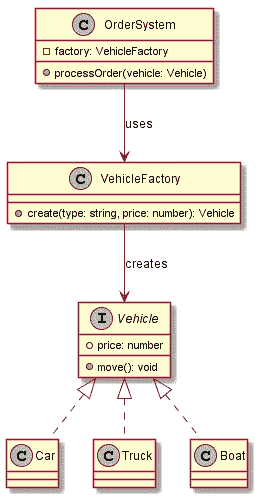

# 工厂模式——设计模式满足前端

> 原文：<https://javascript.plainenglish.io/the-factory-pattern-design-patterns-meet-the-frontend-9bea762847c?source=collection_archive---------9----------------------->

想象一下。销售汽车的汽车经销商🚗。突然，他们想扩大业务，销售卡车🚛。您最初编写了订单和销售系统来处理汽车。你现在做什么？您是否复制了系统中的大部分业务逻辑来专门处理卡车？

当然，这样做有点快。不久之后，经销商决定开始销售摩托车。

🤦哦，不。更多的代码复制？如果订单系统需要更改会发生什么，我们现在需要在**三个**地方更新吗！！？

我们都经历过。很难预测这种情况何时会发生。但当它发生时，要知道有一个解决方案，最初可能需要一点重构，但肯定意味着一个更可维护的解决方案，特别是当经销商说它将开始销售船只的时候！🛥️

在本文中，我们将讨论:

*   💪解决方案——工厂模式
*   🤔我应该什么时候使用它？
*   🤯一些优点和缺点
*   ❓:它在前端世界的什么地方被使用？
*   🏭我们来看一个例子！

# 💪解决方案——工厂模式

工厂模式是一种创造性的设计模式，它在通用类型的多个对象之间的公共基础行为上添加了一个抽象层。
*客户端代码*，将使用该层的代码，不需要知道行为实现的细节，只要它存在。

如果我们以汽车经销店转变为多种车辆经销店为例，我们可以看到汽车、卡车和船只的共同点是它们都是车辆。经销商内部的订单系统只需处理基本车辆，不需要了解正在处理的车辆的具体情况。

让我们快速看一下 UML 图来说明这一点:

从图中我们可以看到，系统包含了`Vehicle`接口的具体实现。`OrderSystem`不知道或者不需要知道这些具体的实现是什么，它只是简单地依靠`VehicleFactory`来创建并在需要时返回它们，因此将我们的`OrderSystem`与经销商想要销售的`Vehicles`分离开来！🚀🚀🚀

他们现在可以扩展到任意多的车辆，我们只需要创建一个新的`Vehicle`接口实现，并更新我们的`VehicleFactory`来创建它！🔥🔥🔥

# 🤔我应该什么时候使用它？

除了上面描述的情况之外，还有一些情况非常适合这种模式:

*   在运行时或运行期间，您不知道代码的特定部分需要处理的确切类型或依赖关系的任何情况。
*   如果您正在开发一个库，使用工厂模式允许您为消费开发人员提供一种方法来扩展其内部组件，而不需要访问源代码本身！
*   如果需要节省系统资源，可以使用这种模式创建对象池，新对象不存在时存储在对象池中，存在时从对象池中检索，而不是创建新的对象池。

# 🤯一些优点和缺点

优势:

*   它避免了工厂的消费者和具体实现之间的紧密耦合。
*   通过允许在一个区域维护创建代码，在某种程度上它满足了*单一责任原则*。
*   它还符合*开放/封闭原则*，允许在不破坏现有代码的情况下添加新的具体实现。

缺点:

*   这可能会增加代码库的复杂性和可维护性，因为它需要为每个工厂和具体实现创建许多新的子类

# ❓:它在前端世界的什么地方被使用？

令人惊讶的是*(也许不是)*，Angular 允许在他们的模块提供者中使用工厂。开发人员可以使用工厂为模块提供依赖关系，这在提供者所需的信息直到运行时才可用时非常有用。

你可以在[工厂供应商](https://angular.io/guide/dependency-injection-providers#factory-providers)的 Angular 文档中了解更多信息。

# 🏭我们来看一个例子！

这在前端的一个很好的例子是跨平台的用户界面。

想象一下，有一个显示对话框的跨平台应用程序。应用程序本身应该允许一个对话框被渲染和隐藏。移动应用程序上的对话框呈现方式可能与桌面上的不同。然而，功能应该是相同的。该应用程序可以使用工厂在运行时创建正确的对话框。

对于这个例子，我们将使用 TypeScript 来创建一个`Dialog`、一个`MobileDialog`和一个`DesktopDialog`的两个实现。该应用程序将使用用户代理字符串来确定该应用程序是在桌面还是移动设备上查看，并将使用工厂来创建正确的对话框。

*注意:通常，开发一个响应对话框更理想，然而，这是一个说明工厂模式的例子。*

让我们从创建一个基本的对话框界面开始

该接口定义了任何具体实现都将遵循的公共行为和状态。
让我们创建这些具体的实现:

这个功能只有微小的变化，你可能会认为抽象类更适合这个，因为`render`和`hide`方法是相同的。为了这个例子，我们将继续使用接口。

接下来，我们想创建我们的工厂:

我们的工厂采用了一个`type`，并将随后创建`Dialog`的正确实现。

最后，我们的应用程序需要使用我们的工厂:

查看上面的代码，我们可以看到应用程序不需要知道具体的实现，相反，逻辑是`DialogFactory`的责任。

希望这个代码示例有助于阐明工厂模式及其在前端世界中的潜在用途。

就个人而言，我理解这种模式的概念和优点，但是我不喜欢它的实现所需要的对继承的关注和依赖。

随意讨论任何其他的例子或者你自己对这种模式的看法，因为我还没有决定。
如有任何问题，欢迎在下方提问或在 Twitter 上联系我: [@FerryColum](https://twitter.com/FerryColum) 。

*原发布于 2019 年 12 月 9 日*[*https://dev . to*](https://dev.to/coly010/the-factory-pattern-design-patterns-meet-the-frontend-1p2l)*。*