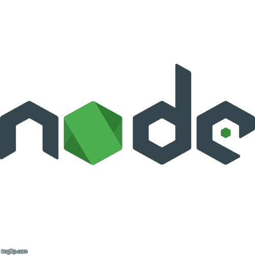
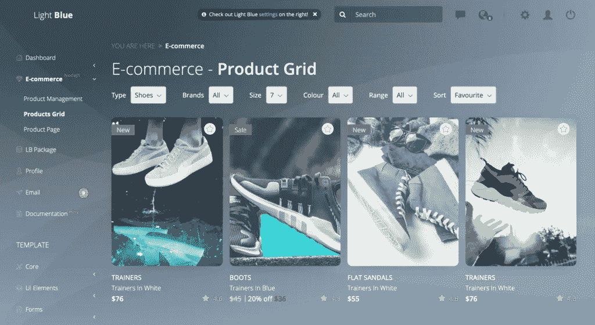
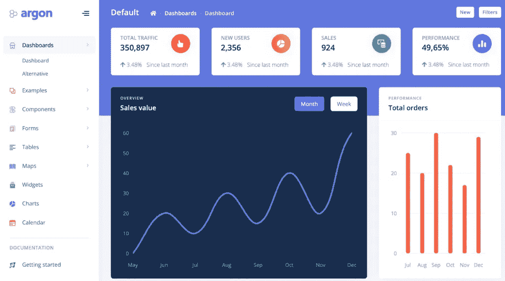
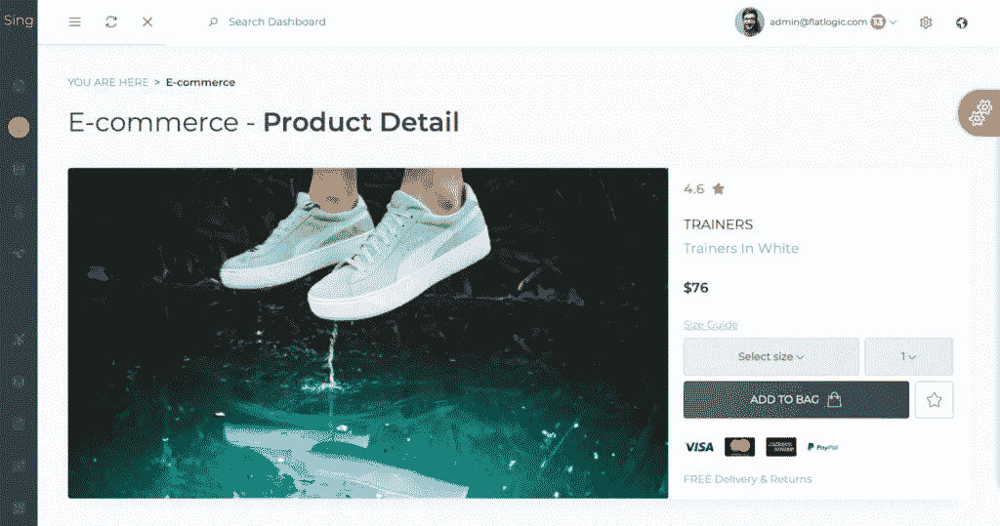
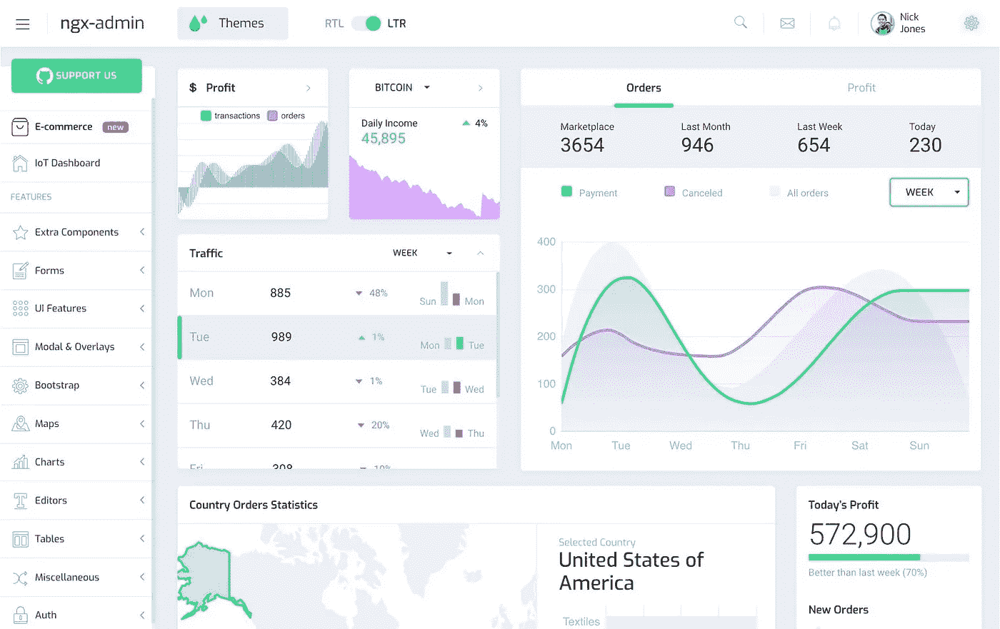
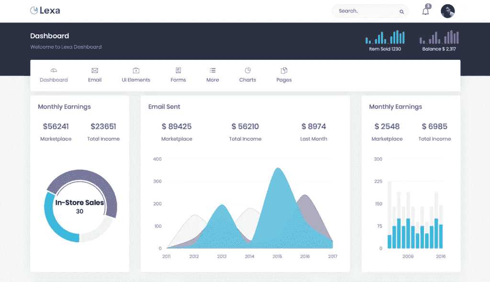

# 使用 Node.js 后端的五个最佳管理模板

> 原文：<https://javascript.plainenglish.io/the-five-best-admin-templates-using-a-node-js-backend-d8c62930acec?source=collection_archive---------2----------------------->

越来越多的开发人员目前决定增加他们的工作流程，减少不必要的杂务，并通过带有 Node.js 后端的管理仪表板构建他们的计算机生成的桌面。

你应该使用 Node.js 吗？Node.js 有一个使用 JavaScript 的运行时设置。这意味着利用该平台的最大好处是，您必须在一种编程语言中同时拥有前端和后端。这使您可以协调应用程序两个部分中的数据。这明显加快了发展的进程。

使用 Node.js 后端的管理模板为您提供了一个准备好的应用前端部分，它还包括一个预制的后端。多种登录方式，产品管理，CRUD 应用程序和 PostgreSQL 已经可以与管理面板相结合。

的确，在你的发展岗位上变得更大、更好、更强需要某种改变或修正，这样你才能更有效率地工作。富有成效和多事之秋有着巨大的差异，尽管有效参与这种变化的主要关键是用正确的工具武装起来。如今，我们正是要这样做。我们将使用 Node.js 后端浏览 5 个不同的管理模板，因此您现在可以提高您的开发效率。

# **浅蓝色 React Node.js 管理模板**

[https://demo.flatlogic.com/light-blue-react/#/app/ecommerce/products](https://demo.flatlogic.com/light-blue-react/#/app/ecommerce/products)

浅蓝色的 React Node.js 是一个 React.js 模板，结合了 Node.js 后端和 PostgreSQL。对于任何想要创建电子商务应用程序、CMS 以及 SASS web 应用程序、CRM 等的人来说，这都是一个非常好的选择。因为它有现成的工作身份验证、社交登录和产品管理部件。此外，该模板还配备了 60 多个现成的 UI 部件，您也可以自定义这些部件。首先，所有需要做的就是安装应用程序，一切就绪。

**特点**

*   PostgreSQL 已加入
*   CRUD 应用程序
*   六十多个现成的用户界面部件，您可以自定义部件
*   反应 16.5.2 以及
*   深厚的背景以及
*   八个图表库
*   电子商务部门

**价格:99.95 美元**

[**附加信息**](https://flatlogic.com/admin-dashboards/light-blue-react-node-js)

[**演示**](https://demo.flatlogic.com/light-blue-react/#/app/main/dashboard)

[**单据**](https://demo.flatlogic.com/light-blue/documentation/)

# **Argon Admin Dashboard Pro node . js**

[https://argon-dashboard-pro-nodejs.creative-tim.com/dashboard](https://argon-dashboard-pro-nodejs.creative-tim.com/dashboard)

这个模板是 Creative Tim 和 Udevoffice 合作的结果，旨在提供一个完全编码的“前端和后端”解决方案。它提供了大量的 UI 组件来帮助你创建任何你想要的 web 应用程序。dashboard 的最大优势是该产品提供了一种轻量级、快速、可伸缩和现代的构建应用程序的方法。

**特性**

*   十六个你可以定制的插件
*   两百个手工制作的雏形
*   25 张样张
*   SASS 文件以及
*   草图文件

**价格:149 美元**

[**附加信息**](https://www.creative-tim.com/product/argon-dashboard-pro-nodejs)

[**演示**](https://argon-dashboard-pro-nodejs.creative-tim.com/dashboard)

[**单据**](https://argon-dashboard-pro-nodejs.creative-tim.com/docs/getting-started/overview.html)

# **Sing App Vue Node.js 管理模板**

[https://demo.flatlogic.com/sing-app-vue/#/app/ecommerce/product](https://demo.flatlogic.com/sing-app-vue/#/app/ecommerce/product)

Sing App Vue Node.js 是一个仪表板模板，结合了 Node.js 后端和 Postgres 数据库。它既有产品管理页面，也有集成的几种登录方式，可以随时使用。该应用程序是完整的，可以安装到任何类型的亚马逊 aws，以及 heroku 等。如果你希望构建 SAAS、CMS 和电子商务应用，并且希望节省一些时间和金钱，这将是一个很好的开始。此外，您还将看到 60 多个现成的 UI 部件，您还可以对其进行定制。

**特性**

*   六十多个现成的用户界面部件，你也可以定制
*   最新的 Vue.js 版本
*   CRUD 应用程序
*   PostgreSQL 组合
*   主题支持
*   电子商务部门
*   静态和悬停侧边栏

价格:99.95 美元

[**附加信息**](https://flatlogic.com/admin-dashboards/sing-app-vue-node-js)

[**演示**](https://flatlogic.com/admin-dashboards/sing-app-vue-node-js/demo)

[**单据**](https://demo.flatlogic.com/sing-app/documentation/)

# **Node.js MongoDB 启动包**

[https://store.akveo.com/collections/all/products/nodejs-mongodb-ngx-admin-angular-starter-bundle](https://store.akveo.com/collections/all/products/nodejs-mongodb-ngx-admin-angular-starter-bundle)

这个包是 ngx-admin 与 Node.js 后端结合的最小套件。该软件包包括用户界面的 JWT 验证以及后端加基本用户管理。你可以根据需要选择两种不同的套装:初级套装或电子商务套装。这个电子商务集包含一些额外的特性，如订单详细信息页面和示例订单表。它的仪表板依赖于 Angular ngx-admin、Express REST API、MongoDB 以及其他广泛使用的有价值的技术。如果您正在寻找模板的文档，您应该了解文档是随可交付的归档文件一起提供的。

**特性**

*   Angular 和 Node.js 项目以及
*   ExpressJS、MongoDB 集成以及
*   公共和 JWT 保护的 API 端点以及
*   授权/注册/密码检索表单以及 API 和
*   个人资料页面 CRUDL

**价格:39-140 美元**

[**附加信息**](https://store.akveo.com/collections/all/products/nodejs-mongodb-ngx-admin-angular-starter-bundle)

[**演示**](https://bundle-demo.azurewebsites.net/pages/dashboard)

# **莱克萨管理模板**

[https://lexa-node.ourdemo.website](https://lexa-node.ourdemo.website)

使用 Bootstrap 4 以及 Node.js 和 jQuery 创建莱克萨。它完全可以接受，并且有一个干净的用户界面，包括了顶级的部件、UI 元素和小部件。

管理员模板的横向设计看起来很棒，这是一个相当好的显著性。莱克萨为每个版本都提供了一流的代码，开发者可以根据自己的需求轻松定制。这是一个通用的管理模板，可以用来创建所有类型的项目。

**特性**

*   水平和垂直设计，以及
*   节点版本。9.11.2 以及
*   支持 SASS，以及
*   登录、注册和错误页面，以及
*   日历视图，以及
*   表单认证
*   带有准备打印开关的发票，以及
*   目录列表页面，以及
*   谷歌地图，以及
*   拖放区文件上传功能，以及
*   夏季笔记编辑器
*   超过六个图表库
*   数据表

**价格:22 美元**

[**附加信息**](https://themeforest.net/item/lexa-responsive-nodejs-admin-dashboard-template/23211691)

[**演示**](https://themesbrand.com/lexa-node/)