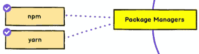
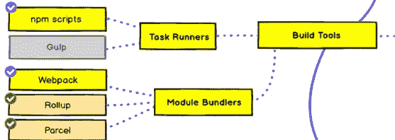
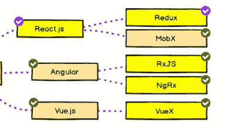
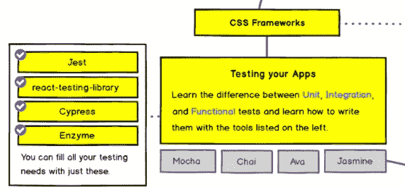

# 2022 年前端 Web 开发者路线图

> 原文：<https://javascript.plainenglish.io/the-front-end-web-developer-roadmap-for-2021-bcf88c5d4ccd?source=collection_archive---------1----------------------->

## 成为现代前端 web 开发人员的一步一步指南。

Photo by [Per Lööv](https://unsplash.com/@perloov?utm_source=medium&utm_medium=referral) on [Unsplash](https://unsplash.com?utm_source=medium&utm_medium=referral)

# 介绍

前端 web 开发人员负责构建网站或 web 应用程序的用户界面。他/她主要致力于创建可视部分，并使其动态化，以允许用户与之交互。

如今，前端 web 开发已经变得比以前更加复杂。它不仅仅是 HTML、CSS 和 JavaScript。你需要学习的技术很多，任务也很多。然而，如果你有热情和纪律，你一定可以成为一名成功的前端 web 开发人员。

在这篇文章中，我们将给出一个前端 web 开发者路线图，告诉你 2021 年应该如何学习前端 web 开发。让我们开始吧。

# 1.网络是如何工作的？

在开始学习任何技术之前，你最好先学习一般的网络基础知识。在这里，我们正在学习网络是如何工作的，它是如何开始的，这是每一种类型的开发人员都必须做的。你需要了解 HTTP、域名、主机、浏览器以及它们是如何工作的。

以下是您需要考虑的一些主题:

*   什么是互联网？
*   互联网是如何工作的？
*   HTTP 是什么，是如何演变的？
*   浏览器是如何工作的？
*   什么是域名和托管？
*   DNS 是如何工作的？

# 2.学习基础知识:HTML 和 CSS

**HTML** 代表*超文本标记语言。它用于为你的网站构建框架或标记。在这里，你需要学习 HTML 的基础知识，但是你可能希望更多地关注 HTML 表单，因为它们在未来将是基础。*

一旦你对 HTML 有了基本的了解，你就可以开始学习 CSS 的基础知识了。嗯，CSS 代表*层叠样式表*。它用于定义 HTML 元素的外观。它也用于制作响应性布局，使你的网页更漂亮。

CSS 容易学，但是很难掌握。有几个话题你应该更加关注，比如:

*   **框模型:**边距、填充和边框如何协同工作。
*   **CSS 单位:**用于表示长度(`rem`、`vh`、`vw`)。
*   **位置:**指定定位方法的类型。这也让很多人感到困惑，所以一定要花些时间在这上面。
*   **变量:**是可以在整个文档中重用的实体。这是 CSS 中我最喜欢的特性。它们让使用 CSS 变得如此有趣，你只需要几行代码就可以创建主题。
*   **媒体查询:**决定在不同的屏幕尺寸上显示什么。它们是响应式设计的关键组成部分。
*   **动画:**让一个元素从一种风格变成另一种风格。如果你知道如何正确使用动画，它会让你的网站脱颖而出。否则会让你的网站看起来不专业，一定要小心。
*   **Flexbox，CSS Grid:** 用于构建响应式布局。

我也建议你学习一些网页和用户界面设计的基础知识。作为一名前端 web 开发人员，这将使您有可能制作出好看的网页。

# 3.学习使用 Git 和 Github

Git 是一个版本控制系统，它允许您跟踪代码库和文件随时间的变化。它允许你毫无问题地回到代码库的某个先前版本。此外，它有助于与处理相同代码的人协作。

因此，学习 Git 的基础知识以及如何在命令行中使用它。此外，在 Github 上创建一个帐户，并学习如何创建第一个存储库，以便使用 Git 将 HTML 和 CSS 代码放入其中。这会让你在前端 web 开发的未来项目中养成使用 Git 和 Github 的习惯。

# 4.网站部署

现在您已经了解了 HTML 和 CSS，您可以使用这两种技术创建简单的 web 页面。但是你需要把它们放到网上，这样人们才能看到。

以前，这要困难得多。但是现在，它超级简单，你可以使用像 [GitHub Pages](https://pages.github.com/) 或 [Netlify](https://www.netlify.com/) 这样的工具。

# 5.Java Script 语言

JavaScript 是 web 开发的女王，我无法想象没有它的 web。对于 web 开发人员来说，它是最好的编程和脚本语言。你可以用它做很多事情，比如前端、后端、移动应用等等。

说到 JavaScript，你需要先学习基础知识。像变量、数据类型、函数、数组、对象等等。您还需要学习如何操作 DOM 等等。

以下是你需要考虑的一些事情:

*   语法和基本结构。
*   学习 DOM 操作。
*   学习 Fetch API/ Ajax。
*   ES6+。
*   模块化 javascript。
*   理解这些概念:闭包、作用域、异步 Await、原型、事件冒泡、影子 DOM、提升、严格等等。

# 6.学习 Sass

Sass 代表**S**yn tactically**A**we some**S**style sheets。它是一个 CSS 预处理器，可以更容易地处理 CSS，减少重复，节省时间。这将有助于用更少的代码行轻松地设计您的页面。就像有超能力的 CSS。

如果你经常使用 CSS，Sass 是一个强大的工具。它使你的生活变得更容易，并且它帮助你不在 CSS 中重复你自己。

# 7.包装经理和网络捆绑商

说到包装经理，我首先想到的是 NPM 和纱线。所以从这两个中选一个，学习它的基础知识。

[Package managers](https://roadmap.sh/frontend).

包管理器基本上是一个工具，它可以自动化安装、更新、配置和删除程序或项目的过程。

之后，你需要学习构建工具。像任务运行器(NPM 脚本或吞咽)和网络捆绑器(网络包或包裹)。

[Build tools](https://roadmap.sh/frontend).

# 8.选择一个框架

学习完上面所有的基础知识和工具后，你可以选择任何一个 JavaScript 框架。我很推荐从 React 或者 Vue 开始。如果你想的话，你也可以选择棱角分明的。

对于 React 来说，它实际上是一个用于构建用户界面的 JavaScript 库。它是基于组件的，它有一个虚拟的 DOM，使你的 web 应用程序性能更好，速度更快。Vue 也是一个很棒的框架，他们有一个很棒的社区和文档。

总而言之，根据你所在地区的市场选择你想要的框架。最终，它们只是工具，重要的是你知道基础知识(JavaScript)。

你还需要学习状态管理，基于你选择的框架，你可以使用很多工具(Redux，VueX…)。下面这张图片来自流行的[路线图](https://roadmap.sh/frontend)。

State management.

# 9.服务器端呈现和静态生成器

Next.js 用于服务器端渲染或者生成静态网站。是的，Next.js 仍然很新，但是我相信这是我们*作为 React 开发者必须具备的技能。如果您使用 Vue，您将需要了解另一个名为 Nuxt.js 的工具，它也用于服务器端渲染。对于 angular，我认为你需要学习 Universal。*

在那之后，你会想要构建一些应用程序，比如*求职工具、*博客、或*文档页面等等。*

# 10.测试您的应用

谈到测试，你需要知道单元测试、集成测试和功能测试之间的区别，并学习如何编写它们。

[Testing](https://roadmap.sh/frontend).

# 结论

如你所见，前端 web 开发变得复杂了。有很多工具要学。但是如果你有激情，你就能做到，成为一名伟大的开发者。只是练习你的东西，因为没有练习你永远不会做好你正在做的事情。

 [## 通过我的推荐链接加入 Medium-Mehdi Aoussiad

### 作为一个媒体会员，你的会员费的一部分会给你阅读的作家，你可以完全接触到每一个故事…

mehdiouss.medium.com](https://mehdiouss.medium.com/membership) 

感谢您阅读本文，希望您觉得有用。如果有，通过 [**订阅我们的 YouTube 频道**](https://www.youtube.com/channel/UCtipWUghju290NWcn8jhyAw?sub_confirmation=true) **获取更多类似内容！**

# 更多阅读

 [## 作为前端开发人员应该构建的 5 个 JavaScript 项目

### 为您的投资组合提供前端 web 开发项目

medium.com](https://medium.com/javascript-in-plain-english/5-javascript-projects-you-should-build-as-a-front-end-developer-57318b710344)