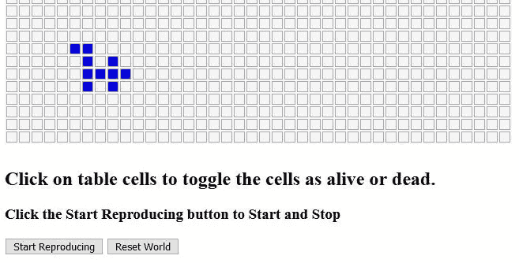
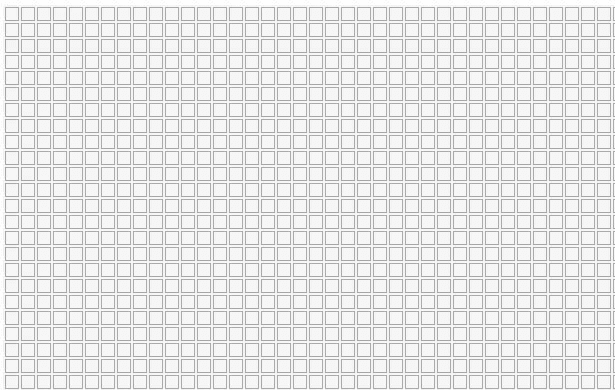
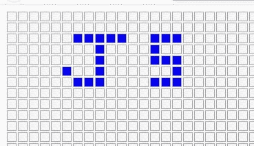
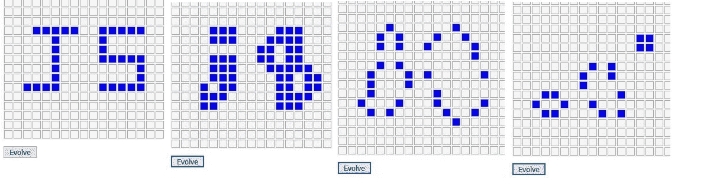
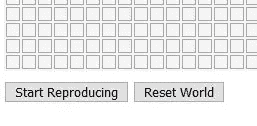

# 使用 JavaScript 的生活游戏

> 原文：<https://javascript.plainenglish.io/the-game-of-life-using-javascript-fc1aaec8274f?source=collection_archive---------0----------------------->


Photo by [Kasturi Roy](https://unsplash.com/@kasturiroy?utm_source=unsplash&utm_medium=referral&utm_content=creditCopyText) on [Unsplash](https://unsplash.com/s/photos/villages?utm_source=unsplash&utm_medium=referral&utm_content=creditCopyText)

## 探索细胞自动机和核心 JavaScript

[生命的游戏](https://en.wikipedia.org/wiki/Conway%27s_Game_of_Life)最初是为了研究[细胞自动机](https://en.wikipedia.org/wiki/Cellular_automaton)而设计[约翰康威](https://en.wikipedia.org/wiki/John_Horton_Conway)。

> 我喜欢用我所学的每一种语言编写这个程序，并且在教授编程时总是把它作为教学工具；因为它使用了变量、数组、循环、条件、函数等。
> 
> 我们的目标是创建一个使用大量核心 JavaScript 的有趣应用程序。

# 游戏的前提

一个人通过创建“居民”的初始配置并观察他们如何通过“世代”的自我复制进化来与游戏互动。从一些“活”和“死”的应用规则。

> 上面的初始配置是粗体的，因为这是用户唯一可以做的“播放”。然后他们坐下来，看着进化展开。

# 最终产品

> ***如果您想预览我们将要构建的内容，可以在*** [***这里查看并播放最终的应用程序。***](http://www.nusoftva.com/gol/index.html)

我知道您的时间很宝贵，这篇文章可能会很长。虽然我鼓励您继续编写代码，但是如果有必要的话，可以复制和粘贴代码，并对其进行研究。

完整的 JavaScript 代码也在文章末尾。

# 规则

生活游戏的规则很简单。我们首先在一个“世界”中填充尽可能多的“活”细胞，这是我们选择的初始配置。然后根据下面的规则，我们看到随着一代代的过去，我们的人口在增长、变化和消亡。

*   任何少于两个活邻居的活细胞都会死亡，似乎是由人口不足引起的。
*   任何有两个或三个活邻居的活细胞都可以存活到下一代。
*   任何有三个以上活邻居的活细胞都会死亡，好像是因为过度拥挤。
*   任何一个死细胞，只要有三个活的邻居，就会变成活细胞，就像通过繁殖一样。

我们将使用二维数组来跟踪当前代和下一代，下一代是在应用规则后创建的。

我们将使用一个表格来构建一个网格，用于显示当前这一代。这是玩家的视觉效果。



Visual Table. User has set some cells alive

# 我们开始吧！

我将使用 Visual Studio 代码，但任何可以创建 HTML、CSS 和 JavaScript 的编辑器都可以。

## 设置

1.  创建一个名为**index.html 的 HTML 页面。**

2.创建一个名为 **gol.js** 的 JavaScript 文件，其中包含我们需要的所有 JavaScript 代码。

3.创建一个名为 **gol.css** 的样式表文件，它将包含我们需要的所有样式。

## 超文本标记语言

创建一个名为 index.html**的文件**

*   将**脚本引用**添加到我们的 gol.js 中。
*   在头部添加**样式表引用**。

```
<!DOCTYPE html>
<html lang="en">
<head>
    <meta charset="UTF-8">
    <meta name="viewport" content="width=
    , initial-scale=1.0">
    <meta http-equiv="X-UA-Compatible" content="ie=edge">
    <title>Game of Life</title>
    <!-- Our Style Sheet -->
  **  <link rel="stylesheet" href='gol.css'>**</head>
<body><!-- Our JavaScript -->
   ** <script src='gol.js'></script>**
</body>
</html>
```

# 台阶

## 第一步——建造世界

首先，我们想建立我们的“世界”，世界网格，在那里我们的人口将兴旺(或不。)这将使用一个用 JavaScript 构建的 HTML 表来完成。这也是玩家的视觉感受。

首先，我们将添加一个

元素来包含**index.html**中的世界网格，然后构建 HTML 表并将其附加到 div 中。

```
<!DOCTYPE html>
<html lang="en">
<head>
    <meta charset="UTF-8">
    <meta name="viewport" content="width=
    , initial-scale=1.0">
    <meta http-equiv="X-UA-Compatible" content="ie=edge">
    <title>Game of Life</title>
    <!-- Our Style Sheet -->
    <link rel="stylesheet" href='gol.css'></head>
<body>
   ** <div id='world'>** **</div>**<!-- Our JavaScript -->
    <script src='gol.js'></script>
</body>
</html>
```

接下来，我们将为我们的世界网格编写 JavaScript。

> 世界将是一个 HTML 表格。每个单元可以包含一个居民。一个细胞是有人居住(活着)还是无人居住(死去)是初始配置的一部分，也是由规则决定的进化过程的一部分。

*注:在生命的原始游戏中，世界应该是无限的。抱歉。不是我们的。*

我们需要一些变量来存储表中需要多少行和多少列。

然后我们将创建一个函数， **createWorld()** ，它将逐行、逐列、逐单元格地构建表格。

然后我们将把它附加到我们的 div 中。我们将从 window.onload 调用这个函数。

**将以下内容添加到 gol.js 中**

```
const rows = 40;
const cols = 40;function createWorld() {
    let world = document.querySelector('#world');

    let tbl = document.createElement('table');
    tbl.setAttribute('id','worldgrid');for (let i = 0; i < rows; i++) {
        let tr = document.createElement('tr');
        for (let j = 0; j < cols; j++) {
            let cell = document.createElement('td');

            tr.appendChild(cell);
        }
        tbl.appendChild(tr);
    }
    world.appendChild(tbl);
}window.onload=()=>{
    createWorld();
}
```

在我们给我们的桌子添加一些样式之前，你不会看到太多，所以

**将以下内容添加到 gol.css 中**

```
#world {
    padding-bottom: 10px;
}table {
    background-color: whitesmoke;
}td {
    border: 1px solid darkgray;
    width: 10px;
    height: 10px;
}
```

## 试运转

打开 index.html，你会看到你的美丽新世界正等着被开发！



Our brave new world!

## 第二步——细胞

*   最初，所有细胞都会死亡。
*   当玩家在初始配置期间点击一个单元时，在开始生成过程之前，我们希望单元在存活(蓝色)或死亡(透明)之间切换。)
*   之后，我们希望能够处理代，即应用规则。

**所以我们需要给表格单元格附加一些属性。**

*   每个单元格都需要添加一个 id 和一个属性，这样我们就可以跟踪它们。我们将在 i_j 形式中使用 I 和 j，因此左上角将是 0_0，依此类推。
*   每个单元格需要添加一个*死*的**类**。在初始配置或进化过程中，此类可以更改为*活动*。

将以下属性添加到单元格中(粗体)，

```
const rows = 40;
const cols = 40;function createWorld() {
    let world = document.querySelector('#world');

    let tbl = document.createElement('table');
    tbl.setAttribute('id','worldgrid');for (let i = 0; i < rows; i++) {
        let tr = document.createElement('tr');
        for (let j = 0; j < cols; j++) {
            let cell = document.createElement('td');
           ** cell.setAttribute('id', i + '_' + j);
            cell.setAttribute('class', 'dead');**

            tr.appendChild(cell);
        }
        tbl.appendChild(tr);
    }
    world.appendChild(tbl);
}window.onload=()=>{
    createWorld();
}
```

## 让细胞活起来

为了在活单元和死单元之间切换，我们将为每个单元附加一个点击事件监听器。这是为玩家设置的初始配置。

以后，我们将需要跟踪当前一代以及应用规则后创建的下一代。为此，我们需要两个二维数组。*一个给现在，一个给下一代。*

> **注意** : [JavaScript 不直接支持二维数组](https://medium.com/javascript-in-plain-english/javascript-multi-dimensional-arrays-7186e8edd03)。我们必须把它们构造成一个数组。更多关于二维阵列的信息可以在[这里](https://medium.com/javascript-in-plain-english/javascript-multi-dimensional-arrays-7186e8edd03)找到。

添加以下监听器和 **cellClick()** 功能。

```
const rows = 40;
const cols = 40;function createWorld() {
    let world = document.querySelector('#world');

    let tbl = document.createElement('table');
    tbl.setAttribute('id','worldgrid');for (let i = 0; i < rows; i++) {
        let tr = document.createElement('tr');
        for (let j = 0; j < cols; j++) {
            let cell = document.createElement('td');
            cell.setAttribute('id', i + '_' + j);
            cell.setAttribute('class', 'dead');
          **  cell.addEventListener('click',cellClick);**            
            tr.appendChild(cell);
        }
        tbl.appendChild(tr);
    }
    world.appendChild(tbl);
}**function cellClick() {
    let loc = this.id.split("_");
    let row = Number(loc[0]);//Get i
    let col = Number(loc[1]);//Get j****// Toggle cell alive or dead
    if (this.className==='alive'){
        this.setAttribute('class', 'dead');

    }else{
        this.setAttribute('class', 'alive');

    }****}**window.onload=()=>{
    createWorld();
}
```

**将以下内容添加到 gol.css**

```
td.dead {
    background-color: transparent;
}td.alive {
    background-color:blue;
}
```

## 试运转

打开**index.html**，你应该可以通过点击单元格在活的(蓝色)和死的(透明)之间“切换”。这就是玩家如何创建居民的初始配置。



Click to toggle alive or dead

> 由于代码量越来越长，请随意将我们创建的函数放在。js 文件。

## 设置当前和下一代阵列

当我们进行初始点击时，我们正在设置当前(开始)生成。

在我们开始处理后代之后，我们将需要应用这些规则来创建下一代。*随着世界的发展，下一代将成为当代，以此类推。*

我们需要设置**二维**数组来存储当前一代和下一代(应用“生”和“死”的规则后计算)。)

数组声明将根据行数建立一维数组。然后，我们将在每个数组位置创建一个数组，以创建所需的二维数组。

> 数组需要匹配每个表格单元格的状态，无论是活的还是死的。我们将使用数组值 1 表示存活，0 表示死亡。

我们最初将每个数组位置设置为 0(死)，以匹配表。

添加以下数组声明和函数 **createGenArrays()，**创建数组和 **initGenArrays()，**将数组值设置为 0(死)。

我把我的代码放在行和列声明的后面和 **createWorld()** 函数的上面。

```
const rows = 40;
const cols = 40;// Need 2D arrays. These are 1D
let currGen =[rows];
let nextGen =[rows];// Creates two-dimensional arrays
function createGenArrays() {
    for (let i = 0; i < rows; i++) {
        currGen[i] = new Array(cols);
        nextGen[i] = new Array(cols);
    }
}function initGenArrays() {
    for (let i = 0; i < rows; i++) {
        for (let j = 0; j < cols; j++) {
            currGen[i][j] = 0;
            nextGen[i][j] = 0;
        }
    }
}
```

我们将把 **createGenArrays()** 和 **initGenArrays()** 函数调用添加到我们的 **onload** 和*中，添加两行*来引出 **cellClick()** 函数。

您的代码应该如下所示。

*   请注意当前对 cellClick()的添加。
*   请注意 onlaod 的新增功能。

```
const rows = 40;
const cols = 40;// Need 2D arrays. These are 1D
let currGen =[rows];
let nextGen =[rows];// Creates two-dimensional arrays
function createGenArrays() {
    for (let i = 0; i < rows; i++) {
        currGen[i] = new Array(cols);
        nextGen[i] = new Array(cols);
    }
}
function initGenArrays() {
    for (let i = 0; i < rows; i++) {
        for (let j = 0; j < cols; j++) {
            currGen[i][j] = 0;
            nextGen[i][j] = 0;
        }
    }
}function createWorld() {
    let world = document.querySelector('#world');

    let tbl = document.createElement('table');
    tbl.setAttribute('id','worldgrid');for (let i = 0; i < rows; i++) {
        let tr = document.createElement('tr');
        for (let j = 0; j < cols; j++) {
            let cell = document.createElement('td');
            cell.setAttribute('id', i + '_' + j);
            cell.setAttribute('class', 'dead');
            cell.addEventListener('click',cellClick);            
            tr.appendChild(cell);
        }
        tbl.appendChild(tr);
    }
    world.appendChild(tbl);
}function cellClick() {
    let loc = this.id.split("_");
    let row = Number(loc[0]);
    let col = Number(loc[1]);
// Toggle cell alive or dead
    if (this.className==='alive'){
        this.setAttribute('class', 'dead');
       ** currGen[row][col] = 0;**
    }else{
        this.setAttribute('class', 'alive');
       ** currGen[row][col] = 1;**
    }
}window.onload=()=>{
    createWorld();// The visual table
    **createGenArrays()**;// current and next generations
   ** initGenArrays();**//Set all array locations to 0=dead}
```

# 进化-计算邻居并应用规则

我们现在正处于这样一个阶段，我们需要编写代码，通过应用规则和创建下一代来执行进化。

我们需要，

*   计算每个表格单元中处于活动状态的相邻单元/邻居。
*   应用基于邻居计数的规则来创建下一代。
*   让新一代成为现在的一代。
*   创建显示当前(新)代的方式(更新世界表。)
*   创建一个**临时**按钮来启动流程并执行层代更改。此按钮仅用于测试。

*最终我们想要启动自动生成过程的按钮。*

> 最初，为了测试，我们将只手动地从当前代到下一代。但是我们将使用一个循环来处理尽可能多的代。

## 数邻居

一个细胞是活的还是死的规则完全取决于给定细胞的邻居数量。

让我们添加一个函数，**getneighborhoodcount()**，来计算给定单元的邻居数量。

之后，在另一个函数中，我们将遍历当前代中的单元格，使用**getneighborhoodcount()*对邻居进行计数并应用规则，创建下一代*** ，将其存储在存储在 nextGen 数组中。

我们必须查看八个相邻的小区/邻居，

*   超过
*   左上角
*   右上方
*   左边的
*   对吧
*   左下角
*   右下角
*   底部

> 当我们计算邻居时，我们必须确保我们没有在世界网格之外“越界”。为此，我们将始终确保在查看相邻单元格时，当前行和/或列不小于 0。

您可以在任何地方添加以下函数。我把我的放在 JavaScript 的底部。

```
function getNeighborCount(row, col) {
    let count = 0;
    let nrow=Number(row);
    let ncol=Number(col);

        // Make sure we are not at the first row
        if (nrow - 1 >= 0) {
        // Check top neighbor
        if (currGen[nrow - 1][ncol] == 1) 
            count++;
    }
        // Make sure we are not in the first cell
        // Upper left corner
        if (nrow - 1 >= 0 && ncol - 1 >= 0) {
        //Check upper left neighbor
        if (currGen[nrow - 1][ncol - 1] == 1) 
            count++;
    }// Make sure we are not on the first row last column
        // Upper right corner
        if (nrow - 1 >= 0 && ncol + 1 < cols) {
        //Check upper right neighbor
            if (currGen[nrow - 1][ncol + 1] == 1) 
                count++;
        }// Make sure we are not on the first column
    if (ncol - 1 >= 0) {
        //Check left neighbor
        if (currGen[nrow][ncol - 1] == 1) 
            count++;
    }
    // Make sure we are not on the last column
    if (ncol + 1 < cols) {
        //Check right neighbor
        if (currGen[nrow][ncol + 1] == 1) 
            count++;
    }// Make sure we are not on the bottom left corner
    if (nrow + 1 < rows && ncol - 1 >= 0) {
        //Check bottom left neighbor
        if (currGen[nrow + 1][ncol - 1] == 1) 
            count++;
    }// Make sure we are not on the bottom right
    if (nrow + 1 < rows && ncol + 1 < cols) {
        //Check bottom right neighbor
        if (currGen[nrow + 1][ncol + 1] == 1) 
            count++;
    }

        // Make sure we are not on the last row
    if (nrow + 1 < rows) {
        //Check bottom neighbor
        if (currGen[nrow + 1][ncol] == 1) 
            count++;
    }

    return count;
}
```

## 创造下一代

现在我们将创建一个函数， **createNextGen()** ，该函数将遍历每个单元格，使用**getneighborhoodcount()**获取邻居计数，并使用该计数和规则来确定当前单元格是保持活动、变得活动、保持死亡还是死亡。

创建以下函数，将其放在 JavaScript 中的任意位置。我把我的放在了**getneighborhoodcount()之上。**

```
function createNextGen() {
    for (row in currGen) {
        for (col in currGen[row]) {

            let neighbors = getNeighborCount(row, col);

            // Check the rules
            // If Alive
            if (currGen[row][col] == 1) {

                if (neighbors < 2) {
                    nextGen[row][col] = 0;
                } else if (neighbors == 2 || neighbors == 3) {
                    nextGen[row][col] = 1;
                } else if (neighbors > 3) {
                    nextGen[row][col] = 0;
                }
            } else if (currGen[row][col] == 0) {
                // If Dead or Empty

                if (neighbors == 3) {
                    // Propogate the species
                    nextGen[row][col] = 1;//Birth?
                }
            }
        }
    }

}
```

咻。坚持住！

# 更新世界

既然我们已经计算了存储在 nextGen 数组中的下一代，我们需要用 nextGen 中的值更新 currGen 数组，并相应地更新我们的 world 表。

我们还将创建一个临时按钮来运行测试。

我们将添加一个函数， **updateCurrGen()，**，该函数将获取 nextGen 数组值，并将它们放入 CurrGen 数组中。

我们还将添加一个函数， **updateWorld()** ，它将更新我们世界的视觉显示。

添加以下函数。

```
function updateCurrGen() {

        for (row in currGen) {
            for (col in currGen[row]) {
                // Update the current generation with
                // the results of createNextGen function
                currGen[row][col] = nextGen[row][col];
                // Set nextGen back to empty
                nextGen[row][col] = 0;
            }
        }

    }function updateWorld() {
        let cell='';
        for (row in currGen) {
            for (col in currGen[row]) {
                cell = document.getElementById(row + '_' + col);
                if (currGen[row][col] == 0) {
                    cell.setAttribute('class', 'dead');
                } else {
                    cell.setAttribute('class', 'alive');
                }
            }
        }
    }
```

# 人工测试

现在我们将创建一个简单的函数， **evolve()** ，它将从我们的临时按钮(待添加)中被调用。)

添加以下函数。

```
function evolve(){

        createNextGen();//Apply the rules
        updateCurrGen();//Set Current values from new generation
        updateWorld();//Update the world view}
```

使用临时按钮更新 index.html 的主体，如下所示。

```
<body>
    <div id='world'></div>
**<div>
    <input type='button' value='Evolve' onclick='evolve()'.>
</div>**
    <!-- Our JavaScript -->
    <script src='gol.js'></script>
</body>
```

**试运行**

打开 index.html 的**，点击一些细胞开始你的文明。然后根据需要经常点击进化按钮来观察它的进化。**

这是我的第一代、第一代、第二代和第十代。



Left to right: initial, first, second and tenth.

# 添加一些播放器控件

现在我们已经验证了它的工作，我们可以添加一些玩家控制。我们将增加用户的能力，

*   开始繁殖过程——一代又一代，让它继续运行，不断进化。
*   停止复制过程。停止进化。
*   重置世界。

> 开始和停止将是同一个按钮。播放点击开始后，会变为停止。

**注意**:即使所有的居民都死光了，玩家点击停止也很重要。无论如何，该过程都会运行。

删除临时按钮，并将以下按钮添加到 index.html 的正文中。

```
<body>
    <div id='world'></div>
<div>

 **<Input type='button' id='btnstartstop' value='Start Reproducing'/>
 <Input type='button' id='btnreset' value='Reset World'/>
   **        

</div>
    <!-- Our JavaScript -->
    <script src='gol.js'></script>
</body>
```



Player Controls

## 开始按钮

为了启动/停止工作，我们将需要一些变量。

*   我们需要知道开始/停止按钮是否被点击过(知道它是处于开始还是停止状态。)
*   我们需要能够重复进化过程。
*   我们需要控制进化的速度。

在 JavaScript 的顶部添加以下内容。

```
let started=false;// Set to true when use clicks start
let timer;//To control evolutions
let evolutionSpeed=1000;// One second between generations
```

接下来，我们需要一个函数来启动和停止进化过程。

> 如果我们处于开始状态，我们需要一个循环来运行，调用 evolve()函数并使用计时器来控制进化的速度。

我们将创建一个函数， **startStopGol()** 并将一些代码添加到我们的 **evolve()** 函数中。

添加以下函数。

```
function startStopGol(){
        let startstop=document.querySelector('#btnstartstop');

        if (!started) {
           started = true;
           startstop.value='Stop Reproducing';
           evolve();

         } else {
            started = false;
            startstop.value='Start Reproducing';
            clearTimeout(timer); 
        }
    }
```

注意这调用了 **evolve()** 函数。一旦进入 evolve()函数，我们需要继续进化，直到用户点击 Stop。

修改 evolve()如下:

```
function evolve(){

        createNextGen();//Apply the rules
        updateCurrGen();//Set Current values from new generation
        updateWorld();//Update the world view **if (started) {
            timer = setTimeout(evolve, evolutionSpeed);
        }**}
```

## 重置按钮

要重置，我们只需重新加载页面。那会让一切重新开始。

添加以下函数。

```
function resetWorld() {
        location.reload();
    }
```

最后一步是将 **startStopGol()** 和 **resetWorld()** 函数附加到按钮上。

为此，我们将采用传统方法，使用 onclick 。我们还将添加一些说明。

修改 index.html 的身体如下。

```
<h2>Click on table cells to toggle the cells as alive or dead.</h2>
<h3>Click the Start Reproducing button to Start and Stop</h3>
<Input type='button' id='btnstartstop' value='Start Reproducing' **onclick='startStopGol()**;'/>
<Input type='button' id='btnreset' value='Reset World' **onclick='resetWorld();**'/>
```

## 搞定了。

你现在应该有一个完整的人生游戏了！

**gol . js 的所有代码都在文末。**

# 结论

生命的游戏是关于细胞自动机(T21)的，所以我鼓励你研究这个概念，玩游戏规则。看看人生游戏的一些变奏。

但是这也是一个有趣的游戏，并且允许我们使用一些很棒的 JavaScript。我也鼓励您尝试应用程序并改进代码。

**感谢您的阅读和快乐编码！**

在 Medium 上阅读所有你想要的文章，并通过成为 Medium 会员来帮助我继续写作，每月只需 5 美元。

[](https://bobtomlin-70659.medium.com/membership) [## 通过我的推荐链接加入灵媒——重力井(罗伯·汤姆林)

### 作为一个媒体会员，你的会员费的一部分会给你阅读的作家，你可以完全接触到每一个故事…

bobtomlin-70659.medium.com](https://bobtomlin-70659.medium.com/membership) 

你可能会感兴趣。

[](https://medium.com/javascript-in-plain-english/javascript-multi-dimensional-arrays-7186e8edd03) [## JavaScript 多维数组

### 真相大白了

medium.com](https://medium.com/javascript-in-plain-english/javascript-multi-dimensional-arrays-7186e8edd03) 

戈尔. js

```
const rows = 40;
const cols = 40;let started=false;// Set to true when use clicks start
let timer;//To control evolutions
let evolutionSpeed=1000;// One second between generations// Need 2D arrays. These are 1D
let currGen =[rows];
let nextGen =[rows];// Creates two-dimensional arrays
function createGenArrays() {
    for (let i = 0; i < rows; i++) {
        currGen[i] = new Array(cols);
        nextGen[i] = new Array(cols);

    }
}
function initGenArrays() {
    for (let i = 0; i < rows; i++) {
        for (let j = 0; j < cols; j++) {
            currGen[i][j] = 0;
            nextGen[i][j] = 0;
        }
    }
}function createWorld() {
    let world = document.querySelector('#world');

    let tbl = document.createElement('table');
    tbl.setAttribute('id','worldgrid');for (let i = 0; i < rows; i++) {
        let tr = document.createElement('tr');
        for (let j = 0; j < cols; j++) {
            let cell = document.createElement('td');
            cell.setAttribute('id', i + '_' + j);
            cell.setAttribute('class', 'dead');
            cell.addEventListener('click',cellClick);            
            tr.appendChild(cell);
        }
        tbl.appendChild(tr);
    }
    world.appendChild(tbl);
}function cellClick() {
    let loc = this.id.split("_");
    let row = Number(loc[0]);
    let col = Number(loc[1]);
// Toggle cell alive or dead
    if (this.className==='alive'){
        this.setAttribute('class', 'dead');
        currGen[row][col] = 0;
    }else{
        this.setAttribute('class', 'alive');
        currGen[row][col] = 1;
    }
}function createNextGen() {
    for (row in currGen) {
        for (col in currGen[row]) {

            let neighbors = getNeighborCount(row, col);

            // Check the rules
            // If Alive
            if (currGen[row][col] == 1) {

                if (neighbors < 2) {
                    nextGen[row][col] = 0;
                } else if (neighbors == 2 || neighbors == 3) {
                    nextGen[row][col] = 1;
                } else if (neighbors > 3) {
                    nextGen[row][col] = 0;
                }
            } else if (currGen[row][col] == 0) {
                // If Dead or Empty

                if (neighbors == 3) {
                    // Propogate the species
                    nextGen[row][col] = 1;// Birth?
                }
            }
        }
    }

}function getNeighborCount(row, col) {
    let count = 0;
    let nrow=Number(row);
    let ncol=Number(col);

        // Make sure we are not at the first row
        if (nrow - 1 >= 0) {
        // Check top neighbor
        if (currGen[nrow - 1][ncol] == 1) 
            count++;
    }
        // Make sure we are not in the first cell
        // Upper left corner
        if (nrow - 1 >= 0 && ncol - 1 >= 0) {
        //Check upper left neighbor
        if (currGen[nrow - 1][ncol - 1] == 1) 
            count++;
    }// Make sure we are not on the first row last column
        // Upper right corner
        if (nrow - 1 >= 0 && ncol + 1 < cols) {
        //Check upper right neighbor
            if (currGen[nrow - 1][ncol + 1] == 1) 
                count++;
        }// Make sure we are not on the first column
    if (ncol - 1 >= 0) {
        //Check left neighbor
        if (currGen[nrow][ncol - 1] == 1) 
            count++;
    }
    // Make sure we are not on the last column
    if (ncol + 1 < cols) {
        //Check right neighbor
        if (currGen[nrow][ncol + 1] == 1) 
            count++;
    }// Make sure we are not on the bottom left corner
    if (nrow + 1 < rows && ncol - 1 >= 0) {
        //Check bottom left neighbor
        if (currGen[nrow + 1][ncol - 1] == 1) 
            count++;
    }// Make sure we are not on the bottom right
    if (nrow + 1 < rows && ncol + 1 < cols) {
        //Check bottom right neighbor
        if (currGen[nrow + 1][ncol + 1] == 1) 
            count++;
    }

        // Make sure we are not on the last row
    if (nrow + 1 < rows) {
        //Check bottom neighbor
        if (currGen[nrow + 1][ncol] == 1) 
            count++;
    }

    return count;
}

    function updateCurrGen() {

        for (row in currGen) {
            for (col in currGen[row]) {
                // Update the current generation with
                // the results of createNextGen function
                currGen[row][col] = nextGen[row][col];
                // Set nextGen back to empty
                nextGen[row][col] = 0;
            }
        }

    }function updateWorld() {
        let cell='';
        for (row in currGen) {
            for (col in currGen[row]) {
                cell = document.getElementById(row + '_' + col);
                if (currGen[row][col] == 0) {
                    cell.setAttribute('class', 'dead');
                } else {
                    cell.setAttribute('class', 'alive');
                }
            }
        }
    }function evolve(){

        createNextGen();
        updateCurrGen();
        updateWorld();if (started) {
            timer = setTimeout(evolve, evolutionSpeed);
        }}function startStopGol(){
        let startstop=document.querySelector('#btnstartstop');

        if (!started) {
           started = true;
           startstop.value='Stop Reproducing';
           evolve();

         } else {
            started = false;
            startstop.value='Start Reproducing';
            clearTimeout(timer); 
        }
    }

    function resetWorld() {
        location.reload();

    }window.onload=()=>{
    createWorld();// The visual table
    createGenArrays();// current and next generations
    initGenArrays();//Set all array locations to 0=dead}
```