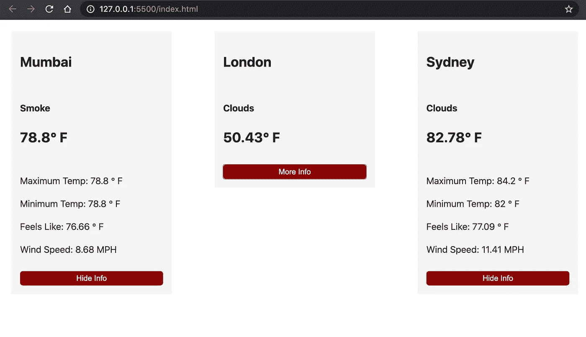

# JavaScript 生态系统# 1——普通的 Web 组件

> 原文：<https://javascript.plainenglish.io/the-javascript-ecosystem-blog-1-vanilla-web-components-7d6960f34ff9?source=collection_archive---------10----------------------->

大家好，欢迎来到我的关于 JavaScript 生态系统的新博客系列。我希望你和你认识的每个人在这个前所未有的时代保持安全和健康。我开始撰写这个博客系列，作为探索和实际实现 JavaScript 和 Node.js 中不同库的新事业的一部分。我希望以一种帮助 web 开发人员探索和开始使用新的库、框架或技术概念的方式来组织这个系列。希望你们喜欢学习！

# **简介**

在本系列的第一篇博文中，我们不要谈论任何库和框架，而是让我们深入到**普通 JavaScript** *(没有库。没有框架。只是编程语言 JavaScript)* 和实现 **Web 组件**的概念，而不使用任何现有的库或框架。Web 组件在推动现代 web 用户界面方面发挥了巨大的作用，其基本概念被用作许多使用前端框架(如 ReactJS、VueJS 和 Angular)构建的 web 应用程序的架构基础。根据 MDN 文档:

> Web 组件可以定义为一套不同的技术，允许您创建可重用的自定义 HTML 元素，将它们的功能封装在代码的其余部分之外，并在您的 web 应用程序中使用它们。

简单的基于浏览器的 web 组件的概念由三种主要技术组成:

1.  **自定义元素** —一组 JavaScript API 方法，用于定义自定义 HTML 元素，修改它们的行为，并根据需要在 UI 中重用。
2.  **影子 DOM** —一组 JavaScript API 方法，用于将封装的“影子”DOM 树附加到元素上。简而言之，Shadow DOM API 提供了一种有效的方法，可以将隐藏的独立 DOM 附加到 HTML 元素上，保持元素特性的私有性，并与文档的其他部分隔离开来。
3.  **HTML 模板** —渲染页面中不显示的 HTML 标签为 *<模板>* 和<槽>。这些标签可以多次重复使用，作为定制元素结构的基础。

让我们试着在一个简单的项目中实现这些技术。

# 项目介绍

为了简单展示 web 组件如何使用普通 JavaScript 工作，我们将使用开放天气地图 API 构建一个简单的天气仪表板，以获取一个城市的实时天气信息。本项目的主要目标是满足以下要求:

1.  定义可以在整个 UI 中重用的自定义 HTML 元素。
2.  创建用于显示自定义元素的 HTML 模板。
3.  使用 Shadow DOM 添加特定于元素的特性。
4.  在整个文档中重用和显示自定义元素。

## **文件结构:**

用如下所示的文件初始化您的项目目录，并将一个基本的初学者模板添加到 index.html 文件中。

```
-webComponentBasics
----index.html
----weather.js
```

## **第一步。创建自定义 HTML 元素**

打开你最喜欢的代码编辑器，打开 *weather.js* 文件。您可以通过使用扩展 HTML element 接口的 ES6 JavaScript 类语法来创建自定义 HTML 元素。在 *weather.js* 文件中，添加以下几行代码:

```
class Weather extends HTMLElement {
    constructor(){
        this.innerHTML = "<h2>Simple Weather Dashboard</h2>";
    } connectedCallback(){} disconnectedCallback()
}
window.customElements.define("weather-card", Weather);
```

使用*<>*标签将 *weather.js* 文件包含在您的*index.html*中，并将元素添加为*<weather-card></weather-card>*。瞧啊。您已经成功创建了第一个自定义 HTML 元素。

自定义 HTML 元素还为您提供了生命周期方法，如:

1.  **connectedCallback()** —在 DOM 中插入元素时调用。
2.  **disconnectedCallback()**—从 DOM 中移除元素时调用。
3.  **attributeChangedCallback(attributeName，oldValue，newValue)** —在添加、删除、更新或替换属性时调用。

## **步骤二。创建一个 HTML 模板**

在 weather.js 文件中，使用以下代码行创建一个自定义 HTML 模板。

```
const template = document.createElement('template');
template.innerHTML = `
    <style>
        .flex-child {
            flex: 1;
            border: 2px solid;
        }
        .card {
            background: #f4f4f4;
            width: 250px;
            display: grid;
            grid-gap: 10px;
            margin-bottom: 15px;
            padding: 15px;
        }
        .container {
            padding: 2px 16px;
        }
        #toggle-info {
            cursor: pointer;
            background: darkred;
            color: #fff;
            border: 0;
            border-radius: 5px;
            padding: 5px 10px;
        }
    </style>
    <div class="grid-child card">
        <div class="card-header"><h2></h2></div>
        <div>
            <h4 class="card-title"></h4>
            <div class="temp"></div>
            <h2 class="temp"><span class="degree"></span></h2>
        </div>
        <div class="more-info"></div>
        <button id="toggle-info">Hide Info</button>
    </div>
`;
```

要将这个特定的模板附加到您的定制 HTML 元素，您需要初始化 Weather 元素的 Shadow DOM。在初始化 Shadow DOM 时，它将返回一个 Shadow Root 对象，该对象可用于修改 Weather 元素的行为。更新 Weather 类的构造函数，如下所示:

```
class Weather extends HTMLElement {
    constructor(){
      this.attachShadow({ mode: 'open' }); //returns shadowRoot
      this.shadowRoot.appendChild(template.content.cloneNode(true));
    }
    connectedCallback(){}
    disconnectedCallback(){}
}
```

现在我们已经设置了模板和定制元素，让我们继续进行 API 调用并更新相应的 DOM 元素。

## 第三步。从打开的天气图 API 获取数据

为了检索对应于给定位置的实时天气信息，我们将使用 Open Weather Map API 和 JavaScript Fetch 方法来处理这个 API 请求。将 API 请求方法包含在 Weather 元素类的构造函数中，以便在每次初始化元素时执行该方法。用下面的代码更新 Weather 元素类的构造函数。

```
constructor() {
    super();
    this.info = {};
    this.attachShadow({ mode: 'open' });
    this.shadowRoot.appendChild(template.content.cloneNode(true)); fetch(`https://community-open-weather-map.p.rapidapi.com/weather?q=London&units=imperial`, {
        "method": "GET",
        "headers": {
            "x-rapidapi-key": "YOUR_API_KEY",
            "x-rapidapi-host": "community-open-weather-map.p.rapidapi.com"
        }
    }).then(response => return response.json();)
      .then(data => {
          this.info["temp"] = data["main"]["temp"];
          this.info["maxTemp"] = data["main"]["temp_max"];
          this.info["minTemp"] = data["main"]["temp_min"];
          this.info["feelsLike"] = data["main"]["feels_like"];
          this.info["weather"] = data["weather"][0];
          this.info["windSpeed"] = data["wind"]["speed"];
          return this.info
    }).then(info => {
          this.shadowRoot.querySelector('.card-title').innerText = info["weather"]["main"];
          this.shadowRoot.querySelector('.temp').innerHTML = `<h2>${info.temp}<span>&#176;</span> F</h2>`;
          this.shadowRoot.querySelector('.more-info').innerHTML =
`<p>Maximum Temp: ${info.maxTemp} <span>&#176;</span> F</p><p>Minimum Temp: ${info.minTemp} <span>&#176;</span> F</p>
<p>Feels Like: ${info.feelsLike} <span>&#176;</span> F</p>
<p>Wind Speed: ${info.windSpeed} MPH</p>
`;
    }).catch(err => {
        console.error(err);
    });
}
```

让我们浏览一下上面的代码。我们已经初始化了一个简单的 hashmap，用于存储来自 API 调用的相关数据。在收到来自 API 的响应时，hashmap 根据需要用相关信息更新，并沿着**承诺管道链**传递。使用影子根对象，我们选择模板中定义的类，并使用 *innerHTML* 和 *innerText* 方法更新 DOM。

## 第四步。添加位置属性

为了根据需要在不同的位置重用天气组件，让我们添加一个属性，我们可以将该属性与用于查询天气结果的自定义元素一起传递。在*中，将*位置*属性添加到< *天气卡></天气卡>* 组件中。你最终的*index.html*文件应该如下所示:*

```
*<!doctype html>
<html lang="en">
    <head>
    <meta charset="utf-8">
    <meta name="viewport" content="width=device-width, initial-scale=1, shrink-to-fit=no">
    <title>Web Components Basics</title>
    <style>
        .grid-container {
            padding: 20px;
            display: grid;
            grid-template-columns: 1fr 1fr 1fr 1fr;
            grid-gap: 20px;
        }
    </style>
    </head> <body>
        <div class="grid-container">
            <weather-comp location="Mumbai"></weather-comp>
            <weather-comp location="London"></weather-comp>
            <weather-comp location="Sydney"></weather-comp>
        </div> <script src="./weather.js"></script>
    </body>
</html>*
```

*为了访问与自定义天气元素一起传递的属性值，我们可以在天气元素的构造函数中使用 *getAttribute()* 方法。更新构造函数中的代码以检索属性的值，并使用该值从 API 进行查询。天气元素的构造函数应该如下所示:*

```
*constructor() {
    super();
    this.info = {}; //get value of attribute
    this.location = this.getAttribute('location'); this.attachShadow({ mode: 'open' });
    this.shadowRoot.appendChild(template.content.cloneNode(true));//substitute value of location in the API query
    fetch(`https://community-open-weather-map.p.rapidapi.com/weather?q=${this.location}&units=imperial`, {...})
      .then(...)
      .then(...)
      .then(info => { //Add this line to display the location on the weather card
        this.shadowRoot.querySelector('.card-header h2').innerText = this.location;
     })
      .catch(err => {
        console.error(err);
     });
}*
```

*太好了！我们现在有了一个可重用的天气组件，它可以呈现一个卡片，显示特定位置的实时天气数据。现在让我们添加一个切换功能来隐藏/显示一些天气信息。*

## *第五步。添加切换功能*

*正如您在我们的元素模板中看到的，我们已经用 ID #toggle-info 定义了一个*

```
*constructor(){
    this.showInfo = true;
    ...
}*
```

*让我们添加一个方法，在切换值改变时更新 DOM。在 Weather 类中添加以下方法:*

```
*toggleInfo() {
    this.showInfo = !this.showInfo;
    const moreInfo = this.shadowRoot.querySelector('.more-info');
    const toggleBtn = this.shadowRoot.querySelector('#toggle-info');
    if (this.showInfo) {
        moreInfo.style.display = 'block';
        toggleBtn.innerText = 'Hide Info';
    } else {
        moreInfo.style.display = 'none';
        toggleBtn.innerText = 'More Info';
    }
}*
```

*我们还必须为切换按钮注册一个事件侦听器，并且我们将使用元素生命周期方法在元素插入 DOM 时注册一个事件侦听器，在元素从 DOM 中移除时注销一个事件侦听器。*

```
*connectedCallback() {
    this.shadowRoot.querySelector('#toggle-info').addEventListener('click', () => {
        this.toggleInfo();
    });
}disconnectedCallback() {
    this.shadowRoot.querySelector('#toggle-info').removeEventListener();
}*
```

## *第六步。包扎*

*为了防止你在中途迷失方向，请在下面找到 *weather.js* 的完整代码*

```
*const template = document.createElement('template');
template.innerHTML = `
    <style>
        .card {
            background: #f4f4f4;
            width: 250px;
            display: grid;
            grid-gap: 10px;
            margin-bottom: 15px;
            padding: 15px;
        }
        .container {
           padding: 2px 16px;
        }
        #toggle-info {
           cursor: pointer;
           background: darkred;
           color: #fff;
           border: 0;
           border-radius: 5px;
           padding: 5px 10px;
        }
    </style>
    <div class="grid-child card">
        <div class="card-header"><h2></h2></div>
        <div>
            <h4 class="card-title"></h4>
            <div class="temp"></div>
            <h2 class="temp"><span class="degree"></span></h2>
       </div>
       <div class="more-info"></div>
       <button id="toggle-info">Hide Info</button></div>
`class Weather extends HTMLElement {
    constructor() {
      super();
      this.showInfo = true;
      this.info = {};
      this.location = this.getAttribute('location');
      this.attachShadow({ mode: 'open' });
      this.shadowRoot.appendChild(template.content.cloneNode(true));
      fetch(`https://community-open-weather-map.p.rapidapi.com/weather?q=${this.location}&units=imperial`, {    "method": "GET","headers": {
        "x-rapidapi-key": "YOUR_API_KEY",
        "x-rapidapi-host": "community-open-weather-map.p.rapidapi.com"
     }})
      .then(response => {
          return response.json();
      })
      .then(data => {
          this.info["temp"] = data["main"]["temp"];
          this.info["maxTemp"] = data["main"]["temp_max"];
          this.info["minTemp"] = data["main"]["temp_min"];
          this.info["feelsLike"] = data["main"]["feels_like"];
          this.info["weather"] = data["weather"][0];
          this.info["windSpeed"] = data["wind"]["speed"];
          return this.info
      })
      .then(info => {
        this.shadowRoot.querySelector('.card-header h2').innerText = this.location;
        this.shadowRoot.querySelector('.card-title').innerText = info["weather"]["main"];
        this.shadowRoot.querySelector('.temp').innerHTML = `<h2>${info.temp}<span>&#176;</span> F</h2>`;
        this.shadowRoot.querySelector('.more-info').innerHTML = `
          <p>Maximum Temp: ${info.maxTemp} <span>&#176;</span> F</p>
          <p>Minimum Temp: ${info.minTemp} <span>&#176;</span> F</p
          <p>Feels Like: ${info.feelsLike} <span>&#176;</span> F</p
          <p>Wind Speed: ${info.windSpeed} MPH</p>
        `;
      })
      .catch(err => {
          console.error(err);
      });
    } toggleInfo() {
        this.showInfo = !this.showInfo;
        const moreInfo = this.shadowRoot.querySelector('.more-info');
        const toggleBtn = this.shadowRoot.querySelector('#toggle-info');
        if (this.showInfo) {
            moreInfo.style.display = 'block';
            toggleBtn.innerText = 'Hide Info';
        } else {
            moreInfo.style.display = 'none';
            toggleBtn.innerText = 'More Info';
        }
    } connectedCallback() {
        this.shadowRoot.querySelector('#toggle-info').addEventListener('click', () => {
            this.toggleInfo();
        });
    } disconnectedCallback() {
        this.shadowRoot.querySelector('#toggle-info').removeEventListener();
    }}window.customElements.define('weather-comp', Weather);*
```

## *应用预览*

*恭喜你！您已经使用用普通 JavaScript、HTML 和 CSS 开发的 Web 组件构建了一个简单的天气仪表板应用程序。您可以使用 Bootstrap 或任何您喜欢的 CSS 框架进一步定制和修改它。*

*你可以在这里找到这个应用[的源代码:](https://github.com/msalvi96/Essential-JS-Libraries/tree/main/webComponentBasics)*

**

*App Preview*

# *结论:*

*Web 组件的概念已经被许多现有的前端框架使用，如 ReactJS、VueJS 和 Angular，允许开发人员创建自定义的可重用组件，这些组件可以在用户界面中多次使用。*

*Web 组件确实提供了一种封装代码逻辑的有效方法，并且更好地构建了应用程序的“视图”部分。尽管使用定制的 JavaScript 元素和 HTML 模板已经成为新兴前端框架的过去式，但是了解如何使用普通 JavaScript 构建这些组件可以确保您在 Web 组件和相关技术方面有一个坚实的基础。*

*希望你从这篇文章中学到了一些新的东西，任何反馈/评论都将不胜感激。谢谢你，保持安全，保重，我会在下一篇文章中看到你！*