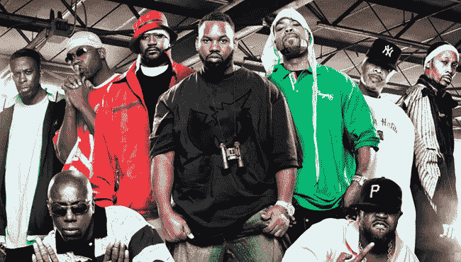
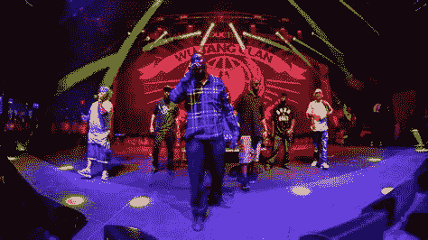

# 理解 JavaScript 解释器

> 原文：<https://javascript.plainenglish.io/the-javascript-interpreter-b17d3397ba04?source=collection_archive---------5----------------------->

大家好，本周我将发表一系列关于 JavaScript 引擎、作用域、JavaScript 中 var、let 和 const 的区别的文章。我认为本系列的最佳起点是解释 JavaScript 引擎及其工作原理。所以让我们开始吧！

## 在某种程度上，JavaScript 引擎的工作方式有点像你的身体。

你把食物放进去，它就像魔法一样被转化成能量，然后你就可以四处走动，做一些事情。你可能对这是如何发生的有一些基本的了解，但你可能不了解分子水平。嗯，就像你的身体摄入食物并将其转化为身体可以使用的能量一样，JavaScript 引擎摄入 JavaScript 并将其转化为浏览器可以使用的方向。

如果你正在阅读这篇文章，你可能还没有达到你想要或者需要确切理解它是如何工作的程度，但是一些基本的理解会有所帮助。

JavaScript 是一种单线程语言，这意味着它一次执行脚本中的一行代码…有点像看书。在这一点上，我觉得我们应该把吴唐一族带进这场对话，因为根据我的经验，任何值得了解的事情都可以用一个好的吴唐类比来概括。

所以，就像吴唐家族有多个成员一样，你的脚本也有多个函数和变量。如果吴唐家族决定表演一首歌，而团队中的每个人都在麦克风上同时吐槽，那就很难理解了，对吗？嗯，对于你的 JavaScript 来说也是一样，如果你所有的函数同时运行，你很难理解发生了什么。



现在，我必须说，我实际上并不认识吴唐帮的任何人(如果你真的让他们来找我的话)，但是，我要大胆猜测一下，当他们写一首歌的时候，他们可能会在开始录音之前做一些计划。在小组中的任何人写歌词之前，他们需要一个节拍，否则歌词可能不会准时。一旦 RZA 创造了一个节拍，这首歌的所有艺术家都可以写他们的歌词。一旦有了节拍，每个人都写好了歌词，他们还需要计划好押韵的顺序。这将是 ***创作阶段*** 的一个例子，吴在这一点上没有记录，只是对他们将要记录的内容有了一个想法。


既然吴已经知道这首歌听起来会是什么样了，那就该录首歌了。由于每个艺术家都已经写好了歌词，这个小组已经计划好了节拍的声音，当每个艺术家都押韵时，剩下的唯一事情就是做这件事。我们称这个阶段为 ***执行阶段*** ，因为每个艺术家现在将执行歌曲中他们的部分。



既然我们已经知道了吴的 ***创世&【执行阶段】***是什么样子，让我们看看 JavaScript 会是什么样子！首先，我们的代码是这样的。

所以，就像武堂门一样，JavaScript 引擎将从 ***创建阶段*** 开始，它通过脚本找到所有的变量( ***intro，beat，歌词*** )和函数(***play tro()&playback()【record song()】***)，并为它们节省内存空间。这个过程被称为 ***、*、**我觉得这是一个令人困惑的术语。对我来说， ***提升*** 意味着变量和函数被提升到了代码的顶端，而事实并非如此。我喜欢把它看作是“游戏计划”，解释器会通过代码找到所有的函数和变量，并为它们节省空间，但它会把它们留在原地。让我们稍微走过 ***创造阶段*** 和 ***提升*** 。

正如您从我上面的评论中所看到的(…顺便说一下，这正是 JavaScript 解释器在分析代码时所想的)，JavaScript 解释器现在有了一个游戏计划，它知道应该期待什么，现在只需要执行代码。请记住，我们还没有进行记录，因为我们处于 ***创建阶段*** 所以变量有空间，但目前它们尚未定义，函数存在，但它们尚未运行。

所以，从上面的注释中可以看出，JavaScript 解释器将运行 ***recordSong()*** 函数，因为它是脚本中唯一被调用的函数。让我们仔细看看调用 ***recordSong()*** 函数时会发生什么。

如上图所示，当解释器运行一个功能时，它经过另一个 ***创建阶段*** ，它也将有自己的 ***执行阶段*** 。事实上，每个被调用的函数都有自己的 ***创建阶段*** 和自己的 ***执行阶段*** 。在上面的函数中，我们有一个新的变量，叫做*，除此之外，没有新的变量或函数，所以解释器将进入 ***执行阶段*** 。*

*现在，当函数被执行时，它会产生以下结果。*

```
*Intro: Choose the sword, and you will join me. Choose the ball, and you join your mother, in death. You don't understand my words, but you must choose. So, come boy, choose life or deathBeat: dun dun duuun...dun dun duuun...dun dun duuunGhostFace Killah: Why is the sky blue? Why is water wet? Why did Judas rat to Romans while Jesus slept?Killah Priest: I judge wisely as if nothing ever surprise me lounging between two pillars of ivory.RZA: Hey yo, camouflage chameleon, ninjas scaling your building No time to grab the gun, they already got your wife and childrenGZA: The banks a G, all CREAM downs a bet Money feed good, opposites off the set*
```

*所以，就像吴唐部落首先计划一首歌，然后他们录制它一样，JavaScript 引擎采取了非常相似的方法。首先它通过 ***创建阶段*** ，在那里它通过 ***提升*** 脚本中的所有变量和函数并为它们节省内存空间来制定游戏计划。接下来，解释器进入 ***执行阶段*** ，一次执行一行代码。理解 ***提升*** 、 ***创建阶段*** 、以及 ***执行阶段*** 在你阅读我下一篇关于作用域以及 const、let 和 var 之间的区别的文章时会非常重要。*