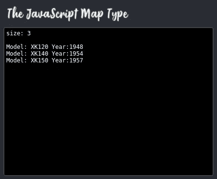
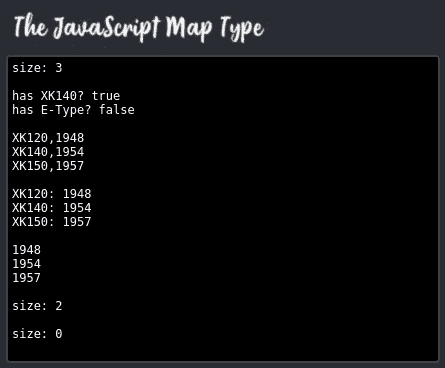

# JavaScript 映射类型

> 原文：<https://javascript.plainenglish.io/the-javascript-map-type-ec7d3e1cff5d?source=collection_archive---------8----------------------->

Image: [Pixabay](https://pixabay.com/illustrations/background-atlas-folder-old-1762690/)

地图数据类型易于理解和使用，但由于用于指代同一事物的名称多种多样，该主题可能会引起混淆。最重要的是，JavaScript 没有自己的映射类型，直到 ES6 出现，我们不得不临时使用一个普通的对象。

在这篇文章中，我将在使用一个对象和一个 ES6 地图之前先浏览一下什么是地图。

在 JavaScript 中通常称为映射的数据结构，尤其是自从引入 ES6 映射类型以来，也被称为字典或关联数组，有时也称为哈希表或哈希表。这最后两个名字有些误导，因为它们指的是一种可能的底层实现，而不是抽象的行为集。

映射是键/值对的集合，或者换句话说，是用于引用相应数据值的名称或标签的集合。在一个映射中，每个键必须是唯一的。以下操作是需要可用的最少操作，尽管通常实现会提供更多操作。

*   插入新对
*   删除现有对
*   编辑现有对
*   读取给定键的值

JavaScript 映射类型还提供以下功能:

*   获取条目的数量
*   在一次操作中删除所有条目
*   获取键/值对
*   拿钥匙
*   获取值
*   检查密钥是否存在
*   对所有条目运行函数的 forEach 函数

## 该项目

这是一个快速简单的项目，它给出了一个非常简单的传统的基于对象的地图的演示，然后是一个更全面的 ES6 地图类型的演示。您可以从 [Github 库](https://github.com/CodeDrome/javascript-map-type)中克隆或下载源代码。

(该项目还包括一个名为 **console.js** 的小实用程序文件，它提供了一个函数，以模拟终端的方式将文本输出到 HTML 页面中的元素。)

JavaScript 位于一个名为 **map.js** 的文件中，这是该文件的第一部分。

如你所见，`useObjectAsMap`函数在`window.onload`中被调用，而第二个函数`useMap`，我们稍后会看到，被注释掉了。

`useObjectAsMap`函数非常简单:它只是创建一个`Object`，然后添加一些属性来模拟地图数据结构。然后，我检索对象的键，打印出大小和键/值对。

这种方法本身没有什么错误，毫无疑问，它已经被使用了数百万次。然而，它并不完美，ES6 Map 提供了一个更优化的实现。

如果你在浏览器中打开**map.htm**，你会看到类似这样的内容。

现在我们来看看`useMap`函数。

这段代码应该是不言自明的，但是一些额外的注释可能会有所帮助。

*   使用`set`方法添加键/值对。
    代码如
    `jaguars[“XK120”] = 1948; // WRONG!`
    不会导致错误但也不会将项目添加到`Map`。
*   我使用字符串作为键，但是令人惊讶的是你可以使用任何东西，包括对象和函数。我还没有机会使用一个函数作为一个键，但希望有一天。(软件开发者有些奇怪的野心！)
*   使用`size`方法检索项目数量。`length`将返回 0。
*   我们可以使用`has`来检查钥匙的存在。
*   您可以获得键/值对，因此使用`entries`方法迭代`Map`。
*   您也可以分别使用`keys`和`values`来分别获取键或值。
*   如果你有一个键，你可以用`get`方法读取相应的值。
*   也可以使用
    `for (let [key, value] of jaguars)`迭代条目
*   迭代器按照条目被插入的顺序返回条目。
*   您可以使用`delete`方法删除单个条目。
*   您可以使用`clear`方法删除所有条目。
*   除了比`Object`更直观之外，`Map`还为频繁的设置和删除操作提供了更好的性能。

如果您注释掉`useObjectAsMap`并取消`window.onload`中的`useMap`注释，然后刷新页面，您将看到对我们的`Map`对象的各种操作的结果。

