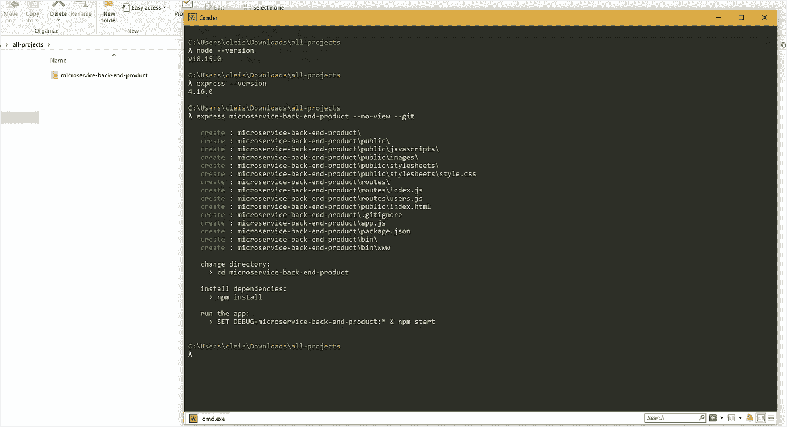
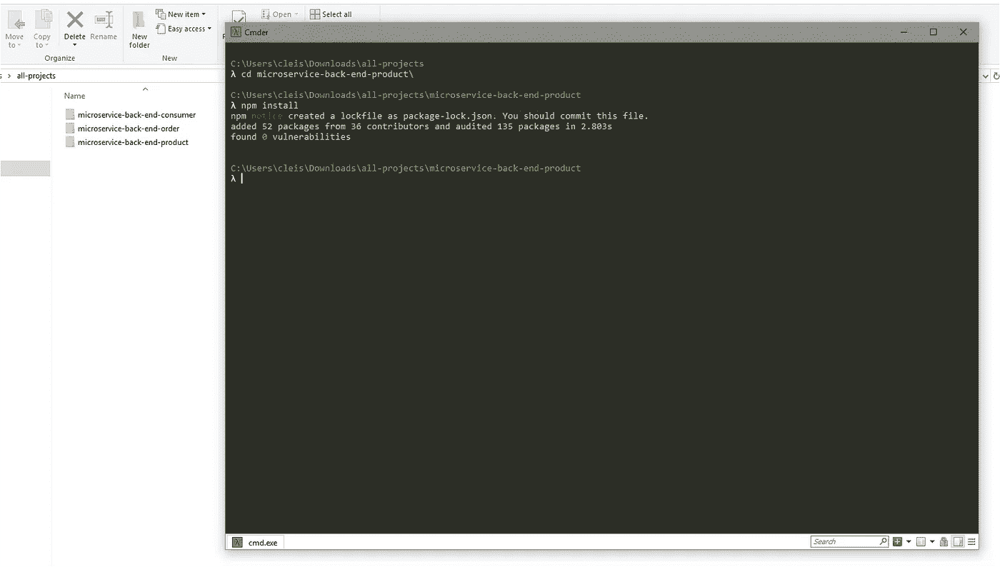
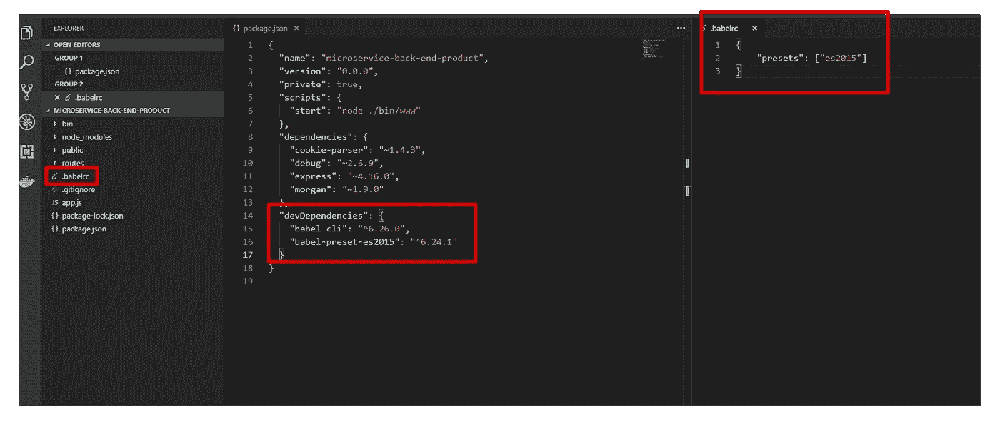
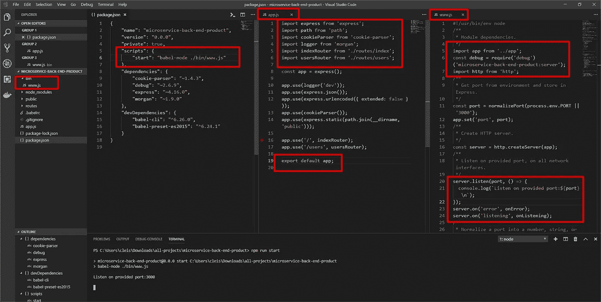

# 构建完整微服务应用的旅程(第 1 部分)

> 原文：<https://javascript.plainenglish.io/the-journey-to-building-a-full-microservice-app-9267a910a04f?source=collection_archive---------0----------------------->

我将分享我创建 POC 以构建完整微服务应用程序的过程。完全微服务意味着我计划分别在前端和后端构建组件，**帮助敏捷团队内部的 CI/CD 流程**。

我将尝试这样做，以确认是否单独构建所有内容是一个好方法。如您所见，我在这个过程中开始写这篇文章；我不确定我的旅程是否会成功。

然而，我想与你分享；也许这对你来说是值得的。

> “成功是一个旅程，而不是目的地。过程往往比结果更重要。阿瑟·阿什”


pixabay.com

我首先要告诉你的是堆栈。后端方面，我选择用 **Node.js** 搭配 **Express 框架**，我是一个 Java 程序员，我可以选择 Java，但是我喜欢把自己推向未知。

为了服务之间的集成/通信，我选择了使用 **RPC** 策略的 **RabbitMQ** 。记录数据，我选择了 **MongoDB** 和**Redis**；所有 GET 操作都将从 Redis 中检索数据，所有 PUT、DELETE 和 POST 操作都将更新 Redis 数据和 MongoDB 数据。

在前端方面，我选择使用 **Angular** 最新版本的**材料设计**。我打算为 **AWS** 推送一切，我想使用 **ECS** 服务，因此我将创建 **Docker** 文件，并且在我的本地环境中，我将运行所有使用**Docker**Compose 来编排它的容器。

一旦我定义了堆栈，现在我必须定义服务，我的想法是保持简单，所以，服务是:**消费者** (id，名字，姓氏和电子邮件)，**产品** (id，名字，价值和数量)和**订单** (id，product_id，productName，consumer_id，consumerName，数量和日期)。

# **我将开始创建后端服务**

为此，我将使用 Express CLI 来为我生成包。在开始之前，请记住，您必须先安装几个开发工具。

安装 node . js "[https://nodejs.org/en/](https://nodejs.org/en/)

安装快速框架`npm install express -g`

一旦您安装了节点和 Express，现在您可以创建一个文件夹，主文件夹，所有项目都将在那里。在这个主文件夹中，运行命令:

`express –no-view microservice-back-end-product — git`

`express –no-view microservice-back-end-consumer — git`

`express –no-view microservice-back-end-order — git`



所附的截图显示了对 Node.js 和 Express 安装的检查，然后运行命令创建第一个微服务。

注意命令输出；在那之后你有一些步骤要做。



一旦我创建了所有的项目，我应该安装节点依赖关系，附上的截图显示了这个过程，你应该为所有的项目这样做。

完成上一步后，现在我将项目更改为 JavaScript **ES2015 —** ，这样您就可以使用新的 JavaScript 语言特性。



首先，我添加了文件**。根文件夹中的 babelrc** 并包含了高亮显示的内容。其次，我添加了 ECSMA 2015 项目工作所需的依赖项。

之后，在根文件夹中运行命令`npm install`来安装新的依赖项。



现在你应该做一些改变。

为此，首先:添加**。js 扩展名为 www** 的文件放在 bin 文件夹内，查看高亮显示的项目。

第二:在 package.json 中更改脚本操作，正如您在突出显示的内容中所看到的。

第三:替换 ECSMA 2015 新标准的“旧”代码 JavaScript 正如您在所附的截图中看到的，文件 [www.js](http://www.js) 和 app.js 应该被更改。

更改后，在根文件夹中运行“npm run start”，如果一切正常，您将从控制台获得输出“**Listen on provided port:3000**”。

打开浏览器并键入[http://localhost:3000/users](http://localhost:3000/users)您可能会看到消息“用资源响应”，要停止节点服务器，请在控制台内单击 ctrl+c，并按“Y”确认。

对所有创建的项目重复这些步骤。

我将完成文章的第一部分。下次再见，我们将为自己创建合适的开发环境并安装更多的依赖项。

# 克莱森·费雷拉·德·梅洛

*讲师 Estía 培训*

[](https://medium.com/@cleisonferreiramelo/the-journey-to-building-a-full-microservice-app-the-dev-env-60c492f40937) [## 打造全微服务 app 之旅。开发环境。

### 嗨，伙计们，继续我们的文章，现在我将改变我们的项目，自动重启 Node.js 服务器…

medium.com](https://medium.com/@cleisonferreiramelo/the-journey-to-building-a-full-microservice-app-the-dev-env-60c492f40937) 

帮助您的最终代码:

```
*//package.json*

{
    "name": "microservice-back-end-product",
    "version": "0.0.0",
    "private": true,
    "scripts": {
        "start": "babel-node ./bin/www.js"
    },
    "dependencies": {
        "cookie-parser": "~1.4.3",
        "debug": "~2.6.9",
        "express": "~4.16.0",
        "morgan": "~1.9.0"
    },
    "devDependencies": {
        "babel-cli": "^6.26.0",
        "babel-preset-es2015": "^6.24.1"
    }
}*//.babelrc*

{
    "presets": ["es2015"]
}*//www.js*

#!/usr/bin/env node
*/**
 * Module dependencies.
 */*
import app from '../app';
const debug = require('debug')('microservice-back-end-product:server');
import http from 'http';
*/**
 * Get port from environment and store in Express.
 */*
const port = normalizePort(process.env.PORT || '3000');
app.set('port', port);
*/**
 * Create HTTP server.
 */*
const server = http.createServer(app);
*/**
 * Listen on provided port, on all network interfaces.
 */*
server.listen(port, () => {
  console.log(`Listen on provided port:${port} \n`);
});
server.on('error', onError);
server.on('listening', onListening);
*/**
 * Normalize a port into a number, string, or false.
 */*
function normalizePort(val) {
  let port = parseInt(val, 10);

  if (isNaN(port)) {
    *// named pipe*
    return val;
  }

  if (port >= 0) {
    *// port number*
    return port;
  }

  return false;
}

*/**
 * Event listener for HTTP server "error" event.
 */*

function onError(error) {
  if (error.syscall !== 'listen') {
    throw error;
  }

  let bind = typeof port === 'string' ? 'Pipe ' + port : 'Port ' + port;

  *// handle specific listen errors with friendly messages*
  switch (error.code) {
    case 'EACCES':
      console.error(bind + ' requires elevated privileges');
      process.exit(1);
      break;
    case 'EADDRINUSE':
      console.error(bind + ' is already in use');
      process.exit(1);
      break;
    default:
      throw error;
  }
}

*/**
 * Event listener for HTTP server "listening" event.
 */*

function onListening() {
  let addr = server.address();
  let bind = typeof addr === 'string' ? 'pipe ' + addr : 'port ' + addr.port;
  debug('Listening on ' + bind);
}*//app.js*

import express from 'express';
import path from 'path';
import cookieParser from 'cookie-parser';
import logger from 'morgan';
import indexRouter from './routes/index';
import usersRouter from './routes/users';

const app = express();

app.use(logger('dev'));
app.use(express.json());
app.use(express.urlencoded({ extended: false }));
app.use(cookieParser());
app.use(express.static(path.join(__dirname, 'public')));

app.use('/', indexRouter);
app.use('/users', usersRouter);

export default app;//console output

PS C:\Users\cleis\Downloads\all-projects\microservice-back-end-product> npm run start

> microservice-back-end-product@0.0.0 start C:\Users\cleis\Downloads\all-projects\microservice-back-end-product
> babel-node ./bin/www.js

Listen on provided port:3000

//CTRL + C

Terminate batch job (Y/N)? y
PS C:\Users\cleis\Downloads\all-projects\microservice-back-end-product>
```