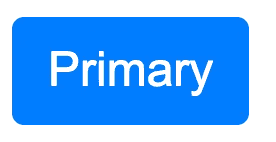

# 用样式化组件设计样式的现代方式

> 原文：<https://javascript.plainenglish.io/the-modern-way-to-style-with-styled-components-c3c51b750b5f?source=collection_archive---------2----------------------->

## 深入了解样式化组件的强大功能


Photo by [Greg Rakozy](https://unsplash.com/@grakozy) on [Unsplash](https://unsplash.com/)

# 我的旅程

像许多人一样，我第一次开始使用内联 CSS 设计 React。这是来自样式表的调整，但我真的很喜欢定义本地化样式和利用 Javascript 力量的能力。当然，也有一些问题，比如性能和缺乏伪选择器支持，但是总体来说我很满意，没有令人信服的理由或不足来寻找另一种方式来设计我的组件。

当我第一次接触到[风格的组件](https://styled-components.com/)时，我有点担心它的好处，因为我已经习惯内联 CSS 很久了。毕竟，React documentation(当时)仍然对所有的例子使用内联 CSS。当我原型化这个框架时，我发现了内联 CSS 和传统样式表之间的两全其美。

# 样式组件

尽管定义非常不同，但样式化组件的行为基本上类似于 React 组件。它们都以 props 作为 HTML 的输入和输出。

让我们以这个按钮组件为例，它的样式类似于 [Bootstrap 的按钮](https://getbootstrap.com/docs/4.0/components/buttons/)的样式。

```
import styled from 'styled-components';const Button = styled.button`
  display: inline-block;
  padding: 6px 12px;
  font-size: 16px;
  font-family: Arial, sans-serif;
  line-height: 1.5;
  color: white;
  background-color: #6c757d;
  border: none;
  border-radius: 4px; :not(:disabled) {
    cursor: pointer;
  } :hover {
    background-color: #5a6268;
  }
`;
```

导入`styled`组件工厂，并使用模板文字(``...``)生成带有样式的按钮。该工厂支持所有有效的 [HTML 元素](https://github.com/styled-components/styled-components/blob/master/packages/styled-components/src/utils/domElements.js)，无论是`div`、`h1`、`p`等。类似地，模板文本中的样式接受所有有效的 CSS，因此您可以疯狂使用复杂的 [CSS 选择器](https://www.w3schools.com/cssref/css_selectors.asp)。

# 使用

一旦被定义，它们的行为就完全像 React 组件，并且以完全相同的方式使用——JSX。毕竟，样式化组件只是带有某种样式的 React 组件。

```
const App = () => {
  return (
    <Button onClick={() => alert('clicked!')} type="button">
      Button
    </Button>
  );
};
```


Styled Component Button

就像 React 组件一样，Styled 组件也接受 props，并以完全相同的方式定义。样式化的组件会将所有(有效的)DOM 属性传递给 DOM。

# 内部构件

好吧，这是怎么回事？内部正在发生什么神奇的过程？

1.  在渲染时，样式化组件将基于定义的样式生成唯一的类名。
2.  样式化组件将在 HTML 头中注入一个样式标签(`<style>`)，将惟一的类名映射到定义的样式。
3.  样式化组件将使用唯一的类名呈现元素。

对于我们的例子，这些步骤将导致 DOM 结构看起来像这样。

```
<!DOCTYPE html>
<html lang="en">
  <head>
    <style data-styled="active" data-styled-version="5.2.0">
      .bAeiQF {
          display: inline-block;
          padding: 6px 12px;
          font-size: 16px;
          font-family: Arial, sans-serif;
          line-height: 1.5;
          color: white;
          background-color: #6c757d;
          border: none;
          border-radius: 4px;
      }
      .bAeiQF:not(:disabled) {
          cursor: pointer;
      }
      .bAeiQF:hover {
          background-color: #5a6268;
      }
    </style>
  </head>
  <body>
  <div id="root">
    <button type="button" class="sc-bdnylx bPvsWA">
      Button
    </button>
  </div>
  </body>
</html>
```

# 扩展组件

组件工厂也可以用来扩展现有的样式。它可以接受一个样式化的组件，并以类似 React 的高阶组件的方式返回一个新的组件。

```
const PrimaryButton = styled(Button)`
  background-color: #007bff;
  :hover {
    background-color: #0069d9;
  }
`;const App = () => {
  return (
    <PrimaryButton onClick={() => alert('clicked!')} type="button">
      Primary
    </Button>
  );
};
```



Extended Style Button

使用`styled`作为一个函数将产生一个新的样式化组件，该组件具有来自`Button`组件的样式和模板文本中定义的新样式。如果样式冲突，新样式优先。所有道具(带`$`前缀的除外；参见[造型道具](#362b))也将被传递给底层组件。

类似地，`styled`组件工厂可以通过小的修改来扩展 React 组件。

```
const ButtonComponent = ({ className }) => {
  return (
    <Button
      className={className}
      onClick={() => alert('clicked!')}
      type="button"
    >
      Primary
    </Button>
  );
};const PrimaryButton = styled(ButtonComponent)`
  background-color: #007bff;
  :hover {
    background-color: #0069d9;
  }
`;
```

实现这一点的一个关键附加功能是`className`支柱。扩展样式的组件将设置`className`并在渲染时将其传递给 React 组件。这个`className`将映射到定义的样式，就像它如何处理样式化的组件一样。因此，如果没有`className`，样式将无法应用。

# 可组合的样式

样式组件还允许我们定义可重用的样式，这些样式可以组合成样式组件。

```
import styled, { css } from 'styled-components';const blackFont = css`
  color: black;
`;const WarningButton = styled(Button)`
  background-color: #ffc107;
  :hover {
    background-color: #e0a800;
  }
  ${blackFont}
`;const App = () => {
  return (
    <WarningButton onClick={() => alert('clicked!')} type="button">
      Warning
    </WarningButton>
  );
};
```


Composed Style Button

在这里，`blackFont`是一个通用的样式。它是使用`css`助手用模板文字定义的。`WarningButton`和任何其他样式的组件都可以包含这种带有美元符号花括号语法的样式，以合并两个模板文字。

# 造型道具

此外，样式组件本身可以使用道具来修改样式。

```
import styled, { css } from 'styled-components';const SuccessButton = styled(Button)`
  ${props =>
    props.$success
      ? css`
          background-color: #28a745;
          :hover {
            background-color: #218838;
          }
        `
      : ''}
`;const App = () => {
  return (
    <SuccessButton
      $success
      onClick={() => alert('clicked!')}
      type="button"
    >
        Success
    </SuccessButton>
  );
};
```


Styling Props Button

在这里，`Button`组件被扩展为采用一个`$success`属性，如果设置为 true，该属性将有条件地设置成功样式(使用可组合样式)。

虽然造型道具不需要`$`前缀，但我强烈推荐。通常，所有的 props 都被传递给底层组件(DOM 元素、React 组件或样式化组件)。名称以`$`为前缀的属性称为瞬态属性，仅由定义的样式组件使用，不会传递给底层组件。这就非常清楚哪些道具是用于造型的，哪些道具是用于底层组件的。

# 最后的想法

Styled Components 为样式化提供了一个简单而奇妙的界面。它使用核心 React 原则增强了开发人员对 CSS 的体验。它与 React 集成得如此之好，以至于我不禁想知道 React 为什么不直接集成它——它就是这么好。我再也不会回到我以前的造型方式了。

# 资源

*   [官方风格组件文档](https://styled-components.com/)
*   [Github 回购本文](https://github.com/mjchang/medium/tree/master/styled-components-1)
*   [本文的 CodeSandbox】](https://codesandbox.io/s/github/mjchang/medium/tree/master/styled-components-1)