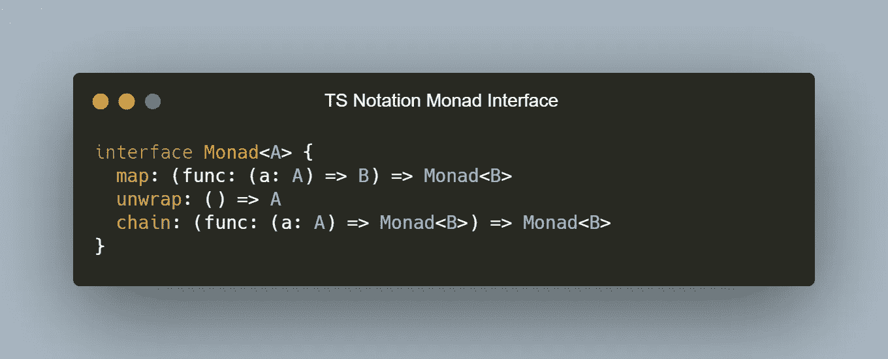
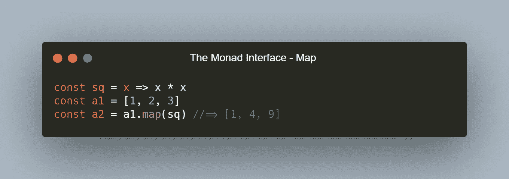
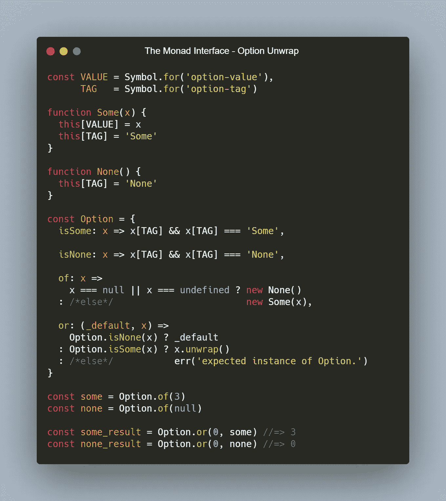
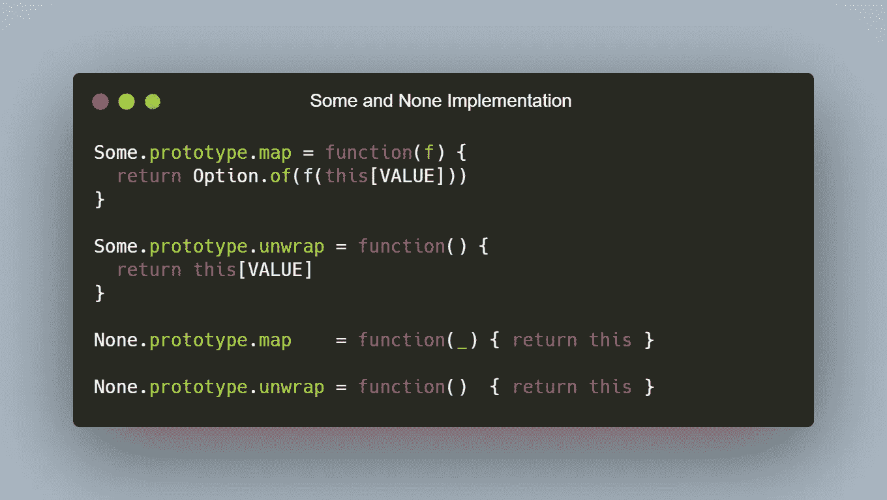
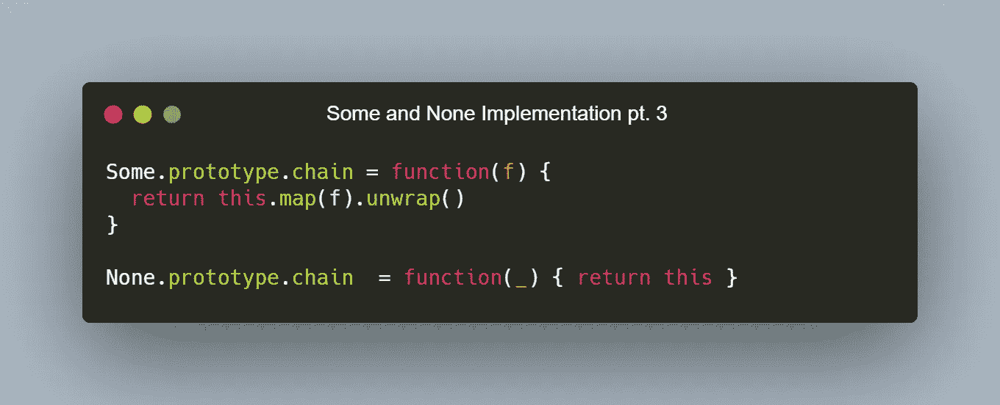
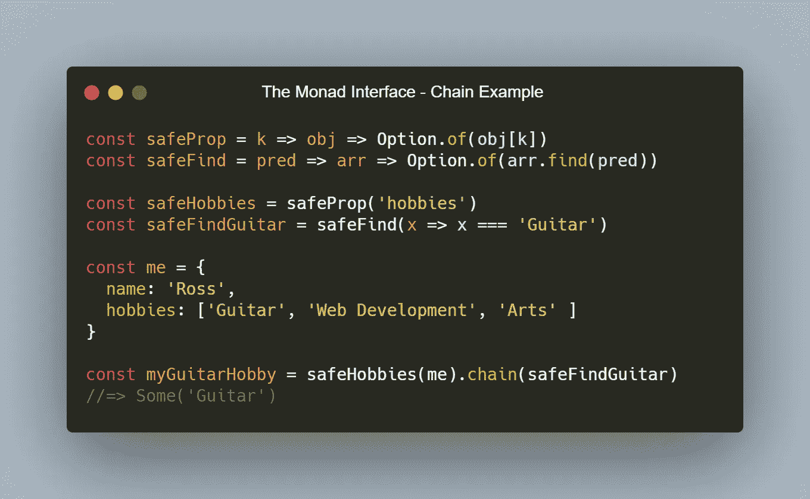
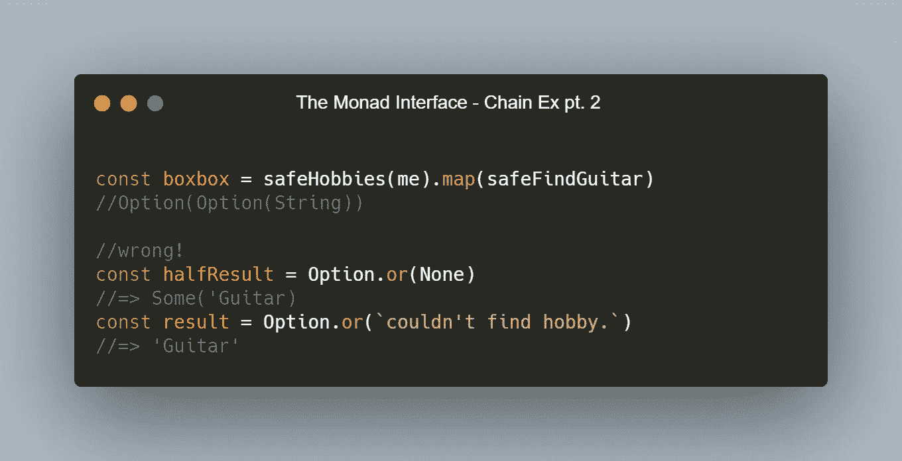

# 单子界面

> 原文：<https://javascript.plainenglish.io/the-monad-interface-2045e5810851?source=collection_archive---------5----------------------->

## 莫纳德简单地解释道

Photo by [Michael Dziedzic](https://unsplash.com/@lazycreekimages?utm_source=medium&utm_medium=referral) on [Unsplash](https://unsplash.com?utm_source=medium&utm_medium=referral)

最近在 JS 世界里，单子风靡一时。如果任何严肃的 JS 开发者没有听说过*单子，我会感到惊讶。*但以防万一，我喜欢把单子描述成一个奇特的盒子。这是一个特殊的盒子。你不能(嗯，你*不应该*能够)看到盒子里面到底是什么，但是你*可以*知道这个盒子保存了某种类型的值，并且公开了三个主要的操作符，我们可以用它们来修改或者取出盒子的内容。这些操作就是我所说的 *Monad 接口。*

好的，所以 *Monad* 不完全是一个接口。但是在 JS 中我们可以把它想成一个。作为快速复习，在强类型语言(如 C 系列)中，*接口*是类对象*的定义。*如果你曾经使用过 TypeScript，你会知道一个接口描述了某个东西的预期*形状*——比如一个对象，或者一个函数的参数和返回值。一个接口归结起来就是一个*契约*由任何实现该接口的东西来维护，但是它没有给出实现的细节。将事物看作接口是有用的，因为接口是抽象的。抽象是计算机科学中最有用的概念之一。说什么东西是*抽象*就是表达它离机器码有多远。我们离机器代码越远越好，因为人类大脑理解语言的抽象；只有机器被制造来读取机器码。关于接口最好的部分是它是一个无成本的抽象。例如，如果您用 TypeScript 编写一个，它最终甚至不会生成代码，它只会在编译时检查接口的契约是否得到维护。在 bare JS 中，接口只是在作者的头脑中。因此，我们只能通过自己确保所有预期的方法和字段都被正确实现来维护接口的契约——没有编译时检查来帮助您。但这没关系，因为 JS 的动态类型特性带来了一些其他非常好的好处，我现在不一定要讨论这些。

所以事不宜迟，下面是 *Monad* 坚持的接口(用 TS 接口符号表示):

The Monad Interface in TS notation.

其实没那么复杂。我将逐一介绍这三个函数，让它们变得清晰明了。

首先我们从`map`开始。`map`是*单子*界面中最容易掌握的功能。我们一直在 JS 中使用它。它说，‘给定一个单子`M a`和一个函数`a -> b`，将该函数应用于单子的内容`M a`产生一个单子`M b`。您可以在野外看到本地 JS 的*数组*类型的地图。在*数组*中，`map`只需将提供的函数应用于数组中的每个元素，生成一个新的数组:

An example of the map function as used by Array.

请注意，我只使用函数`sq`的标识符来调用 map 的方式——这是一种声明式的编码方式。你在一个地方定义事物，在其他地方用名字称呼它们。简单地用名字来称呼它们实际上让事情变得不那么复杂，因为它会将您编写的代码弄乱。此外，您可能想在多个地方拨打`sq`。为什么每次调用`sq`都要写出匿名函数`x => x * x`？也看看阅读有多好？这几乎是简单的英语，“将函数`sq`应用于`a1`的内容，并将其分配给一个新的数组`a2`。

现在为`unwrap`。`unwrap`是 *Monad* 界面中最没有意义的界面。您可能知道它是`flat`、`flatten`、`join`、`emit`等，但它的意思是“把盒子里的东西拿出来”。虽然拥有它可能看起来很傻，但它实际上是一个非常重要的功能。如果你不能从盒子里拿出里面的东西，单子就没什么用了。也就是说，您通常不应该调用`unwrap`，相反，您应该选择一个考虑到您的 Monad 的每个变体的函数。

考虑这个片段，定义一个最小的选项(一个处理可空值的单子)。

The Option Monad with an example of correct unwrapping.

这段代码创建了一个基础，它定义了一个简单的容器，该容器有两个变体( *Some* 和 *None* )，称为 *Option* 。它还不是一个完全成熟的单子，因为我们还没有在它上面定义`map`、`chain`或`unwrap`。注意选项 namespace-object 上的`or`的定义。它在内部调用`unwrap`，而不是直接调用。它检查每个变量，如果不是 Option 的变量，就抛出一个错误。这优于`unwrap`，因为展开一个 *None* 值将简单地返回一个 *None* 。大多数单子都有一个特定的函数来安全地展开它们，考虑空值或未定义的值并适当地响应，更重要的是，*可预测的。*

让我们用上面定义的`map`和`unwrap`操作符来充实*选项*。

Map and Unwrap implemented for the option variants Some and None.

现在我们有了一些真正的功能。让我们快速讨论一下这意味着什么:

*   选装件有两种*变型——部分*和*无*。
*   你要么有一些东西，要么什么都没有。
*   当你有一些东西，你可以像平常一样映射和打开它。
*   当你没有任何东西的时候，你可以试着映射或打开，但你仍然没有，所以这就是为什么我们不断返回它。

现在我们可以对盒子里的东西进行操作。如果我们仅仅在`map`处停止，我们就会有所谓的*函子*。函子是一个奇特的盒子，可以`map`。很容易把函子误认为完全成熟的单子，但它们是不同的。必须遵守数学恒等式法则，才能正确地将 a 构造定义为单子，包括`unwrap`和`chain`方法。我们不会深入讨论所有这些，但是我们将定义`chain`，当它和`unwrap`一起被正确定义时，几乎可以使函子成为单子。现在我们来定义一下`chain`:

Chain of the Monad Interface implemented on Some and None.

明白我为什么把链子留到最后了吧？它是通过在一个类型上定义`map`和`unwrap`免费给我们的。`chain`实际上是将提升值的函数链接在一起，通过展开丢弃外部的单子。这是一种数学对称，允许我们应用单子构造操作，而不会出现盒中盒中盒的情况。这些是 FP 想要避免的复杂类型。

现在我们可以玩一下`chain`:

A simple use case for chain of the Monad Interface.

如果我们没有`chain`，我们仍然可以像这样映射函数。这种方法的问题是，我们最终会得到一个`Option(Option(A))`，而不仅仅是一个`Option(A)`。用盒子里的盒子工作要复杂得多。让我们看看会发生什么:

Mapping an Option-returning function into an Option.

看看我们现在如何考虑我们的嵌套值是什么，然后随着我们的进行添加越来越多的展开？这就是为什么`chain`如此重要——它使得一系列相当冗长的操作变得非常简单易懂。一个人一次只能处理这么多信息，所以为什么不通过让信息更有表现力来让自己的生活变得更好呢？这很有意义。想象一下，尝试使用 prop 之类的方法处理一些检索到的 JSON，将结果提升到一个新的单子中——如果我们不使用 chain 来打开每个结果，每个嵌套的值都会创建一个新的单子包装器。这将导致展开等于您需要下降的嵌套级别—不理想。故事的寓意:使用`chain`安全地操作你的价值，同时丢弃多余的容器。

所以现在我们知道了如何基于这个接口定义简单的单子。这支笔可以让你破解选项单子:

希望你喜欢函数式编程的冒险。直到下一次，FP 对乡亲们！