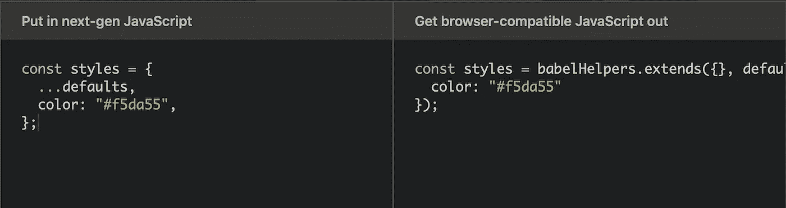
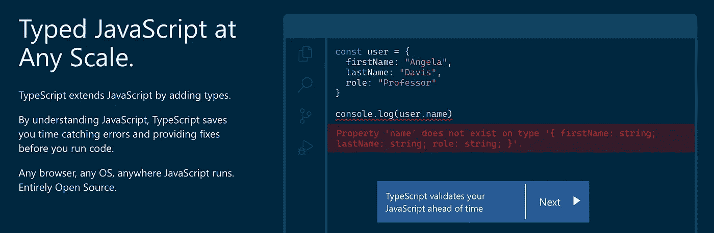
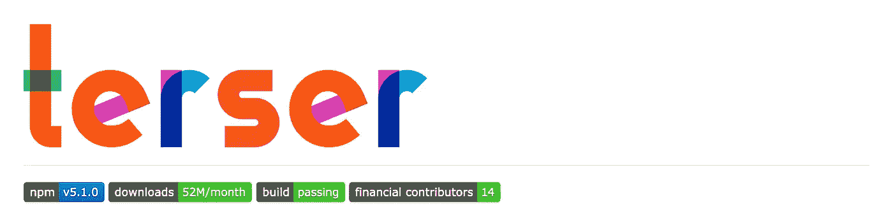
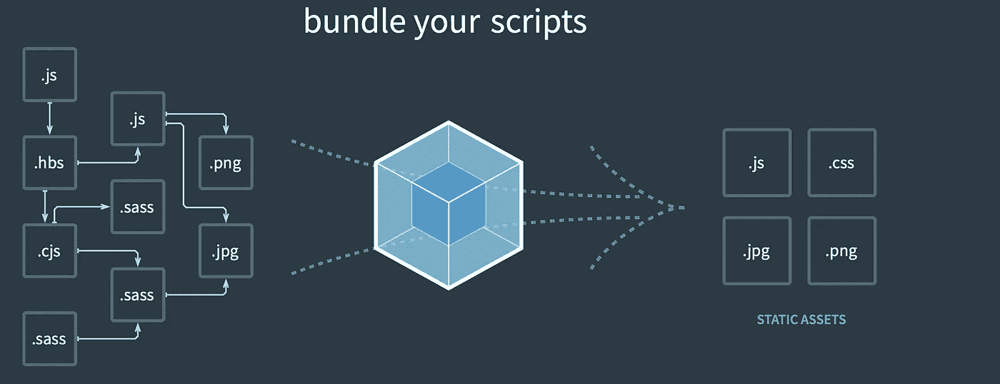
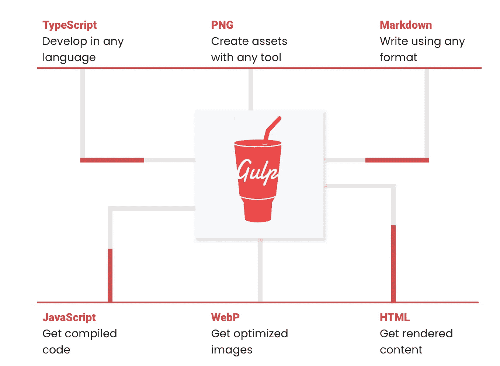
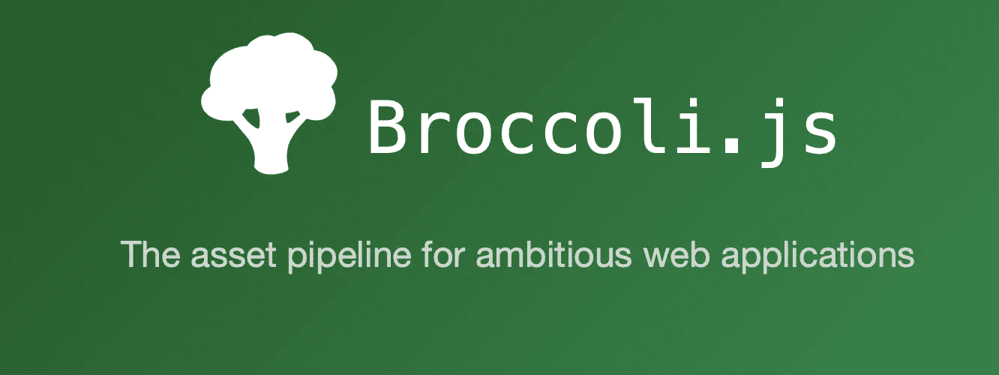
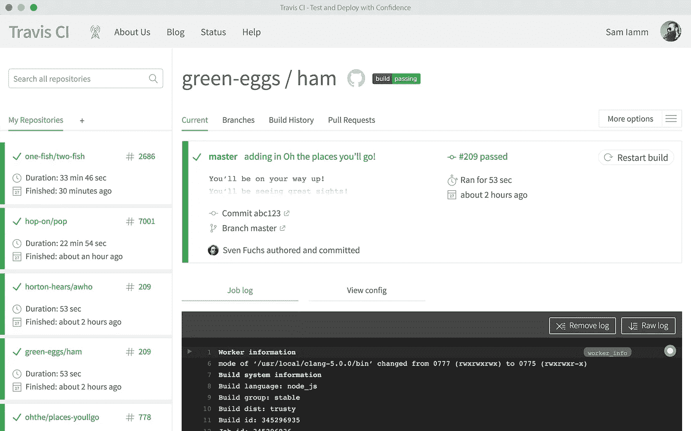
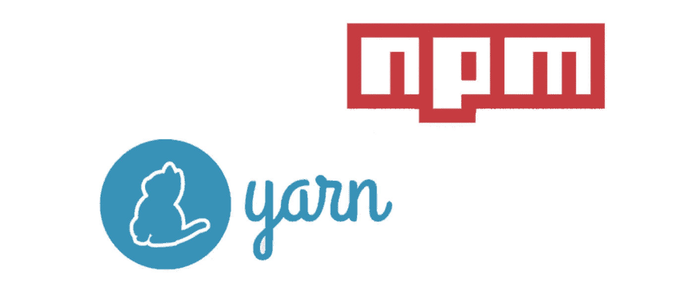

# 您应该使用的最流行的 JavaScript 工具

> 原文：<https://javascript.plainenglish.io/the-most-popular-javascript-tools-you-should-be-using-7630a424186a?source=collection_archive---------1----------------------->

## 深度 JavaScript

## 构建、检查、测试等等

Photo by [Maxim Selyuk](https://unsplash.com/@artplay?utm_source=medium&utm_medium=referral) on [Unsplash](https://unsplash.com?utm_source=medium&utm_medium=referral)

根据流行程度选择开发工具并不是一个坏主意。受欢迎的工具通常更稳定，它们通常比不太受欢迎的工具拥有更多的资源和社区支持。今天，我将介绍工具的类别和许多特定工具的名称。

让我们现在开始吧…！

# 构建工具

我们使用构建工具构建我们编写的 JavaScript 源代码。

## 运输工人

transpiler 是一种将源代码编译成源代码的工具。有两种 transpilers 在社区中很受欢迎，如下所示。

*   [**Babel**](https://github.com/babel/babel) 是一款帮助你用最新版本的 JavaScript 编写代码的编译器。当您支持的环境本身不支持某些特性时，Babel 会帮助您将这些特性编译成支持的版本。

*   [**Typescript**](https://github.com/microsoft/TypeScript) 是 JavaScript 的超集除了标准正在定义的所有新东西之外，还将添加一个静态类型系统。Typescript 还有一个 transpiler，它将我们的 Typescript 代码(即 ES6 +类型)转换为 ES5 或 ES3 javascript 代码，这样我们就可以在今天的浏览器中使用它。

## 迷你放大镜

Minifiers 是一种工具，它可以删除不必要的或冗余的数据，而不会影响浏览器处理资源的方式，例如，代码注释和格式、删除未使用的代码、使用较短的变量和函数名等。

有一些流行的小型打印机，包括:

*   [**UglifyJS**](https://github.com/mishoo/UglifyJS#readme) 是一个 JavaScript 解析器、迷你器、压缩器和美化器工具包。
*   [**Babel-minify**](https://babeljs.io/docs/en/babel-minify) :如果你还没有使用 Babel(作为预置)或者想独立运行，使用 Babel-minify。
*   [**Terser**](https://github.com/terser/terser) 是面向 ES6+的 aJavaScript 解析器和 mangler/compressor 工具包。

*   [**闭包编译器**](https://github.com/google/closure-compiler) 是一款让 JavaScript 下载运行更快的工具。它不是从源语言编译成机器码，而是从 JavaScript 编译成更好的 JavaScript。它解析你的 JavaScript，分析它，删除死代码，重写并最小化剩下的代码。它还检查语法、变量引用和类型，并警告常见的 JavaScript 陷阱。

## 捆扎机:

JavaScript bundler 是一个工具，它将您的代码及其所有依赖项放在一个 JavaScript 文件中。它还通过使用诸如[树摇动](https://webpack.js.org/guides/tree-shaking/)之类的技术来最小化输出的大小，并在绑定时执行编译步骤，如传输和缩小。

受欢迎的捆扎机包括:

*   [**Webpack**](https://webpack.js.org) 是一个面向现代 JavaScript 应用的静态模块捆绑器。

*   [**Browserify**](http://browserify.org) 允许您通过捆绑所有依赖项在浏览器中要求`‘modules’`。

*   [**Rollup**](https://rollupjs.org/guide/en/) 是一个 JavaScript 的模块捆绑器，它将小段代码编译成更大更复杂的东西，比如一个库或应用程序。

*   [**Parcel**](https://parceljs.org) 是一个 web 应用捆绑器，以其开发者经验来区分。它利用多核处理提供极快的性能，并且不需要任何配置。

## 把它们放在一起

我们将所有这些工具和构建步骤放入所谓的任务运行器中，如下所示。

*   [**Grunt**](http://gruntjs.com/) 是一个任务运行器，帮助自动化前端开发&节省时间。

*   [**一饮而尽**](https://gulpjs.com) 是一个自动化&增强工作流程的工具包

*   [**西兰花**](https://broccoli.build) 是一个 JavaScript 构建工具，它公开了一个简单的 JavaScript API 来执行基于文件的转换，允许开发人员使用简单的功能 API 轻松构建复杂的构建管道。

# 静态检查

这意味着在不运行源代码的情况下对其进行统计分析。它可以用来检测各种问题，包括有问题的模式、未使用的变量、代码风格等等。

## 棉短绒

它们是分析源代码以标记编程错误、bug、风格错误和可疑结构的工具。

*   [**JSLint**](https://jslint.com) 是软件开发中用于检查 JavaScript 源代码是否符合编码规则的静态代码分析工具。
*   [**JSHint**](https://github.com/jshint/jshint) 是一个社区驱动的工具，可以检测 JavaScript 代码中的错误和潜在问题。
*   [**ESLint**](https://eslint.org) —查找并修复您的 JavaScript 代码中的问题。

## 代码样式检查器

它们根据缩进、括号后的空格、逗号后的空格等检查代码的格式是否正确。

*   [**JSCS**](https://jscs-dev.github.io)—JavaScript 代码样式检查器。这是一个代码风格棉绒和格式为您的风格指南。

## 代码格式化程序

它们会根据您可以自定义的规则自动格式化您的代码。

*   漂亮是一个固执己见的代码格式化程序。它通过解析您的代码并根据自己的规则(考虑到最大行长度，必要时换行)重新打印代码来强制执行一致的风格。

## 类型检查器

我们使用 [**流**](https://flow.org/en/) 作为 JavaScript 代码的静态类型检查器。它做了很多工作让你更有效率。让你的代码更快、更智能、更自信、更大规模。

# 测试框架

JavaScript 中有很多测试框架。

## 单元测试

单元测试只测试实现的一个部分。一个单位。没有依赖或集成，没有框架细节。它们就像一个用特定语言返回链接的方法。一些流行的单元测试框架包括。

*   [**Jasmine**](https://jasmine.github.io) 是一个行为驱动的开发框架，用于测试 JavaScript 代码。它不依赖于任何其他 JavaScript 框架。它不需要 DOM。它有一个清晰、明显的语法，所以你可以很容易地编写测试。
*   [**Mocha**](https://mochajs.org) 是一个功能丰富的 JavaScript 测试框架，运行在 Node.js 上和浏览器中，让异步测试变得简单有趣。Mocha 测试连续运行，允许灵活和准确的报告，同时将未捕获的异常映射到正确的测试用例。
*   [**AVA**](https://github.com/avajs/ava) 是 Node.js 的测试运行程序，它有简洁的 API、详细的错误输出、新的语言特性和进程隔离，让你可以放心地开发。
*   [**Jest**](https://jestjs.io) 是一个令人愉快的 JavaScript 测试框架，专注于简单性。它与项目一起使用:Babel，TypeScript，Node，React，Angular，Vue 等等！
*   [**Karma**](https://karma-runner.github.io/latest/index.html) 的主要目标是为开发者带来一个高效的测试环境。

## 集成测试

在某些时候，您的代码与数据库、文件系统或另一个第三方进行通信。它甚至可以是你应用程序中的另一个模块。这部分实现应该通过集成测试来测试。他们通常有一个更复杂的设置，包括准备测试环境、初始化依赖项等等。

*   [**Jenkins**](https://www.jenkins.io) 是一个开源的自动化服务器，它使世界各地的开发人员能够可靠地构建、测试和部署他们的软件。

*   [**Travis CI**](https://travis-ci.org) 让您的团队充满信心地测试和发布您的应用。

## 用户界面测试

流行的 UI 测试包括。

*   卡斯珀吉斯
*   量角器
*   守夜人. js
*   测试咖啡馆

# 包管理器

包管理器是一个软件，它可以让你管理你的项目正常工作所需要的依赖关系。

JavaScript 最流行的包管理器是 [**npm**](https://github.blog/2020-04-15-npm-has-joined-github/) 。有 npm 的替代品，但它们都以这样或那样的方式基于 npm 的软件注册。

*   [**纱**](https://yarnpkg.com) 是一个兼任项目经理的包经理。无论您是从事一次性项目还是大型 monorepos，无论您是业余爱好者还是企业用户，我们都能满足您的需求。
*   微软在每天数百个项目和数百个 pr 的 Rush repos 中使用 [**pnpm**](https://github.com/pnpm/pnpm) ，我们发现它非常快速可靠。

这都是关于 JavaScript 中的工具。尽量选择最适合自己的工具。

感谢阅读！我们是否遗漏了您认为应该包含的任何工具？如果是的话，留下你的建议吧！