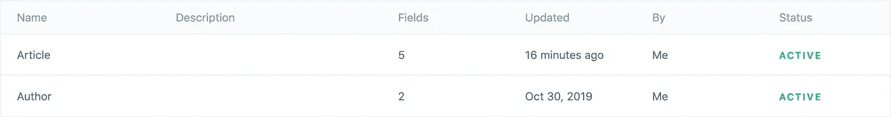

# 使用 NextJS 应用程序的最简单的 Contentful + React 教程

> 原文：<https://javascript.plainenglish.io/the-most-simple-contentful-react-tutorial-using-a-nextjs-application-8d0ce4596ad6?source=collection_archive---------1----------------------->

## 一个非常简单的 JAM Stack how-to 教程，使用 Contentful 和 React，而不必掌握+1000 工具作为先决条件。


上个月看了那么多关于 Contentful 或者 Prismic 之类的无头 CMS 的教程。但是每次人们都倾向于与许多工具共享存储库，例如 Docker、一些书呆子式的 CSS-in-js 库和其他一些东西，这使得初学者的学习曲线变得如此艰难。

🙅🏻‍♂️By 这样做，人们将不必仅仅试图理解内容并作出反应，他们还必须掌握许多概念，这将导致许多挫折和可能的头痛🤯。

👨🏻‍🎓今天我想和你分享的是**一个非常简单的例子，没有太多的依赖和要求**。对于需要不断部署和改进的大型应用程序来说，这可能不是最适合的设置。但是足够简单，可以自信地开始使用 Contentful 和 React，因此您可以尝试这些令人敬畏的工具。

我希望你会喜欢，让我们开始吧。我们走吧！

# 🗓摘要

1.  **👨🏻‍🔬什么是无头 CMS 和 Contentful？**
2.  **🦸🏻‍♂️:什么是 NextJS，它与 React 相比如何？**
3.  **🚀演示时间:使用 Contentful 和 React 列出作者的小文章**
4.  **💁🏻‍♂️你可能也会对…** 感兴趣

# **👨🏻‍🔬什么是无头 CMS 和 Contentful？**


Contentful 是一个强大的、高度可扩展的无头内容管理软件(CMS)。它是在专有许可下作为基于云的解决方案分发的。定价是基于订阅的，但你有一个相当合理的免费层。

它允许您管理和组织任何类型的内容，如您的页面布局，您的文章在一个智能和可扩展的后台。

## 🧟‍♂️:什么是无头 CMS，它与传统 CMS 有何不同？

无头 CMS 是一种只将数据作为 JSON(或任何其他类型的数据)有效载荷来交付的 CMS。它不提供任何类型的前端代码，如 HTML 页面或 CSS。它只交付用于稍后构建视图的小块数据，这就是[**通过网络**分离关注点](https://en.wikipedia.org/wiki/Separation_of_concerns) **的原理。**

这个 UI 实现被委托给开发人员，他们可以使用任何他想要的东西来呈现内容。

*   像 **Laravel** 、 **Spring** 或 **Symfony** 这样的后端框架…
*   …或前端框架，如 **ReactJS** 、 **VueJS** 、 **Angular** 或任何类似的框架。

那些前端框架在著名的 **JAMSTACK** 架构中非常流行，代表 **Ja** vascript、 **A** PI 和 **M** arkup。

**无头 CMS 是以数据和内容为中心的，他们擅长这个。**

现在我们知道了我们将使用的后端工具，让我们看看将使用什么来显示我们的数据。

# **🦸🏻‍♂️:什么是 NextJS，它与 React 相比如何？**


如果你读了这篇文章，你可能已经知道了 ReactJS。为了便于演示，我们将使用一个基于它的工具，一个名为 **NextJS 的框架。**

NextJS 由一家提供基于云的服务([zeit.co](http://zeit.co/))的大公司开发和支持，它是一个由 ReactJS 制成的服务器**ide**R**R**渲染框架(SSR ),允许使用 SSR 或静态渲染来构建高性能的 web 应用程序。

**💡** *如果你想了解更多关于 SSR、JAMstack 以及相关的东西，* ***我会在本文末尾掉一些链接。***

## ⚡️NextJS 作为简化应用程序开发的工具

NextJS 默认使用基于目录的导航。简单地说，根据我们在`pages`文件夹中的文件，框架将自动生成应用路由器。

*   拥有`pages/index.js`将使应用程序在`/`端点上响应。
*   拥有`pages/blog.js`将使应用程序在`/blog`端点上响应。
*   拥有`pages/tag/react.js`会让 app 在`/tag/react`端点响应等等。
*   任何其他 URL 将被重定向到默认的 404 页面，您当然可以覆盖它。

使用这种模式，我们可以非常快速地制作一个非常简单的应用程序，这正是本文的主题:快速而简单。

说够了。演示时间！

# **🚀演示时间:使用 Contentful 和 React 列出作者的小文章**

下面的截图是我们将要构建的最后一个页面的截图。这是一个简单的双卡页面，包含从远程内容丰富的数据库中获取的数据。


We all know that Batman is the best.

让我们从使用命令`git clone [https://github.com/ScreamZ/react-contentful-nextjs-tutorial.git](https://github.com/ScreamZ/react-contentful-nextjs-tutorial.git)`克隆存储库下面的[开始。](https://github.com/ScreamZ/react-contentful-nextjs-tutorial)

**💡为了简单起见，使用 Contentful 的导出工具[已经为您自动完成了所有工作，下面只是对已经完成的工作的解释。如果你喜欢的话，你可以自己繁殖。](https://www.contentful.com/developers/docs/tutorials/cli/import-and-export/)**

## ❶使用 JS SDK 配置前端集成的内容

**➡️创建一个账户和一个新的空位**

在这个演示中，我们需要一个空白的内容空间，如果你还没有一个内容丰富的账户，就从创建一个开始[https://www.contentful.com/sign-up/](https://www.contentful.com/sign-up/)。

完成后，继续选择`free space`和`Create an empty space`创建一个新的空间，如下所述:


精彩！您的共享空间现已创建。我们现在需要一些访问键来与 Contentful API 对话。

**➡️创建内容交付和管理密钥**

在演示中，我们需要两种类型钥匙:

*   一个**管理 API 密匙**，它将用于把我创建的测试内容导入到你的内容空间。
*   和一个**内容交付密钥**，它将用于在前端代码中访问来自 SDK 的内容。

**首先从内容交付键开始:**要得到那个:进入你的空间 click️ **设置**，然后 **API 键**点击**添加 API 键**创建一个新的指向`master`环境的键。将其命名为 you which，但请注意`Space ID`和`Content Delivery API — Access token`，我们稍后会用到它们。


Here is my Example Key 1

**您现在可以创建一个内容管理密钥**，用于数据导入。点击`Content management tokens`选项卡，点击`Generate personal token`。就像其他人一样，留着这个代币，我们很快就会用到它。

**➡️使用 CLI 将内容和资产导入 contentful】**

Contentful CLI 已经被添加到您的`package.json`中的`devDependencies`中，所以您现在需要的是使用我们上面取的`space id`和`management key`的值来填充工作区根目录下的`import.json`文件，它们的名字不言自明。不要更改`content-file`键，这是我们将使用的转储文件夹的路径。

```
{
  "spaceId": "your_space_id",
  "managementToken": "your_management_api_token",
  "content-file": "dump/export.json"
}
```

空间 ID 用于标识您组织内的空间，管理密钥用于使用 API 管理内容丰富的空间中的内容创建。

完成后，保存并运行以下命令:

*   `npm install`
*   `npx contentful space import --config import.json`开始将`dump`文件夹的内容导入到您的内容空间。

你的应用程序几乎已经准备好了，现在我将详细说明后台已经做了什么来获得这个数据集。

**➡️解释为生成此内容转储所做的工作**

首先，我创建了两个内容模型，它们是带有一些字段的内容的“类”。这用于按语义类别存储数据。

我有一个`article`和一个`author`内容模型，分别有 5 个和 2 个字段。



文章模型具有一对一的作者关系，它包含日期、标题、图像(也是一对一的资产关系)和一个名为 body 的丰富内容字段。

还要注意右下角的内容类型 ID 是`article`。


Article entity

作者模型是一个哑 2 文本字段，包含作者的名和姓。


Author entity

然后我创建了 5 个内容:

*   一个作者，也就是我。
*   两篇文章，一篇带**🦇蝙蝠侠**和一个 with️ **⚡️Flash** 。
*   我创建了两个资产实体，它们是我们两个主角的照片。

事实上，这很简单…如果你想创建更多，只需进入顶部导航栏的`content`菜单，然后开始。(不要忘记发布，状态显示在右上角)。


That guy is badass… isn’t ?

我们已经完成了后端和数据，现在让我们看看如何查询所有这些数据。

## ❷理解使用 NextJS 和 react 构建的前端代码

前端是使用组件的 React 函数而不是类来构建的。这样以后，您可以利用 React 的钩子用法。

UI 由[和**驱动👻**](https://picturepan2.github.io/spectre/index.html) 厉鬼一个微小的前端框架，布局简单。

由于我们只有一个页面用于列出文章，我们将创建一个独特的`pages/index.js`文件，它将解析为我们上面看到的`http://localhost:3000/` URL。

**➡️填充配置并运行应用程序**

首先用我们上面生成的密钥填充工作区根文件夹中的`config.json`文件。SDK 将使用它来查询您的内容空间中的内容。

```
{
  "space": "",
  "accessToken": ""
}
```

然后在你的控制台上运行`npm run dev`。这将从 npm 获取依赖项并启动应用程序。

现在，在你的浏览器中打开 [http://localhost:3000](http://localhost:3000) ，你应该可以让应用程序处理这两篇文章。

太好了，让我们详细看看这是怎么发生的。

**主页面**

那个主页面组件，你可以在`pages/index.js`找到它，我加了一些注释来解释是怎么回事。

简而言之，每次您在浏览器中访问`/` URL 时，都会调用`getInitialProps`函数，它将使用 Javascript SDK 根据指定的空间 ID 和内容交付密钥从内容丰富的数据库中获取数据。

然后在页面组件的 props 中注入那些文章的数组，一个循环遍历它以显示`Post`组件。


**岗位组件**

这也很简单，我只需解析 Contentful 文章中的值，以便将其显示在 UI 上。


**一个小注意:**我们在文章模型中使用了一个富内容字段类型。为了做到这一点，我们需要将 AST 代码转换成 HTML，Contentful 已经使用一个小库提供了这个功能:`[@contentful/rich-text-html-renderer](https://www.contentful.com/developers/docs/javascript/tutorials/rendering-contentful-rich-text-with-javascript/)`。

我们到了。随时添加更多的文章，并看到内容在每个页面调用变化！

## ❸构建并运行生产服务器或使用静态渲染

从现在开始，我们在开发模式中使用 next，您现在可以使用`npm run build`编译生产服务器，这将为生产优化 JS 包。完成后，您可以运行`npm start`来获得一个 SSR ready 服务器，该服务器将运行`getInitialProps`来获取每个请求的最新内容，或者运行`npm run export`来查询一次，并在`out`文件夹中生成页面的静态版本，该版本可以托管在诸如 Netlify、Now、Firebase Hosting 之类的 CDN 或您自己的服务器上，如 NginX。

如果你对此感兴趣，只需留下评论，我可以更新文章来展示一个例子。

**🙏🏻感谢您的阅读，希望这有所帮助。**

# 💁🏻‍♂️，你可能也会感兴趣…

## **➡️什么是 JS 应用的服务器端渲染？**

*   [https://ssr.vuejs.org/](https://ssr.vuejs.org/)是理解 SSR 的好向导，即使它是基于 VueJS 的。
*   [https://nextjs.org/features/server-side-rendering](https://nextjs.org/features/server-side-rendering)

## ➡️果酱堆

*   这是一本关于 JAM Stack 架构的很棒的指南[https://jamstack.org/](https://jamstack.org/)。
*   [https://jamstack.wtf/](https://jamstack.wtf/)
*   [https://www.gatsbyjs.org/](https://www.gatsbyjs.org/)

# 🚛收尾/TLDR；📦

所有的文章代码都存放在下面的库中:[https://github.com/ScreamZ/react-contentful-nextjs-tutorial](https://github.com/ScreamZ/react-contentful-nextjs-tutorial)。

您只需要生成内容交付和内容管理密钥，并相应地填充`import.json`和`config.json`，然后使用`import.json`运行内容导入。如果你不知道怎么做，就看看那篇文章的第二部分。

*   Contentful 是一个基于云的无头 CMS，它高度可扩展和强大，即使它可能有点贵。
*   NextJS 是一个基于 ReactJS 的 SSR/static generator 框架，它允许构建针对 SEO 和性能进行优化的强大的产品级 React 应用程序。