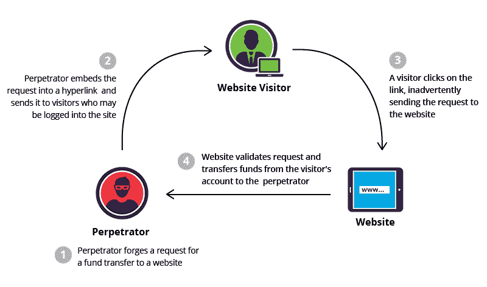

# Web 应用的必备安全清单

> 原文：<https://javascript.plainenglish.io/the-must-have-security-checklist-for-web-apps-f5a0b9032670?source=collection_archive---------7----------------------->

当你开发更复杂的应用程序时，你会意识到互联网是一个危险的地方！的确如此。我们经常看到有关数据泄露、网络攻击和其他安全威胁的新闻，这些威胁危及用户的个人数据和互联网安全。

在今天的帖子中，我将分享一些常见的网络安全威胁，以及如何通过遵循网络应用程序的安全清单来应对这些威胁。


# 常见安全威胁的类型

## 1.跨站点脚本

跨站点脚本或 XSS 是黑客通过网站注入客户端脚本的一种攻击。服务器会错误地将恶意脚本处理为自己的脚本，并将机密用户数据发送给黑客。这使得黑客能够以用户的身份登录网站，窃取任何个人信息，如用户的信用卡信息，并更改他们的密码。


【cloudflare.com/img/learning/security/threat..】来源:[](https://www.cloudflare.com/img/learning/security/threats/cross-site-scripting/xss-attack.png)

## *2.注射*

*当有人注入由解释器作为代码执行的数据时，就会出现注入漏洞，并允许此人访问、修改和窃取应用程序中未经授权的数据。常见的注入威胁类型有 SQL、LDAP(轻量级目录访问协议)和 CRLF(回车换行)。*

*例如，典型的 SQL 语句可能看起来像:*

```
*statement = "SELECT * FROM users WHERE name = $username*
```

*普通用户将输入他们的用户名，代码将返回与输入的用户名对应的帐户信息。*

*但是对于怀有恶意的人，他们可以输入他们的用户名*

```
*'any-name'; SELECT * FROM userinfo WHERE 'all' = 'all';*
```

*在这个 SQL 语句中，攻击者通过给出某个随机名称来完成第一个查询。但是后来，他们开始了一个新的查询，从 userinfo 中选择和检索所有数据。*

*下面是一张来自 spanning.com/wp-content/uploads/2019/07/SQL..的 SQL 注入的图片*

**

## *3.跨站点请求伪造*

*简称 CSRF，是一种攻击，当黑客发送链接(通过电子邮件或社交媒体)给误认为来自合法来源(如他们的银行)的用户时，就会发生这种攻击。用户将被诱骗登录其电子银行帐户，以执行一些操作，如更改其电子邮件/密码或进行资金转账(即提出请求)，从而导致攻击。黑客现在可以完全访问用户的数据。*

**

**来源:*[*imperva.com/learn/wp-content/uploads/sites/..*](https://www.imperva.com/learn/wp-content/uploads/sites/13/2019/01/csrf-cross-site-request-forgery.png)*

## *4.暴力攻击*

*当攻击者通过使用自动化系统尝试不同的密码和用户名组合来反复尝试访问用户帐户时，就会发生这种类型的攻击。这就像一个窃贼在邻居家的前门上尝试一千把不同的钥匙，以找到一把能用他的钥匙打开的钥匙。*

**

*这些是最常见的 web 安全威胁类型的示例。你可以在 https://sucuri.net/guides/website-security/[的](https://sucuri.net/guides/website-security/)阅读更多内容*

# *安全清单*

*现在我们已经了解了一些最常见的安全威胁，让我们按照下面的清单来对抗它们。*

## *1.安全 HTTP 头*

*为了保护你的 Express 应用程序，使用[头盔](https://helmetjs.github.io/)是最方便的方法。*

*运行`npm install helmet --save`，然后包括以下内容*

```
*const express = require('express')
const helmet = require('helmet')

const app = express()

app.use(helmet())

// ...*
```

**(代码来自*[*helmetjs . github . io*](https://helmetjs.github.io/)*)**

*默认情况下，头盔会保护你的应用程序，防止 [XSS 攻击](https://helmetjs.github.io/docs/csp/)、[哑剧嗅探](https://helmetjs.github.io/docs/dont-sniff-mimetype/)、[点击劫持](https://en.wikipedia.org/wiki/Clickjacking)和[通过 HTTP](https://helmetjs.github.io/docs/hsts/) 连接实施 HTTPS。*

****你可以通过阅读他们的*** [***文档***](https://helmetjs.github.io/) ***来配置更多选项。****

## *2.证明*

*使用名为`ratelimiter`的 npm 包，您可以通过限制用户尝试登录的次数来防止暴力攻击。*

*运行`npm install ratelimiter --save`安装，然后限制`user._id`的次数*

```
*let id = req.user._id;
let limit = new Limiter({ id: id, db: db });
limit.get(function(err, limit){
  if (err) return next(err);

  res.set('X-RateLimit-Limit', limit.total);
  res.set('X-RateLimit-Remaining', limit.remaining - 1);
  res.set('X-RateLimit-Reset', limit.reset);

  // all good
  debug('remaining %s/%s %s', limit.remaining - 1, limit.total, id);
  if (limit.remaining) return next();

  // not good
  var delta = (limit.reset * 1000) - Date.now() | 0;
  var after = limit.reset - (Date.now() / 1000) | 0;
  res.set('Retry-After', after);
  res.send(429, 'Rate limit exceeded, retry in ' + ms(delta, { long: true }));
});*
```

**(代码来自*[*【npmjs.com/package/ratelimiter】*](https://www.npmjs.com/package/ratelimiter)*)**

****更多详情，请阅读他们的*** [***文档***](https://www.npmjs.com/package/ratelimiter) ***。****

## *3.饼干*

*保护您的 cookies 可以确保只有经过身份验证的用户才能重新登录他们的帐户。npm 包听起来很不错，安装它可以轻松防止 cookie 或与会话相关的攻击。*

*安装`npm install cookie-session --save`并设置一个简单的视图计数器:*

```
*var cookieSession = require('cookie-session')
var express = require('express')

var app = express()

app.set('trust proxy', 1) // trust first proxy

app.use(cookieSession({
  name: 'session',
  keys: ['key1', 'key2']
}))

app.use(function (req, res, next) {
  // Update views
  req.session.views = (req.session.views || 0) + 1

  // Write response
  res.end(req.session.views + ' views')
})

app.listen(3000)*
```

**(代号出自【npmjs.com/package/cookie-session】[](https://www.npmjs.com/package/cookie-session)**)****

****重要提示:“密钥”列表应该存储在一个。用于保护的 env 文件。详见*** [***文档***](https://www.npmjs.com/package/cookie-session) ***。****

## *4.跨站点请求伪造*

*对于 Node.js 应用来说，使用 csurf 这样的 Node.js CSRF 防护中间件是防止 CSRF 攻击的有效方法。*

*在您的路线处理器上安装`npm install csurf`:*

```
*var cookieParser = require('cookie-parser')
var csrf = require('csurf')
var bodyParser = require('body-parser')
var express = require('express')

// setup route middlewares
var csrfProtection = csrf({ cookie: true })
var parseForm = bodyParser.urlencoded({ extended: false })

// create express app
var app = express()

// parse cookies
// we need this because "cookie" is true in csrfProtection
app.use(cookieParser())

app.get('/form', csrfProtection, function (req, res) {
  // pass the csrfToken to the view
  res.render('send', { csrfToken: req.csrfToken() })
})

app.post('/process', parseForm, csrfProtection, function (req, res) {
  res.send('data is being processed')
})*
```

*然后，在前端，您可以将 csrfToken 设置为隐藏输入元素的值。*

*【npmjs.com/package/csurf】[*代码*](https://www.npmjs.com/package/csurf) *)**

*csurf 包兼容 Express 或 AJAX 应用程序。*

****查看*** [***文档***](https://www.npmjs.com/package/csurf) ***了解规格。****

## *5.注射风险管理*

*为了保护 SQL 或其他命令注入威胁，可以使用各种工具，如 [sqlmap](https://github.com/sqlmapproject/sqlmap) 来自动化检测和消除 SQL 注入缺陷的过程。*

*另一种选择是对字符进行转义，以允许解释器改变其预期用途。比如确保任何“用户名”或“id”字段不能接受`'`或`"`或`;`，因为这些符号在 SQL 中可能有某种意义，可能会改变其行为。*

*这里有更多应该转义的特殊字符。*

**

**来源:*[*【s31.postimg.cc/4blpqo1pn/image.png】*](https://s31.postimg.cc/4blpqo1pn/image.png)*

# *结论*

*暂时就这些了！安全清单绝不可能 100%保护你的应用，因为有太多类型的漏洞，我们无法在这篇文章中涵盖所有类型的漏洞。此外，安全威胁也在不断演变。作为开发人员，我们至少不能成为上面列出的常见问题的受害者。遵循这个安全清单将或多或少地显著减少威胁，并保持您的应用程序总体安全。*

*对于更详细的清单，我建议多读一些关于这个主题的书，我发现 OWASP 的 [cheatsheet](https://github.com/OWASP/CheatSheetSeries/tree/master/cheatsheets) 系列非常广泛和有用！*

*感谢阅读，注意安全。干杯！*

## *简单英语的 JavaScript*

*喜欢这篇文章吗？如果有，通过 [**订阅获取更多类似内容解码，我们的 YouTube 频道**](https://www.youtube.com/channel/UCtipWUghju290NWcn8jhyAw) **！***