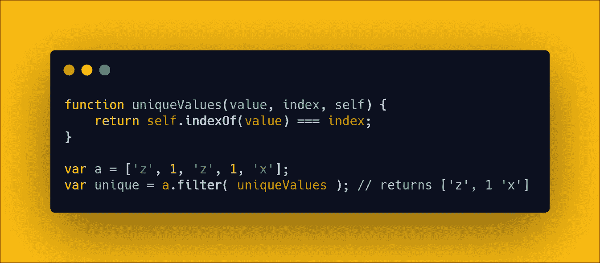
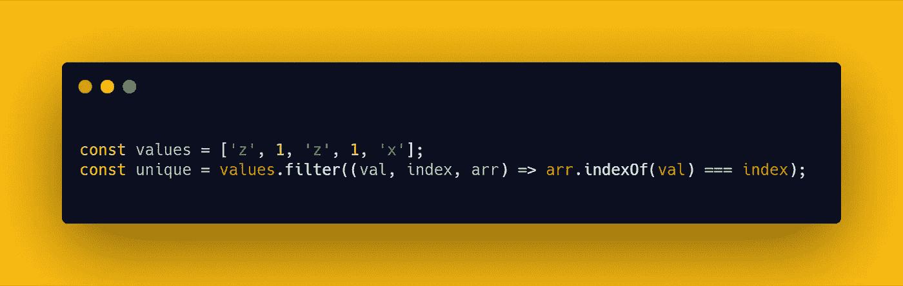
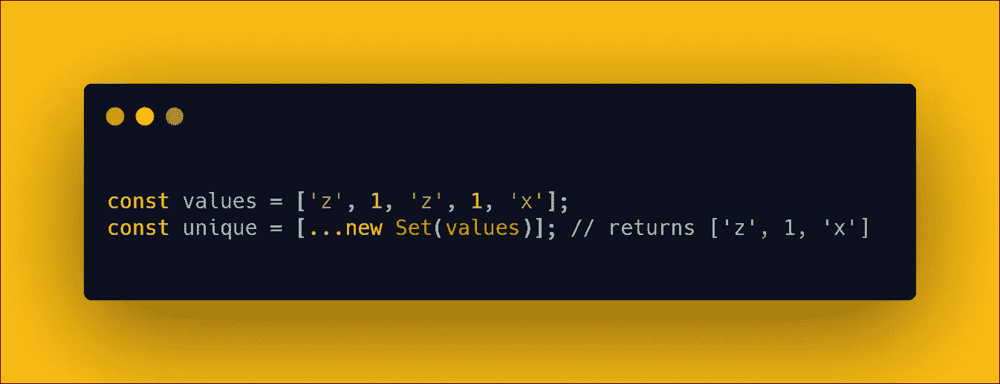

# JavaScript 中从数组中删除重复项的新方法

> 原文：<https://javascript.plainenglish.io/the-new-way-to-remove-duplicates-from-an-array-in-javascript-cc806b05236b?source=collection_archive---------7----------------------->

## 不需要图书馆或奇怪的把戏

数组是我们处理数据集的基本模块。我们每天都在使用它们，不仅在 JavaScript 中，在每种语言中都是如此。今天，我想向大家展示一个我在阅读一些代码时发现的特别酷的技巧。

我相信，在处理从数组中删除重复项时，它可以帮您省去一些麻烦。也许你需要给一个库函数提供唯一的数组值，或者别的什么。

你怎么能这样做？

## 老派解决方案

使用 ECMAScript 5，您可以这样做

本地方法`filter`遍历我们的数组，只留下那些满足函数`uniqueValues`的条目。这个函数检查一个值是否第一次出现，如果是，那么它不是一个重复的值。

ES6 简化版可能是这样的

## 新的方式

为什么过度复杂我们的代码？为什么要写一个我们根本不需要的函数。ES6 并不强迫我们使用`filter`方法。还是用`Set`代替吧。

同样的结果，更少的代码行和更清晰。通常最好的解决方法是躲在角落里。

——*皮耶罗*

## 来自简明英语团队的说明

你知道我们有四种出版物吗？给他们一个关注来表达爱意吧:[**JavaScript in Plain English**](https://medium.com/javascript-in-plain-english)，[**AI in Plain English**](https://medium.com/ai-in-plain-english)，[**UX in Plain English**](https://medium.com/ux-in-plain-english)，[**Python in Plain English**](https://medium.com/python-in-plain-english)**—谢谢，继续学习！我们还推出了一个 YouTube，希望你能通过 [**订阅我们的英语频道**](https://www.youtube.com/channel/UCtipWUghju290NWcn8jhyAw) 来支持我们**

**一如既往,“简明英语”希望帮助推广好的内容。如果您有一篇文章想要提交给我们的任何出版物，请发送电子邮件至[**submissions @ plain English . io**](mailto:submissions@plainenglish.io)**，并附上您的媒体用户名和您感兴趣的内容，我们将会回复您！****