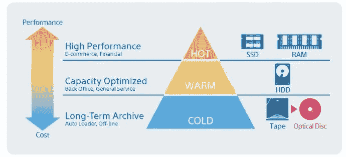
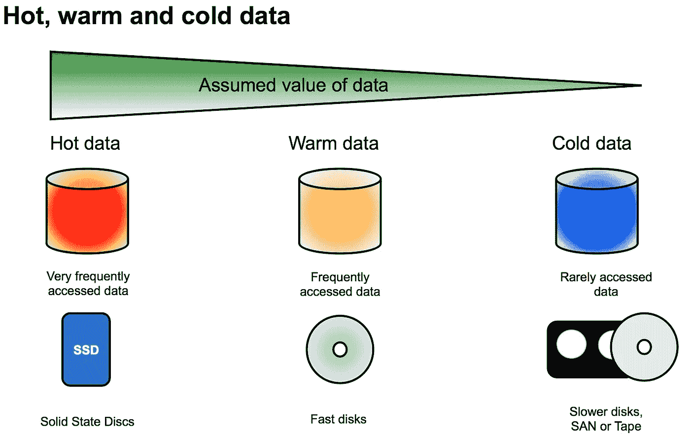

# 计算机科学中的数据温度概念

> 原文：<https://javascript.plainenglish.io/the-notion-of-data-temperature-in-computer-science-75446f267362?source=collection_archive---------2----------------------->

## 以及它如何帮助改进前端和后端的缓存策略。

开发应用程序时，您使用的数据不一定以相同的频率获取或修改。此外，根据这个频率，它不是以相同的方式处理的。

为了说明这种差异，我们来谈谈**数据的温度**。

Comparison of hot and cold data

应该注意的是，温度的概念应该与环境联系起来。例如，在脸书这样的社交网络中:个人资料历史中 10 年前的照片将被视为冷数据。

而对于每 3 天只修改一次列表的房地产网站来说，它也将被视为冷数据。这是尽管事实上我们谈论的是天而不是年。

Hot data is generally more valued, hence its high availability

# 🔥热门数据

**热点数据通常具有高度易变性，且变化频繁，必须尽快获得。**

例如，云中的数据(如我们的照片)被视为热门数据，尽管它们不一定每天都会被访问(这是云存储的问题，因为高可用性更昂贵)。

我们还将讨论热门数据的更新频率，例如，一个股票市场份额的仪表板就是一个热门数据，汇率随时变化。

# ❄️冷数据

**与就诊频率相比，感冒数据很少更新。**

例如，归档不常查阅的文件是冷数据。
它非常适合 HTTP 或其他缓存策略以及低性能硬件。它通常不需要存储在高可用性磁盘上。

此外，由于所用设备和技术的价格，冷数据的维护成本更低。降低磁盘或缓存的速度，以避免不必要的计算。

# 🚛包扎📦

在应用程序中，您将始终在冷数据和热数据之间保持平衡。请记住调整这些数据的缓存和存储策略，以优化您的成本和性能，并考虑地球的生态和保护🌍

> 让我们的星球再次变得伟大

> *🇫🇷🥖法国总统埃马纽埃尔·马克龙，2017 年 6 月 1 日*

谈论法语……**本文的法语版🇫🇷:让我们来看看我的博客:**[https://modern-JavaScript . fr/la-ideas-de-temperature-de-la-donne/](https://modern-javascript.fr/la-notion-de-temperature-de-la-donnee/)