# 你需要的关于 Redux(和 React-Redux)的唯一介绍

> 原文：<https://javascript.plainenglish.io/the-only-introduction-to-redux-and-react-redux-youll-ever-need-8ce5da9e53c6?source=collection_archive---------0----------------------->


本文旨在通过构建三个非常简单的应用程序，通过理论和示例尽可能简单明了地解释 Redux 和 React Redux 的基本概念。
它分为三部分——单独 Redux、类组件的 React-Redux 和功能组件的 React-Redux:

1.  在第一部分中，我们将看看动作、Reducers 和 Redux 中的存储。然后，我们将在一个简单的普通 JavaScript 应用程序中实现 Redux。
    最后，我们将讨论初始化我们的应用程序状态，以及用 Redux DevTools 浏览器扩展连接我们的应用程序。
2.  在第二部分中，我们将使用类组件在 React 中实现相同的 Redux 应用程序，并了解 React-Redux，这个包允许我们从 React 组件连接 Redux。
3.  在第三部分中，我们将做与第二部分相同的实现，但是使用功能组件，利用 React-Redux 包提供的钩子。这一部分中构建的应用程序作为 Git 分支添加到第二个应用程序中。
4.  最后，有一个额外的部分讨论了 Redux 中中间件和异步操作的概念。但是，在那里编写的代码不会包含在两个 GitHub 项目中的任何一个中。

GitHub 链接到这两个项目:

*   [首次申请(用香草 JS 还原)](https://github.com/hstevanoski/redux-notes-app)
*   [带有类组件的第二个应用程序(与 Redux 反应)](https://github.com/hstevanoski/react-redux-notes-app)
*   [第三个应用(与 Redux 反应)带有功能组件](https://github.com/hstevanoski/react-redux-notes-app/tree/hooks)

**注:**

*   在这三个部分中，我将假设您对 JavaScript 和 EcmaScript 6+有很好的理解
*   在整个第一部分中，我将假设您以前使用过 NodeJS(并且在您的计算机上安装了 NodeJS 和 NPM ),并且至少知道什么是 Webpack 和 Babel。
*   在整个第二部分中，我将假设您习惯于在 React 中构建比 ToDo 应用程序更复杂的应用程序，并且知道什么是[hoc(高阶组件)](https://reactjs.org/docs/higher-order-components.html)。
*   在整个第三部分中，我将假设您至少理解 React 钩子的概念。如果你不做，[让](https://reactjs.org/docs/hooks-intro.html)确定[你做](https://overreacted.io/a-complete-guide-to-useeffect/)。
*   为了使一切尽可能简单，我们将不写任何样式。我知道当有人毫无理由地一次扔给你一堆不必要的东西，让你感到困惑的时候是什么感觉。
    然而，在应用二和应用三中提供了一个 *src/index.css* 。所以，如果你想让你的应用看起来更漂亮，取消 *index.js* 中相应行的注释来包含它。
*   我不会强制使用任何 Redux 浏览器扩展。我们将在文章第一部分的末尾简要介绍一下 Redux DevTools 扩展，但是我强烈建议您更加熟悉它，因为您将会希望在几乎所有的项目中使用它。
*   我不会拿 Redux 和 Flux 之类的类似库做比较。如果你对这类话题感兴趣，可以考虑自己研究一下。

此外，我不希望这是另一个 ToDo 教程(我自己也厌倦了 ToDo 教程，它就像 Hello World v2.0)，所以我们将制作一个写笔记的应用程序，用户可以在其中为每个笔记指定标题和内容。

事不宜迟，让我们开始学习吧！

# 第一部分— Redux

Redux 是一个流行的 JavaScript 库，用于管理应用程序的状态。这很常见，如果你正在使用 React，很可能你已经听说过了。

对于那些不知道什么是应用程序状态的人来说:它就像一个全局对象，保存着您在应用程序中稍后用于各种目的的信息(例如，决定呈现哪些组件以及何时呈现，呈现存储的数据等)。

我们经常遇到的一个例子是在页面加载时显示一个加载指示器。在这种情况下，如果我们仅将存储用于该目的，则状态对象将存储一个布尔字段，表示页面是否已加载，我们将使用该字段来切换加载指示器的显示。

另一个例子是——如果我们要构建一个社交媒体应用程序，我们将在应用程序状态中存储几个对象和数组——当前用户信息、HTTP 状态、toast 消息、用户将收到的通知，以及是否要在整个应用程序的多个位置呈现——用户关注的个人资料中的当前帖子和故事，等等。

对于哪些数据应该保存在 Redux 中，没有任何规则，所以，这完全取决于您。但是，请记住始终只存储[可串行化数据](https://redux.js.org/faq/organizing-state#can-i-put-functions-promises-or-other-non-serializable-items-in-my-store-state)。

大型应用程序有大型应用程序状态，随着应用程序的增长，管理它们变得越来越不方便。此外，您可能有使用相同数据的组件，但是它们被随机放置在 DOM 树中。这就是为什么我们需要像 Redux 这样的状态管理库。

Redux 的工作方式令人着迷，但又如此简单。它的模式非常直观，它的函数名不言自明。相信我，你会爱上它的！

在我们深入研究 Redux 之前，我想提一下 Redux 遵循的两个重要模式(我强烈建议您在编写 Redux 应用程序时始终牢记这些信息！):

Redux 遵循的一种模式被称为“真实的单一来源”，这意味着我们只有一个地方(称为 Store)来存储整个应用程序的唯一状态。换句话说，一个应用——一个商店——一个状态。

然而，React 或其他框架中的组件也可以自由地包含它们自己的内部状态。通常，你不会想把所有东西都放在应用程序状态中。

Redux 遵循的另一个模式叫做“不变性”。你会经常在其他框架和库中发现这个术语。
简而言之，不变性就是我们不直接改变状态对象及其属性。相反，我们创建一个新对象，重新计算新的应用程序状态，并用新创建的对象更新它。我们想让旧的状态对象保持不变。

## Redux 的三个组成部分

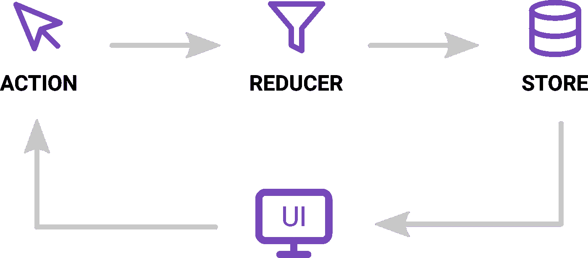

The three building blocks of Redux — Actions, Reducers and Store

Redux 有 3 个主要部分:

1.  行动
2.  还原剂
3.  商店

## **商店**

正如您已经猜到的，存储保存了应用程序的状态。
商店实际上是一个对象，而不是一个类，尽管一开始可能感觉像一个类。除了应用程序的状态之外，它还包含一些额外的东西(比如函数和其他对象)。

尽管从理论上讲，创建多个存储是可能的，但这违背了 Redux 遵循的模式。
请记住，我们只为每个应用程序创建一个商店！

我们可以订阅在商店更新时收听事件。例如，在非 React 应用程序中，我们可以使用该订阅来更新 UI，就像我们在应用程序中将要做的那样。

Redux 中的状态是 JavaScript 对象的形式，通常被称为“状态树”。你可以把你想存储的任何值放在里面，你可以根据需要嵌套它们。

## **动作**

动作是普通的 JavaScript 对象，描述**发生了什么**发生了什么，但是不描述应用状态如何变化。

每当我们想要更新应用程序的状态时，我们只需将它们分派(发送)到我们的 store 实例。其余的由减速器处理，我们一会儿就会熟悉它。

需要记住的一件重要事情是，Redux 要求我们的动作对象包含一个类型字段。该字段用于描述我们正在调度的操作类型，它通常应该是一个从文件中导出的常量。
动作对象中的所有其他字段都是可选的，由您决定。

例如:在我们将要构建的应用程序中，每当用户点击“添加注释”按钮时，我们将向我们的商店发送类似于以下操作的内容:

注意，我们不处理任何关于存储如何变化的逻辑。我们只是通知商店，我们想用提供的标题和内容添加一个新注释。
标题和内容字段是可选的。类型字段也是必需的。

你经常会遇到的另一个术语是**动作创作者**。它们基本上是生成并返回普通 JavaScript 对象的函数。使用它们是为了让我们可以在动作中“插入”动态数据(或者用动态数据生成动作)。在我们的例子中——我们有一个接受两个参数的函数——title 和 content，它将返回一个包含我们提供的信息的普通 JavaScript 对象。

An action creator example

## **减速器**

Reducers 是**纯**函数，它定义了**app 状态如何变化。换句话说，它们用于重新计算新的应用程序状态，或者至少是它的一部分。**

每当我们向我们的商店发送一个动作时，这个动作就会被传递给 reducer。
reducer 函数接受两个参数:前一个应用程序状态、正在调度的动作，并返回新的应用程序状态。

```
(previousState, action) => newState
```

换句话说，reducer 将根据我们调度的动作(及其类型)来计算我们的应用程序的新状态。

在实际应用中，你的 reducers 很可能会变得非常复杂。为了处理 reducer 的复杂性，我们将它们分成多个更简单的 reducer，然后，我们将它们与一个名为`combineReducers`的 Redux 辅助函数结合起来。

主减速器习惯上称为“根部减速器”。

## 数据流

虽然一开始看起来有点复杂，但 Redux 中的数据流实际上非常简单。

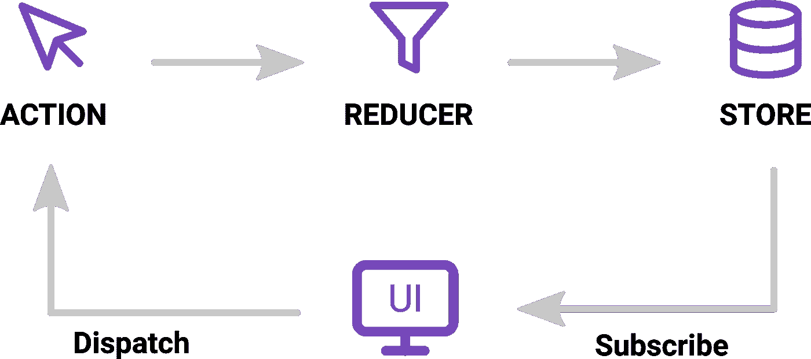

Data flow in Redux

假设用户触发了一个事件(例如，点击“添加注释”按钮)，应用状态更新(即，新的注释被插入到应用状态中)。下面是引擎盖下发生的事情:

1.  按钮点击处理函数*用`store.dispatch()`方法向商店发送*动作
2.  Redux 将分派的动作传递给 reducer
3.  存储保存由缩减器返回的新状态
4.  由于我们已经向商店*订阅了*，我们提供的函数将被调用，它将相应地更新 UI(即，在笔记列表中添加新的笔记)

## 设置我们的应用程序

现在让我们开始创建我们的第一个应用程序。

*   如果你在 Linux 或 Mac 上，只需导航到你的项目目录并粘贴到终端中。它将省去您手动创建所有必要文件和文件夹的麻烦:

```
mkdir -p redux-notes-app/{dist,src/{actions,reducers,store}} && cd redux-notes-app && touch {index.html,.babelrc,webpack.config.js,src/{actions/actions.js,reducers/reducers.js,store/store.js,main.js}}
```

*   如果您使用的是 Windows，请手动创建必要的文件和文件夹，并确保您的文件夹结构与我的相同:

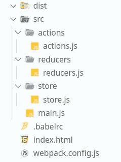

*   在新项目的目录中运行以下命令:

```
npm init -ynpm i redux webpack webpack-cli @babel/core babel-loader @babel/preset-env --save-dev// --- Yarn alternative --- //yarn init -yyarn add redux webpack webpack-cli @babel/core babel-loader @babel/preset-env --dev
```

*   在`webpack.config.js`文件里面插入以下内容

The webpack.config.js file

*   在`.babelrc`文件中，添加以下内容

The .babelrc file

*   在`package.json`文件中，在脚本对象中添加下面一行

```
"dev": "webpack --watch --mode=development"
```

*   最后，跑

```
npm run dev
// or, yarn run dev
```

让我们言归正传！

## 定义我们的应用状态

在你开始写代码之前，最好拿一张纸，写下你的应用程序的所有特性，画出所有东西是如何相互连接的，并试着找出你在应用程序状态中需要什么，以及应用程序状态最终应该是什么样子。

换句话说，不要直接写代码，而是做一些计划！

> “你花在计划上的每一分钟，在执行上就节省了 10 分钟；这给了你 1000%的能量回报！”—布莱恩·特雷西

最后，让我们假设我们的应用程序状态如下所示:

```
{
  notes: [
    {
      title: 'Note 1 Title',
      content: 'Note 1 Content'
    },
    {
      title: 'Note 2 Title',
      content: 'Note 2 Content'
    }, ...

    {
      title: 'Note N Title',
      content: 'Note N Content'
    }
  ]
}
```

notes 数组中的每个对象代表一个音符。

换句话说，我们的应用程序状态将是一个非常简单的对象，只包含一个属性 notes，它将是一个对象数组(单个的 notes)。
由于我们没有使用 API，我们将假设注释的 ID 将是它们在数组中的索引——因此在最终的注释格式中缺少 ID 字段。

## 初始代码

我已经准备了一些我们的应用程序需要的初始代码。在您的`index.html`文件中插入以下代码:

index.html

现在将这段代码插入到您的`src/main.js`文件中:

stc/main.js

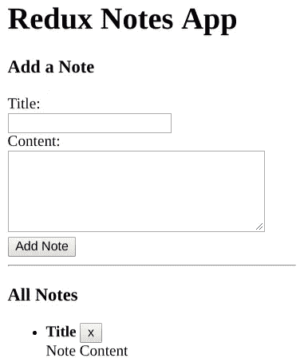

Result (our initial index page)

如您所见，我们有一个非常简单的表单，只有标题和内容字段。
此表将用于添加新注释。

`ul#notes`是我们将所有笔记作为列表项呈现的地方。
有一个硬编码的列表项作为我们笔记的模板，我们将立即从代码中删除它。

我们将让用户通过按下笔记标题右侧的按钮来删除他们的笔记。按钮上的`data-id`属性将帮助我们获得将要删除的笔记的 id(索引),从而让我们知道应该删除哪个笔记。

## 行动

现在我们知道了要做什么，让我们开始创建一个添加注释的动作。
在`actions.js`中，我们将添加我们的初始代码:

src/actions/actions.js

让我一行一行地解释这是怎么回事:

1.  我们正在导出一个常量 ADD_NOTE，因为我们以后会在几个地方需要它。
    是的，我们可以到处都写字符串‘ADD _ NOTE ’,但这是很糟糕的做法！想象一下，你的项目变得越来越大，突然你的老板说:“将 ADD_NOTE 操作重命名为 ADD_NEW_NOTE”。明白我的意思了吗？
2.  我们正在导出函数`addNote`。正如我们前面所发现的，这个函数是一个动作创建器，这意味着它的工作只是返回一个普通的对象。注意，它没有任何逻辑。它只是返回一个对象。因为，正如我们之前所说，行动决定了改变了什么，而不是如何改变！

这是 Redux 关于动作的约定。
这看起来可能有点奇怪，但是相信我，导出常量和动作创建器是最合理的方法。

## 还原剂

在我们创建存储和开始调度操作之前，让我们首先创建我们的主(根)缩减器:

src/reducers/reducers.js

正如你所看到的，我们为我们的 reducer 声明了一个初始状态对象，在这个例子中，它变成了整个应用程序的状态，因为它是我们应用程序中唯一的 reducer。

就像我们之前说过的，reducers 接收两个参数——之前的状态和被调度的动作。我们正在检查动作类型，根据它的值，我们将返回新的状态。

记住，我们**从不**直接修改状态！我们希望所有的 reducers 保持不变！
注意，在我们所有的案例都用尽之后，我们简单地返回我们的应用程序状态(稍后会详细介绍，但这与 Redux 初始化有关)。

**注:**

```
case ADD_NOTE:
  return {
    notes: [
      ...state.notes,
      {
        title: action.title,
        content: action.content
      }
    ]
  };
```

这里，我们返回应用程序的整个新状态对象，我们**假设**notes 属性是我们新状态的唯一**属性。如果我们在先前的状态中有其他属性，它们将会丢失，因为我们没有保留它们。**

如果您有其他属性，并且不希望它们被排除在新状态之外，请在 notes 属性之前或之后使用 spread 运算符:

```
case ADD_NOTE:
  return {
    **...state, // <- like so
**    notes: [
      ...state.notes,
      {
        title: action.title,
        content: action.content
      }
    ]
  };
```

还有一点:如果 switch 语句伤害了你的眼睛，你也可以使用 if 语句！然而，通常情况下，你会接触到 switch 语句，随着时间的推移，你会慢慢喜欢上它。

## 商店

让我们现在创建我们的应用程序商店！

src/store/store.js

Redux 有这个`createStore`函数，它非常简单，一目了然——它用于创建应用程序商店。
它接受 [3 个参数](https://redux.js.org/api/store)(后两个是可选的)，但是现在，我们将只使用第一个，它接受您的应用程序的根缩减器。

接下来，我们将把商店导入到我们的`main.js`文件中，并分派一些动作来查看我们的状态在添加一些注释前后的样子。

Excerpt from src/main.js

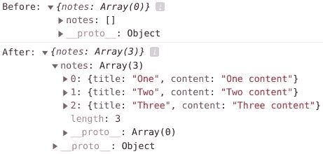

Chrome DevTools console

## 添加注释

要添加新注释，我们只需在表单事件处理程序中添加 3 行:

Excerpt from src/main.js

我们所做的只是向我们的商店发送一个动作！我们的 action creator 对象返回一个对象，其中包含我们提供给它的标题和内容值，事实上这些内容是我们放入表单字段的内容。就是这样！

## (重新)渲染注释

正如我们前面提到的，Redux 中的 store 是一个对象。它有一个名为`subscribe`的函数，我们可以用它来订阅对状态树所做的更改，也就是说，每当我们向存储库发送一个动作时。
我们将使用 subscribe 方法，并使用订阅来重新呈现我们的笔记。

**注意:**我们将简单地重新呈现无序列表中的所有音符。
相反，如果你使用 React、Angular 或 Vue 这样的框架/库，可能会有一些优化的 [diffing 算法](https://reactjs.org/docs/reconciliation.html)来计算需要更新的内容，让你不必像我们一样自己动手甚至完全重新渲染 DOM 中的内容。

我们首先要更新我们的`renderNotes`函数:

Excerpt from src/main.js

我们现在要订阅商店:

Excerpt from src/main.js

现在，回到你的页面，尝试添加一个新的笔记！感觉像魔术一样，不是吗？！

## **退订店铺**

如果你出于某种原因想要从商店退订，`store.subscribe`函数返回一个函数。因此，通过调用该函数，我们取消了对商店的订阅:

## 删除注释

首先，我们将转到我们的`actions.js`文件，添加一个新的常量和一个新的动作创建者。

Excerpt from src/actions/actions.js

接下来，我们将转到我们的`reducers.js`文件，并向我们的 switch 语句添加一个新的 case(记住还要导入`REMOVE_NOTE`)。

Excerpt from src/reducers/reducers.js

最后，我们将更新`main.js`中的`deleteNote`函数。

Excerpt from src/main.js

瞧啊。现在我们的用户可以删除笔记了。容易得很。

## 初始化状态

在我们开始初始化我们的应用程序状态之前，明智的做法是再看一眼 reducers 并真正理解发生了什么:

**1)** 每个减压器都有自己的状态，可能与 app 状态不同(例如，您可能有多个减压器)。
现在，因为我们只有一个归约器(根归约器)，它最终成为我们应用程序的状态。

**2)** 当 Redux 初始化我们的 app 时，它会在 switch 语句中发送一个不会满足我们任何 cases 的动作。
事实上，如果我们在控制台中记录操作类型，这就是我们第一次访问页面时得到的结果:

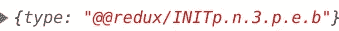

Chrome DevTools console

因为我们没有提供应用程序的初始状态，所以状态是未定义的，所以它默认为我们的`initialState`对象。

你的应用程序很可能有不止一个缩减器，因为它们远比一个简单的笔记/待办事项应用程序复杂。
在这种情况下，你会想要写多个 reducers。

Redux 提供了一个名为`[combineReducers](https://redux.js.org/api/combinereducers)`的函数，它让我们可以组合多个减速器，并将它们传递给`createStore`函数，就像它们是一个减速器一样。

有趣的地方就在这里:
在`combineReducers`函数内部，我们传递了一个 reducers 的对象。每个 reducer 处理它自己的应用程序状态部分(reducer 现在不关心整个应用程序的状态)。Redux 然后从对象的所有键和值构建应用程序的状态。

首先，我们将在`src/reducers`目录中创建一个新文件`notesReducer.js`，我们将把`src/reducers/reducers.js`文件中的代码移动到该文件中，并对其进行一些修改:

src/reducers/notesReducer.js

**注意:**我已经将第一个参数从 state 改为 notes。由于我们的 reducer 将只管理 notes，它将总是返回一个数组。其他任何一块状态都不会在减速器里传承！

接下来，我们将添加另一个减速器。姑且称之为`visibilityFilter`。它将通过可见性处理过滤笔记。
**注意:**因为这篇文章越来越大，我们不会为这部分写 UI 或者扩展可见性过滤器特性。那是你的家庭作业！
**提示:**要利用可见性过滤器，一个选项是在您的注释对象中添加一个`tags`字段。然后，您可以添加几个标签(例如存档的和重要的)，并添加更改单个便笺标签的操作。最后，添加一个 *select* 元素，该元素将有助于只显示标有存档、重要或所有笔记的笔记。

src/reducers/visibilityFilter.js

注意，我们只处理状态的可见性部分，我们对应用程序状态的注释部分和整个应用程序状态都不感兴趣。所以 Redux 才这么厉害，这么牛逼！

在`actions.js`文件中，插入以下内容:

Excerpt from src/actions/actions.js

我们现在将在`reducers.js`文件中合并减速器。

src/reducers/reducers.js

最后，让我们重写`store.js`文件，使其更具描述性:

src/store/store.js

如果我们现在尝试在我们的`main.js`文件中记录我们的状态应用程序，我们将得到如下结果:

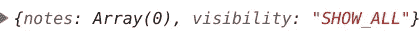

Chrome DevTools console

看到了吗？我们的状态最终成为一个对象，带有我们在`combineReducers`函数中提供的键，我们的每个 reducers 管理它自己的状态。漂亮！

**4)** 作为`createStore`函数的第二个参数，我们可以提供应用程序的初始状态。这将覆盖我们减速器中的任何默认值。

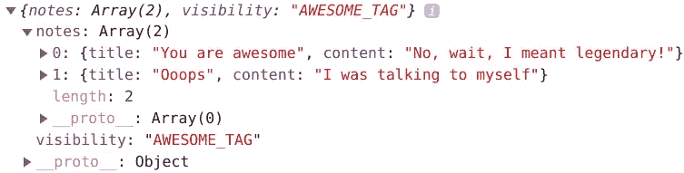

Our application’s initial state after being logged in Chrome’s DevTools console

例如，如果我们在[本地存储](https://developer.mozilla.org/en-US/docs/Web/API/Window/localStorage)中保存了我们之前的应用程序状态的副本，我们将在提供它作为第二个参数之前获取它的值。然而，请确保您只输入第二个参数同步数据(本地存储 API 是同步的，所以没有问题！).

"好吧，但是如果我想从一个 API 加载我的初始状态呢？"。
-那么，在这种情况下，最简单的解决方法是在某个组件(例如，根组件)第一次呈现时加载数据，并在 API 数据到达时根据需要调度尽可能多的动作。
当然，这意味着当您的 API 数据到达时，Redux 将完成初始化，您仍将拥有初始状态下的默认 reducer 数据，但这并没有错。一个简单的加载指示器不会伤害你的用户！

## 用 Redux DevTools 浏览器扩展连接我们的应用

Redux DevTools 扩展是一个非常强大的工具。在您准备好之前，我不想强迫您使用它，因为我确信在本文开始时，您会感到有些不知所措。

无论如何，添加这一行作为`createStore`函数的第三个参数:

```
window.__REDUX_DEVTOOLS_EXTENSION__ && window.__REDUX_DEVTOOLS_EXTENSION__()
```

您的`store.js`文件现在应该是这样的:

src/store/store.js

如果您没有提供应用程序的初始状态，只需将 *undefined* 作为第二个参数传递就可以了。

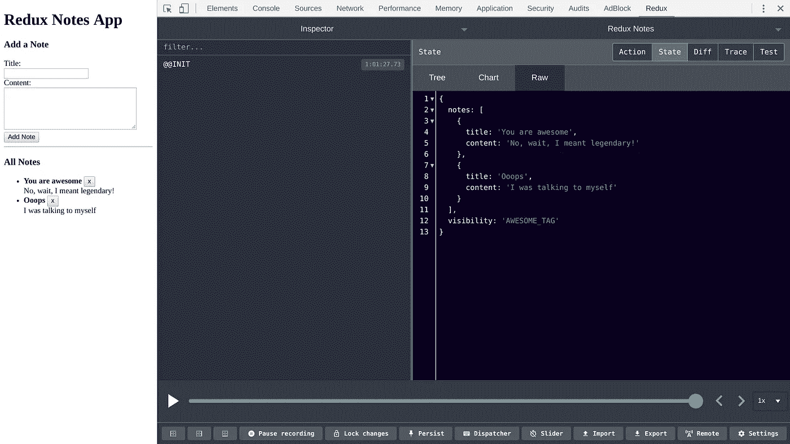

Feel free to explore the Redux DevTools extension on your own

然而，对于更复杂的应用程序，一定要检查一下 [Redux DevTools 扩展文档](https://github.com/zalmoxisus/redux-devtools-extension)。

`createStore`函数中的第三个参数是我们在 Redux 中放置增强器的地方，比如中间件。请务必查看文章末尾的奖金部分，了解这些概念！

这就是我们的第一个项目。你可以在 GitHub [这里](https://github.com/hstevanoski/redux-notes-app)找到它。

# 第二部分和第三部分先决条件

如前所述，第二部分和第三部分的两个应用程序都将包含在同一个 GitHub 项目中。您可以在*主*分支的第二部分找到申请，而*分支的第三部分钩住*分支。
我们将使用 [create-react-app](https://github.com/facebook/create-react-app) 来创建两个应用程序。

有一个叫做[reaction-redux](https://react-redux.js.org/)的包，我们用它将我们的 reaction 组件与 Redux 连接起来。我们将在本文的第二、第三部分使用这个包。

您可以通过打开 reactor 项目目录中的终端窗口并执行以下命令来安装 Redux 和 reactor-Redux 软件包:

```
npm i redux react-redux
// or, yarn add redux react-redux
```

**注意:**为了使这个例子尽可能简单，我们不会在这个项目中实现可见性过滤器。

关于 reaction-Redux，我们需要了解两件事:

**1)** React-Redux 提供了一个名为 Provider 的 React 组件，它使我们的应用程序存储在整个应用程序中可用。
这是通过在我们的`index.js`文件中用提供者组件包围应用程序，并将存储作为属性传递给提供者组件来实现的。

Using the Provider component

无论我们使用的是基于类的组件还是功能性组件，我们都会这样做。
这家店是普通的 Redux 店，就像我们之前创建的那家一样。

**2)** React Redux 提供了一个`connect`函数，我们只对基于类的组件使用该函数。但是，对于功能组件，我们使用由 React Redux 包提供的钩子。

# 第二部分—用于基于类的组件的 reactor-Redux

每当我们想将一个组件“连接”到 Redux 时，我们就使用`connect`功能，即让一个 React 组件与我们的 Redux 商店交互。
我们几乎从来没有直接去过商店。我们只是激发动作创建者，所有的逻辑稍后都由`connect`功能自动处理。

`connect`函数实际上是一个高阶分量。
它返回一个函数，我们为该函数提供了我们组件的类名(注意后面例子中`connect`函数后面的多余括号)。
它还接受两个可选参数:*mapstatetorops*和*mapdispatchtops*。

第一个参数， *mapStateToProps* ，通过在组件的属性中映射存储值来订阅存储。
如果我们想要订阅商店，我们提供一个非空的第一个参数。否则，如果我们不想订阅商店，我们提供`null`作为第一个参数。

第二个参数， *mapDispatchToProps* ，与在组件的属性中注入动作创建者有关。如果我们根本不想注入任何动作创建者，我们也提供`null`作为第二个参数。

## mapStateToProps

这是`connect`函数的第一个参数。顾名思义，我们将应用程序状态的一部分映射到组件的实际属性中。

*mapStateToProps* 实际上是一个函数，它将我们应用程序的整个状态作为其第一个参数，并返回我们组件将需要的数据对象，即第一个参数相当于`store.getState()`。

这个函数有一个可选的第二个参数，它允许您使用一些组件属性。当我们需要来自组件属性的附加信息来从存储中检索数据时，这可能会很有用。

```
(state, ownProps?) => stateProps
```

*mapStateToProps* 在每次我们的应用程序状态改变(`state`参数)或`ownProps`对象的任何字段改变时被调用。
此外，当`ownProps`或`stateProps`不同时，我们的组件将重新呈现，这意味着我们将总是从状态中获取最近的值。

## mapDispatchToProps

正如我们前面提到的，这个参数用于将动作创建者映射(注入)到组件的道具。

*mapDispatchToProps* 实际上可以是一个对象，也可以是一个函数。React Redux 官方文档建议将其作为一个对象，老实说，大多数情况下这就是你要做的。

在它是一个对象的情况下，键将被映射到组件的道具。从那里，我们可以调用 action creator 函数将新的注释保存到状态中。

mapDispatchToProps use case

但是，请注意，正如我们之前提到的，在 React 中，我们不直接访问商店，因此，我们从不调用`store.dispatch()`。我们只需调用我们的动作创建者，其余的由`connect`函数神奇地处理。

“如果 *mapDispatchToProps* 是一个函数，而不是一个对象呢？我什么时候会想把它作为一种功能来使用呢？”我将引用 React-Redux 文档中的这段话，因为它非常简单:

> "将 mapDispatchToProps 定义为一个函数，可以让您最灵活地自定义组件接收的函数，以及它们如何调度操作。你可以使用派遣和自己的道具。您可以利用这个机会编写自定义函数，供您连接的组件调用。”

`dispatch`和`store.dispatch`实际上是同一个东西，而`ownProps`，正如我们已经知道的，是在创建组件时被传递的组件道具。

关于 *mapDispatchToProps* 还有一点我想强调的是:
如果您没有在`connect`函数中提供第二个参数，或者您从 *mapDispatchToProps* 函数返回的对象返回了一个分派字段，那么分派函数在您的组件中将是现成可用的。欲了解更多信息，请访问 React Redux 文档中的[链接](https://react-redux.js.org/using-react-redux/connect-mapdispatch#why-is-my-component-not-receiving-dispatch)。

## 用基于类的组件在 React 中重新创建我们的 Notes 应用程序

我重写了 App 组件，简单地返回了我们的 Notes 组件。
Notes 组件呈现另外两个组件——Notes form 和 AllNotes。

我们将把我们的`Notes`、`AllNotes`和`NotesForm`组件保存在我们的`src/Notes`文件夹中。

src/App.js

src/Notes/Notes.js

## **通知表单**

这个组件与添加注释的表单有关。这个组件所做的只是向商店发送一个添加新注释的动作。由于我们不关心应用程序的状态，也不打算订阅它，所以我们提供`null`作为第一个参数( *mapStateToProps* )。

src/Notes/NotesForm.js

然而，对于第二个参数( *mapDispatchToProps* ，我们提供了一个对象，通过该对象我们映射了从`actions.js`文件导入的`addNote` action creator 函数。

`connect`函数发挥了它的魔力，只需在我们的组件中调用`this.props.addNote()`,我们就可以将添加注释动作发送到商店。

## **所有笔记**

我们将使用这个组件来呈现所有的注释，这些注释存储在我们的 Redux 状态中。同样，我们将需要调度一个删除状态的操作。
换句话说，我们必须填写`connect`函数中的两个参数。

简单地说，我们必须订阅应用程序的状态(因为我们希望在状态中添加或删除注释时立即显示),并将`deleteNote`动作映射到组件的道具，因为我们将需要它来调度删除注释的动作。

src/Notes/AllNotes.js

我们的第二个项目也是如此。你可以在 GitHub [这里](https://github.com/hstevanoski/react-redux-notes-app)找到它。

# 第三部分—功能组件的反应-还原

与类组件不同，功能组件不使用 Redux `connect` HOC 来连接到商店，我们也不会将任何 Redux 东西注入到组件的道具中。
相反，react-redux 包提供了我们在为功能组件编写 redux 代码时使用的钩子:

**1) useSelector** 这个钩子，是对`connect`函数的 *mapStateToProps* 参数的替换(粗略地说)。
它接受两个参数——一个选择器函数和一个等式函数。

选择器函数的目的是返回存储的一部分。这是通过它唯一的参数应用程序的存储来实现的。
例如，假设我们想要获得应用程序存储的注释，并将它们存储在组件的一个常量中。
这是我们的代码的样子:

```
const notes = useSelector((store) => store.notes);
```

*useSelector* 钩子使用`===`(也称为严格的引用相等检查)来检查先前从存储中获取的值是否与我们当前正在获取的值相同。如果不是这样，组件会重新呈现。

对于只返回 Redux 存储的一部分的简单选择器，可以省略这个钩子中的第二个参数。然而，当钩子每次运行都返回一个新对象时(例如，你在选择器函数中进行一些计算，或者从存储的多个值中构建一个新对象)，那么你应该利用 Redux 的`shallowEqual`函数。如果这还不够，试试[重新选择](https://github.com/reduxjs/reselect)或者尝试用[使用备忘录](https://reactjs.org/docs/hooks-reference.html#usememo)包装你的组件。

如果我们看一下`shallowEqual`的[源代码](https://github.com/reduxjs/react-redux/blob/master/src/utils/shallowEqual.js)，我们将很快理解这个函数的作用——它检查先前和当前的值是否通过引用相等，或者如果它们是对象，它检查它们是否包含相同的属性，同样，它们必须通过引用相等。

**2)使用 Dispatch**

这个钩子从 Redux 存储中返回对调度函数的引用。
分派动作非常简单——我们只需将动作(或动作创建者函数)传递给分派函数，就像在非 React 应用程序中一样:

```
const dispatch = useDispatch();
dispatch(addNote('Title', 'Content'));
```

**3)使用商店**

这个钩子也非常简单。它返回对 Redux store 对象的引用:

```
const store = useStore();
console.log(store.getState());
```

## 在 React with function 组件中重新创建我们的 Notes 应用程序

我们只需更改*所有注释*、*注释*和*注释表单*组件。我们首先从`connect`函数中展开每个组件，并将它们转换成功能组件。

## 笔记

因为我们不使用任何 Redux 数据，所以我们简单地将组件转换成功能组件。

## NotesForm 表单

在这里，我们利用了*使用的 Dispatch* 钩子。我们从 React Redux 导入它，然后将它存储在组件内部的一个常量中。然后，在`handleSubmission`函数中，我们用之前存储的`dispatch`函数包装`addNote`函数。

## 所有笔记

这里，我们同时使用了*使用选择器*和*使用分配器*挂钩。我们使用前一个钩子将笔记存储在一个名为`notes`的常量中，而后者的使用就像在 *NotesForm* 组件中一样。在这个特定的场景中，`shallowEqual`函数根本没有用，因为每次组件更新时，我们都会从存储中收到相同的对象，但是我编写它只是为了演示。

我们不使用 *useStore* 钩子，因为在这个场景中没有它的用例。老实说，你很少会伸手去拿。

这就是第三个项目的全部内容。你可以在 GitHub [这里](https://github.com/hstevanoski/react-redux-notes-app/tree/hooks)找到。

# 额外收获:中间件、异步操作和 Redux Thunk

## 储存增强剂

存储增强器基本上是高阶函数，通过添加一些额外的功能(如中间件)来增强存储。Redux 附带的唯一存储增强器是`applyMiddleware`函数，用于提供中间件。

## 中间件

您可能熟悉其他库/框架，如 [Express.js](https://expressjs.com/) ，其中存在一个称为中间件的概念，它实际上是位于请求和响应之间的一层。它在每次请求时执行，通常用于身份验证目的(在执行某些代码之前检查用户是否登录)。

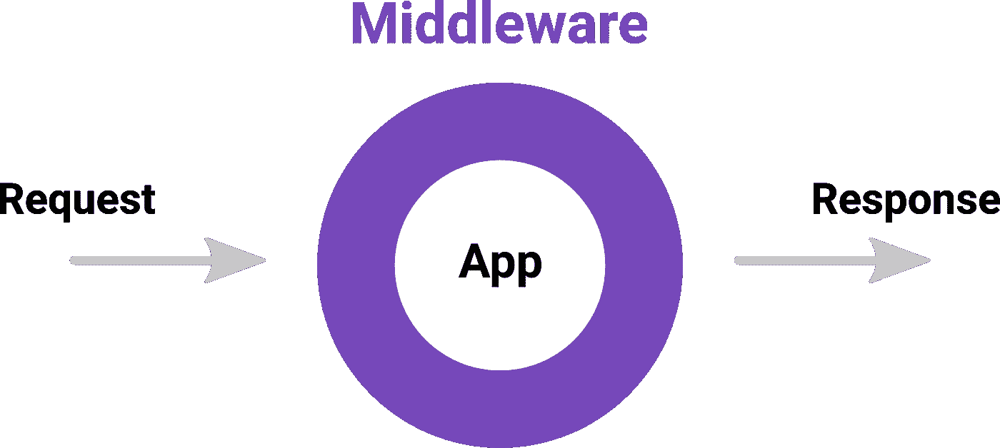

The concept of middleware

同样，Redux 中间件在每个被分派的动作到达 reducer 之前被执行。Redux 中的中间件可以用于许多目的。最简单也是最无害的例子是记录您在每个派单上的操作。最高级的例子之一是构建一个用于调试目的的 DevTools 扩展。

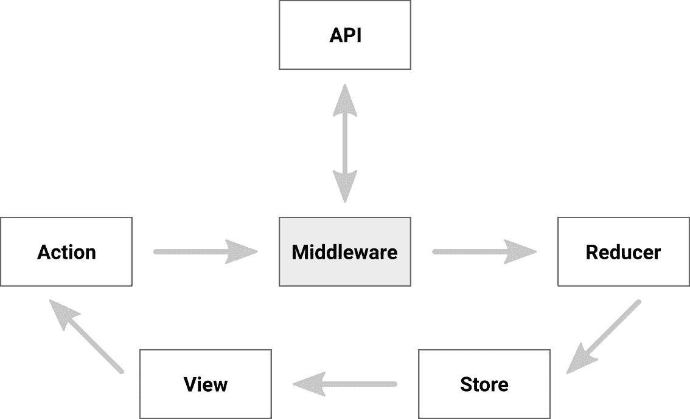

Middleware in Redux

Redux 允许通过向`applyMiddleware`函数提供一组中间件来实现中间件:

```
applyMiddleware(...middleware)
```

作为`createStore`函数中的第三个参数，我们提供了想要使用的存储增强器。正如我们之前提到的，Redux 附带的唯一存储增强器是`applyMiddleware`函数。

Redux 附带了一个`compose`功能，可以帮助你对商店应用多种商店增强剂。它涉及到[函数组合](https://en.wikipedia.org/wiki/Function_composition_(computer_science))，这是函数式编程中一个众所周知的模式。Redux DevTools 扩展也附带了这样的函数，用于其内部目的。

我们将`applyMiddleware`函数包装在 Redux DevTools 的`connect`函数中，或者作为后备(当用户没有安装 Redux DevTools 扩展时)，包装在 Redux 的`compose`函数中:

Redux’s compose and applyMiddleware function example

## 通过 Redux-Thunk 的异步操作

到目前为止，我们一直在 Redux 中处理同步动作。然而，异步动作也是存在的，根据项目的不同，可能会有大量的异步动作。然而，不要不知所措，因为它们也很容易理解:

异步操作意味着以异步方式将操作分派给存储。就是这样。

举个例子，假设我们也有一个 API 来帮助我们在笔记上进行 [CRUD](https://en.wikipedia.org/wiki/Create,_read,_update_and_delete) 操作，也许同样也提供登录和注册功能。我们可以向 API 发送一个 HTTP 请求，并在收到响应时分派一些动作。虽然这种方法没什么问题，但还有另一种方法——通过调度异步动作，为此存在大量的库: *redux-thunk* 、 *redux-promise* 、 *redux-promise-middleware* 、 *redux-observable* 、 *redux-saga* 和 *redux-pack* 等等。顾名思义，所有人都使用不同的技术来达到相同的结果——思考、承诺或观察。

我们将介绍 redux-thunk，因为它是最受欢迎的一个，非常容易理解，并且它使用 thunks，这只是一个包装在另一个函数中的函数的花哨词。要安装它，请运行

```
npm i redux-thunk
// or, yarn add redux-thunk
```

redux-thunk 中的异步操作具有以下模式:

Redux Thunk syntax

该函数不是一个对象创建者并返回一个普通对象，而是返回另一个接受两个参数的函数——商店的`dispatch`和`getState`函数，从而允许延迟调度所需的操作。

为了展示 redux-thunk 的实际例子，我们将编写以下操作:

Redux Thunk async actions example

**注意:**我们不会实现这些，因为我们没有 API，但我希望你能明白要点。

# 结论

恭喜你学会了 Redux 和 React Redux！

作为你的下一步，我强烈建议你访问一下这些技术的官方文档。
您可能还想考虑以下额外资源，我认为这些资源可能会让您更深入地了解 Redux 和 React Redux:

## 要考虑的资源

1.  [Redux Docs](https://redux.js.org/)
2.  [React-Redux Docs](https://react-redux.js.org/)
3.  [丹·阿布拉莫夫](https://medium.com/u/a3a8af6addc1?source=post_page-----8ce5da9e53c6--------------------------------)的[关于理论家的课程](https://egghead.io/courses/building-react-applications-with-idiomatic-redux)
4.  来自[学院](https://www.youtube.com/playlist?list=PL55RiY5tL51rrC3sh8qLiYHqUV3twEYU_)、[网络忍者](https://www.youtube.com/playlist?list=PL4cUxeGkcC9ij8CfkAY2RAGb-tmkNwQHG)和[旅行媒体](https://www.youtube.com/watch?v=93p3LxR9xfM)的重复相关视频
5.  如果你正在使用 Angular，检查一下 [NgRx](https://ngrx.io/) 和 [NGXS](https://www.ngxs.io/)

如果你发现任何有助于你更好地理解 Redux 的额外资源，请在下面的评论中提供，这样其他人也可以从中受益。

我希望你喜欢这篇文章，并且它至少帮助你对 Redux 和 React Redux 有了更清楚的了解。
作为对您的挑战，尝试通过以下方式扩展该项目:

*   添加编辑注释的功能
*   为应用程序添加一个赏心悦目的设计，并使其具有响应性
*   提高应用程序的 UX。考虑添加一个表单验证，强制用户提供内容，但不一定是要保存到商店的新笔记的标题。
*   向注释添加标签并扩展可见性过滤器，该过滤器将根据标签过滤要显示的注释
*   添加一个归档功能和一个归档部分，所有归档的笔记都将在这里呈现
*   将根归约器分割成多个子归约器
*   创建单独的注释组件
*   将此应用程序连接到云上，或者考虑用您最喜欢的编程语言创建一个 API(如果您对后端开发感兴趣)
*   跳出框框，发挥你自己的创造力，在一个完全不同的主题上创造一个令人敬畏的项目！

祝你在进一步精通 Redux 的旅途中好运！

*更多内容敬请关注*[***plain English . io***](http://plainenglish.io)**和上****我们的 YouTube 频道** **！****

**[](https://newsletter.plainenglish.io/) [## 上周简明英语杂志

### 《上周简明英语》——科技世界的每周综述，包含我们认为你会…

时事通讯. plainenglish.io](https://newsletter.plainenglish.io/)**