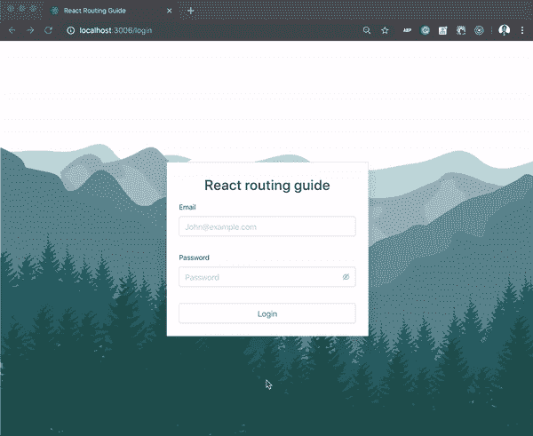
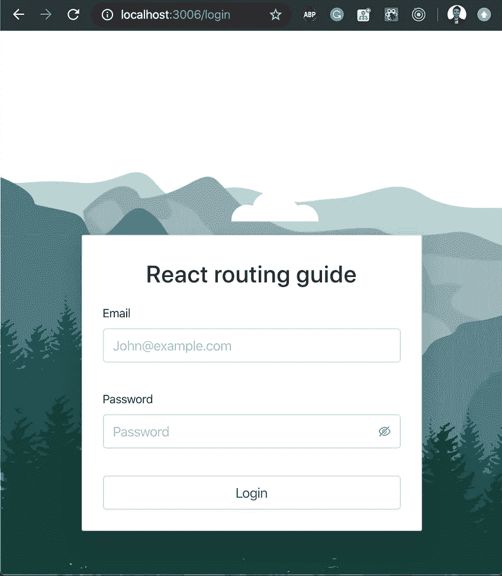
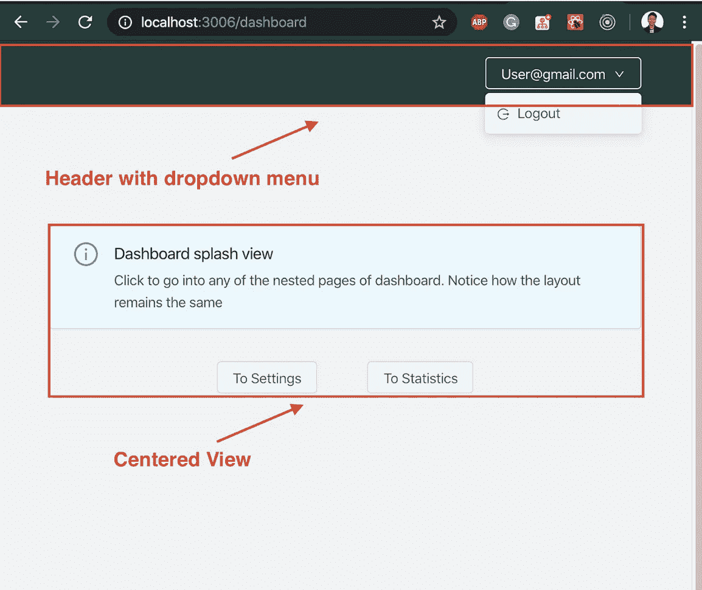
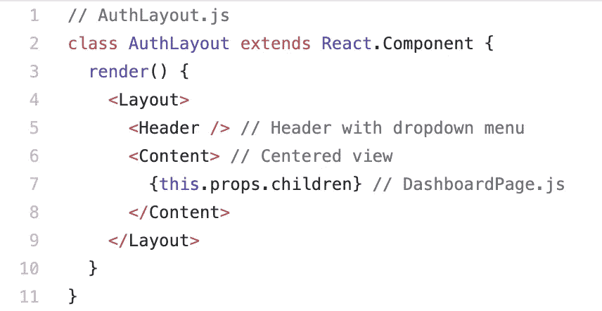
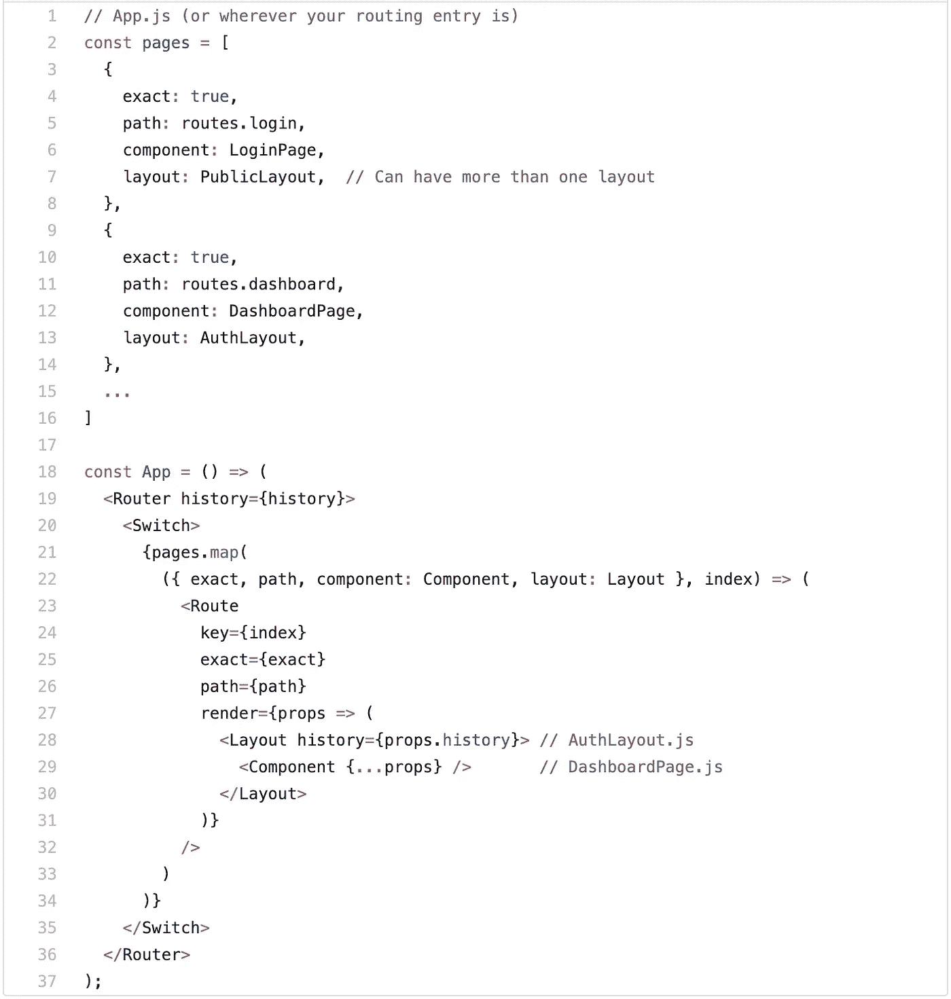
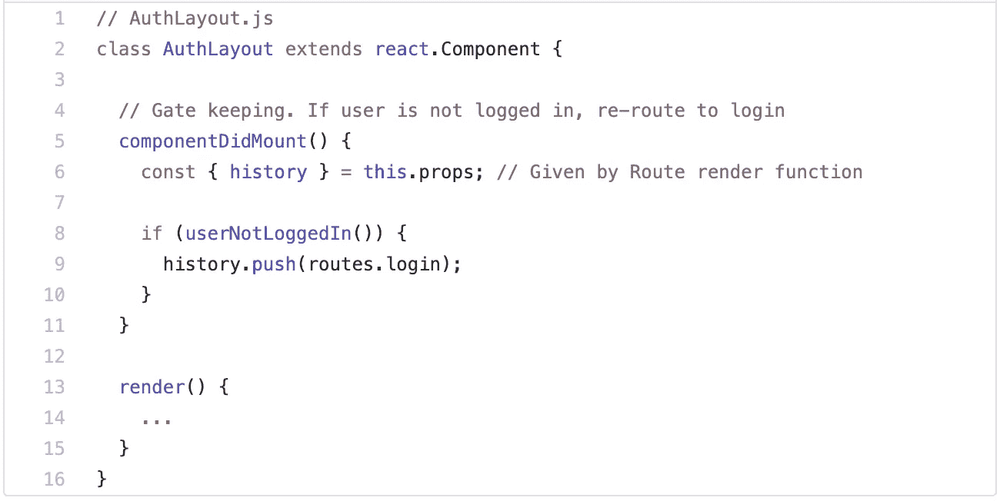
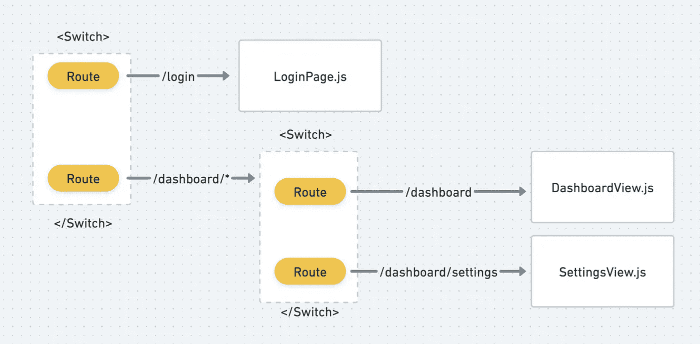
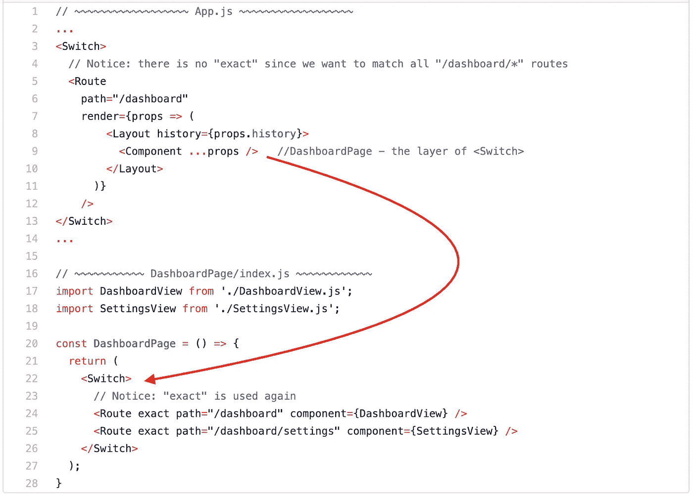
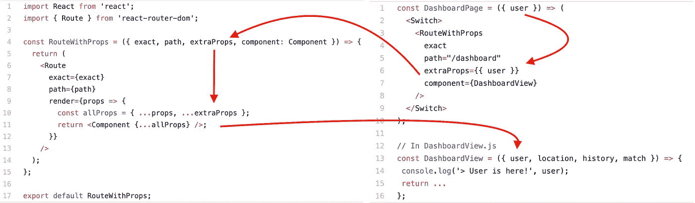

# 您需要的唯一 React 路由器设置

> 原文：<https://javascript.plainenglish.io/the-only-react-router-set-up-you-will-ever-need-9f36ddee03a5?source=collection_archive---------1----------------------->

本文旨在构建 4 个常见的路由需求，为您的 React web 应用程序提供一个坚如磐石的路由基础设施。

我的承诺是，在您阅读结束时，我们会提供一个干净、可扩展的路由基础设施，它具有以下特性:

*   向页面添加布局
*   嵌套路线
*   保护路由，添加授权
*   将道具传递给组件

# 概观

如果你正在工作或曾经在前端工作，我愿意打赌，你曾经搜索过任何上述路由功能。我知道我有。

一个简单的谷歌搜索可以很容易地产生构建这些功能的解决方案。但是根据我的经验，这些解决方案在孤立的情况下工作得很好，这还不够好。

这篇文章背后的动机是统一每个特性的工程。创建一个强大的无冲突扩展的路由基础设施，这样您就可以专注于前端真正重要的事情。

> 使
> 
> 居中

# 让我们建造一些东西

为了查看基础设施的运行情况，我们将使用它构建一个简单的 React web 应用程序。

**完整源代码 [***此处***](https://github.com/marxlow/react-router-layout-guide)

只有 5 个步骤，每个步骤都在前一个步骤的基础上增加一个额外的功能。

在我们开始之前，如果你不熟悉 React 路由器的官方网站[这里](https://reacttraining.com/react-router/web/api/Route)，我建议你复习一下 React 路由器的`<Route>`组件。



The end product of what we will be building. (focus on its routing)

## 1.基本路由

我们将首先为一个简单的登录和仪表板页面构建路由。

```
import { Router, Route, Switch, Redirect } from "react-router-dom";
import LoginPage from './pages/LoginPage';
import DashboardPage from './pages/DashboardPage';<Router>
  <Switch>
    <Route exact path="/login" component={LoginPage}
    <Route exact path="/dashboard" component={DashboardPage}
  </Switch>
</Route>
```

这里没有太多的事情发生。不出所料，任何匹配`path`道具的 URL 都会呈现我们的`component`。例如，“/log in”URL 将呈现我们的 LoginPage 组件—很好！

我们的仪表板和登录页面现在有不同的布局，如下所示。假设我们想要添加一个新的“/settings”页面，其布局与我们的仪表板页面(右图)相同。应该怎么做？



Login & Dashboard page

## 2.添加布局

我们可以轻松地将仪表板组件中的代码复制到新的设置组件中。但是这不仅违反了 DRY(不要重复自己)原则，而且也是非常不可扩展的。想象一下，每次为需要布局的新页面复制相同的代码。

更好的方法是使布局可重用。

通过将布局结构从`DashboardPage`重构到它自己的组件中，我们可以将它作为父组件来包装所有需要它的子组件，如下所示:

(我将其命名为`AuthLayout.js`,因为这些页面稍后需要授权)



创建好布局组件后，下一个挑战是找到如何以及在哪里用它包装页面。

我发现最好的方法是使用`<Route/>`中的`render`道具。`render`接收一个函数，当我们的 URL 与`path`中的字符串匹配时，该函数运行并返回一个组件。更多信息请点击[这里](https://github.com/ReactTraining/react-router/blob/master/packages/react-router/docs/api/Route.md#render-func)。

请注意下面的第 27–30 行，它用`AuthLayout`组件包装了我们的页面(`SettingPage`和`DashboardPage`):



*你会注意到什么:*

*   在我们的`pages`常量中，我们可以很容易地控制每个页面的布局。这意味着我们无需重写任何代码就可以支持多种布局。
*   我们没有在 Route 中使用`component={}` prop 来呈现我们的页面组件，因为我们想将它们包装在我们的父布局组件中。
*   我们不会失去任何力量，因为我们仍然可以使用我们的路线道具(比赛，位置，历史)

到目前为止，我们已经在页面中实现了一致的布局("/Settings" & "/Dashboard ")。

但是这些页面不受保护，任何未登录的用户仍然可以访问它们。接下来我们要做的是将未经验证的用户重定向回我们的登录页面。

## 3.保护路线

谢天谢地，我们仍然可以在`AuthLayout.js`中访问我们的路线道具(历史)。认识到这一点后，解决方案变得非常简单。

我们可以将我们的布局组件变成一个看门人，并在我们的`componentDidMount`函数中将任何未经授权的用户发送到登录页面，如下所示:



这个实现的美妙之处不仅仅在于它的简单，还在于我们如何从页面组件中抽象出授权的责任。我们只需要在布局层次做一次，而不是在每个页面组件中检查权限，干！

## 4.嵌套路线

拥有许多页面的足够大的应用程序最终需要嵌套一些“路由”。有许多方法可以做到这一点，但我们必须找到一种可以平稳集成到我们当前基础架构中的方法。

让我们看看如何将“/设置”页面嵌套到“/仪表板”中。这里的目标是呈现带有 URL 的设置页面:“/dashboard/settings”。

输入嵌套的`<Switch>`组件——因为当一个 URL 匹配其“`path`”时，一个`<Route>`“返回”一个组件，我们可以在返回的组件中嵌套另一个`<Switch>`,以进一步导航任何具有“/dashboard/…”URL 模式的 URL。



In diagrams: How nested <Switch> works



In code: How nested <Switch> works

*你会注意到什么:*

*   `exact`必须在第一层`<Switch>`关闭，并在最后一层(第二层)打开。
*   `AuthLayout`仍从第一层开始打。这意味着我们不会失去之前的访问控制，仍然可以保持我们的布局！
*   我们已经创建了一个新的组件`/dashboardPage/index.js`，负责路由任何匹配“/dashboard/*”模式的 URL
*   我们重构了`SettingsPage.js` → `/dashboardPage/SettingsView.js`
*   我们重构了`DashboardPage.js` → `/dashboardPage/DashboardView.js`

## 5.将道具传递给组件

无论您的用例是什么，这都是将全局或存储级数据传递给组件的便捷方式。

我个人使用它，这样页面组件就不用一直连接到 redux。例如，不是将`/dashboardPage/SettingsView.js`和`/dashboardPage/DashboardView.js`都连接到 redux。我只有父节点`/dashboardPage/index.js`连接到 redux，并将全局属性传递给这些组件。

假设我们有一个“用户”变量，我们想把它作为道具传递给我们的`DashboardView`组件。

```
const DashboardPage = ({ user }) => (
  <Switch>
    <Route exact path="/dashboard" component={DashboardView} />
  </Switch>
);
```

我们将创建一个更高阶的组件`RouteWithProps.js`(一个接受一个组件并返回一个新组件的函数)，将我所说的“extraProps”传递给我们的组件。

这里，它取代了前面的`<Route/>`→`<RouteWithProps/>`,将“用户”向下传递到`DashboardView.js`。



*你会注意到什么:*

*   `<Route/>`的道具也可以用来传入道具，而不仅仅是用来添加早期的布局。
*   我们必须传递`exact` & `path`到`RouteWithProps`，它们是`<Route/>`道具，所以路由不会改变。

# 摘要

**再次完整源代码 [***此处***](https://github.com/marxlow/react-router-layout-guide)

到目前为止，这种路由基础设施对于中小型应用程序来说非常有用。它并不完美，这里有一些更大的问题:

*   [嵌套路由]如果你有一个单独的“404”页面，注意你必须显式地写代码在第二层路由*再次*重定向。
*   [Layout]从“/Dashboard”→“/Settings”导航到新的 URL 将再次重新呈现您的布局。也就是说，你的布局的`componentDidMount`函数经常重新运行，如果处理不好，这可能会很昂贵。

完美的基础设施在我看来是不存在的。一个好的工程师会为正确的工作选择正确的工具。我希望我的写作为你的工具箱增加了一个，即使你现在不使用它。

我一直在寻找改进的方法，所以请告诉我你的想法。感谢您的阅读！