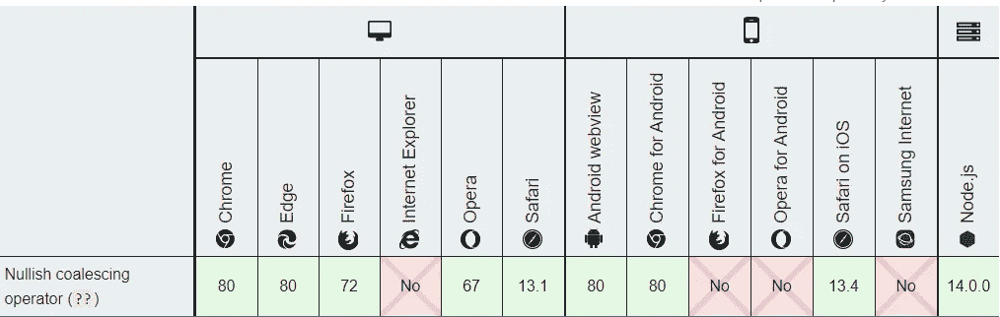

# 您可能没有使用的 JavaScript 操作符

> 原文：<https://javascript.plainenglish.io/the-operator-you-are-probably-not-using-1105a3010c8a?source=collection_archive---------9----------------------->


Photo by [Mohdammed Ali](https://unsplash.com/@mohdali_31?utm_source=medium&utm_medium=referral) on [Unsplash](https://unsplash.com?utm_source=medium&utm_medium=referral)

如果你在谷歌上搜索`javascript operators`这个词，然后点击[的第一个结果](https://www.w3schools.com/js/js_operators.asp)——这个神秘的操作者将无处可寻。至少在 2020 年 9 月，你必须点击第四个*结果，然后在页面上搜索它，否则，它真的很容易被忽略，因为它不包含在任何漂亮的表格中。*

# *秘密够多了。*

*我说的是`Nullish Coalescing Operator` — `??`，它是一个二元逻辑运算符，与`||`(逻辑 or)和`&&`(逻辑 and)相同，只是它不做类型强制，实际上它类似于`||`，语法如下:*

> *leftExp？？rightExp*

*如果`leftExp`等于`null`或`undefined`，表达式将返回`rightExp`，没有`truthy`或`falsy`的转换发生，结果无法预料，比如`0`没有通过我们的数字检查，因为它是`falsy`*

*看来我们可以把`||`换成`??`然后就到此为止了？*

# *不，这是为什么*

*首先，这个操作符非常新，Chrome 仅从 2020 年 2 月发布的版本 80 开始支持它，并且它需要 JavaScript 服务器端的节点 v 14(2020 年 4 月)。*

**

*browser support*

*其次，用`??`嵌套一个表达式仍然会进行类型转换，一个很好的例子是`if`语句:*

```
*if(0 ?? -1) {
   console.log("a number!")
}*
```

*日志永远不会执行，我们将从表达式中得到`0`，但是在`if`的布尔上下文中，它仍然被认为是`falsy`。*

*最后，当用其他逻辑操作符链接它时，它的返回值仍然会受到类型转换的影响，这使得很难在心里处理。它还需要一组额外的括号:*

```
*let a = true && (0 ?? false); // 0let b = (0 ?? "bar") || "foo"; // "foo"let c = null ?? "bar" ?? "foo"; // "bar"let d = (0 ?? "foo") && "bar"; // 0*
```

# *不过也不全是坏事*

*你可以用它很好地缩短赋值操作中边缘情况的检查，不需要显式地检查`null`和`undefined`，这应该在逻辑 or 的情况下完成。*

```
*let a = 0;
let b = a ?? -1;let c = 0;
let d = c !== null && c !== undefined ? c : -1;*
```

*看一下前面的例子，逻辑 OR 的链接毫无意义，但是用`??`代替它意义重大。*

```
*let b = 0 ?? "bar" ?? "foo"; // 0*
```

*但是无法保存和。*

# *我应该取消联合吗？*

*如果项目允许，我个人会这样做，但只是在做任务检查时，因为表情比常规的`null`或`undefiend`检查更悦目，而且思维过程更快。*

*与其他逻辑操作符链接在一起确实会造成精神紧张，因为不再仅仅涉及`truthy`和`falsly`检查，还会涉及额外的`null/undefined`检查，这些检查随后会被转换为`truthy/falsy`——为了保持代码的整洁和连贯，应该避免使用它们。*

## ***简单英语的 JavaScript***

*喜欢这篇文章吗？如果有，通过 [**订阅解码，我们的 YouTube 频道**](https://www.youtube.com/channel/UCtipWUghju290NWcn8jhyAw) **获取更多类似内容！***