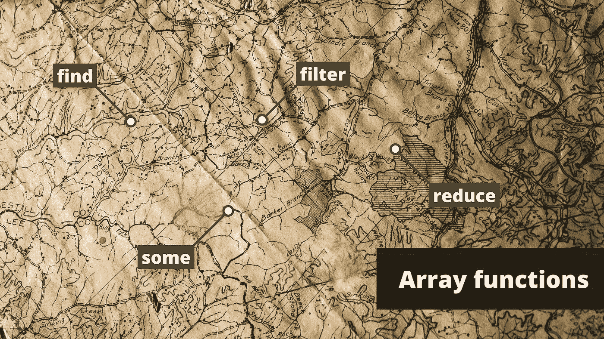
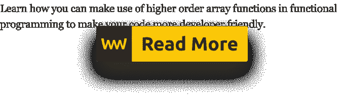

# 高阶数组函数的威力

> 原文：<https://javascript.plainenglish.io/the-power-of-array-function-93d5428286c3?source=collection_archive---------4----------------------->

## 查找，一些，映射，减少，每个，过滤器

Photo by [Nik Shuliahin](https://unsplash.com/@tjump?utm_source=medium&utm_medium=referral) on [Unsplash](https://unsplash.com?utm_source=medium&utm_medium=referral)

数组无处不在。从简单的矩阵到复杂的对象列表，在页面上保存每个产品的每个细节。我们每天都要处理它们，当我们对它们进行操作时，我们会本能地写出相同的代码行，而不会太注意它们可能采取的形式。您编写它们的方式决定了其他人阅读和理解您的实现的难易程度。

幸运的是，在 JavaScript 中，我们有一些很好的处理数组的内置函数，可以简化您的代码，使其更容易阅读，最终，在出现问题时更容易调试。

与数组相关联的函数是函数式编程范式的核心部分，它只不过是

> “构建计算机程序的结构和元素的一种风格”——[维基百科](https://en.wikipedia.org/wiki/Functional_programming)

人们常说，在函数式编程中，你声明你的意思。当你使用命令式方法时，你的代码更关注于*“它是如何做的”*事情。采用声明式方法，它更关注于*“它正在做什么”*。如果您想看一些代码示例来演示这两者之间的区别，请继续阅读，当我们看到`map`函数时，我会这样做。

现在，为了演示我们拥有的每一个函数，我们需要一些数据来处理。让我们假设你正在开发一个电子商务，你有一系列的产品。每个商品都包含一个对象，该对象具有各种属性，例如名称、价格、id，如果商品正在销售，还会有一个可选的标志:

如果商品不打折，则整个标志被省略。

# 数组.原型.查找

`find`，顾名思义是用来查找数组中的特定元素。它返回一个首先通过回调函数测试的项目:

对于第一个例子，我们返回一个对象，因为每个 id 都是唯一的。够清楚了。但是在第二个例子中，我们有两个正在销售的产品，但是我们仍然只能得到第一个通过测试的产品。如果没有匹配，它简单地返回`undefined`。

# 数组.原型.过滤器

现在，如果我们想找到所有正在销售的产品，而不仅仅是第一个产品，该怎么办呢？这就是`filter`可以帮助我们的地方:

`filter`返回每个通过测试的元素，不像`find`只返回第一个。如果没有匹配，我们得到的不是`undefined`，而是`[]`。

# 数组.原型.每

不像`find`或`filter`我们期望从数组中返回一个项目，`every`返回一个`true`或`false`值。如果数组中的每一项都通过了测试，我们就得到`true`，否则就剩下`false`:

很明显，对于一个给定的电子商务网站，并不是每个产品都在销售，所以我们回到第一个例子的`false`。但是，我们可以检查是否每个产品都有名称。因为在这个例子中他们有，我们得到一个`true`值。

# 数组.原型.一些

`some`在返回值方面与`every`非常相似:要么返回一个`true`要么返回`false`。但是，不是检查每一个项目是否符合标准，如果至少有一个产品符合标准，它将立即返回`true`。

这一次，我们返回`true`,因为我们没有检查是否每件商品都在打折。我们只对是否至少有一件商品打折感兴趣。

# 数组.原型.地图

到目前为止，我们只研究了如何过滤数组中的值。每个函数的主要目的都是根据给定的标准匹配一个项目。`map`另一方面，用于变换一个数组。我们给它一个回调函数，每个条目都会被调用。在函数内部，我们通常会做一些转换。假设您想要对每种产品的价格进行舍入:

在第一个例子中，如果我们只返回价格，我们只得到一个与原始长度相同的数组，但是只有价格。为了获得预期的行为，我们需要在最后返回`product`本身。请注意，与 for 循环相比，使用`map`可以简化您的代码—*—并使其更具可读性。*

# array . protocol . reduce

我们漏掉了 reduce，最吓人的。至少对我来说是这样，比其他人都多。`reduce`用于从数组中产生单个值。它对每个项目都进行操作，并且还需要一个累加器。

假设这次我们想得到所有产品的价格总和。借助`reduce`。这可以简单地用一行代码来完成:

`reduce`需要两个参数，一个用于回调函数，一个用于初始值。我们从`0`开始，这是我们的初始值。回调函数接受两个参数，一个是累积值，一个是项目本身。在每次迭代中，`accumulated`参数获取前一次迭代产生的值。

*   开始的时候，它的值会是`0`。
*   然后我们将第一个产品的价格加到它上面，这样它的值就是`73`。
*   在下一次迭代中，当函数被调用时，`accumulated`的值将会是`73`,我们将为其添加下一个价格标签，以此类推。

# 摘要

有了工具箱中的每一个重要的数组函数，你就能使你的代码更容易推理，更干净，最后但同样重要的是，更容易测试。

如果你现在还没有在你的代码库中使用它们，那就去尝试一下吧，你可能永远都不想回头了。感谢您花时间阅读本文，编码快乐！

