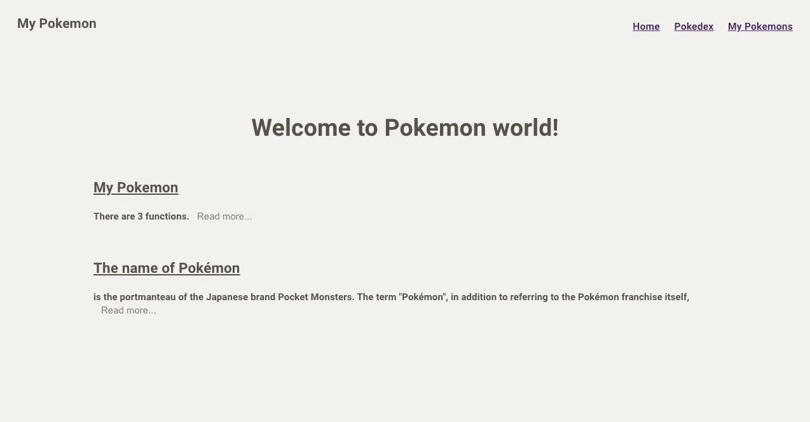
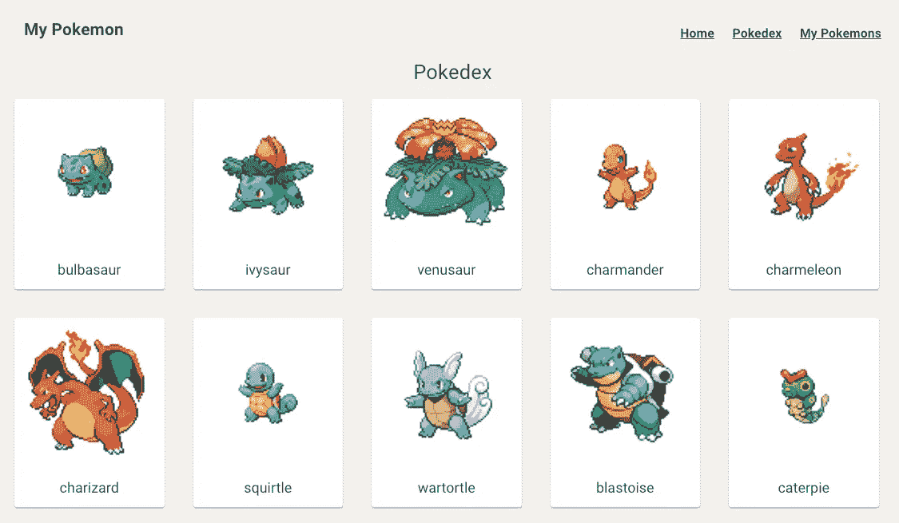
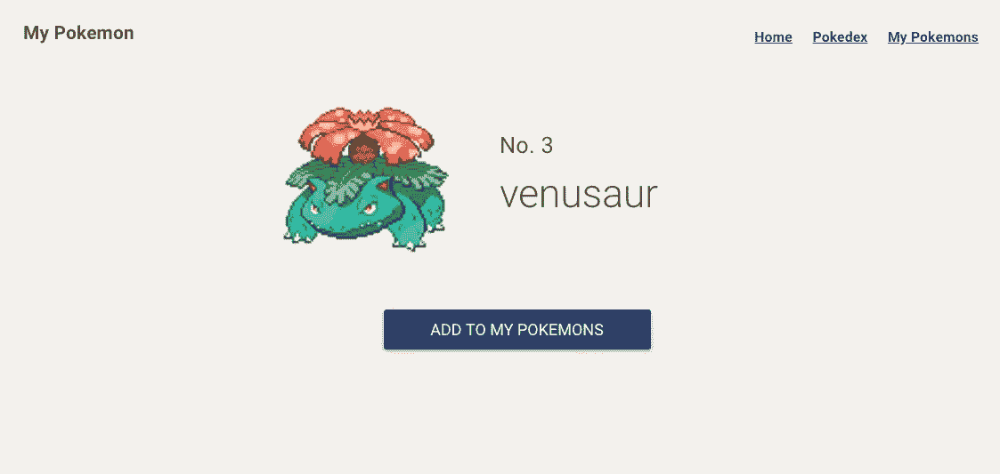
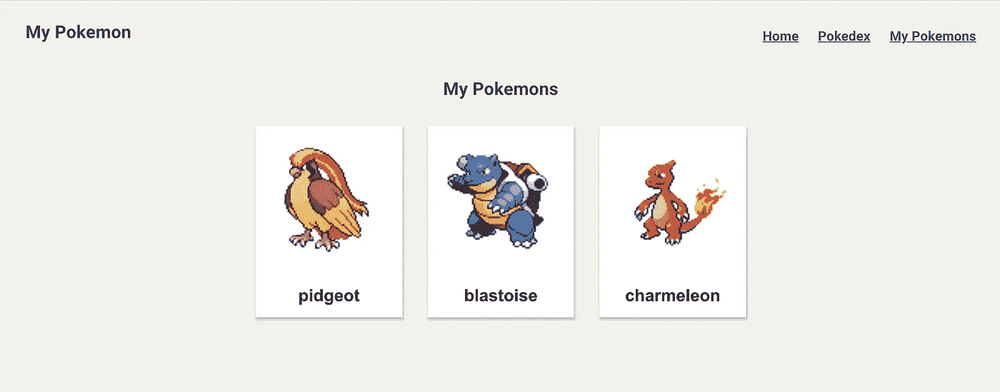
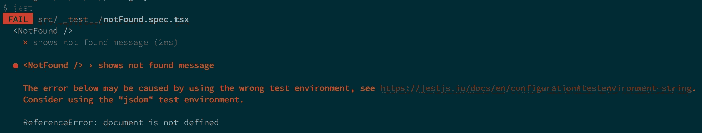
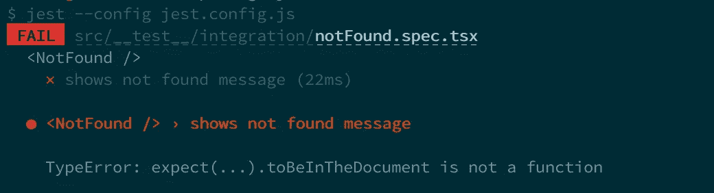
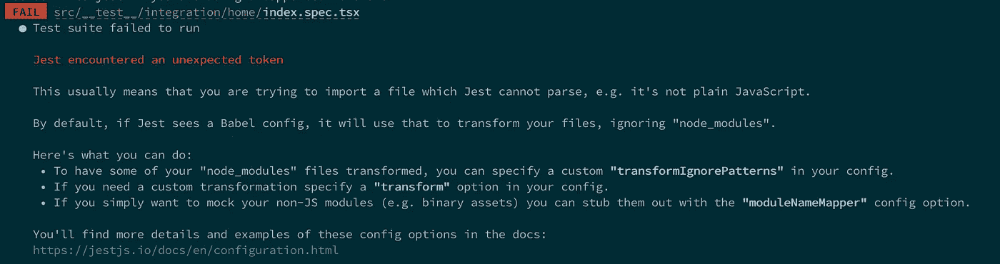

# 用 TypeScript 反应测试库的实用指南

> 原文：<https://javascript.plainenglish.io/the-practical-guide-to-start-react-testing-library-with-typescript-d386804a018?source=collection_archive---------1----------------------->


每个人都知道编写测试对于软件开发来说非常重要。它使我们能够以更少的错误更快地修改代码。

说到前端，`React Testing Library`越来越受欢迎，因为与`enzyme`相比，它更容易测试 React 钩子。然而，用 TypeScript 解释它的文章并不多。

所以本指南主要关注如何用`React Testing Library`用 TypeScript 编写测试。

如果您想了解 React 测试库的其他主题，请参考下面的文章。

*   [如何用 React 测试库和 TypeScript 编写测试:今天实现基本的 AAA 测试模式](https://medium.com/javascript-in-plain-english/how-to-write-the-basic-aaa-pattern-tests-with-react-testing-library-and-typescript-6836173d656b)
*   [如何用 TypeScript 为材质 UI 样式的组件设置 React 测试库](https://medium.com/@egctoru/how-to-setup-react-testing-library-for-material-ui-styled-component-with-typescript-556decbcbb55)
*   [带有 React 测试库和类型脚本的材质 UI 样式组件的快照](https://medium.com/@egctoru/snapshots-of-material-ui-styled-component-with-react-testing-library-and-typescript-d82d7d926d2c)

# 反应测试库

它是由在 PayPal 工作的 Kent C Dodds 创建的，他是前端 TDD 的先驱。React 测试库的首要原则是

> 你的测试越像你的软件被使用的方式，它们就越能给你信心。

它的意图是你的测试应该像用户如何操作一样工作，而不是你的应用程序如何实现。

React 测试库包(名为`@testing-library/react`)是`@testing-library`家族中的一员。家族的核心库，`@testing-library/dom`提供了 React、Anguler、Vue 的通用 API。但是如果使用 React 之类的框架，就要使用包装器库，`@testing-library/react`。

对于一个测试框架，它说 React 测试库可以在任何测试框架中工作。另一方面，因为许多文章和人都在用它来开玩笑，所以本指南也用 JEST。

# 设置演示应用程序

因为自己编码比较好，所以准备了一个演示应用，叫我的口袋妖怪。

科技栈在下面。

*   反应
*   以打字打的文件
*   反应路由器
*   Redux
*   材料-用户界面
*   其他(webpack、babel、eslint、prettier、 [PokéAPI](https://pokeapi.co/) )

因为我想解释如何用 Redux、react-router 和 Material-UI 编写测试，所以 tech stack 有点复杂。

可以浏览 Pokedex，添加喜欢的口袋妖怪为`My Pokemons`。

*   主页:“/”



Home

*   pokedex:“/口袋妖怪”



Pokedex

*   口袋妖怪详细信息:"/口袋妖怪/:id "



Pokemon Detail

*   我的口袋妖怪:“/我的 _ 口袋妖怪”



My Pokemons

如果您愿意，请复制此回购。

```
git clone [https://github.com/egurinko/react-testing-library-demo.git](https://github.com/egurinko/react-testing-library-demo.git)
```

# 安装软件包

让我们为 React-Testing-Library 添加包。你需要的在下面。

```
yarn add -D [@testing](http://twitter.com/testing)-library/react [@testing](http://twitter.com/testing)-library/jest-dom jest
```

`@testing-library/jest-dom`为 JEST 提供自定义 DOM 匹配器。这让你的考试生活变得更容易。

对于 TypeScript，应该添加一些包。

```
yarn add -D ts-jest [@types/jest](http://twitter.com/types/jest) [@types/testing-library__react](http://twitter.com/types/testing-library__react) [@types/testing-library__jest-dom](http://twitter.com/types/testing-library__jest-dom)
```

`@types`包是每个包的类型文件。`ts-jest`是 TypeScript 的 JEST 预处理器。它使您能够进行类型检查。

# 设置

先设置 Jest 和 TypeScript！只需运行下面的一个命令。它使用 TypeScript 设置创建一个 jest 配置文件(jest.config.js)。

```
yarn ts-jest config:init
```

在编写测试之前，如果需要，请添加`eslint`设置，因为`eslint`不知道测试框架代码。

```
// .eslintrc.json{
  ...
  "env": {
    "browser": true,
    "jest": true       // ADD THIS
  }
  ...
}
```

让我们写第一个测试。因为我想在 src 目录下创建测试文件，所以请创建一个名为`__test__`的测试目录。JEST 自动检测出`__test__`下的文件是测试文件。

```
// src/__test__/integration/first.spec.tsit('runs the first test', () => {
  expect(true).toBe(true);
});
```

因为通常会创建其他类型的文件，如配置、模拟，所以我通常为纯测试文件创建集成目录。

要轻松运行 JEST 测试，我推荐你创建如下的 yarn 脚本。

```
// package.json...."scripts": {
  ....
  "check-types": "tsc",
  "test": "jest"
}....
```

准备好进行第一次测试了。去做吧！

```
yarn test$ jest
 PASS  src/__test__/integration/first.spec.ts
  ✓ runs the first test (2ms)Test Suites: 1 passed, 1 total
Tests:       1 passed, 1 total
Snapshots:   0 total
Time:        2.141s, estimated 3s
Ran all test suites.
✨  Done in 3.50s.
```

恭喜🎉🎉

# 用 React 测试库编写第一个测试

上面的测试不是 React 测试库的测试。这只是一个玩笑测试。所以让我们用 React 测试库写一个简单的组件测试。

我的口袋妖怪回购里最简单的组件就是`src/components/NotFound.tsx`。它只有普通的 html 标签和文本。没有 Redux，没有 Material UI，没有 react-router，但是有 TypeScript。

```
// src/components/NotFound.tsximport React from 'react';const NotFound: React.FC<{}> = () => (
  <div>
    <h1>Not Found</h1>
    <h1>404</h1>
  </div>
);export default NotFound;
```

所以请将第一个测试重命名为 notFound.spec.tsx，并编写一个简单的测试。

```
// src/__test__/notFound.spec.tsximport * as React from 'react';
import { render, RenderResult } from '@testing-library/react';
import NotFound from '../../components/NotFound';let documentBody: RenderResult;describe('<NotFound />', () => {
  beforeEach(() => {
    documentBody = render(<NotFound />);
  }); it('shows not found message', () => {
    expect(documentBody.getByText('Not Found')).toBeInTheDocument();
    expect(documentBody.getByText('404')).toBeInTheDocument();
  });
});
```

`[render](https://testing-library.com/docs/react-testing-library/api#render)` API 将你传递的组件呈现为`document.body`下的一个参数。它返回`RenderResult`。如果你对`RenderResult`更感兴趣，请自行查看。您可以了解使用`render` API 可以做什么。

让我们来测试一下。



嗯🤔上面写着`using the wrong test environment. Consider using the "jsdom" test environment`。因为 jest.config.js 中当前环境设置为`node`。

```
// jest.config.jsmodule.exports = {
  preset: 'ts-jest',
  testEnvironment: 'node',
};
```

但是节点环境不能处理 DOM。所以请把`testEnvironment`改成`jsdom`。

仍然出现错误🤔



因为`toBeInTheDocument` matcher 来自`@testing-library/jest-dom`。如果导入`@testing-library/jest-dom`，测试将会成功。

然而，在所有文件中编写重要的句子是没有效率的。因此，让我们创建一个 JEST 配置来实现全局导入`@testing-library/jest-dom`。

首先，请创建配置文件。

```
// src/__test__/config/importJestDOM.tsimport '@testing-library/jest-dom';
```

并将文件添加到 jest.config.js 的`setupFilesAfterEnv`中，如下所示。

```
// jest.config.js
module.exports = {
  preset: 'ts-jest',
  testEnvironment: 'jsdom',
  setupFilesAfterEnv:['<rootDir>/src/__test__/config/importJestDOM.ts']
};
```

如果您使用 setupFilesAfterEnv，您可以在执行每个测试文件之前运行任何模块。

现在第一个考验就要通过了！！

```
PASS  src/__test__/integration/notFound.spec.tsx
  <NotFound />
    ✓ shows not found message (23ms)Test Suites: 1 passed, 1 total
Tests:       1 passed, 1 total
Snapshots:   0 total
Time:        1.48s, estimated 4s
Ran all test suites.
✨  Done in 2.58s.
```

# 固定文本的快照测试

如果你想在应用程序中测试固定文本，你不必在测试中编写固定文本，因为你必须在应用程序和测试中管理固定文本。

在这种情况下，快照测试是有效的。您获取组件快照并提交给 GitHub。如果更改了固定文本，只需更新快照并再次提交即可。

代码本身非常简单。

```
// src/__test__/integration/notFound.spec.tsx.....describe('<NotFound />', () => {
  beforeEach(() => {
    documentBody = render(<NotFound />);
  }); it('matches snapshot', () => {
    const { baseElement } = documentBody;
    expect(baseElement).toMatchSnapshot();
  });
})
```

你再也不用在测试中写固定的文本了。

当您第一次运行快照测试时，`__snapshot__`目录和`.snap`文件将如下创建。

```
// src/__test__/integration/__snapshots__/notFound.spec.tsx.snapexports[`<NotFound /> matches snapshot 1`] = `
  <body>
    <div>
      <div>
        <h1>Not Found</h1>
        <h1>404</h1>
      </div>
    </div>
  </body>
`;
```

当你更新一些东西时，你的测试会失败。但是如果是有意的更改，您可以使用`--updateSnapshot`选项运行测试并提交它。

※注意
快照测试非常容易，但是对于大组件来说有一些缺点。如果你想知道有效的快照，请点击链接

[](https://kentcdodds.com/blog/effective-snapshot-testing) [## 有效的快照测试

### 我想我最近一直在尝试，我保证这篇时事通讯以后会深入研究更多的东西。但是…

kentcdodds.com](https://kentcdodds.com/blog/effective-snapshot-testing) 

# 额外:处理静态资产

因为`NotFound`的例子没有样式表和图片这样的静态资产。但是如果你用它们测试一个组件，它会失败，因为 jest 不能解析。



Error with static assets

为了避免这种错误，您应该模仿静态资产。

[](https://jestjs.io/docs/en/webpack#handling-static-assets) [## 与 webpack Jest 一起使用

### Jest 可以用在使用[web pack](https://web pack . js . org/)管理资产、样式和编译的项目中…

jet js . io](https://jestjs.io/docs/en/webpack#handling-static-assets) 

在本例中，创建模拟文件。

```
// src/__test__/mock/styleMock.tsexport default {};// src/__test__/mock/fileMock.tsexport default "test-file-stub";
```

并在`jest.config.js`的 moduleNameMapper 中使用它们。ModuleNameMapper 用您指定的内容替换了一些模块。

```
// jest.config.jsmodule.exports = {
  preset: 'ts-jest',
  testEnvironment: 'jsdom',
  setupFilesAfterEnv: ['<rootDir>/src/__test__/config/importJestDOM.ts'],
  moduleNameMapper: {
    "\\.(jpg|jpeg|png|gif|eot|otf|webp|svg|ttf|woff|woff2|mp4|webm|wav|mp3|m4a|aac|oga)$": "<rootDir>/src/__test__/mock/fileMock.ts",
    "\\.(css|less)$": "<rootDir>/src/__test__/mock/styleMock.ts"
  }
};
```

使用这个选项，您可以将静态资产包含到您的测试中🎉

本文重点介绍如何用 TypeScript 设置 JEST 和 React 测试库，并运行第一个测试。因为我写了其他关于 React 测试库的文章，喜欢的话可以去看看。

*   [如何用 React 测试库和类型脚本编写测试:今天实现基本的 AAA 测试模式](https://medium.com/javascript-in-plain-english/how-to-write-the-basic-aaa-pattern-tests-with-react-testing-library-and-typescript-6836173d656b)
*   [如何用 TypeScript 设置材质 UI 风格组件的 React 测试库](https://medium.com/@egctoru/how-to-setup-react-testing-library-for-material-ui-styled-component-with-typescript-556decbcbb55)
*   [带有 React 测试库和类型脚本的材质 UI 样式组件的快照](https://medium.com/@egctoru/snapshots-of-material-ui-styled-component-with-react-testing-library-and-typescript-d82d7d926d2c)

谢谢大家！

## 参考

*   [测试库](https://testing-library.com/)
*   [笑话](https://jestjs.io/en/)
*   [ts-jest](https://github.com/kulshekhar/ts-jest)

## **用简单英语写的 JavaScript 笔记**

我们已经推出了三种新的出版物！为我们的新出版物献上一点爱心吧，请跟随他们:[**AI in Plain English**](https://medium.com/ai-in-plain-english)，[**UX in Plain English**](https://medium.com/ux-in-plain-english)，[**Python in Plain English**](https://medium.com/python-in-plain-english)**——谢谢，继续学习！**

**我们也一直有兴趣帮助推广高质量的内容。如果您有一篇文章想要提交给我们的任何出版物，请发送电子邮件至:[**submissions @ plain English . io**](mailto:submissions@plainenglish.io)**，使用您的 Medium 用户名，我们会将您添加为作者。另外，请让我们知道您想加入哪个/哪些出版物。****