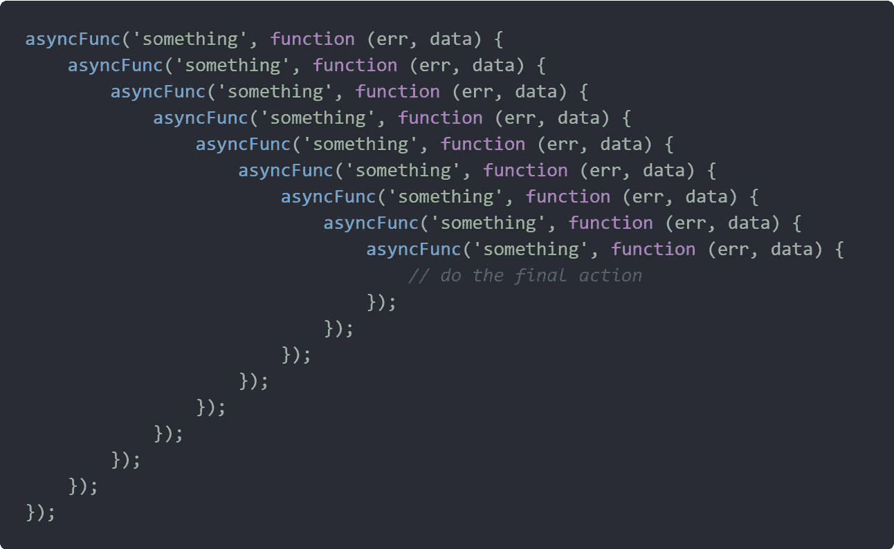
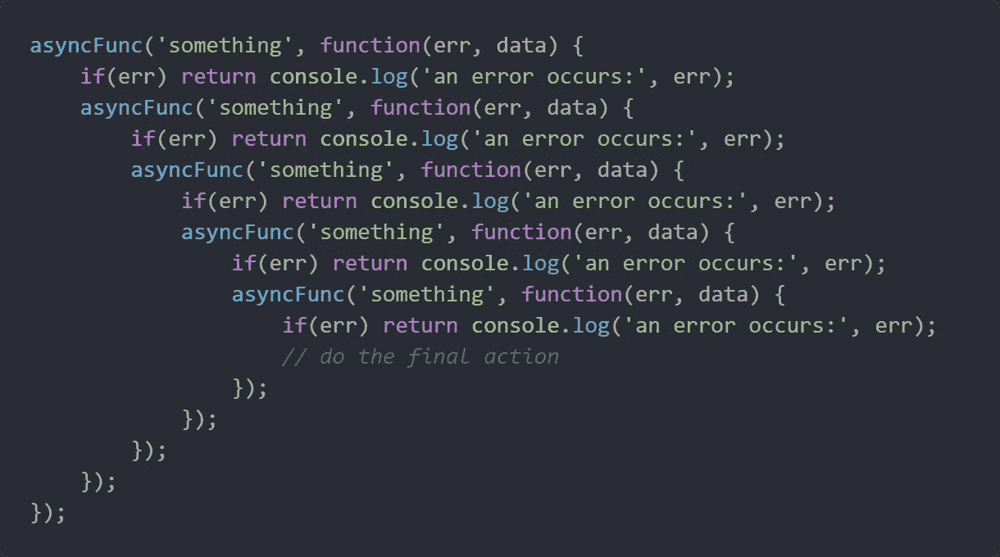
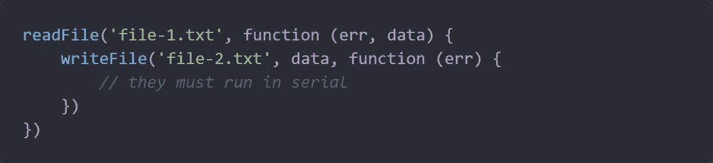
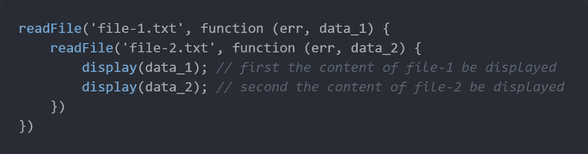
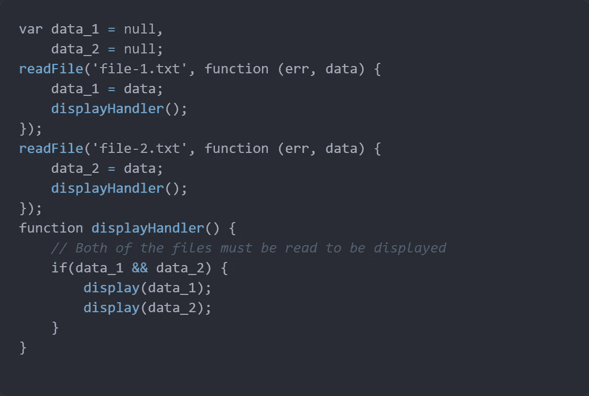

# JavaScript 中回调的实际问题

> 原文：<https://javascript.plainenglish.io/the-practical-problems-with-callbacks-in-javascript-5dd4209c20d?source=collection_archive---------2----------------------->

## 嵌套回调有什么问题，为什么大家都讨厌它？

Photo by [Clem Onojeghuo](https://unsplash.com/@clemono2?utm_source=medium&utm_medium=referral) on [Unsplash](https://unsplash.com?utm_source=medium&utm_medium=referral)

由于您可能是 JavaScript 新手或使用多年，所以您不可能从未听说过“**回调地狱**”以及对它的厌恶。不知何故，无论你走到哪里，都会有一些人说*嵌套回调*是邪恶的，并展示了如下图像，其他人通常也会说，“回调见鬼，恶心！”

Callback Hell — actually I think it looks cool :)

但是作为一个新手(或者有经验的人)，你可能想知道嵌套回调到底有什么问题，为什么每个人都讨厌它。

也许你已经听到了一些模糊的争论，但是让我试着澄清这个主题并展示一些问题，这可以帮助你逻辑地推理回调，并使你理解为什么你可能需要一些其他的模式(例如，承诺、异步/等待、观察者、CSP 等)。)

# 回调本身有什么问题？

首先，让我们看看当你使用回调时会发生什么。

让我告诉你一个真实的故事。

几个月前，我只想使用一个库中的函数，该函数接受回调并将结果作为参数传递给回调(这是异步函数的一种规范)，然后我说，“好的，酷！”

但是当我运行程序时，我注意到我的回调是同步执行的(Whaaat？？为什么？)

如果你写了一个应该同步工作的函数，为什么要把结果传递给一个回调函数呢？为什么不直接返回值呢？

实际上，以这种方式使用回调并不是一个好主意，也没有理由这样做(当然你可以，但你不应该这样做)，因为**习惯上回调应该用在异步函数**或**中，至少异步调用**。

我告诉你这个故事是为了让你明白，当你向第三方发出回电时，你必须依赖第三方，这可能会导致一些混乱，比如回电时的情况:

*   **会被同步调用**(像我的)
*   **会被多次调用**
*   **永远不会被称为**

# 嵌套回调有什么问题？

在开始之前，让我们看看为什么我们把函数放在异步函数的回调中(如果 put 函数是异步的，这个过程可以递归地继续)。

如果你想在一个异步函数执行后调用其他函数，并且因为回调是你在一个异步函数执行完成后被注意到的唯一方式，你别无选择，只能把下一个函数放入异步函数的回调中。(如上图。)

换句话说，当我们想要按顺序运行一些异步函数时，我们必须将它们放入前一个函数的回调中，这使得嵌套回调发生。

我希望这里的解释对你来说足够清楚(如果不是，在评论区问你的问题，我会回答你。)

现在我们了解了嵌套回调的原因，让我们研究一下它的后果。

## 嵌套回调中的错误处理

你可能听说过这个论点，但是我们应该一起仔细研究在嵌套回调中处理错误的问题。

Error handing in nested callbacks

如你所见，**我们必须在每个回调**中处理错误，这实际上是处理错误的样板文件的重复。所以**这段代码并不枯燥**(作为程序员，我们不喜欢一遍又一遍地重复相同的代码)，重用错误处理程序有点困难。

## 平行

当我们打算使用嵌套回调时，异步函数之间可能有两种关系:

1.  异步功能执行必须在**序列**中进行
2.  异步功能的执行应该在**并行**

所以让我们调查他们两个。

**异步功能执行必须按顺序进行**

例如，想象一下当我们想读取`file-1`然后将内容写入`file-2`时的情况。

在这种情况下，它们必须串行运行，使用这种模式，可以简单地完成。

**异步功能的执行应该是并行的**

例如，想象一下当我们想阅读`file-1`和`file-2`时的情况，但是要确保`file-1`的内容在`file-2`之前显示

事实上，我们这里有一个问题。正确的做法是，解析的内容必须按顺序显示，但是读取过程应该同时运行(即并发、并行)。

所以这意味着我们不能使用嵌套模式，因为它阻止我们平行。换句话说，**嵌套回调模式被限制在序列**中运行。

为了并行运行这些功能，我们可以使用一些技巧来实现:

Callbacks run concurrently, but the result of them would be displayed in sequence

在`displayHandler` 功能中，我们必须控制**竞争条件**。

> 注意:竞争条件仅仅意味着当一些异步函数以不正确的顺序被解析时(例如，`file-2`在`file-1`之前被读取)

但是这种技巧不应该用在生产中，因为它们既不可伸缩，也不可维护，也不灵活。

## 对未来价值的参考

最后但同样重要的是，我要提到一个回调模式无法实现的特性(在我看来，我们不应该称之为问题)。

我们不能用回调模式传递对异步函数未来值的引用(不像 promise)，我们只能传递对异步函数执行的控制。

# 包扎

这篇文章的主要目的是以实际和切实的方式向您展示这些问题。

我的想法是，可能有一些像我一样的人无法被一些关于回调问题的模糊论点所说服，例如"*回调地狱是坏的"、"很难推理嵌套"、"错误处理是困难的"、" T1 "以及这些我过去不清楚的东西。*

所以我试着用简单的方式，从我的个人经历和我遇到的问题的角度来解释它们。

我希望这篇文章对你有用(尤其是新手)

如果这里有什么不清楚的地方，欢迎在评论区提出你的问题，我会回应的。

## **用简单英语写的 JavaScript 笔记**

我们已经推出了三种新的出版物！请关注我们的新出版物: [**AI in Plain English**](https://medium.com/ai-in-plain-english) ，[**UX in Plain English**](https://medium.com/ux-in-plain-english)，[**Python in Plain English**](https://medium.com/python-in-plain-english)**——谢谢，继续学习！**

**我们也一直有兴趣帮助推广高质量的内容。如果您有一篇文章想要提交给我们的任何出版物，请发送电子邮件至[**submissions @ plain English . io**](mailto:submissions@plainenglish.io)**，使用您的 Medium 用户名，我们会将您添加为作者。另外，请让我们知道您想加入哪个/哪些出版物。****