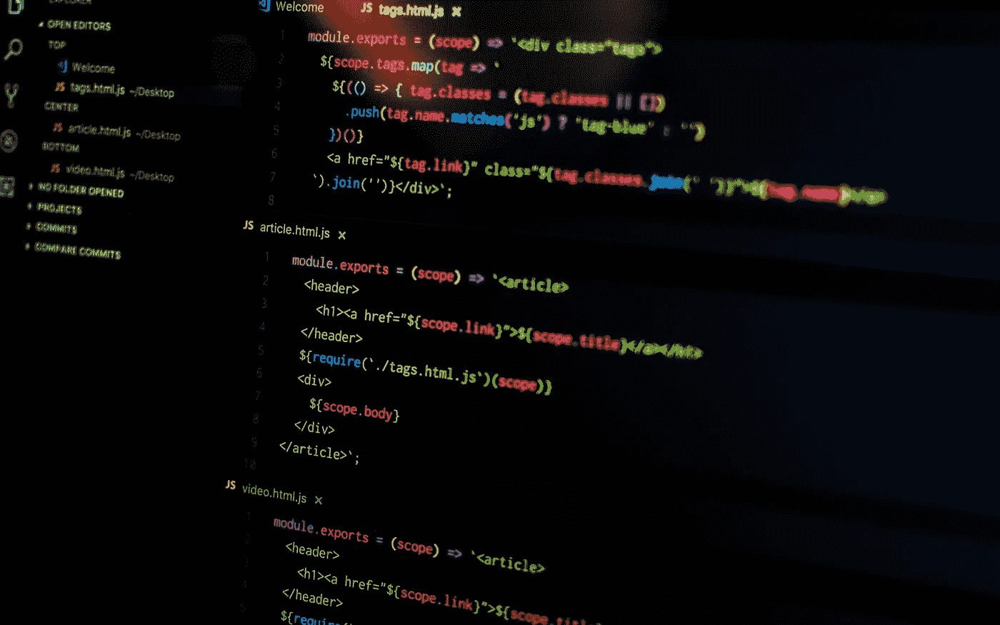
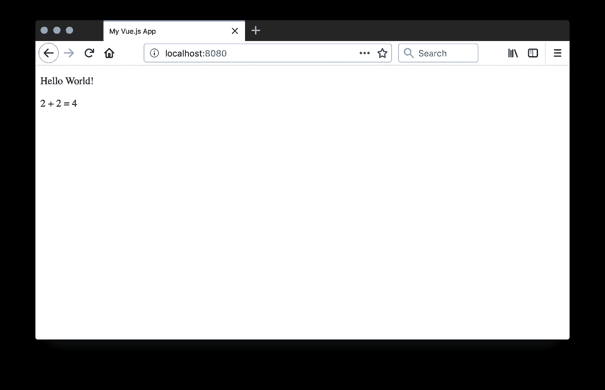
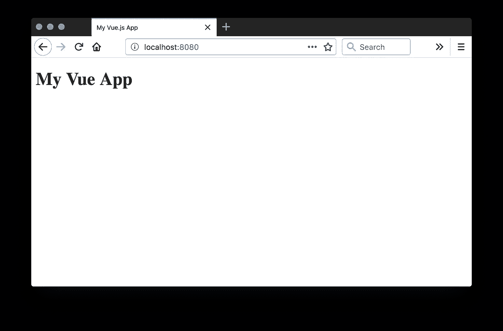

# 渐进式 JavaScript 框架:Vue.js

> 原文：<https://javascript.plainenglish.io/the-progressive-javascript-framework-vue-js-65f106080cb6?source=collection_archive---------5----------------------->



Photo by Pankaj Patel on Unsplash

[**Vue.js**](https://vuejs.org/v2/guide/) 是一个构建网站 ui 的 Javascript 框架。它在许多方面与 Angular 相似，也有某些概念上的相似性。

[](https://www.vuemastery.com/courses/intro-to-vue-js/vue-instance/) [## Vue 实例-Vue . js 简介| Vue 掌握

### 本课讲述了如何从 JavaScript 中获取数据并显示在 HTML 中。

www.vuemastery.com](https://www.vuemastery.com/courses/intro-to-vue-js/vue-instance/) 

您可以 [**下载 vue.js**](https://vuejs.org/js/vue.min.js) 将其包含在您的项目中，或者您可以从 cdn 加载它:

```
<script src="https://cdn.jsdelivr.net/npm/vue"></script>
```

当这个文件加载时，它将把一个名为`**Vue**`的构造函数放入全局范围。您将调用这个构造函数，向它传递一个带有配置信息的对象，以创建一个`**Vue**`实例。写 Vue app 的过程主要是给你传递给`**Vue**`构造函数的对象添加属性和方法。

让我们从用最简单的可以想象的对象来调用它开始。

```
new Vue({
    el: '#main'
});
```

属性告诉 Vue 你的 UI 将出现在哪个元素中。Vue 会自动找到与选择器匹配的元素，并将它存储在实例的一个名为`**$el**`的属性中。元素的内容将被视为模板并自动呈现。

```
<!doctype html>
<html>
<head>
    <title>My Vue.js App</title>
</head>
<body>
    <div id="main">
        <p>{{ 'Hello World!' }}
        <p>2 + 2 = {{ 2 + 2 }}
    </div>
    <script src="https://cdn.jsdelivr.net/npm/vue"></script>
    <script src="script.js"></script>
</body>
</html>
```

给定这个 HTML，并假设对上面的`**Vue**`构造函数的调用放在 script.js 中，可见的结果将是:



包含在`{{`和`}}`中的表达式被自动计算和渲染。不需要手动编译模板、调用它并将结果插入 DOM。这都是为你做的。

通过向传递给`**Vue**`的对象添加一个`**data**`属性，可以指定要在 UI 中呈现的数据。以这种方式指定的所有属性都可以在 HTML 中使用。

```
<div id="main">
    <h1>{{ heading }}</h1>
</div>
```

```
new Vue({
    el: '#main',
    data: {
        heading: 'My Vue App'
    }
});
```



您在`**data**`对象中指定的字段将被复制到您的视图实例中。当然，`**Vue**`实例只是一个 Javascript 对象，您可以用正常的方式直接向它添加属性。但是，如果您通过`**data**`添加它们，它们将成为*反应*属性。如果它们的值在应用程序的生命周期内发生了变化，UI 将自动更新以反映这种变化。因此，您应该使用`**data**`来添加您在 HTML 中使用的任何属性。如果在调用`**Vue**`构造函数时没有属性值，那么应该使用一个占位符值，比如空字符串或`**null**`。

双花括号语法适用于文本节点，但是如果您想在 HTML 属性中使用数据字段，您必须做一些稍微不同的事情。

```
<div id="main">
    <h1 v-bind:class="headingClassName">{{ heading }}</h1>
</div>
```

```
new Vue({
    el: '#main',
    data: {
        heading: 'My Vue App',
        headingClassName: 'heading'
    }
});
```

`**v-bind**`是所谓的*指令*，一个以`**v-**`开头的特殊属性，它的值是一个 Javascript 表达式。Vue 理解许多[指令](https://vuejs.org/v2/api/#Directives)(也可以创建自己的指令)。例如，`**v-if**`可用于有条件地呈现内容，而`**v-for**`可用于呈现项目列表。

```
<div id="main">
    <ul v-if="cities.length > 0">
        <li v-for="city in cities">{{city.name}}, {{city.country}}
    </ul>
</div>
```

```
new Vue({
    el: '#main',
    data: {
        cities: [
            {
                name: 'Berlin',
                country: 'Germany'
            },
            {
                name: 'Istanbul',
                country: 'Turkey'
            },
            {
                name: 'Paris',
                country: 'France'
            }        ]
    }
});
```

`**v-model**`指令用于表单字段，以实现双向数据绑定。表单域将显示指定的属性值。当用户更新表单域的值时，属性的值将自动更新。

```
<div id="main">
    <h1>Hello, <span>{{greetee || 'World'}}!</h1>
    <input type="text" v-model="greetee">
</div>
```

```
new Vue({
    el: '#main',
    data: {
        greetee: ''
    }
});
```


`**v-on**`指令用于向元素添加事件处理程序。通过向传递给构造函数的对象添加一个`**methods**`属性，可以向`**Vue**`实例添加要在事件处理程序(或其他地方)中调用的方法。

```
<div id="main">
    <span v-on:mouseover="emphasize" v-on:mouseout="deemphasize">
        Hello, World!
    </span>
</div>
```

```
new Vue({
    el: '#main',
    methods: {
        emphasize: function(e) {
            e.target.style.textDecoration = 'underline';
            this.count = this.count ? this.count + 1 : 1;
        },
        deemphasize: function(e) {
            e.target.style.textDecoration = '';
            this.logCount();
        },
        logCount: function() {
            console.log(this.count);
        }
    }
});
```

# 生命周期

实例在其生命周期中会经历几个阶段。它们被创建，在 DOM 中呈现内容，在适当的时候更新内容，最后被销毁。Vue 允许您检测这些时刻何时发生，并在它们发生时采取适当的措施。它通过[生命周期挂钩](https://vuejs.org/v2/api/#Options-Lifecycle-Hooks)来实现这一点——您可以将这些方法添加到您的`**Vue**`实例中，当生命周期事件发生时，会自动调用这些方法。例如，如果您想在您的`**Vue**`实例被创建时做一些事情，您可以将一个`**created**`属性添加到您传递给`**Vue**`的对象中，并将其设置为一个函数来做您想做的事情。

当 Vue 处理了您的`**el**`并向您的实例添加了一个`**$el**`属性时，`**mounted**`生命周期钩子就会运行。使用这个生命周期钩子对想要显示的数据进行 HTTP 请求是很方便的。

# 带有 axios 的 Ajax

Vue.js 没有任何内置的工具来发出 ajax 请求。我们将使用一个名为 [axios](https://github.com/axios/axios) 的基于 promise 的库来满足这个需求。

```
<script src="https://unpkg.com/axios/dist/axios.min.js"></script>
```

axios 使用起来相当简单。它有一个发出 GET 请求的`get`方法和一个发出 POST 请求的`**post**`方法。您将 url 作为第一个参数传递给这两个函数。您可以将一个对象作为第二个参数传递给`**post**`，它将被转换成一个 JSON 请求体。

当`**get**`和`post`返回的承诺被解析时，您传递给`**then**`的函数将接收的值是一个表示接收到的响应的对象。它有许多属性，如`**status**`和`**headers**`。通常您最感兴趣的是`**data**`属性，它包含响应的主体。JSON 响应体将被自动解析。

感谢您的阅读！点击查看作者的其他文章:

[](https://medium.com/lucid-archive/how-to-install-nightwatch-js-first-test-with-nightwatch-js-cffd7b96f49f) [## 如何安装 Nightwatch.js？用 Nightwatch.js 进行第一次测试

### 在下面的文章中，我将重点介绍如何安装 Nightwatch.js，你必须知道的内容以及如何进行安装

medium.com](https://medium.com/lucid-archive/how-to-install-nightwatch-js-first-test-with-nightwatch-js-cffd7b96f49f) [](https://medium.com/swlh/software-testing-process-and-levels-of-testing-4274904ce655) [## 软件测试过程和测试级别

### 软件测试过程

medium.com](https://medium.com/swlh/software-testing-process-and-levels-of-testing-4274904ce655) [](https://medium.com/swlh/software-testing-and-methodologies-1fc519c98fdf) [## 软件测试和方法

### 在我的软件测试系列中，我将尝试讨论为什么测试是必要的，这些测试是如何执行的，如何…

medium.com](https://medium.com/swlh/software-testing-and-methodologies-1fc519c98fdf)