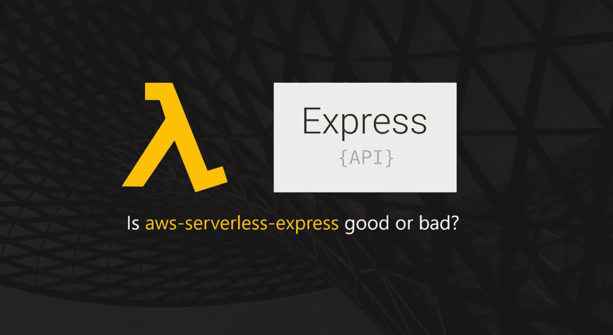
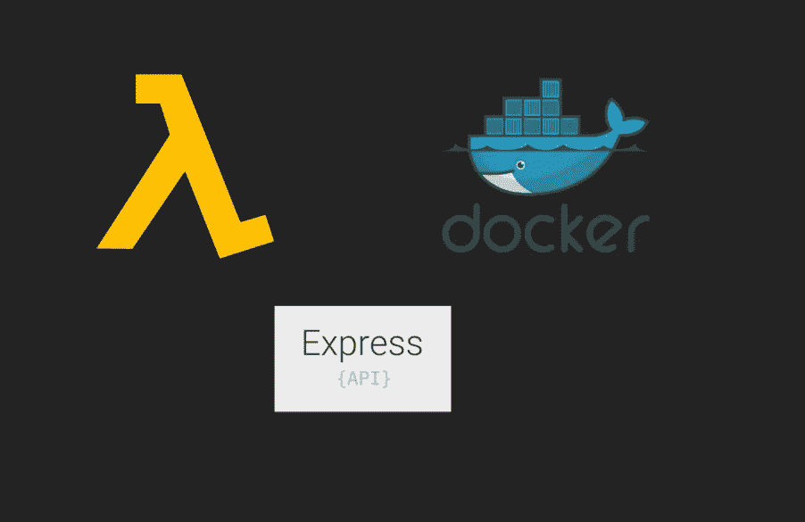
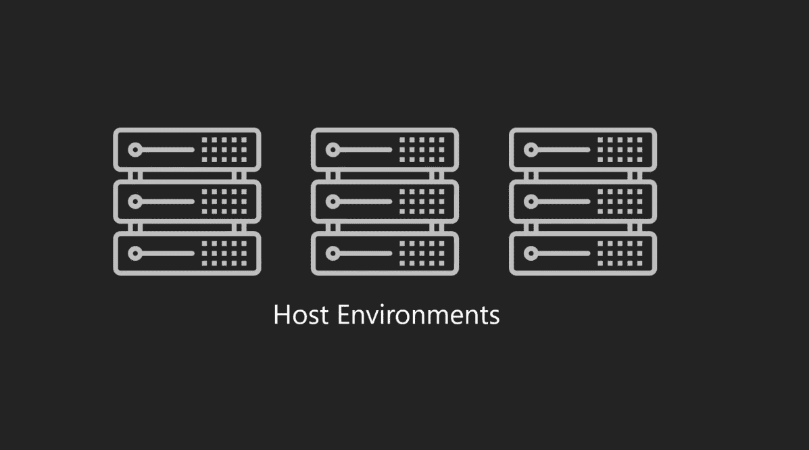
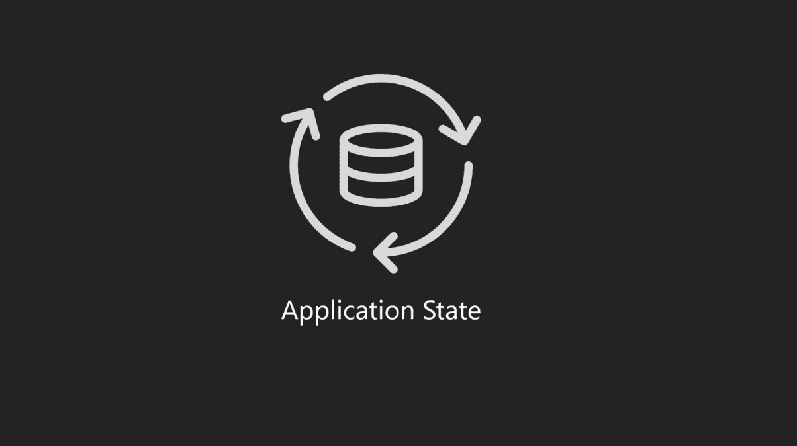

# AWS 无服务器快递的利与弊

> 原文：<https://javascript.plainenglish.io/the-pros-and-cons-of-aws-serverless-express-789996e4be32?source=collection_archive---------0----------------------->

Is aws-serverless-express good or bad for your application’s migration use-case?

[aws-serverless-express](https://github.com/awslabs/aws-serverless-express) 是一个基于 NodeJS 的 API 框架，用于模仿 Lambda 函数中 ExpressJS 框架的路由功能。本文旨在解释使用这个库的利与弊。

## 入门！

你在这里可能是因为:

*   您是 NodeJS 开发人员
*   您已经使用 Express 作为 API 框架
*   您正在考虑将 API 工作负载迁移到基于无服务器的架构
*   你正在寻找 AWS Lambda 的快速入门，但不知何故被新的概念超载，并希望利用这个框架。

如果我设法确定了您的可能身份，那么您来对地方了，因为这篇文章打算从架构师的角度展示关于 [AWS 无服务器快速](https://github.com/awslabs/aws-serverless-express)框架的好与坏。

## **无服务器快递的区别&经典快递**

Knowing the differences between lambda-based and classic express helps in assessing the value that they offer to your architecture

为了让我们对 aws-serverless-express 的优缺点给出一个公平的评估，我们必须理解经典和基于 lambda 的 express 框架之间的关键差异。

# **关键差异**

Understanding differences between the frameworks’ hosting environments will help you get a better understanding of the premises mentioned later in the article

**托管环境**

aws-serverless-express 旨在运行在 Lambda 函数内部，而经典的 ExpressJS 预计运行在虚拟机或 Docker 容器内部。这意味着基于无服务器的 express 不能保持任何形式的会话状态，这是由于在区域的可用性区域之间的λ函数的随机执行位置。

这也意味着基于 lambda 的框架可以更便宜，更具可扩展性，与传统框架相比，它可以提供更高的效率。

The application state plays a critical role in authenticating and authorizing HTTP requests on APIs.

**状态管理**

aws-serverless-express 不管理状态，因为它意味着跨不同的底层 lambda 函数运行。这意味着任何在 API 实例中存储会话相关状态的尝试都将导致 lambda 函数失败。这是因为 lambda 函数在 15 分钟的空闲计算时间后被释放。

## 开始对比吧！

既然我们已经意识到了两个 express 框架之间的关键差异，我们可以开始深入研究使用无服务器 express 的好处和坏处了。

**优势# 1 无服务器 Express 加速迁移**

利用无服务器 express 将现有 API 工作负载迁移到基于无服务器的设计减少了开发人员的工作量，因为:

*   两个框架之间的路由实现是相似的，这导致在两个框架之上构建所需的思维模式之间的认知障碍更低。
*   开发人员不必修改要迁移的应用程序中存在的 HTTP 路由。
*   前端开发人员不必更新所有客户端代码来将 GUI 模块指向新的路径。我将单词“All”设置为粗体，因为我想强调您仍然需要更新一些与 HTTP 相关的代码。特别是 HTTP 方法(PUT、POST、GET、DELETE)。
*   开发人员可以放心地将控制器级代码从现有的基于 express 的 API 复制粘贴到基于 lambda 的 express 中。

**优势 2 减少 SAM 和云形成代码**

由于 serverless express 只要求我们运行一个 lambda 函数，因此 SAM 和云形成代码的定义变得更加简单，因为您不必介意获取基础架构作为代码技能来自动化和配置您的无服务器工作负载。

这也使得 SAM 模板更容易维护，从一个新加入者的角度来看更容易阅读(基本上，任何简洁且适合一个屏幕的代码都很容易维护)。

**优势 3 部署速度更快**

由于 serverless express 不要求您拥有一个以上的 lambda 函数来运行您的所有 API，因此它允许我们实现更快的部署，因为:

*   您只有一组节点模块
*   SAM 只需要在最少/大多数情况下打包/压缩单个 lambda 函数
*   与传统的部署规模**(` artifact ` x ` API count ')+1**相比，SAM 将只上传**两个工件**(模板+ API 代码)

**优势# 4 标准版依赖关系**

因为 serverless express 只需要一组节点模块就可以启动并运行，所以您可以放心，您在 API 代码库中使用的每个库都有一个标准的相同版本。

这有利于您的组织，因为它确保 API 代码库中任何形式的库使用都是标准化的，并且不同版本的框架不会出现意外行为，这些框架通常位于典型的基于 Lambda 的 API 中，其中每个端点都有自己的节点模块集。

**优势 5 请放心，开发人员无法构建有状态 API**

aws-serverless-express 在他们的 [Github](https://github.com/awslabs/aws-serverless-express) 文档中提到它只能在“无状态”模式下运行。对于架构师来说，这是一个好消息，因为您不必从喜欢在服务器内存中存储大对象的开发人员那里寻找任何形式的可伸缩性障碍。

**总结优点**

*   加速现有 API 工作负载向无服务器的迁移
*   它减少了您需要定义的 SAM 和云的数量
*   它提供了更快的部署，因为您只有一组库
*   它允许你的团队拥有一个标准版本的依赖关系
*   你可以放心，开发人员不会构建有状态的 API。

缺点# 1 Restful 动词是一个热门话题

您是否曾经从一个可以使用 POST HTTP 动词访问的 API 中提取过一个对象数组？是不是听起来很别扭？太好了。我想向您介绍您将从消费方(前端开发人员)那里收到的最常见的投诉。

**缺点 2 额外的 372 KB 节点模块**

我刚刚通过 NPM 下载了最新版本的 [aws-serverless-express](https://www.npmjs.com/package/aws-serverless-express) ，在撰写本文时(2020 年 8 月)，它为你提供了额外的 372 KB 的依赖项。你可以很容易地通过使用纯 Lambda 架构来避免这些额外的模块。这是优势部分路由折衷的价格。

**缺点# 3 在纯无服务器堆栈上学习速度较慢**

这是相当明显的，因为你不会得到你的硬脏与萨姆或云的形成。您更有可能阅读这篇文章，因为企业希望您尽快交付转换后的 express API。

缺点 4:你会有一些糟糕的冷启动

aws-serverless-express 强迫你在一个 Lambda 包中吃掉所有的端点，这意味着 Lambda 的内部必须从你的源代码中取出整个源代码来执行一个特定的执行路径。

为特定的端点加载代码是基于无服务器的 API 提供给你的一个很酷的好处，当你在 Lambda 函数中使用内部路由器时，你会失去这个好处。

**缺点 5 重新部署工作代码**

由于 aws-serverless-express 鼓励将多个端点组合到一个 Lambda 包中，这也迫使您重新部署整个代码库，包括在发布之前没有任何现有更改的代码。

如果您没有对您的依赖项进行任何重大的更改或任何形式的更新，这应该不会令人不安。在更新基于 NodeJS 的 API 时，库和依赖项更新是最常见的风险来源。

**缺点 6:被迫更新所有与库相关的现有代码**

如前所述，就搜索所有感兴趣的领域而言，更新您的依赖项是非常痛苦和昂贵的。我想把依赖性更新比作被卡车撞了。它只是强迫你彻底搜索整个 API 代码库。

您可以通过利用代码智能工具(如 [Quod AI](https://www.quod.ai/) )来减轻这种情况。这个令人敬畏的代码智能人工智能工具是如此荒谬，它使无服务器代码搜索变得轻而易举。我强烈推荐你去看看！

**缺点# 7 违反工作代码的风险**

你是否曾经签入过曾经正常工作的代码，但在你没有任何形式的交互的情况下，这些代码突然开始出现故障？经过一番调查后，你意识到是你那调皮的同事打破了僵局？听起来熟悉吗？是的，当你要求开发人员一起编码时，即使没有任何 aws-serverless-express 的参与，这种情况也经常发生！

**缺点 8 代码冲突更经常发生**

基于与前一条类似的原因，当开发人员一起处理一个代码库时，代码冲突会更频繁地发生。当使用这个框架时，纯无服务器提供的分离就失去了。

**总结缺点**

*   使用 AWS serverless express 时，HTTP 动词的笨拙用法是常见的情况。
*   您将获得额外的 372 KB 的节点模块+与启动 serverless-express 内部相关的内存消耗
*   与使用纯 Lambda 堆栈相比，您的开发人员的采用和学习速度会更慢。
*   由于冷启动，您被迫保持实例温暖
*   每次发布更新时，您都在重新部署工作代码，这导致了风险的增加。当第二级依赖关系更新时，爆炸半径也被放大了
*   如果你需要一个新版本的库，lambda 中的所有相关代码都需要一些爱和更新相关的工作
*   当进行类似于旧的整体应用程序维护方式的更改时，您有破坏现有代码的风险。
*   当使用这个框架时，让多个开发人员在您的项目上工作会带来更高的代码冲突风险。

## 这是否意味着我们必须避免使用快速无服务器？

本文介绍的缺点远远超过了优点(几乎是 2 的倍数)。然而，这并不意味着我们应该放弃使用 aws-serverless-express！

当你的团队正在执行一个框架评估时(是请或否评估)，记住一个框架的数据驱动的评估是你手边最强大的工具！

总是倾向于依赖与确保组织战略价值的关键因素(交付时间、开发人员信心、应用程序性能等)相关的硬数字。

我建议您对我在这里列出的每个利弊的权重和影响进行自己的评估。

本文不应该以任何方式对您的决策产生偏见，因为每个应用程序都有其自己的一组有趣的需求、设置和变量。

嘿！我在写一本关于无服务器的书！

 [## allancha 101/无服务器-忍者

### 成为一名无服务器 API 忍者你需要知道的事情我要感谢以下的人，他们训练了我…

github.com](https://github.com/allanchua101/serverless-ninja) 

如果您觉得这篇文章有帮助，我在空闲时间在 Github 上写了大量的代码示例和文章，如果能从社区获得 Golang & Python 示例代码的帮助，我将不胜感激。

想法显然是受欢迎的，我想有一个 excel 表在书中列出了贡献者！

# 您可能对以下内容感兴趣:

 [## 无服务器忍者第 1 部分:无服务器=效率

### 本文旨在解释组织和个人如何从无服务器的高效率中获益…

medium.com](https://medium.com/@ac052790/serverless-ninja-part-01-serverless-efficiency-64cf77915838)  [## 如何使用 S3 生命周期管理和云形成降低 SAM 工件存储的成本

### 在使用 AWS SAM 时，您需要做的一件微妙的事情是将 Lambda 部署包(工件)上传到一个…

medium.com](https://medium.com/@ac052790/how-to-reduce-cost-of-sam-artifact-storage-using-s3-lifecyle-management-cloud-formation-4e18ef0cab1b)  [## 无服务器 Ninja 第 2 部分:使用 AWS Lambda & NodeJS 通过 ChatOps 报告错误

### 这篇文章解释了如何通过 ChatOps 进行错误报告，以及它如何帮助组织更快地对问题做出反应…

medium.com](https://medium.com/@ac052790/serverless-ninja-part-02-reporting-errors-via-chatops-using-aws-lambda-nodejs-8d56dccadc9b)