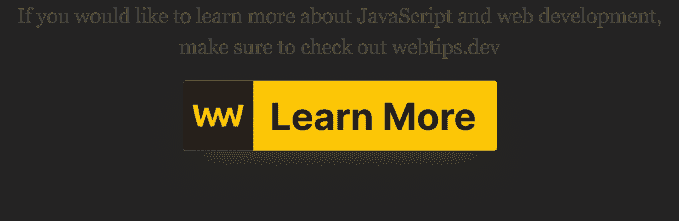

# 设计模式入门——创建自己的 PubSub 库

> 原文：<https://javascript.plainenglish.io/the-pubsub-pattern-33e0e9269bf9?source=collection_archive---------2----------------------->

## JavaScript 中的行为设计模式

Photo by [Taras Chernus](https://unsplash.com/@chernus_tr?utm_source=medium&utm_medium=referral) on [Unsplash](https://unsplash.com?utm_source=medium&utm_medium=referral)

当我们谈论设计模式时，我们指的是软件开发中常见问题的解决方案。

模式是关于可重用性的，可重用性帮助我们解决整个程序中可能出现的架构问题，而不管它是用什么语言实现的。因此，它们并不特别依赖于 JavaScript，而是独立于语言的。

设计模式分为三种不同的类型。这些被称为**创造**、**结构**和**行为**模式。每种类型我们都有很多不同的。本文中我们感兴趣的一个被称为发布-订阅或简称为 PubSub，通常也称为观察者。

它们经常互换使用，但我们必须区分两者，因为它们并不完全相同。但是在深入研究差异之前，让我们看看它应该解决什么样的问题？

# 问题是

当我们的应用程序中有不同的模块，我们想在它们之间共享一些数据，但又不想让它们直接依赖于彼此时，问题就出现了。我们需要一个链接来创建一个通信通道。

给你一个实际的例子，假设我们有一个销售产品的电子商务网站。我们有`filtersModule.js`处理过滤功能，这显示在多个页面上；`listView.js`和`gridView.js`。每当过滤器更新时，我们都希望通知这两个文件有关更改的信息，这样我们就可以相应地更新产品列表。这可以通过多种方式解决，其中之一就是使用 PubSub 或 Observer 模式。现在回到差异。

# 观察者 vs 发布者

为了理解两者之间的区别，我们需要先回顾一些命名约定。

让我们从观察者开始。在观察者模式中，我们有一个**主题**，它跟踪它的依赖者，称为**观察者。**主体可以通知他们任何状态变化，作为回报，观察者可以为我们执行代码块。

在 PubSub 中，我们有一个名为 **publisher** 的发送者，不像在 Observer 模式中，他们不持有对他们的观察者(名为 **subscribers、**subscriber)的任何引用，也不被编程为直接向预定义的接收者发送消息。

强调两者之间的核心区别:在观察者模式中，观察者和主体是相互意识到的，他们被联系在一起。特定的消息被发送给特定的观察者，而在 PubSub 中，发布者和订阅者不需要互相了解。可以订阅任何已发布的活动。在灵活性方面，PubSub 更符合。

*如果你对更多的设计模式感兴趣，在*[*dofactory.com*](https://www.dofactory.com/javascript/design-patterns)*中有一个非常整洁的集合，有定义、图表和深入的例子。*

# 蓝图

让我们深入编码。首先，让我们看看我们想要的最终结果是什么。

每当过滤器发生变化时，我们都希望在`filtersModule.js`中发布一个名为`filterUpdated`的事件，传入一个包含所有与变化的过滤器相关的数据的`data`对象。

在`gridView.js`中，我们通过订阅来监听这个事件，并且我们想要执行一个回调函数，在这个函数中我们对接收到的正在发布的数据进行操作。稍后在我们的应用程序中，每当用户导航到一个没有过滤的页面时，我们也想通过取消订阅`filterUpdated`事件来删除订阅。也就是说，我们已经可以看到我们将需要什么方法。

# 骷髅

从最终结果可以清楚地看出，我们想要一个`EventService`对象，有三种不同的方法；`publish`、`subscribe`和`unsubscribe`。但是这三种方法如何逻辑地结合起来创造我们想要的行为呢？

基本上，我们希望有一个订阅列表，在那里我们跟踪每一个`subscribe`事件。我们还希望有一个关联的`callback`函数，它应该作为第二个参数传递给`EventService.subscribe()`。每当我们用相同的事件名调用 publish 时，我们只是执行与之相关的函数。取消订阅一个事件仅仅意味着我们想从我们的订阅列表中删除它。为了跟踪每个事件，我们将使用一个额外的属性。姑且称之为`subscriptions`。

考虑到这一点，我们来布置一下基本结构:

为了让它更灵活一点，假设我们还想处理多个事件订阅和带有名称空间的事件。当我们对同一个事件有多个订阅时，命名一个事件是很有用的，但是我们希望每个订阅者有不同的功能，我们也希望容易地跟踪它们。您可以在上面的例子中看到这个功能被用于`subscribe`方法。

从现在开始，我们可以开始一个接一个地实现每一个方法，从最困难的部分开始，也就是订阅事件的处理。

# 订阅事件

每当我们进行订阅时，我们想要做的就是在我们的`subscriptions`对象中用事件的名称创建一个新的属性。从一些简单的声明和预检查开始:

我们首先需要从参数中获取事件。从示例中可以看出，我们可以预期它是由空格分隔的事件列表。因此，为了收集所有事件，我们简单地将`event`参数用空格分开。我们还需要注意命名空间事件。为此，我们将使用`eventArray`变量。最后，我们做一个小检查；回调是强制性的，所以如果没有提供回调，我们将抛出一个错误。

下一步实际上是循环遍历我们的`events`数组，并在`subscriptions`下用事件名称本身创建一个节点。

如果没有提供名称空间，我们可以让它的值为`undefined`。基于这一点，我们可以用下面的代码扩展我们的 subscribe 方法:

我们再次做了一些预防措施。我们首先在第 10 行检查当前索引是否是一个命名空间事件。在这种情况下，我们可以用它填充我们的`eventArray`变量，例如:`event.namespace`变成`['event', 'namespace']`。

接下来，我们需要检查我们是否已经订阅了该事件。这是我们在第 14 行做的。如果没有，我们为它创建一个空数组。对于名称，我们或者使用`eventArray[0]`，它保存了命名空间事件的基本名称，或者在它未定义的情况下，我们使用`singleEvent`。现在每当我们做`subscribe('event')`时，我们应该在`subscriptions`对象上获得一个`event`属性。

作为第 18 行的最后一步，我们希望确保名称空间是惟一的，并且不会被错误地覆盖。通过遍历我们的订阅列表并检查其中一个实例名称空间是否与我们传递的`event`参数中的名称空间匹配，我们可以消除以下情况:

剩下要做的就是创建订阅的主体，这可以用 3 行代码完成:

这是我们从第 24 行到第 27 行所做的事情。我们创建一个新对象，并赋予它一个`callback`属性，该属性将是函数参数中提供的回调。我们还给它一个`namespace`属性，它可以是`undefined`或者是我们为事件提供的名称空间。最后一步，我们清空了`eventArray`变量，这样我们可以在下一次迭代中重用它。现在我们可以开始实现取消订阅功能了。

# 取消订阅事件

就像认购一样，退订也可以从同一个基数开始；

我们首先基于`event`参数创建一个`events`数组，我们还声明了一个`eventArray`变量，这次没有任何值。然后我们开始循环我们的事件，并在每次迭代中将当前事件名赋给`eventArray`。

接下来，我们需要检查订阅是否存在，如果存在，我们需要遍历事件，因为我们可以对同一个事件有多个订阅。这给我们留下了:

在第 8 行，我们检查我们想要取消订阅的事件是否确实存在。由于我们拆分了在第 2 行得到的`event`参数，我们可以确保`currentEvent`将是一个数组，因此我们将事件名称称为`eventArray[0]`，即使我们没有对`currentEvent`变量使用 split。之后，我们可以开始循环播放。这是必要的，因为我们可能只想删除命名空间实例，而不是整个订阅本身。为了实际检查我们是否将要删除一个命名空间事件，我们需要一个 if 语句来检查`eventArray[1]`是否存在。如果是，我们知道我们正在取消订阅一个命名空间事件。

否则，我们可以删除`this.subscriptions`中的节点。之后我们还需要`break`才能从循环中跳出。剩下要做的就是检查当前订阅实例的`namespace`，如果它与`eventArray[1]`中的值匹配，我们就在`j`的索引处拼接数组。这是在第 13 行完成的。

我还包括了另一个 if 语句，从第 16 行开始。它的工作是确定给定订阅是否只剩下一个实例。如果我们要删除那个唯一的实例，我们实际上可以删除整个事件本身，这意味着:

最后一步，我们现在要做的就是实现发布事件的功能，这样就可以触发相应的回调函数。

# 发布事件

如果你做到了这一步，恭喜你，你已经度过了最困难的阶段！🎉可能整个等式中最简单的部分就是发布事件。我们所要做的就是遍历我们的`subscription`列表，如果我们找到传入的事件名称，我们就用传入的数据执行它的回调属性。

对于循环，我们可以使用一个简单的`for ... in`语句。为了确保我们只遍历它自己的属性，我们可以把所有的东西都放在一个 if 里面。这就是 line:3 应该做的事情。然后在第 4 行，我们可以检查传入的事件是否与当前键匹配，如果匹配，调用`callback`属性并传入从函数的第二个参数得到的`data`。

如果一切都做得正确，在你的控制台中运行`EventService.publish('filterUpdated', data);`应该会立即给你一个带有传入数据的`console.log`。

到目前为止，您应该对如何实现发布-订阅行为设计模式有了很好的理解。恭喜你走到这一步！🙌在结束之前，我想给你一些关于设计模式的建议。

# 要记住的事情

首先也是最重要的，不要让模式成为一把寻找钉子的锤子。不引入新模式就能解决的问题，就应该解决。

凡事都有取舍，模式也是如此。虽然它在很多情况下可以帮助您，但从负面来看，它增加了代码的复杂性和整个包的大小。

你应该总是努力让你的代码尽可能的简单，*(记住 KISS 原则——保持简单，笨蛋)*并且只在你看到需要的时候使用一个模式。

然而，如果你这样做了，不要重新发明轮子，使用已经存在的模式作为解决方案。现在我将继续发表这个故事。☕️

喜欢这篇文章吗？如果有，通过 [**订阅我们的 YouTube 频道**](https://www.youtube.com/channel/UCtipWUghju290NWcn8jhyAw?sub_confirmation=true) **获取更多类似内容！**

*更多内容看* [***说白了. io***](https://plainenglish.io/)