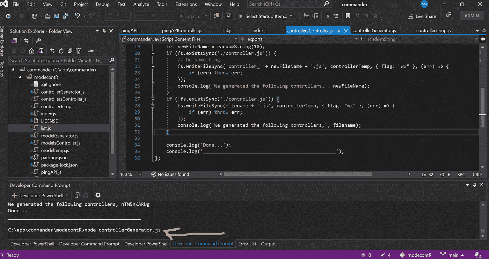
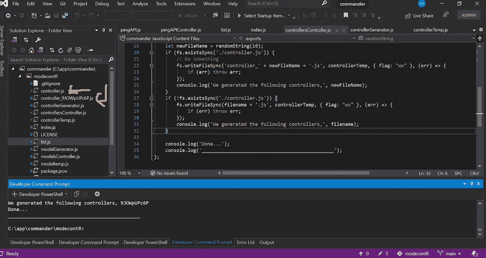
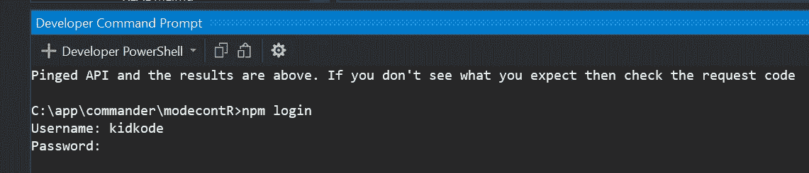
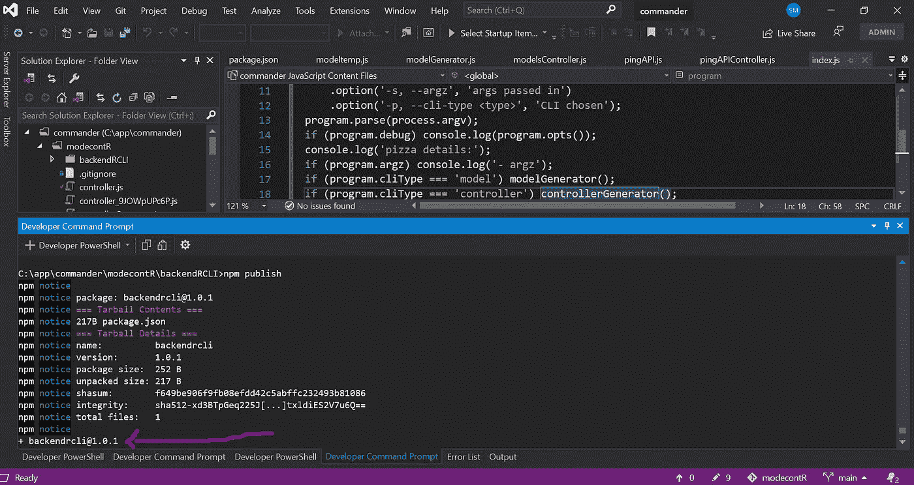
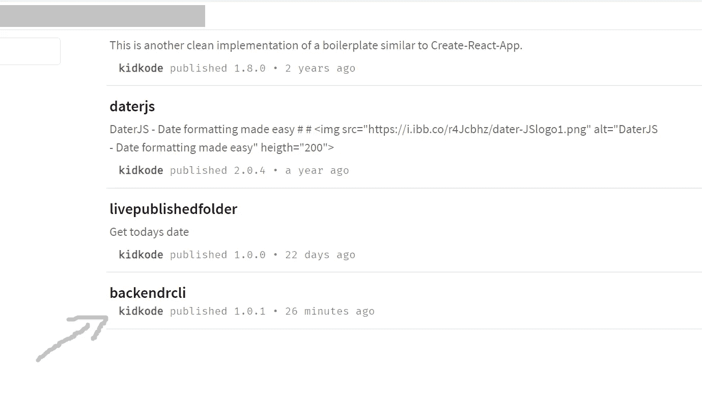
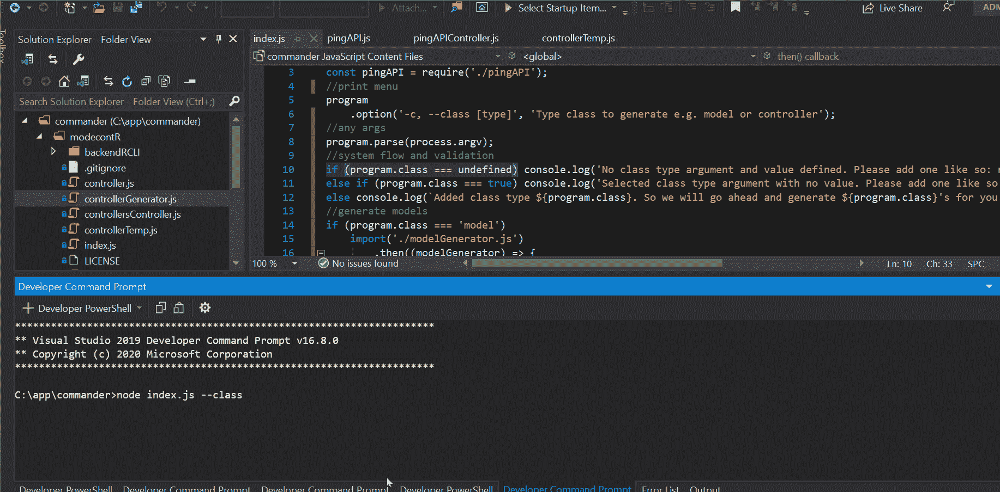

# 为您的应用开发模型和控制器的最快方法

> 原文：<https://javascript.plainenglish.io/the-quickest-way-to-develop-models-and-controllers-cec8273b2522?source=collection_archive---------15----------------------->

## 以及项目的任何其他模板、类或代码单元

让我们用 NodeJS 创建一个有用的工具。

在我开始之前，你可能已经注意到我在 Windows 10 上编码，所以我的一些步骤可能会与 Linux 或 iOS 略有不同。此外，名称**模块**和**包**可以互换使用，在上下文中大致表示相同的意思。

因此，在本文中，我将解释如何构建您自己的模块框架，我们将设计和构建该框架来帮助您生成后端层，如模型和控制器以及中间层类。即使您需要快速生成视图(例如 HTML 页面或部分视图等。)这个工具也可以帮你做这件事——因为我们可以内置它。

我们甚至会通过展示如何为它设计一个菜单来提供一个额外的 cookie，这样对于经验较少的程序员来说它非常容易使用，他们不必通过自己单独的命令来生成模型或控制器，而是可以遵循一个易于使用的菜单。

# **属地**

是的，我们可以同意最好的工具或模块依赖于其他人，通常工程师喜欢在开源项目中互相帮助，但是在我们的指南中，我们只使用一个依赖项，因为这是我们唯一需要的，那就是[Commander](https://www.npmjs.com/package/commander)——查看这里了解更多信息。

让我们看看我在 NPM 上的一个名为 randomusernames 的模块，看看它依赖于什么。

[](https://www.npmjs.com/package/randomusernames) [## 随机用户名

### 获得一个随机的用户名，可用于任何类型的应用程序

www.npmjs.com](https://www.npmjs.com/package/randomusernames) 

在上面的模块中，如果您查看“dependency”选项卡，您会看到我的 randomusernames 模块依赖于另一个名为 unique-random-array 的模块，在该模块中，它也有一个依赖项，您会看到它是 unique-random 模块。

那么，为什么这种情况会在模块中频繁发生呢？底线是谁想重新发明轮子！


Don’t reinvent the wheel

# **为什么自动生成模型和控制器等文件？**

在强类型语言中，如 TS 或 Java，有时手工创建许多模型和控制器是非常耗时的。是的，IDE 可能会为您设置一些开始，但项目总是增长，并且编写一个又一个模型或一个又一个接口，很容易疲劳并出错，特别是在为每个节点或数据列键入类型时。这就是 generators 的优势所在，我希望这将加快你的团队的开发时间，因为手动创建上述内容花费的时间更少，而不管正在哪个层上工作或者项目处于哪个阶段。

我的目标是给出好的真实世界的例子，但是你可以随意调整每个代码样本来满足你的喜好。让我们开始吧，任何问题，比如通常请在下面随意评论。

# **构建**

我们有一个名为 Commander 的主要依赖项，因此我们将在全球范围内安装它—

1.  设置 VS 代码—打开 VS 代码，然后打开(视图>资源管理器)。文件>打开文件夹>通过点击新文件夹>然后选择文件夹来创建新文件夹。
2.  安装 commander——在 VS 代码终端中输入下面的命令，然后按 enter 键。点击此处了解详情>[https://www.npmjs.com/package/commander](https://www.npmjs.com/package/commander)

```
npm install commander
```

# 3.**设计和逻辑** —创建 3 个文件

然后，在我们刚刚创建的同一个目录中，你需要创建第一个目录——这是 **controllersController.js** ，它的代码如下。复制粘贴并保存。

controllerGenerator.js

控制器 Temp.js

4.现在，通过运行以下命令在本地测试 CLI

```
node controllersGenerator.js
```

5.在当前目录中，将会创建一个名为 controller.js 的新文件。如果你再次运行第 4 步，那么新的文件将继续创建，前缀为 controller +一个随机生成的字符串，如 so controller 4 nd 0 MST 等。如下图所示:



接下来，让我们做同样的事情，创建一个 CLI 来生成模型。同样，我们需要 3 个文件，所以将它们添加到同一个目录中，每个文件都有自己的代码和名称，如下所示:

modelsController.js

模型生成器. js

模型温度

如果您现在通过运行来测试模型的生成

```
node run modelGenerator.js 
```

然后将生成一个新的模型文件。在随后的运行中，它们将继续生成，并带有前缀 model +随机生成的字符串，如 so model 4 nd 0 MST 等。

**6。打包，打包，然后发布到 NPM**

现在，我们的工具在本地工作，让我们把它打包成包(模块),这样我们就可以把它推到 NPM，然后我们可以在另一个项目中使用它，也可以让全世界的人在他们自己的项目中安装和使用它。

在继续下一步之前，您需要一个 NPM 帐户，如果您还没有，请在此 [NPM](https://www.npmjs.com/) 注册。

6.1 通过键入以下命令从命令行登录到 [NPM](https://www.npmjs.com/)

```
npm login
```

6.2 在提示符下，输入您的用户名、密码和电子邮件地址，然后按回车键。



6.3 如果成功，您将会看到一条消息，说明**以 kidkode 的身份登录**[**https://registry.npmjs.org/**](https://registry.npmjs.org/)**，其中 **kidkode** 将被替换为您自己的用户名。**

**6.4 接下来，您希望在同一个开发目录中为您的模块的已发布版本创建一个新的文件夹，因此运行下面的命令—使用您认为合适的任何名称—在我们的示例中，我们选择了下面的 modecontrollerCLI:**

```
md modelcontrollerCLI
```

**6.5 导航到新创建的目录**

```
cd modelcontrollerCLI
```

**6.6 通过在终端中运行以下命令，为软件包创建一个新的 NPM 软件包文件**

```
npm init
```

**6.7 构建和发布到 NPM 的时间:**

```
npm publish
```

**如果操作正确，您将看到这样的响应，最后一行是您的包名和版本号，在图像中我们有一个指向它的箭头:**

****

**你的模块现在可以在 npmjs.org 上使用，就像我的一样，如下所示，名为 backendrcli:**

****

**在这里，您可以像安装任何其他公共软件包一样，使用以下命令来安装该软件包:**

```
npm install backendrcli
```

# ****添加菜单****

**因此，我们已经通过命令**节点运行 controllerGenerator.js** 或**节点运行 modelGenerator.js** 运行了 CLI，但是添加一个菜单如何，这样我们就可以将生成工具和最终用户完全分开？为此，我们可以添加一个菜单，如下所示:**

1.  **在同一个项目目录中创建新的 Index.js 文件，并添加以下代码**

**现在，我们有了一个强大的发电机控制系统，只有领导或高级工程师应该维护，但团队中的其他人也可以使用，无需太多的编码经验。**

**这将确保开发团队的标准始终得到遵守，因为团队从现在开始可以使用该工具来生成新的类和文件。**

**这里有一个视频，介绍了如何通过 CLI 菜单使用上的工具。**

****

**How to automate model and controller and API testing via a generator tool**

**希望你喜欢，所以请鼓掌和分享！**

# **简单的 WEB 开发指南**

**如果你目前正在转行，想成为一名全栈开发人员，那么你会喜欢我的新电子书— [**NO BS:让我快速成为一名 Web 开发人员**](https://gumroad.com/l/vfUou)**