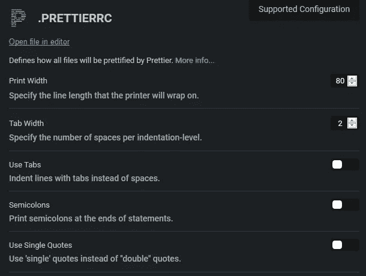

# JavaScript 中“单引号”和“双引号”的真正区别

> 原文：<https://javascript.plainenglish.io/the-real-difference-between-single-quotes-and-double-quotes-in-javascript-3d00bf720bcd?source=collection_archive---------0----------------------->

## JavaScript 中的字符串应该用`‘ ’`还是`“ ”`？答案让我大吃一惊:两个引号字符除了在转义的时候是一样的。


Photo by [John Fornander](https://unsplash.com/@johnfo?utm_source=medium&utm_medium=referral) on [Unsplash](https://unsplash.com?utm_source=medium&utm_medium=referral)

> **“在 JavaScript 中，单引号和双引号在*中的行为与*完全相同。”—**[](https://medium.com/u/14f0f179c1df?source=post_page-----3d00bf720bcd--------------------------------)[cloud boost](https://blog.cloudboost.io/js-bytes-double-quote-vs-single-quote-vs-backtick-44e36c390dbd)中的马修·霍尔曼

B oth 单引号(`''`)双引号(`""`)在 JavaScript 中经常使用，用来创建一个[字符串文字](https://developer.mozilla.org/en-US/docs/Web/JavaScript/Reference/Global_Objects/String)。

文字是值的另一个单词，与引用相反，引用由变量名表示。

JavaScript 中单引号(`''`)和双引号(`""`)的使用只有一个区别，它归结为您必须使用反斜杠(`\`)字符来转义哪个引号字符:`\'`或`\"`。


Photo by [João Silas](https://unsplash.com/@joaosilas?utm_source=medium&utm_medium=referral) on [Unsplash](https://unsplash.com?utm_source=medium&utm_medium=referral)

# 单引号“转义”单引号'

当使用单引号(`''`)创建字符串文字时，单引号字符需要使用反斜杠(`\'`)进行转义。


Photo by [Priscilla Du Preez](https://unsplash.com/@priscilladupreez?utm_source=medium&utm_medium=referral) on [Unsplash](https://unsplash.com?utm_source=medium&utm_medium=referral)

# "双引号'转义'双引号"

当使用双引号`""`创建字符串文字时，双引号字符需要使用反斜杠`\"`进行转义。


Photo by [frank mckenna](https://unsplash.com/@frankiefoto?utm_source=medium&utm_medium=referral) on [Unsplash](https://unsplash.com?utm_source=medium&utm_medium=referral)

# `"Empty" === 'Empty'`

E 两个相邻的双`""`或单`''`引号可以表示一个不包含任何字符的[空字符串](https://www.wikitechy.com/tutorials/javascript/check-for-an-empty-string-in-javascript)。


Photo by [Mimi Thian](https://unsplash.com/@mimithian?utm_source=medium&utm_medium=referral) on [Unsplash](https://unsplash.com?utm_source=medium&utm_medium=referral)

# “反斜线”是更好的解决方案吗？

一个叫做模板文字、反斜线文字或反斜线的 ES6 特性使用反斜线````代替单引号`''`或双引号`""`。

> 模板文字是允许嵌入表达式的字符串文字。您可以使用多行字符串和字符串插值功能。”— [MDN 文档](https://developer.mozilla.org/en-US/docs/Web/JavaScript/Reference/Template_literals)

[反斜线(](https://thebittheories.com/the-3-advantages-of-backtick-literals-in-javascript-f6beade4a9cf) `[` `](https://thebittheories.com/the-3-advantages-of-backtick-literals-in-javascript-f6beade4a9cf)` [)文字有三大优势](https://thebittheories.com/the-3-advantages-of-backtick-literals-in-javascript-f6beade4a9cf):

1.  更简单的字符串串联(“变量插值”)
    `"string "+variable`变成了``string ${variable}``
2.  无需转义(`\`)单引号或双引号
    `"\"Hello World!\""`变成``"Hello World"``
3.  多行代码不带新行字符(`\n` )
    `"Hello\nWorld!"`变为``Hello
    World``

反斜线也更适合 HTML:

反斜线文字和其他字符串文字一样快，不管你是否使用 Babel 编译它们。那么为什么不用反斜线````来代替呢？😊


Photo by [Greg Raines](https://unsplash.com/@lionsdenpro?utm_source=medium&utm_medium=referral) on [Unsplash](https://unsplash.com?utm_source=medium&utm_medium=referral)

# 不要忘记 JSON

J avaScript 对象表示法 [(JSON](https://www.json.org/) )，轻量级数据存储格式，只允许双引号。

如果我碰巧在 JavaScript 和 JSON 文件之间来回复制，使用双引号可以帮助我保持一致。

这很少见——我只是尽量记住不要在 JSON 中使用单引号。

当在 JavaScript 中处理 JSON 文件时， [stringify()和 parse()](https://medium.com/javascript-in-plain-english/how-to-use-stringify-and-parse-in-javascript-6b637b571a32) 函数已经知道了双引号:

从代码片段中可以看出，单引号破坏了 JSON 解析。

技术原因与 JSON 规范( [RFC 7159](https://tools.ietf.org/html/rfc7159#page-8) )有关，该规范要求将双引号作为 JSON 字符串字符。


Photo by [Kyle Broad](https://unsplash.com/@kylebroad?utm_source=medium&utm_medium=referral) on [Unsplash](https://unsplash.com?utm_source=medium&utm_medium=referral)

# 3 个都用有什么问题？

是的，在包含双引号的字符串中使用" "默认情况下，""在包含变量或多行的字符串中使用""不会有任何问题。

这归结于个人偏好，尽管许多人游说选择一个并在创建 JavaScript 字符串时一致地使用它。

例如， [Airbnb 的风格指南](https://github.com/airbnb/javascript#strings--quotes)更喜欢单引号(')，避免双引号(" ")，并且保守地使用反斜线文字(` `):

> [6.1](https://github.com/airbnb/javascript#strings--quotes) 对字符串使用单引号`''`。— [Airbnb](https://github.com/airbnb/javascript#strings--quotes)


Photo by [Wellington Sanipe](https://unsplash.com/@wellingtonsanipe?utm_source=medium&utm_medium=referral) on [Unsplash](https://unsplash.com?utm_source=medium&utm_medium=referral)

# 使用 ESLint 保持一致性

如果 JavaScript 中一致的报价风格对你很重要，就像对 Airbnb 的工程师一样，那么用 [ESLint](https://eslint.org/) 很容易解决:

*   ESLint `[quotes](https://eslint.org/docs/rules/quotes.html)`规则可能要求使用双引号(默认)、单引号或反勾号。
*   引号规则还可以强制一种类型的引号，除非字符串包含引号字符，否则必须对其进行转义。
*   最后，ESLint 可能需要单引号或双引号，但仍然允许字符串使用反斜线文字。


Photo by [Samule Sun](https://unsplash.com/@samule?utm_source=medium&utm_medium=referral) on [Unsplash](https://unsplash.com?utm_source=medium&utm_medium=referral)

# 用漂亮点的，别担心了

使用 ESLint 保持报价风格一致的一个更简单(或支持)的解决方案是使用[更漂亮的](https://prettier.io/)进行自动格式化。



打开漂亮，默认是双引号，但是要求单引号只是一种切换——至少在使用漂亮的时候。

还有一个 [VSCode 扩展可用于更漂亮的](https://marketplace.visualstudio.com/items?itemName=esbenp.prettier-vscode)。


Photo by [freestocks.org](https://unsplash.com/@freestocks?utm_source=medium&utm_medium=referral) on [Unsplash](https://unsplash.com?utm_source=medium&utm_medium=referral)

# 我个人的偏好

我倾向于在我的代码中混合使用双引号和反斜线文字，尽管我曾经考虑过只使用反斜线文字。

我用的是比较漂亮的，默认双引号(" ")设置，我习惯了。

虽然我理解编码中一致性的有用性，但我不认为引号字符在总体方案中有太大的关系。

如果有的话，我们应该始终如一地选择反斜线文字(` ` ` ),因为它们在插值和多行字符串方面有优势。


Photo by [Eli DeFaria](https://unsplash.com/@elidefaria?utm_source=medium&utm_medium=referral) on [Unsplash](https://unsplash.com?utm_source=medium&utm_medium=referral)

# 额外资源

*   [Panu pitkmki](https://medium.com/u/e840d975f134?source=post_page-----3d00bf720bcd--------------------------------)在 ByteArcher 上写了[关于 JavaScript 中的引用风格:](https://bytearcher.com/articles/single-or-double-quotes-strings-javascript/)

[](https://bytearcher.com/articles/single-or-double-quotes-strings-javascript/) [## JavaScript 中的字符串应该使用“单引号”还是“双引号”

### 您已经看到了在 JavaScript 中用于编写字符串的“单引号”和“双引号”。你想知道他们是否…

bytearcher.com](https://bytearcher.com/articles/single-or-double-quotes-strings-javascript/) 

*   [Slate](https://slate.com/human-interest/2014/10/single-quotes-or-double-quotes-its-really-quite-simple.html) 用简单的英语解释了单引号和双引号的用法:

[](https://slate.com/human-interest/2014/10/single-quotes-or-double-quotes-its-really-quite-simple.html) [## 单引号还是双引号？真的很简单。

### 如果你是美国人，使用引号再简单不过了:任何时候都要用双引号，除非…

slate.com](https://slate.com/human-interest/2014/10/single-quotes-or-double-quotes-its-really-quite-simple.html) 

*   [Tania Rascia](https://medium.com/u/d2cf0a29e5ba?source=post_page-----3d00bf720bcd--------------------------------) 在 DigitalOcean 写了[关于如何使用 JavaScript 字符串:](https://www.digitalocean.com/community/tutorials/how-to-work-with-strings-in-javascript)

[](https://www.digitalocean.com/community/tutorials/how-to-work-with-strings-in-javascript) [## 如何在 JavaScript | DigitalOcean 中使用字符串

### 字符串是一个或多个字符的序列，可以由字母、数字或符号组成。字符串在…

www.digitalocean.com](https://www.digitalocean.com/community/tutorials/how-to-work-with-strings-in-javascript) 

*   W3Schools 列出了 JavaScript 中的所有反斜杠(转义)字符:

[](https://www.w3schools.com/js/js_strings.asp) [## JavaScript 字符串

### 组织良好，易于理解的网站建设教程，有很多如何使用 HTML，CSS，JavaScript 的例子…

www.w3schools.com](https://www.w3schools.com/js/js_strings.asp) 

Photo by [Paolo Nicolello](https://unsplash.com/@paul_nic?utm_source=medium&utm_medium=referral) on [Unsplash](https://unsplash.com?utm_source=medium&utm_medium=referral)

德里克·奥斯汀博士是《职业规划:如何在 6 个月内成为一名成功的 6 位数程序员》一书的作者，该书现已在亚马逊上出售。