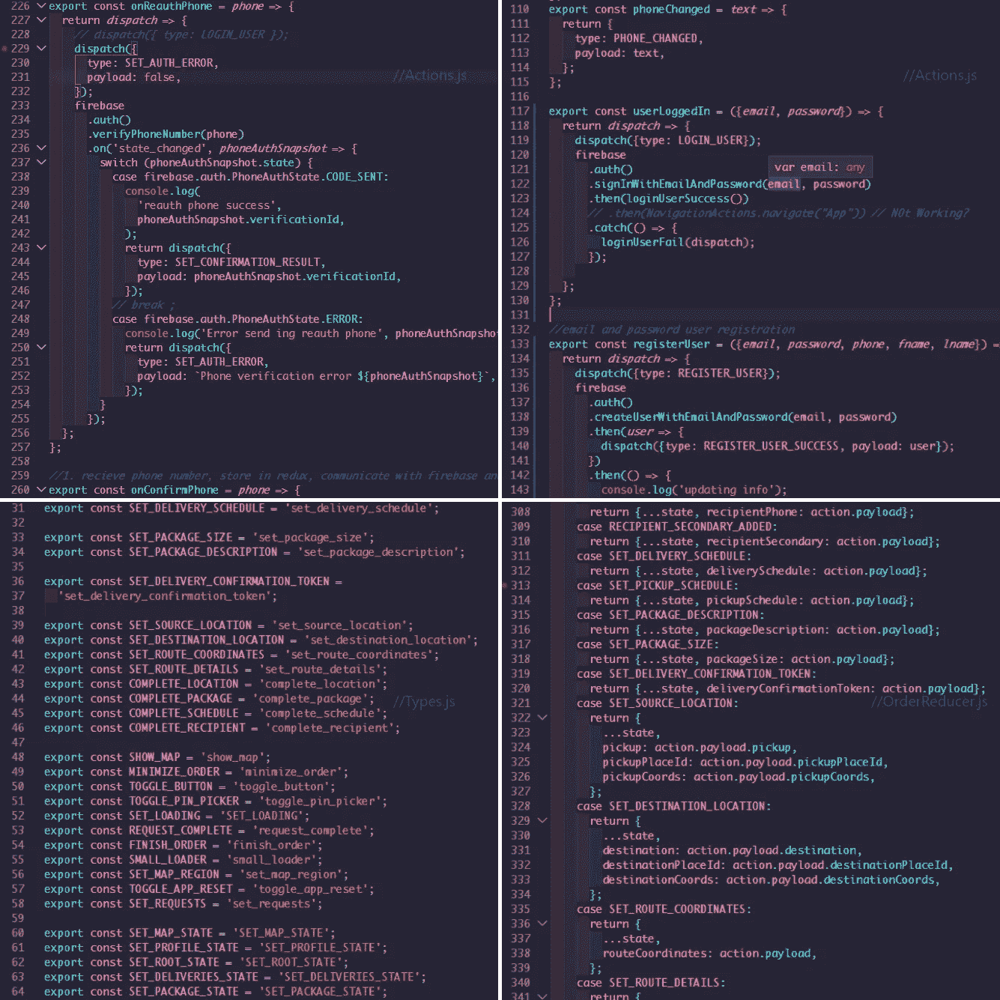
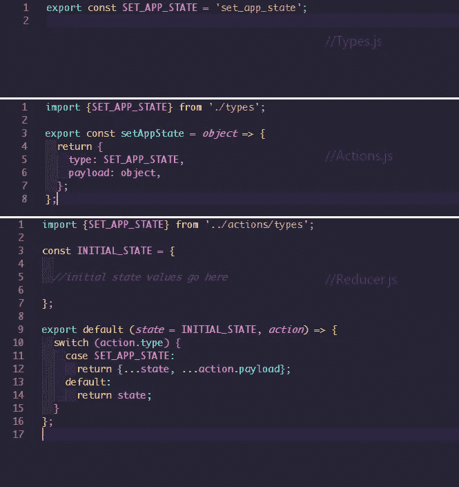

# Redux 快捷方式；一个动作，一个减速器，不调度！

> 原文：<https://javascript.plainenglish.io/the-redux-shortcut-654a5c6157ff?source=collection_archive---------6----------------------->

# 开始

当我第一次使用 redux 时，它看起来是这样的



The near infinite setup; Over 60 types, dispatch after dispatch and an AI’s worth of state cases

天哪，这是一个麻烦！在十几个文件之间切换来创建新的动作、设置新的类型和向 reducer 添加新的案例，仅仅是为了管理一个新的 redux 状态！然后是调度！当你用一个动作处理一个异步函数时，像路由到应用程序的一个新的部分这样简单的事情就会变得非常复杂。但如果有更简单的方法来处理这一切，我可能只是偶然发现了它。那么我们如何从上面的蜘蛛网到下面的这个呢



The finite setup; One action, one reducer, no dispatch

**这不是一个真正的 redux 教程，所以我将继续下去，并假设你已经知道如何设置**

# 设置织机。

因此，这个“loom”设置的思想是使用单个动作来接受数据对象，并在组件和减速器之间建立联系。一个动作，一种类型。会是这个样子；

```
//types.js
export const SET_APP_STATE = 'set_app_state';//action.jsimport {SET_APP_STATE} from './types';export const setAppState = object => {return {type: SET_APP_STATE,payload: object,};};
```

就这样，我们完成了我们的行动和类型。很好很容易。

现在是我们心爱的减速器。

```
//Reducer.jsimport {SET_APP_STATE} from '../actions/types';const INITIAL_STATE = {* some initial state *};export default (state = INITIAL_STATE, action) => {switch (action.type) {case SET_APP_STATE:return {...state,  ...action.payload};default:return state;}};//You can choose to get rid of the switch case since its only one action and one type but i'll maintain it for familiarity's sake.
```

我们的减速器怎么样了？每当我们的 setAppState 操作被调用时，我们展开 redux 状态的当前内容，然后展开 action.payload 的新内容——替换冲突的旧状态内容，并适当地添加任何新值。老样子老样子。

现在让我们来看看这是如何与一个示例组件结合在一起的。

```
//Login.js//import action//export with connect//mapStateToProps<TextInputvalue={this.props.appState.displayName} //access 'displayName' value in redux stateplaceholder="User name"onChangeText={ userName => {this.props.setAppState({ //action creator to modify redux statedisplayName: userName //set new 'displayName' value in redux state});}}/>
```

眼熟吗？setState？setAppState？明白了吗？因此，对于这样一个简单的文本输入，我们用

```
this.props.setAppState({stateKey: stateValue})
```

并从我们的 redux 状态中读取它的值

```
this.props.appState.stateKey
```

应用程序中的所有组件。看起来不错吧？就像使用 react 组件级 setState()和 this.state 命令一样。

# 再见调度！

但这还不是全部。除了这是一个更简单和相对更*有限的*类型的设置，我最喜欢的部分是它完全消除了调度，同时让我们更好地控制我们的状态。例如，考虑这个用户认证功能

```
//Login.jsloginUser() {this.props.setAppState({loading: true}); //use action creator to set loading flag to true and start any activity indicatorsconst {email, password} = this.props.appState; //get email and password values from redux state bucketfirebase.auth().signInWithEmailAndPassword(email, password).then((user)=>{this.props.setAppState({// disable loader and set currentUser.displayName to redux stateloading: false,displayName: user.displayName,});this.props.navigation.navigate('Splash')}.catch(error =>this.props.setAppState({errorMessage: error.message,// set error messages to redux stateloading: false,// stop loading/ disable activityIndicator}),);}
```

通常，像这样的函数会涉及到大量的分派，将类型和有效负载发送到我们的 reducer，以便在代码块的不同级别修改我们的状态。然而，以这种方式设置 redux 意味着像这样的函数不再需要独特的动作创建者、分派和 redux cases 来管理它们自己的状态，而是可以在我们的组件中编写成普通的帮助器方法。

# 问题是。

尽管这一切听起来很可怕，但有一个小问题。与 React 的组件状态管理能够递归处理嵌套对象和数组不同，我还没有完全弄清楚如何类似地分散每个嵌套对象或数组，但我想现在这是社区的问题。然而，目前我通常用两种方法中的一种来回避这个问题。

```
//option 1this.props.setAppState({object: {...this.props.appState.object,modifiedKey: modifiedValue,newKey: newValue}})
```

一种方法是在向嵌套元素添加任何新的或修改的值之前，将嵌套元素的当前内容扩展到新的对象/数组中。这对于一个浅窝来说很好，但是如果你不得不去更深的地方，下一个选项会做得更好。

```
//option 2//new type//new action//new case
```

这是我决定保持减速器开关箱格式的另一个原因。对于深度嵌套的元素，我们可以选择多创建一个动作、类型和案例来管理它们的状态，如果我们需要在它们内部执行大量操作，这是最理想的。

我希望能够像 react 本地组件级状态管理一样进行设置，这允许嵌套而没有这些额外的复杂性，但我可能只是一个新手，无法独自解决所有问题。

就我个人而言，我认为我要么一开始使用 redux 是完全错误的，要么这是我们在使用 React Native 进行 redux 状态管理时可以用来缓解一些压力的东西。无论哪种方式，我期待收到 redux 专家/资深人士对这种设置的利弊的回应。

黑客快乐！

演示项目 GitHub

[https://github.com/Bimpong/reduxShortcut](https://github.com/Bimpong/reduxShortcut)