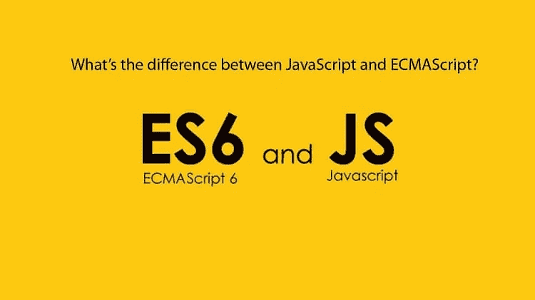
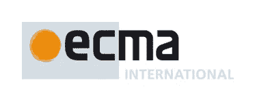

# JavaScript 和 ECMAScript 之间的关系

> 原文：<https://javascript.plainenglish.io/the-relationship-between-javascript-ecmascript-6d17706a576?source=collection_archive---------2----------------------->

Credits: [FreelancingGig](https://www.google.com/url?sa=i&source=images&cd=&cad=rja&uact=8&ved=2ahUKEwjS88XkiavnAhXGyTgGHaofBX8QjB16BAgBEAM&url=https%3A%2F%2Fwww.freelancinggig.com%2Fblog%2F2018%2F02%2F14%2Fdifference-javascript-ecmascript%2F&psig=AOvVaw0_jzFrb1g7BvSzy2XYaT3c&ust=1580465189382718)

我们读到了很多关于这两个关键词 ES6 & JavaScript 的内容。JavaScript 是用于增强用户与网页的交互的脚本语言。但是 ES6 是什么呢？ES6 和 JavaScript 是什么关系？当我在谷歌上搜索 ES6 时，我发现使用了许多单行定义，这让我感到很困惑。例如:

*   " ECMAScript 是一种标准."
*   “ECMAScript 是一种语言。”
*   " JavaScript 是 ECMAScript 标准的一个实现."
*   " ECMAScript 是标准化的 JavaScript . "
*   **“ECMAScript 就是 JavaScript。”**😞

迷茫？我也是。所以我决定花几个小时在网上了解 ES6 和 JavaScript 的确切含义和区别。事不宜迟，我们开始吧。

ES6 代表 2015 年发布的 ECMAScript 第 6 版。现在你会问这是什么 ECMAScript &它做什么？ **ECMAScript 是 ECMA International 发布的标准。它包含了通用脚本语言的规范。**

# **ECMA 国际**

Credits: [ECMA](https://www.google.com/url?sa=i&source=images&cd=&cad=rja&uact=8&ved=2ahUKEwjxk52YlavnAhW6yDgGHSICB7gQjB16BAgBEAM&url=https%3A%2F%2Fwww.ecma-international.org%2F&psig=AOvVaw1N7KL4sqSPt7Qxhu8C03_f&ust=1580468238251761)

> "为技术创造标准的组织."
> 
> 欧洲计算机制造商协会

要知道“**标准**的确切含义和作用，想想你用过的所有键盘。你会注意到字母并不像(A，B，C，D…)那样按顺序排列，而是遵循空格键，回车键，箭头键的相同模式。为什么会这样？这是因为大多数键盘制造商基于 **QWERTY** 布局**标准**进行键盘设计。当有人说 [ECMA International](https://en.wikipedia.org/wiki/Ecma_International) 是一个为技术创造标准的组织时，这就是标准的含义。清楚了吗？

# **什么是 ECMAScript？**

ECMA-262 是一种类似 QWERTY 的标准，但它不是代表键盘布局规范，而是代表一种称为 ECMAScript 的脚本语言规范。它是在 ECMA-262 中定义的用于创建通用脚本语言的规范。简单地说，它是创建脚本语言的标准化。它是由 ECMA International 引入的，基本上是一个实现，通过它我们可以学习如何创建脚本语言。

# **什么是 JavaScript？**

符合 ECMAScript 规范的通用脚本语言。它基本上是一个告诉我们如何使用脚本语言的实现。更多详情[点击此处](https://medium.com/javascript-in-plain-english/noobies-exploration-to-javascript-part-1-introduction-to-js-diff-b-w-93c8cc062fa8?source=friends_link&sk=d2a097dfce3a3e5bbd6156ade7d085e2)。

Credits: [Working Nation](https://www.google.com/url?sa=i&source=images&cd=&cad=rja&uact=8&ved=2ahUKEwjxubyqlqvnAhVu4jgGHQJ3BJMQjB16BAgBEAM&url=https%3A%2F%2Fworkingnation.com%2F10-coding-blogs-skills-development%2F&psig=AOvVaw3gi1_iPSz8j0bvgJpP2EDK&ust=1580468516206974)

# **一些重要事实**

*   1994 年后， [Ecma](https://en.wikipedia.org/wiki/ECMAScript) 成为 ECMA，欧洲计算机制造商协会(ECMA)更名以反映该组织的全球影响力和活动。因此，该名称不再被视为首字母缩略词，也不再使用全大写。
*   遵循 ECMA 标准的其他语言有 **JScript** 和 **ActionScript** 。
*   ECMAScript 规范是由网景公司的 Brendan Eich 开发的脚本语言的标准化规范；最初，它被命名为**摩卡，后来被命名为 LiveScript，最后被命名为 JavaScript。** [点击此处](https://en.wikibooks.org/wiki/JavaScript/History_of_JavaScript)了解更多。
*   1995 年 12 月，太阳微系统公司和网景公司在一份新闻稿中宣布了 JavaScript。
*   ECMA 大会于 1997 年 6 月通过了 ECMA-262 的第一版。
*   2015 年 6 月之后，ES6(第 6 版)名称更改为 ECMAScript 2015 (ES2015)，以遵循该标准的年度发布。
*   2019 年 6 月发布的最新版本名为 **ECMAScript 2019 (ES2019)** 或者你可以说 **ES10** 。