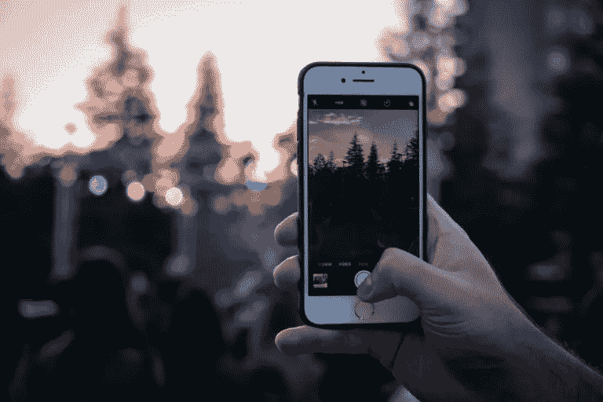

# 反应原生相机简单指南

> 原文：<https://javascript.plainenglish.io/the-simple-guide-for-react-native-camera-b81f5b2ac158?source=collection_archive---------4----------------------->



捕捉记忆！智能手机中的摄像头让我们能够快速捕捉生活中的精彩瞬间。我们很可能再也回不到的时刻，但我们可以用照片和视频的形式安全地捕捉它们。因此，我们渴望通过最喜爱的移动应用程序与我们所爱的人分享这一精彩时刻。

构建您的下一个移动应用程序时，您可能希望添加捕捉照片和视频的功能。您也可能不确定如何实现这一点。嗯，不用再看了，因为我们最近已经在我们的[社交应用](https://www.instamobile.io/mobile-templates/social-networks/)中实现了这个功能。你可能想看看我们是如何用 React Native 无缝实现相机功能的。

我将在这里描述在 React Native 中捕获照片和视频的基本实现。

## 必需的包

对于这个项目，我们将使用:

*   **世博相机**。捕捉照片和视频需要这个包。
*   **expo-av** 。在这里，我们将从该模块导入视频来播放我们录制的视频。

现在，您可以继续安装这两个软件包了。

```
$yarn add expo-camera expo-av
```

或者:

```
$npm install expo-camera expo-av
```

## 实现相机功能

将 camera 组件添加到项目的视图中非常简单。

```
import React, { useState, useRef, useEffect } from "react";
import {
  StyleSheet,
  Dimensions,
  View,
  Text,
  TouchableOpacity,
  SafeAreaView,
} from "react-native";
import { Camera } from "expo-camera";
import { Video } from "expo-av";

const WINDOW_HEIGHT = Dimensions.get("window").height;

const closeButtonSize = Math.floor(WINDOW_HEIGHT * 0.032);
const captureSize = Math.floor(WINDOW_HEIGHT * 0.09);

export default function App() {
  const [hasPermission, setHasPermission] = useState(null);
  const [cameraType, setCameraType] = useState(Camera.Constants.Type.back);
  const [isPreview, setIsPreview] = useState(false);
  const [isCameraReady, setIsCameraReady] = useState(false);
  const [isVideoRecording, setIsVideoRecording] = useState(false);
  const [videoSource, setVideoSource] = useState(null);
  const cameraRef = useRef();

  useEffect(() => {
    (async () => {
      const { status } = await Camera.requestPermissionsAsync();
      setHasPermission(status === "granted");
    })();
  }, []);

  const onCameraReady = () => {
    setIsCameraReady(true);
  };

  const takePicture = async () => {
    if (cameraRef.current) {
      const options = { quality: 0.5, base64: true, skipProcessing: true };
      const data = await cameraRef.current.takePictureAsync(options);
      const source = data.uri;
      if (source) {
        await cameraRef.current.pausePreview();
        setIsPreview(true);
        console.log("picture source", source);
      }
    }
  };

  const recordVideo = async () => {
    if (cameraRef.current) {
      try {
        const videoRecordPromise = cameraRef.current.recordAsync();

        if (videoRecordPromise) {
          setIsVideoRecording(true);
          const data = await videoRecordPromise;
          const source = data.uri;
          if (source) {
            setIsPreview(true);
            console.log("video source", source);
            setVideoSource(source);
          }
        }
      } catch (error) {
        console.warn(error);
      }
    }
  };

  const stopVideoRecording = () => {
    if (cameraRef.current) {
      setIsPreview(false);
      setIsVideoRecording(false);
      cameraRef.current.stopRecording();
    }
  };

  const switchCamera = () => {
    if (isPreview) {
      return;
    }
    setCameraType((prevCameraType) =>
      prevCameraType === Camera.Constants.Type.back
        ? Camera.Constants.Type.front
        : Camera.Constants.Type.back
    );
  };

  const cancelPreview = async () => {
    await cameraRef.current.resumePreview();
    setIsPreview(false);
    setVideoSource(null);
  };

  const renderCancelPreviewButton = () => (
    <TouchableOpacity onPress={cancelPreview} style={styles.closeButton}>
      <View style={[styles.closeCross, { transform: [{ rotate: "45deg" }] }]} />
      <View
        style={[styles.closeCross, { transform: [{ rotate: "-45deg" }] }]}
      />
    </TouchableOpacity>
  );

  const renderVideoPlayer = () => (
    <Video
      source={{ uri: videoSource }}
      shouldPlay={true}
      style={styles.media}
    />
  );

  const renderVideoRecordIndicator = () => (
    <View style={styles.recordIndicatorContainer}>
      <View style={styles.recordDot} />
      <Text style={styles.recordTitle}>{"Recording..."}</Text>
    </View>
  );

  const renderCaptureControl = () => (
    <View style={styles.control}>
      <TouchableOpacity disabled={!isCameraReady} onPress={switchCamera}>
        <Text style={styles.text}>{"Flip"}</Text>
      </TouchableOpacity>
      <TouchableOpacity
        activeOpacity={0.7}
        disabled={!isCameraReady}
        onLongPress={recordVideo}
        onPressOut={stopVideoRecording}
        onPress={takePicture}
        style={styles.capture}
      />
    </View>
  );

  if (hasPermission === null) {
    return <View />;
  }

  if (hasPermission === false) {
    return <Text style={styles.text}>No access to camera</Text>;
  }

  return (
    <SafeAreaView style={styles.container}>
      <Camera
        ref={cameraRef}
        style={styles.container}
        type={cameraType}
        flashMode={Camera.Constants.FlashMode.on}
        onCameraReady={onCameraReady}
        onMountError={(error) => {
          console.log("cammera error", error);
        }}
      />
      <View style={styles.container}>
        {isVideoRecording && renderVideoRecordIndicator()}
        {videoSource && renderVideoPlayer()}
        {isPreview && renderCancelPreviewButton()}
        {!videoSource && !isPreview && renderCaptureControl()}
      </View>
    </SafeAreaView>
  );
}

const styles = StyleSheet.create({
  container: {
    ...StyleSheet.absoluteFillObject,
  },
  closeButton: {
    position: "absolute",
    top: 35,
    left: 15,
    height: closeButtonSize,
    width: closeButtonSize,
    borderRadius: Math.floor(closeButtonSize / 2),
    justifyContent: "center",
    alignItems: "center",
    backgroundColor: "#c4c5c4",
    opacity: 0.7,
    zIndex: 2,
  },
  media: {
    ...StyleSheet.absoluteFillObject,
  },
  closeCross: {
    width: "68%",
    height: 1,
    backgroundColor: "black",
  },
  control: {
    position: "absolute",
    flexDirection: "row",
    bottom: 38,
    width: "100%",
    alignItems: "center",
    justifyContent: "center",
  },
  capture: {
    backgroundColor: "#f5f6f5",
    borderRadius: 5,
    height: captureSize,
    width: captureSize,
    borderRadius: Math.floor(captureSize / 2),
    marginHorizontal: 31,
  },
  recordIndicatorContainer: {
    flexDirection: "row",
    position: "absolute",
    top: 25,
    alignSelf: "center",
    justifyContent: "center",
    alignItems: "center",
    backgroundColor: "transparent",
    opacity: 0.7,
  },
  recordTitle: {
    fontSize: 14,
    color: "#ffffff",
    textAlign: "center",
  },
  recordDot: {
    borderRadius: 3,
    height: 6,
    width: 6,
    backgroundColor: "#ff0000",
    marginHorizontal: 5,
  },
  text: {
    color: "#fff",
  },
});
```

添加完这段代码后，我们应该准备好相机显示了。确保您在实际设备上运行它。


这里的实现非常简单，逻辑被分解为以下核心方法:

在我们分析组成我们的相机项目的逻辑的核心方法之前，我们应该注意我们在哪里显示了“相机”组件实例( **<相机……/>**)。

这里，我们将已经定义好的 **cameraRef** 传递给我们的相机组件的 ref prop。

这样，我们现在可以在之前传递给 Ref 属性的 **cameraRef** 上访问漂亮的方法，如 **takePictureAsync()** 、 **recordAysnc()** …。这种方法将是帮助我们实现预期目标的关键，如拍照、录像等。

*   **oncamaready()**。实现这个回调方法的目的是决定相机何时准备好拍摄照片或视频。您应该注意到，在以任何形式捕获图片之前，检查是否调用了该方法是很重要的。
*   **拍照()**。在相机组件实例(Camera ref . current . takePictureAsync)的 ref 上调用的“takePictureAsync()”的帮助下，我们能够用这种方法成功地捕获一张图片。
*   **recordVideo()** 。这个方法类似于 takePicture()方法。通过我们的 capture 组件的 onLongPress 回调触发，我们借助 recordAsync 方法以视频的形式捕捉瞬间，该方法也在 Camera 组件实例(cameraRef.current.recordAsync())的 ref 上调用。
*   **stopVideoRecording()** 。该方法由用户触发以停止视频记录。
*   **switchCamera()** 。该方法在 ur 设备的前后摄像头之间切换。
*   **cancelPreview()** 。这种方法取消任何形式的照片或视频预览，无论是照片还是视频。

所有的渲染方法，比如**renderCancelPreviewButton()**， **renderVideoPlayer()** …只是简单地渲染一个组件，以便在你的手机屏幕上显示。

在我们呈现任何要显示的组件之前，我们通过在 Camera 组件的实例上调用“requestPermissionsAsync”来请求必要的权限(Camera.requestPermissionsAsync())。此方法在 useEffect 方法中调用。我们的 useEffect 方法只有在组件被初始安装时才会被触发。

我们已经实现了一个简单的条件渲染，使用我们的组件进行显示。这里，只有在预览时，我们才呈现一个 cancel 按钮，以便在照片或视频被捕获后取消预览。我们在录音的时候会渲染一个指示器。一个视频播放器后，视频已被记录，我们有一个视频源。

只有当我们没有视频源并且没有预览时，我们才呈现一个捕获按钮。

用户点击捕获按钮进行记录。

用户也可以按住捕捉按钮来录制视频。按 out 停止录制并预览录制的视频。

按下翻转文本切换相机。

一张图片胜过千言万语，在你的应用程序中拥有捕捉照片和视频的能力是一个重要的功能。照片和视频被认为是新的键盘，传达更多文字无法捕捉的信息。

记得查看我们的任何[演示应用](https://www.instamobile.io/mobile-templates/social-networks/)，看看我们是如何超越这个特性的基本实现的。

*原载于 2020 年 5 月 23 日*[*https://www . insta mobile . io*](https://www.instamobile.io/react-native-tutorials/capturing-photos-and-videos-with-the-camera-in-react-native/)*。*