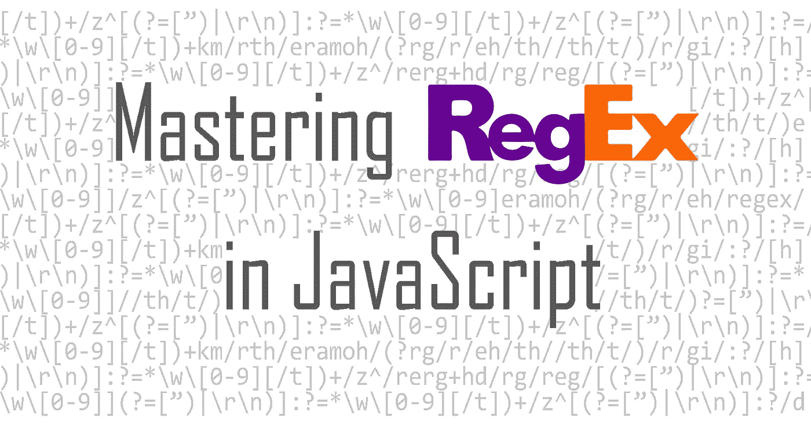
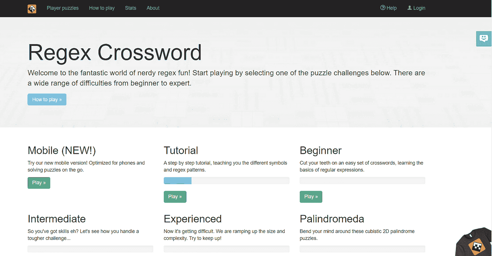

# JavaScript 中的正则表达式简介

> 原文：<https://javascript.plainenglish.io/the-simplest-way-to-master-regex-in-javascript-d889edd2702c?source=collection_archive---------6----------------------->



# 什么是 Regex？

> Regex 是正则表达式的缩写，是在字符串中寻找匹配模式的有用工具。

它们可用于验证用户输入的文本，检查字符串的格式(如电子邮件或 12 位电话号码)，并允许在字符串中搜索特定的单词或数字模式。

像 JavaScript 这样的大多数编程语言都使用 regex。然而，学习它所有复杂的语法和规则是相当困难的。但是一旦你从基础开始，我有一个简单而有趣的方法让你像专业人士一样掌握 regex。

# 让我们从最基本的开始:规则

下面是一些需要了解的基本正则表达式规则和语法。

## 1.寻找匹配模式的正则表达式方法

在 JavaScript 中使用 regex 最常见的方式是在字符串上使用`.match()`。这里有一个例子:

```
const paragraph = 'The quick brown fox jumps over the lazy dog. It barked.'; 
const regex = /[A-Z]/g; 
const found = paragraph.match(regex); 
console.log(found);
```

*代码来自:*[*developer.mozilla.org/enUS/docs/Web/JavaScr..*](https://developer.mozilla.org/enUS/docs/Web/JavaScript/Reference/Global_Objects/String/match)

如代码所示，正则表达式将是`match()`的参数，用于查找字符串是否包含正则表达式指定的模式。

> *重要提示:默认情况下，正则表达式是区分大小写的！除非另有说明。*

在这个例子中，正则表达式指定从 A 到 z 查找大写字母。给定字符串中仅有的两个大写字母是 T 和 I，所以`match()`将返回这两个匹配的字母。

> *其他常见的正则表达式方法有:*`*RegExp.exec()*`*`*RegExp.test()*`*`*String.prototype.matchAll()*`*。***

## **2.语法和标志**

**正则表达式总是包含在两个正斜杠之间，比如:`/some_regex/`。**

**在 regex 中，您可以在最后一个正斜杠的末尾使用“flags”来表示您想要查找的模式的一些额外条件。**

**例如，添加一个“g”全局标志将允许搜索找到指定正则表达式的所有出现，而不是只找到第一个匹配并停止。看一下这个例子:**

```
**let str = "The cat looks at the other cat and purrs."; 
const regex = /cat/g; 
console.log(str.match(regex)); 
let str = "The cat looks at the other cat and purrs."; 
const regex = /cat/; 
console.log(str.match(regex));**
```

**如上面的代码所示，全局标志返回指定单词“cat”的所有实例，而不带“g”的正则表达式返回它在索引 4 处找到的第一个实例。**

**正则表达式中有更多的标志，你应该学习掌握正则表达式。但是我还不想给你过多的信息，因为我会在这篇文章的后面介绍一个简单的方法来学习更多关于旗帜的知识。**

## **3.通配符和锚点**

**在 regex 中，通配符指的是句号(是的，句号)。这个句点代表任何字符(包括空格)。所以如果你想匹配一个句子中的每个字符，正则表达式应该是:`/./g`。**

**锚点是指胡萝卜(^)，它将匹配字符串开头的任何单词。比如回到我们的句子:**“猫看着另一只猫，发出咕噜声。”****

**一个`/^The/`的正则表达式会找到一个匹配，而一个`/^cat/`的正则表达式不会，因为字符串没有带“cat”。**

> ***通配符(。) :匹配任何字符***
> 
> ***锚点(^):匹配字符串中的第一个单词***

**我希望这是对 regex 清晰而简明的介绍。当然，在 regex 中还有更多规则、标志、语法和特殊字符需要学习。对于作者和读者来说，在一篇文章中浏览所有这些内容都是令人疲惫的。**

**所以在这篇文章中，我将给你一个简单有趣的方法来开始掌握你的正则表达式！**

# **掌握正则表达式的简单方法**

****

> ***这里是:*[*regexcrossword.com*](https://regexcrossword.com/)**

**游戏是一种主动学习的形式，它帮助你更容易更快地记住新信息！一个朋友向我介绍了这个很棒的 regex 填字游戏。另一个学习正则表达式的好网站是 https://regexr.com/。**

**由于学习正则表达式可能是压倒性的，这个奇妙的游戏提供了不同程度的难度。从初学者到更高级的正则表达式学习者。试一下吧！每天 10 分钟，你就能成为一名正则表达式大师。我希望这篇文章是一个很好的介绍和激励，让你开始学习一些正则表达式，这对你的项目是一个有用的工具。下次再见，干杯！**