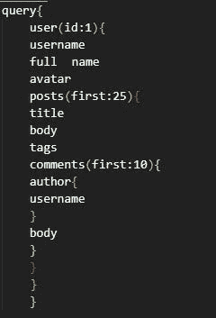

# 2019 年的休息状况

> 原文：<https://javascript.plainenglish.io/the-state-of-rest-in-2019-75005eaf05b9?source=collection_archive---------8----------------------->

Photo by [Angelina Kichukova](https://unsplash.com/@anynieel?utm_source=medium&utm_medium=referral) on [Unsplash](https://unsplash.com?utm_source=medium&utm_medium=referral)

今天，每一个现代应用程序都为外部世界(互联网)提供了一种连接和交互的方式。它是必不可少的，以便应用程序可以通过互联网在客户端之间轻松发送和接收数据。它也可以被称为服务消费者的一种方式。应用程序中实现这一点的部分被称为 **API** 。API 代表 **A** 应用 **P** 编程 **I** 界面。所有主要应用程序都使用某种 API 来促进通信，API 可能是内部的或公共的，也可能是商业化的。销售对应用程序 API 的访问是一项大生意，特别是如果您的应用程序提供了其他服务或应用程序没有提供的数据。这只是对 API 的一个介绍，对它们有很多了解，但这不是本文的目的。由于一个 API 可以很容易地有很多活动部分，所以在创建它之前必须遵循一种架构风格。相同的模式有很多，如对等(P2P)、REST、基于服务、以数据为中心、事件驱动等。其中最著名的是 REST。REST 表示代表状态转移。

十多年来，REST 一直是执政的统治者。REST 是一种架构风格，所有现代软件和网络服务都建立在这种架构风格之上。很可能您在手机、电脑或任何有互联网连接的设备上使用基于 REST API 构建的服务或应用数百次。也许您甚至已经开发了一个 REST API 或者自己编写了一个！尽管 REST 很受欢迎，但是，它也有一些明显的缺陷，需要修正。你可能会问，即使过了 10 多年，为什么它们还没有被淘汰？随着您对 REST 的进一步阅读和了解，您将会知道这些缺陷实际上并不是缺陷，是它们阻碍了 REST 的修复。

# 什么是休息？

在 REST 中，装载 API 的服务器定义了一组客户机可以请求的特定资源，这些资源是使用惟一的 URL 定义和定位的。例如，考虑一下 www.fossa.com 的网站。当你访问这个链接时，它指向了 FOSSA 的主页。如果您将鼠标悬停在资源上并转到文档，您会看到链接 URL 附加了一个/docs 后缀。这些后缀称为路由。它告诉 API 请求什么资源以及 API 提供什么资源。/docs 为 FOSSA 提供了文档。这是一种非常干净、简单和抽象的方式来隔离网站或服务的不同部分。客户端接收的数据由服务器定义和构造，不能更改。考虑到前面的例子，您可以看到，根据请求，您可以获得完整的文档。如果只想看文档的介绍呢？你可以明白我的意思。解决此问题的基本方法是为不同的路段创建不同的路线。因此，对于简介，我们可以使用/docs/introduction，这当然很好，但如果有成千上万个部分，那么实际上会有一千条路线。可怜开发商。需要说明的是，大多数应用程序都有许多路径，并且所有的路径对于应用程序的运行都是必要的，但是上面的一千个路径是对可能已经在使用的一百个路径的补充。对于每一项资源，您都达到了一个端点，如此有效地创建了一个移动到其他部分的请求。这是非常危险的，因为它产生了大量的带宽开销，也使应用程序看起来很慢，存在保真度方面的所有障碍。有些人可能认为太多的请求可能不是一个很大的问题，不能算作一个缺陷，但事实证明，所有的请求都是 HTTP 请求，HTTP 请求已经充满了所有的头和安全协议，增加请求的数量会产生冗余，因为请求中唯一改变的是路由。否则所有的 HTTP 部分保持不变。随着服务的发展，将会创建更多的端点，问题将会恶化。由于显而易见的原因，HTTP 请求是不可更改的，所以必须在所使用的架构中进行更改。了解了您所知道的之后，您可能会认为这个 API 看起来不再是 RESTful 了。但事实就是如此，而且由于缺乏更好的替代方案，REST 得到了统治，更不用说它提供的许多优势了。

概括一下，REST 的主要问题是-

*   无法控制我们收到的数据。
*   HTTP 请求太多。

# GraphQL 是什么？

顾名思义，GraphQL 是一种查询语言。这是一项由脸书创造的内部使用的技术，后来被开源。脸书面临着前面提到的问题，正如你可能已经体验过的，脸书的网页在连接上已经很重了，使用 REST 使它们变得有点慢。它是 REST for APIs 的完美替代，因为它允许您使用类型系统定义数据，形成模式。用简单的英语来说，它让客户能够完全控制他们请求的数据。

# GraphQL 如何工作并帮助克服 REST 带来的问题？

GraphQL 的工作方式使得我们可以一步克服 REST 的缺陷。让我们开始吧。

让我们考虑一个社交网站的例子。

该网站有 **n** 个用户简档，每个简档有 **x** 个帖子，反过来这些帖子有 **y** 个评论。现在，如果我们打开一个配置文件，所有与该配置文件相关的帖子都应该出现，对应于每个帖子的所有评论都应该出现。正如上面已经讨论过的，这种方法不好，一次调用所有数据。所以我们采用另一种方法，只调用所需的数据，增加了请求的数量。

典型的 REST 请求如下

/{ id }/2010 年 25 日

上述路由调用 id 为 *id* 的概要文件，并且 *25* 声明需要前 25 个帖子，25 后面的 *10* 告诉 API 需要对应于概要文件和帖子的 10 个注释。这种方式很方便，但仍然不是模块化的。我们这里有 3 个移动部件，即使其中一个发生变化，也必须提出新的请求。这是一个非常非常非常基本的例子，单个请求中有更多的部分，因此它们更容易被更改。现在在 GraphQL 的帮助下，考虑同样的场景。

这是一个从 API 调用特定数据的查询示例。

第一次看起来可能有点难以理解，但是很容易理解。

该查询主要由用户、帖子和评论字段组成。在 user 字段中，我们给了一个值为 1 的属性 id，这意味着我们需要 id 为 1 的用户。在用户内部，有更多的属性被提及，如用户名全名等。可能会有 10 个以上，但我们只要求我们需要的领域，这与 GraphQL 的魔力开始。同样，我们呼吁张贴和评论。如果我们将这个部分与其余部分进行比较，即使我们想这样做，我们也无法分解请求中所需的子部分。如果在 REST 调用中，我们调用 post，与之相关的所有数据都将发送给我们，这根本不是必需的，会使应用程序变慢，而在 GraphQL 中，我们可以具体指定我们对 API 的要求。为了清楚起见，这只是一个简单的例子，实际上你必须为连接创建一个**解析器**和一个**模式**来定义数据的完整结构。在实际的查询中，您可以从模式的特定字段中进行选择。

你得到的最大收获是你从 n 个请求变成了 1 个。

通常，GraphQL 被视为思考和使用 API 的革命性产品。您不是在服务器上处理严格的端点，而是发送确切需求的查询。如果被一个组织采用，GraphQL 对这个组织和他们的产品都有很好的反应。但是如果你深入研究，你会发现 GraphQL 和 REST 在某些方面是相似的。一些相似之处如下

*   它们都使用 HTTP 来发送请求。
*   两者都可以使用特定的标识(如 id)来请求资源。
*   两者都可以通过 URL 中的 GET 请求获取。
*   两者都可以在请求中返回行业标准的 JSON 数据。

它们的一些不同之处是

*   在 REST 中，被调用的端点是对象的标识，而 GraphQL 将标识与获取该对象的方法分开。
*   在 REST 中，数据的形状和大小由服务器设置，而在 GraphQL 中，服务器只声明可用于调度的资源，客户端询问它需要什么。

# 路由处理程序与解析程序

那么当你实际调用一个 API 时会发生什么呢？通常它会在收到请求的服务器上执行一些代码。代码可以做任何事情，从调用另一个 API 到简单的数字加法，这取决于设计和需求。这里的整个想法是封装。你不需要知道关起门来会发生什么。但是 REST 和 GraphQL 都有非常标准的方法来实现 API 的内部，比较它们可以了解这些技术的不同之处。

让我们看看 express 中的一个基本示例

app.get('/hi '，function (req，res) { res.send('Hello World！')})

在这里，您可以看到我们已经创建了一个/hi 端点，它返回字符串“Hello World！”。从这个例子中，我们可以看到一个 HTTP 请求在 REST API 服务器中的生命周期:

1.  服务器从客户机接收请求，并检索 HTTP 动词(在本例中为 GET)和 URL 路径。
2.  API 库将动词和路径匹配到在服务器中注册的函数。
3.  该函数执行并返回结果
4.  结果由 API 序列化，添加头，然后发送回客户端

GraphQL 提供了类似的实现

const resolvers = { query:{ hi:()= > { return ' Hello world！'；} } };

如您所见，我们没有为特定的 URL 提供函数，而是提供了匹配特定字段的函数，在本例中，字段是 hi。在 GraphQL 中，这个函数被称为**解析器**。

发出请求的查询:

查询{嗨}

因此，当服务器收到 GraphQL 请求时，会发生以下情况:

1.  服务器接收请求，并检索 GraphQL 查询。
2.  遍历查询，并为每个字段调用适当的解析器。在本例中，只有一个字段，hi，它在查询类型中
3.  调用该函数，它返回一个结果
4.  GraphQL 库和服务器将结果附加到与查询形状匹配的响应中

所以你会回到:

{“嗨”:“你好，世界！”}

对于更复杂的查询，解析器也可以在单个查询中相互嵌套。

# 为什么选择 GraphQL？:摘要

GraphQL 完美地解决了 3 个最重要的问题:

*   **需要多次往返以获取视图所需的数据**:使用 GraphQL，您总是可以通过与服务器的*单次*往返来获取视图所需的所有初始数据。为了用 REST API 做同样的事情，我们需要引入难以管理和扩展的非结构化参数和条件。
*   **客户端对服务器的依赖**:使用 GraphQL，客户端使用请求语言，无需服务器硬编码数据的形状或大小，并将客户端与服务器分离。这意味着客户机可以独立于服务器进行维护和改进。

# 结论

GraphQL 是一个游戏改变者。它非常优雅地解决了 REST 带来的问题，但即使在 2019 年，REST 也不会去任何地方。这个场景可以与 XML 和 JSON 之争相比较。在 JSON 之前，XML 是数据传输标准，当 JSON 出现时，它对 XML 构成了巨大的威胁，因为与 XML 相比，JSON 非常简单和轻量级。毫无疑问，JSON 到处都在使用，但是 XML 直到今天还活着，并且还在使用。同样的道理，不管有多少竞争者出现并威胁到它的存在，REST 将永远盛行。这幅作品中的 GraphQL 并不是一幅完整的图画，而是一幅更大图画的一部分。您可以参考 GraphQL 的官方文档，以获得关于该技术的更多知识。