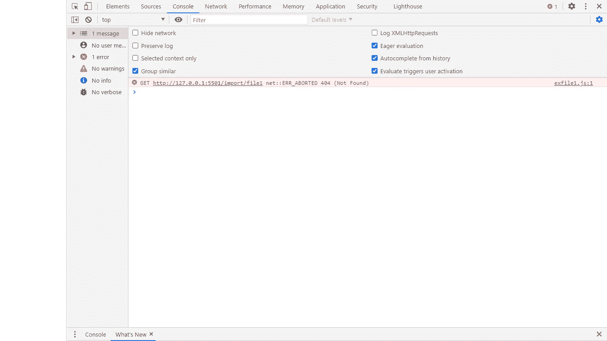

# 我在 JavaScript 导入语句中犯的愚蠢错误

> 原文：<https://javascript.plainenglish.io/the-stupid-mistake-i-made-with-the-javascript-import-statement-75c4d111d70b?source=collection_archive---------4----------------------->

## 都是为了休息一下

Photo by [**Markus Spiske**](https://unsplash.com/@markusspiske)**:** Unsplash.

我第一次编写包含 import 语句的代码时，犯了一个愚蠢的错误。尽管我有 8 个月使用 JavaScript 的经验，我还是花了大约两个晚上的时间试图找出为什么这个程序不工作。

我想让你直接看到错误，但为了让我说的每一句话都有意义，多说这个故事也没什么大不了的。

许多 JavaScript 开发人员仍然持有那种“让我们保持老样子”的观点。我为什么要学习如何用 JavaScript 实现新特性？我曾经有一段时间和这些开发者一样。我忽略了很多次讨论 ES6 新特性的文章、教程和书籍。

每次我遇到一个新的特性，新的语法，我都试图摆脱它并实现旧的，这样做只是为了得到相同的结果，而没有学习新东西的负担。

然而，这并没有持续多久。就过了一段时间，我开始学习 ES6 的特性。事情真的很棒，但我在学习很多东西时很挣扎，包括模块。这个特性并没有在语言中引入新的概念，它只是使用了另一个地方(外部或内部)的代码。

作为一个懒惰的 JavaScript 开发人员，我对模块一无所知。我过去常常通过包含脚本标签或通过 Ajax 调用来检索外部代码或信息。

使用模块导入外部代码在这门语言中并不新鲜。JavaScript 开发人员一直在库的帮助下使用模块，直到社区将它们作为内置特性引入 ES6。

现在让我们举一个使用 import 语句或模块的例子，来说明您可以使用它们的方式，以及为什么我第一次尝试时它们不工作。

## 第一个 JavaScript 文件

下图是我们要从中导出代码的模块，因此，模块只是一个导出一些代码的文件。

**Image by Author**

因此，我们有一个 JavaScript 文件，名为“ *file1* ，它驻留在一个标签为“ *import* 的文件夹中。如上图所示，我们的文件包含一个标签为 Junior 的*类，它有三个属性，我们在第 10 行有一个导出语句。*

我们现在所做的只是导出模块，具体来说就是*初级类。*

## 第二个 JavaScript 文件:

下图是包含导入模块的文件。

这里我们有一个标记为**‘ex file 1**’的 JavaScript 文件，它包含我们从第 8 行的‘file 1’导入的模块。我们创建了初级类的一个实例。

在第 9 行，我们创建了一个高级类的实例，它是 Junior 的扩展版本。剩余的行将为控制台面板中的每个类输出“ ***年属性*** ”。

## Html 文件:

我们的 Html 文件的结构:

正如您看到的 Html 文件包含我们前面提到的 JavaScript“ex file 1”代码，将这些文件放在一起并在浏览器中打开 HTML 文件后，打开控制台面板。

可预测的结果应该是:

我们的低年级朋友被判了 1 年。

**我们的老朋友被判了 4 年。**

不幸的是，在 Chrome 浏览器中打开控制台面板后，我们得到了一个错误，这不是我们应该得到的:

**Image by Author.**

那么我做了什么来解决这个问题呢？我真的很匆忙，我谷歌了一下，然后我在 Stack overflow 中找到了解决方案。事实证明，我应该更改 script 标记中的 type 属性，因为我处理的是一个模块，而不是一个常规的 JavaScript 文件。

所以与其这样做:

我应该这样做:

然而，那对我也不起作用。控制台面板产生了另一个错误信息，如下图所示。

**Image by Author.**

一开始，我甚至无法确定问题的核心，因为我不知道到底发生了什么，为什么它会向我显示状态 404(未找到)，我在正确的位置使用了正确的文件，我关闭了计算机，然后我就睡着了。

第二天早上醒来，打开 Vscode，我惊讶于自己有多蠢。我忘了在“ex file 1”文件的**的第一行的导入语句中添加“js”扩展名，所以在修复了这个小错误之后， **exfile1** 文件应该是这样的:**

结果将会是我们之前讨论过的可预测的结果。

我们的学妹被判了 1 年。

**我们学长朋友判了 4 年。**

# 最后的想法

我写这个故事不是为了教你如何使用 import 语句。如果你想学习如何使用一个模块，你可以去 MDN 网站，自学如何明智地使用它们。

虽然我犯的这个错误看起来很可笑，但是你不要忘记，最好的学习方法是通过犯错误，加上记下你犯的那个错误。

> “如果事情不顺利，就从中吸取教训。”未知