# 为 React Native 集成 AWS Amplify 身份验证的最终指南

> 原文：<https://javascript.plainenglish.io/the-ultimate-guide-for-integrate-aws-amplify-authentication-for-react-native-15a8eec10890?source=collection_archive---------0----------------------->

## [AWS Amplify](https://docs.amplify.aws/) 是一个框架，通过访问 AWS 提供的后端云服务，你可以快速开发 web 或移动应用。在本文中，我们将通过构建一个全功能的登录和注册流程来学习如何在 React Native 中使用 AWS Amplify。

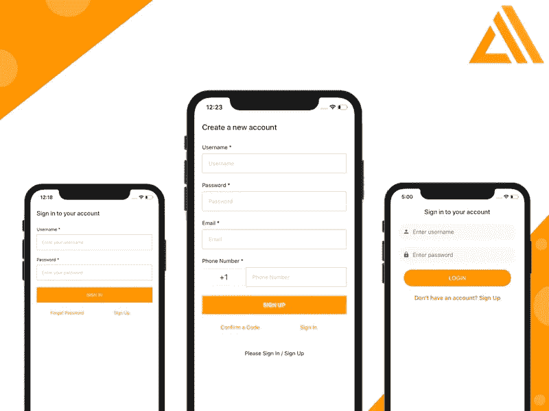

*原载于 2020 年 8 月 29 日*[*https://www . insta mobile . io*](https://www.instamobile.io/mobile-development/react-native-aws-amplify/)*。*

本教程将介绍移动应用程序最重要的特性之一——身份验证。你知道这个场景。您需要存储一些用户信息(凭证),以便他们可以取回并重用应用程序，而不是创建一个新帐户。

在开始本教程之前，请确保拥有一个 AWS 帐户。如果没有，[请报名](https://portal.aws.amazon.com/billing/signup?redirect_url=https%3A%2F%2Faws.amazon.com%2Fregistration-confirmation#/start)一个。

## 什么是 AWS Amplify？

Amazon Web Service 是一种提供云服务的技术。自 2017 年推出以来，Amplify 在以工具链的形式提供一系列服务方面取得了很大进展。它也是开源的。

要使用 Amplify 将身份验证构建到 React Native 和 Expo 应用程序中，首先需要安装 AWS Amplify CLI。打开终端窗口，执行以下命令安装 CLI。我们将把它作为一个全局模块来安装。

```
npm install -g @aws-amplify/cli
```

使用 Amplify 的 CLI 工具，你会发现几个真正有用的 CLI 插件和服务，在与 React Native 等框架集成时，只需点击一下即可启用。诸如 GraphQL 和 REST APIs、身份验证 UI 以及后端支持、存储、托管等服务都可以通过 Amplify 的 CLI 获得。

## React Native 和 AWS Amplify 入门

首先创建一个新的应用程序项目。我们将通过 Expo CLI 生成项目。打开一个终端窗口，创建一个新的 React 原生应用。

```
npx expo-cli init expo-amplify-example
```

这个命令创建一个名为`expo-amplify-example`的新目录。你想叫它什么都可以。在这个目录中，您将发现一个完整的 React Native + Expo SDK 项目。请注意，在运行上述命令时，CLI 会询问您使用哪个模板。本教程使用受管工作流中的`blank`模板。如果您熟悉任何其他模板，请随意选择。

Expo CLI 是一个命令行实用程序，无需构建配置即可创建 React 本地应用。我们依赖它的原因是，首先，对于这样的用例来说，它是一个非常棒的工具。

## 创建新的 AWS IAM 用户

登录 AWS 帐户后，从终端窗口运行以下命令。此命令要求您登录 AWS 控制台。

```
amplify configure
```

这将打开 AWS 控制台仪表板。回到终端，按回车键继续。这将引导您回答一系列问题，以便配置一个用户帐户，将 Amplify 与 React 本机应用程序一起使用。

*   **选择一个地区**:美国东部-2
*   **指定新 IAM 用户的用户名** : expo-amplify

输入用户名后，按 enter 键，AWS 控制台将在浏览器窗口中再次打开，供您添加用户。

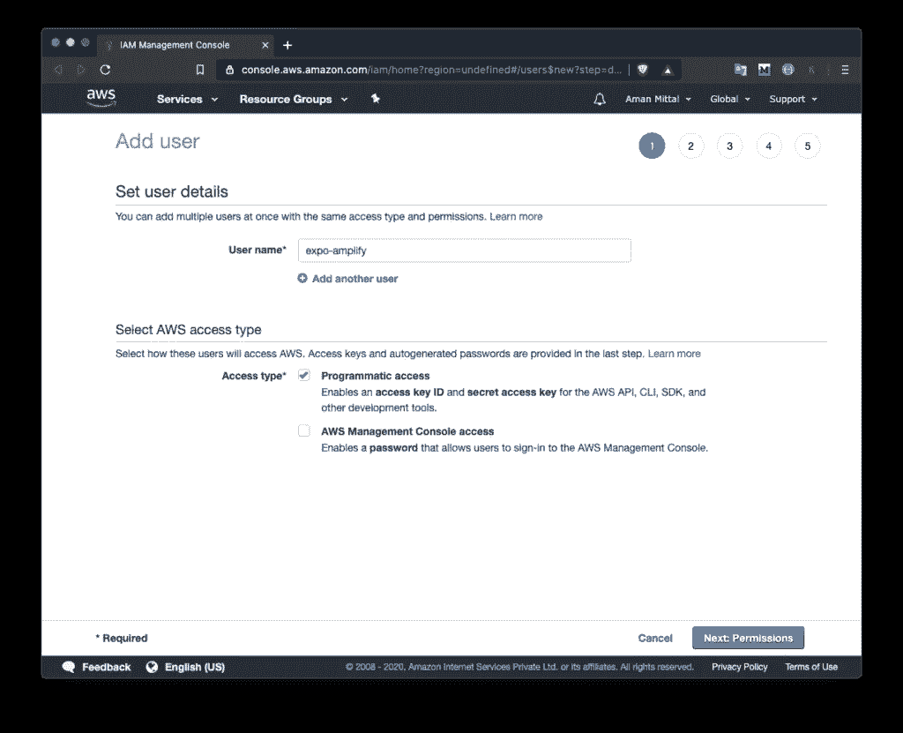

在上面的屏幕中，确保勾选了**编程访问**。它允许新用户以不同的 API 和工具的形式创建资源，为您提供访问密钥和秘密密钥。然后点击按钮**下一步:权限**。请注意，在下面的屏幕中，默认情况下选择了一个策略。应用默认设置。这通过使 AWS 用户(您正在创建的当前用户)成为管理员，为您提供了对 AWS 服务的完全访问权限。

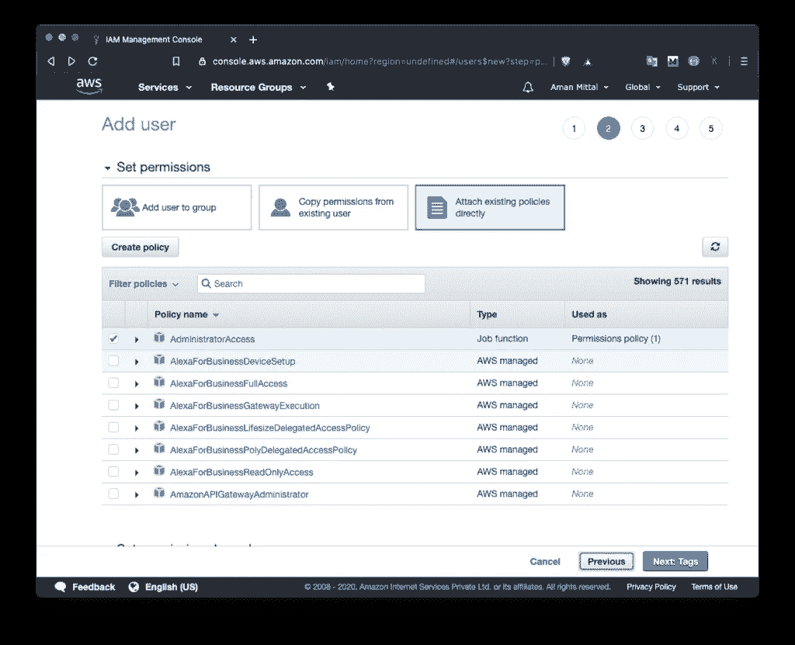

然后，点击**下一步:标签**。当前用例不需要修改。

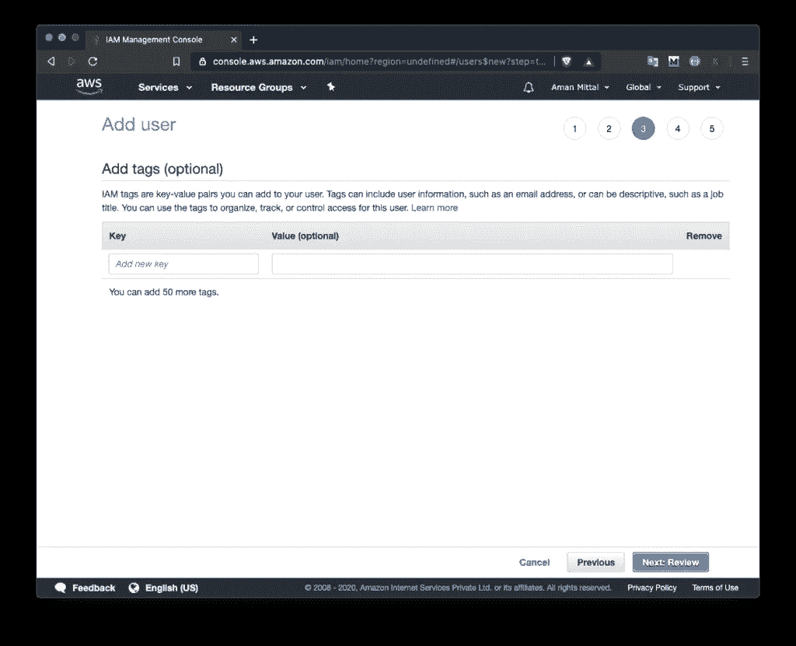

然后，点击**下一步:复习**。同样，不需要修改。点击**创建用户**按钮，您将被定向到一个新页面，在此您可以找到访问密钥和秘密密钥。转到您的终端窗口，按下回车键，并在出现提示时按顺序输入访问键和密钥。它将询问一个配置文件名。您可以在此输入项目名称或用户名。

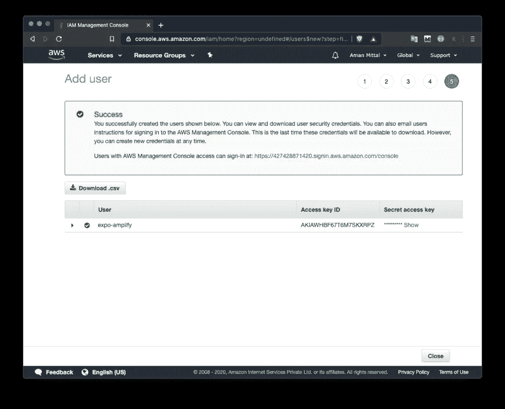

最后一次按 enter 键创建一个新的 AWS 用户。

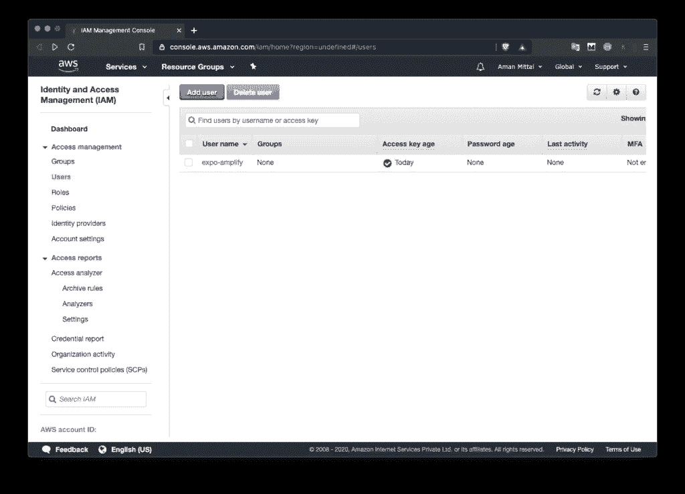

## 在 React Native 中集成 AWS Amplify

要使用 React Native 应用程序初始化 AWS Amplify，请运行以下命令，然后提示您更多问题。返回终端窗口，运行如下初始化命令:

```
amplify init
```

运行此命令后，系统会提示您一些配置问题。对于当前的演示，我们选择所有默认选项。作为参考，您可以找到问题旁边列出的选项，如下所示:

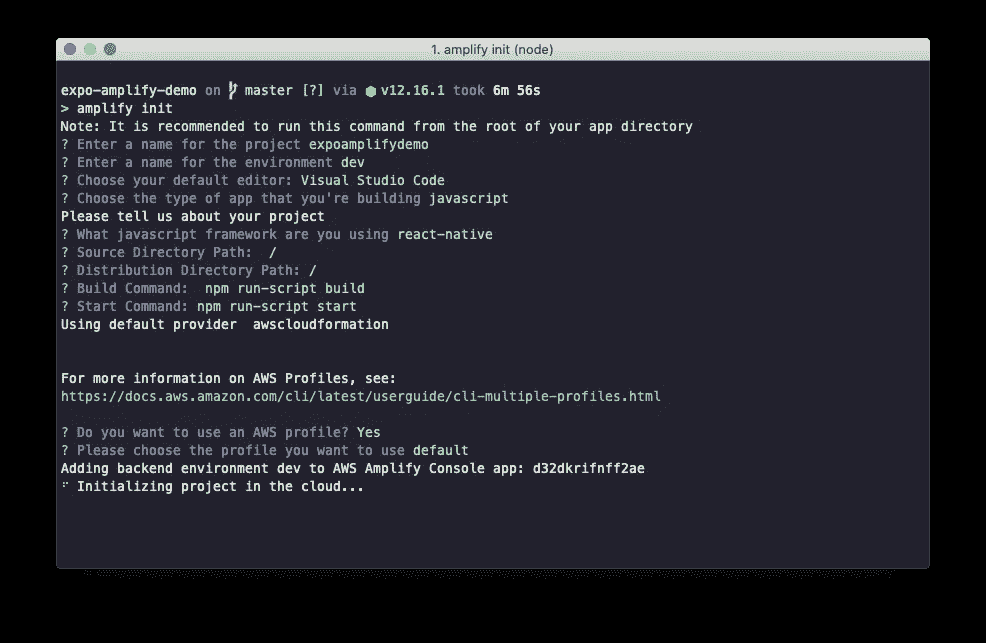

Amplify SDK 初始化过程完成后，请注意项目目录中有一些新的文件更改。一个名为`amplify/`的存储任何本地或云更改的新目录被添加到 React 本地项目的根目录中。一个名为`aws-exports.js`的新文件出现在你没有提交到公共 Github 库的根目录下。`amplify init`司令部负责此事。它将更新 React 本地项目中的`.gitignore`文件。

要将 Amplify SDK 与 Expo 或 React 本机应用程序集成，请安装以下依赖项。返回终端窗口并执行命令:

```
yarn add aws-amplify aws-amplify-react-native
```

包`aws-amplify`允许您向 AWS 提供的 auth 和 API 服务发出请求。另一个包`aws-amplify-react-native`是特定于框架的，包含现成的 UI 组件。

安装完这些依赖项后，打开`App.js`文件并添加以下导入语句。

```
import config from './aws-exports'; 
Amplify.configure(config);
```

这就是将 Amplify 与 Expo 应用程序集成的原因。

## 添加放大认证资源

Amplify 使用 Amazon Cognito 进行身份验证。Amazon Cognito 是一个功能齐全的用户目录，处理用户注册、登录和帐户恢复。放大与 Cognito 用户池的接口，以存储用户信息，包括脸书、谷歌等社交提供商。

要使用 Amplify 添加用户身份验证，首先从终端窗口运行命令。

```
amplify add auth
```

运行该命令后，系统会提示您以下问题:

```
Do you want to use the default authentication and security configuration? Default configuration
How do you want users to be able to sign in? Email 
Do you want to configure advanced settings? No, I am done.
```

第一个选项是选择默认的身份验证和安全配置。让我们默认。第二种选择是使用身份验证提供者。在我们的例子中，让我们选择`Email`。您还可以添加脸书或谷歌登录等社交提供商。

现在运行以下命令，将所有本地更改发布到 AWS，以便创建一个用户池。

```
amplify push
```

执行上述命令后，您会看到以下屏幕。显示当前工作环境`dev`的详细信息，并显示当前使用的资源`Auth`的状态。

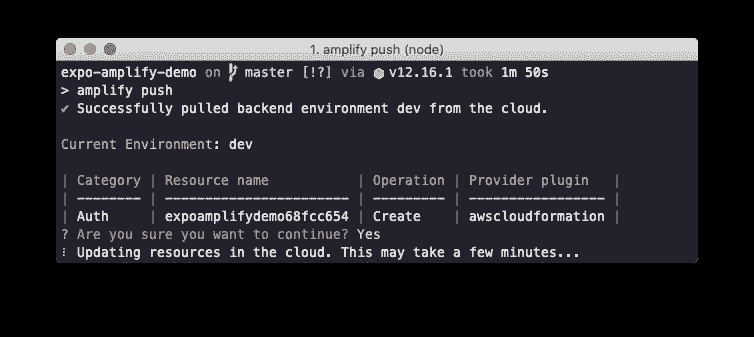

执行命令可能需要一些时间来推动更改以启用和创建用户池。使用 Amazon Cognito 初始化用户身份验证设置完成。

## 构建注册和登录用户界面

Amplify 附带了一个名为`withAuthenticator`的高阶组件，用于包装 React 原生应用的根组件。将其导入到`App.js`文件中，然后用它来包装`App`功能组件。

```
// ... after other import statements
import { withAuthenticator } from 'aws-amplify-react-native';// ... contents of App component
function App() {
  return (
    <View style={styles.container}>
      <Text>💙 + 💛 = React Native + Amplify </Text>
      <StatusBar style="auto" />
    </View>
  );
}// wrap the App component as shown below
export default withAuthenticator(App);
```

`withAuthenticator`组件在用户成功登录后呈现`App`组件，它阻止未登录的用户与您的应用程序交互。它会自动检测身份验证状态并更新 UI。

现在，回到终端窗口，使用`yarn start`命令启动世博开发服务器。

一旦加载了应用程序，您将会看到下面的初始屏幕，其中包含一些已经由用于包装`App`组件的 HOC 提供的 UI 组件。

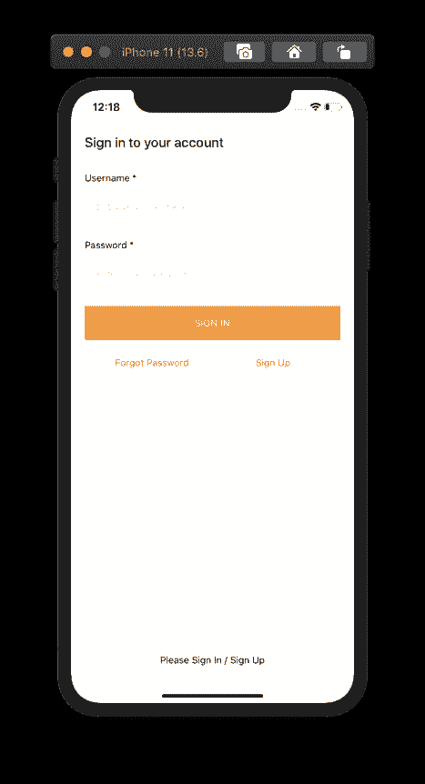

由于没有用户，如果您尝试登录，您将无法访问。

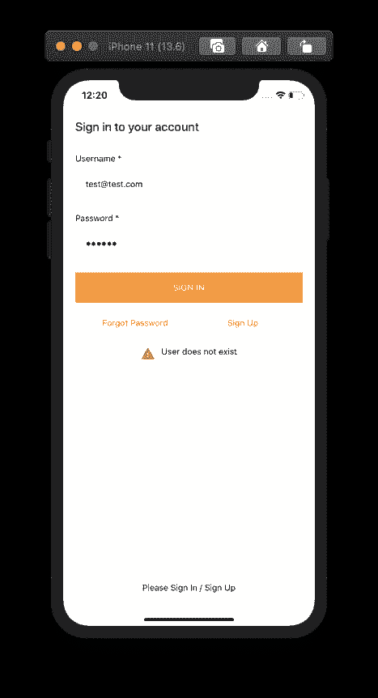

AWS Amplify 在这方面非常棒，它们甚至提供了基本而有用的细节，比如当你试图用错误的用户名或不存在的用户名登录时，会显示一条错误消息。

点击注册按钮下面的注册按钮，进入注册界面，注册一个新用户。


确保在`Username`和`Email`字段输入有效的电子邮件。它会向用户发送一个验证码来创建一个新帐户。

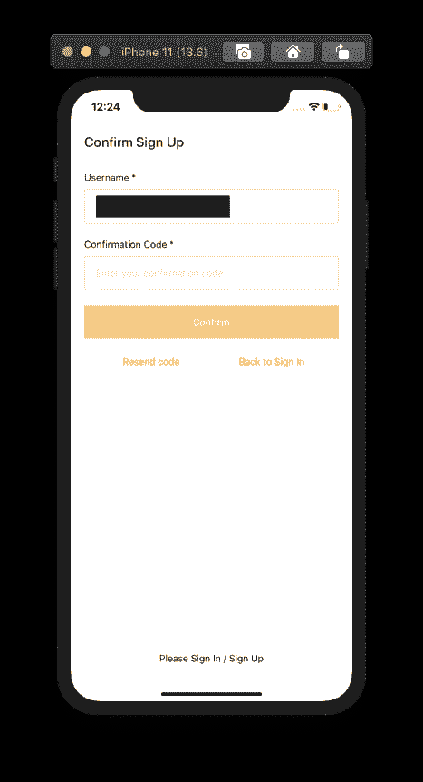

创建新用户帐户后，您将被重定向回登录屏幕。若要登录，请输入您注册新用户时使用的凭据。

成功登录后，您将看到主应用程序。

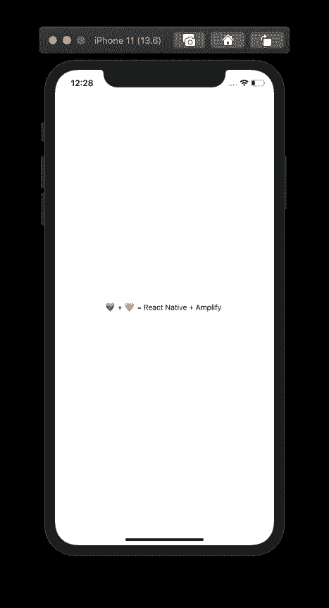

## 在 React Native 中使用 AWS Amplify 添加注销功能

要使用默认 UI 组件将用户从 React 本地应用中注销，您必须在包装`App`组件时向`withAuthenticator`高阶组件传递第二个参数。

修改`App.js`文件:

```
export default withAuthenticator(App, true);
```

这将显示一个注销按钮，如下所示。

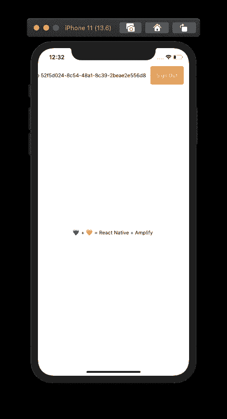

从导入`App.js`文件中的`Auth`对象开始。然后，在`App`函数中，创建一个名为`signOut`的新异步处理程序方法，它使用了`Auth.signOut()`方法。

然后自定义方法被用作来自`react-native`的`Button`组件上的`onPress`属性的值。

```
// other import statements
import { withAuthenticator } from 'aws-amplify-react-native';function App() {
  async function signOut() {
    try {
      await Auth.signOut();
    } catch (error) {
      console.log('Error signing out: ', error);
    }
  }return (
    <View style={styles.container}>
      <Text>💙 + 💛 = React Native + Amplify </Text>
      <Button title="Sign Out" color="tomato" onPress={signOut} />
      <StatusBar style="auto" />
    </View>
  );
}// make sure to remove the second argument
export default withAuthenticator(App);
```

这是完成此步骤后您将得到的输出:

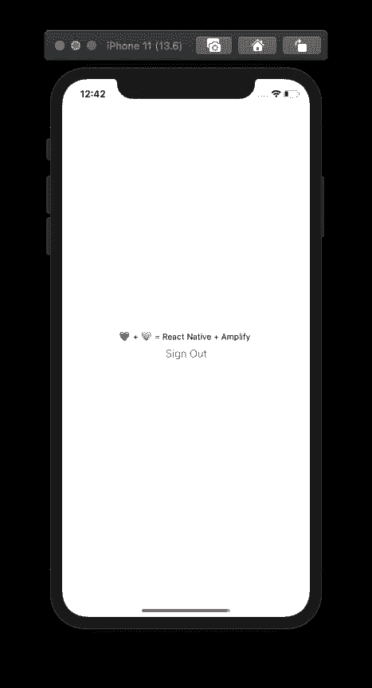

按下退出按钮后，您将返回登录屏幕。

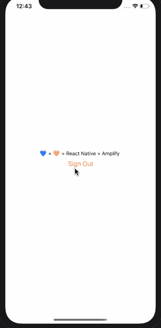

## 使用 React 导航库创建自定义身份验证流

从这一节开始，我们将学习如何使用 React 导航创建自定义身份验证流，并创建自定义屏幕来登录、注册、确认验证码和注销用户。

首先在 React 原生应用中添加`react-navigation`库。返回到终端窗口并安装下列依赖项。

```
expo install @react-navigation/native @react-navigation/stack react-native-gesture-handler react-native-reanimated react-native-screens react-native-safe-area-context @react-native-community/masked-view
```

安装完依赖项后，创建以下目录结构。`screens/`目录包含所有不同的屏幕组件。`components/`包含两个可重用的组件，将用于构建表单屏幕。

```
├──src/
│  └──screens/
│    └── SignIn.js
│    └── SignUp.js
│    └── ConfirmSignUp.js
│    └── Home.js
|  └──components/
│    └── AppButton.js
│    └── AppTextInput.js
```

让我们首先从构建可重用组件开始。在`AppButton.js`文件中添加以下代码片段:

```
import React from 'react';
import { StyleSheet, Text, TouchableOpacity } from 'react-native';export default function AppButton({ title, onPress }) {
  return (
    <TouchableOpacity style={styles.button} onPress={onPress}>
      <Text style={styles.buttonText}>{title}</Text>
    </TouchableOpacity>
  );
}const styles = StyleSheet.create({
  button: {
    marginVertical: 10,
    borderRadius: 25,
    justifyContent: 'center',
    alignItems: 'center',
    padding: 15,
    width: '80%',
    backgroundColor: 'tomato'
  },
  buttonText: {
    color: 'white',
    fontSize: 18,
    fontWeight: '600',
    textTransform: 'uppercase'
  }
});
```

按钮组件由一个`TouchableOpacity`和一个`Text`组件组成，这两个组件从将要使用按钮的屏幕组件接收按钮标签和`onPress`处理程序方法作为道具。类似地，在文件`AppTextInput.js`中添加代码片段，该代码片段将显示一个`TextInput`字段，并在输入字段的左侧显示一个图标。为了显示图标，让我们使用包 [@expo-vector-icons](https://icons.expo.fyi/) 。

```
import React from 'react';
import { View, StyleSheet, TextInput } from 'react-native';
import { MaterialCommunityIcons } from '@expo/vector-icons';

export default function AppTextInput({ leftIcon, ...otherProps }) {
  return (
    <View style={styles.container}>
      {leftIcon && (
        <MaterialCommunityIcons
          name={leftIcon}
          size={20}
          color="#6e6869"
          style={styles.icon}
        />
      )}
      <TextInput
        style={styles.input}
        placeholderTextColor="#6e6869"
        {...otherProps}
      />
    </View>
  );
}

const styles = StyleSheet.create({
  container: {
    backgroundColor: '#f9f9f9',
    borderRadius: 25,
    flexDirection: 'row',
    padding: 15,
    marginVertical: 10
  },
  icon: {
    marginRight: 10
  },
  input: {
    width: '80%',
    fontSize: 18,
    color: '#101010'
  }
});
```

在下一节中，让我们构建允许用户登录的第一个屏幕。

## 创建自定义登录屏幕

`SignIn.js`文件将包含两个输入字段和两个按钮，让用户输入他们的凭证登录到应用程序。该屏幕的工作方式将与您在早期默认登录屏幕中看到的类似，该屏幕带有 Amplify 的高阶组件`withAuthenticator`。

来自`aws-amplify`的`Auth`模块包含所有用于定制导航流的方法。例如，在下面的代码片段中，您会发现`Auth.signIn(username, password);`允许用户登录应用程序。这两个参数将是来自登录表单的用户凭证。为了跟踪`username`和`password`字段的值，我们使用 React Hook `useState`。

暂时忽略`updateAuthState`道具。当导航流的配置完成时，它是否被使用以及用于什么变得更加清楚。

```
import React, { useState } from 'react';
import { View, Text, TouchableOpacity, StyleSheet } from 'react-native';
import { Auth } from 'aws-amplify';
import { SafeAreaView } from 'react-native-safe-area-context';

import AppTextInput from '../components/AppTextInput';
import AppButton from '../components/AppButton';

export default function SignIn({ navigation, updateAuthState }) {
  const [username, setUsername] = useState('');
  const [password, setPassword] = useState('');

  async function signIn() {
    try {
      await Auth.signIn(username, password);
      console.log('Success');
      updateAuthState('loggedIn');
    } catch (error) {
      console.log('Error signing in...', error);
    }
  }

  return (
    <SafeAreaView style={styles.safeAreaContainer}>
      <View style={styles.container}>
        <Text style={styles.title}>Sign in to your account</Text>
        <AppTextInput
          value={username}
          onChangeText={text => setUsername(text)}
          leftIcon="account"
          placeholder="Enter username"
          autoCapitalize="none"
          keyboardType="email-address"
          textContentType="emailAddress"
        />
        <AppTextInput
          value={password}
          onChangeText={text => setPassword(text)}
          leftIcon="lock"
          placeholder="Enter password"
          autoCapitalize="none"
          autoCorrect={false}
          secureTextEntry
          textContentType="password"
        />
        <AppButton title="Login" onPress={signIn} />
        <View style={styles.footerButtonContainer}>
          <TouchableOpacity onPress={() => navigation.navigate('SignUp')}>
            <Text style={styles.forgotPasswordButtonText}>
              Don't have an account? Sign Up
            </Text>
          </TouchableOpacity>
        </View>
      </View>
    </SafeAreaView>
  );
}
```

第二个按钮将使用`react-navigation`库中的`navigation.navigate()`功能将用户导航到注册屏幕。

添加以下`styles`对象:

```
const styles = StyleSheet.create({
  safeAreaContainer: {
    flex: 1,
    backgroundColor: 'white'
  },
  container: {
    flex: 1,
    alignItems: 'center'
  },
  title: {
    fontSize: 20,
    color: '#202020',
    fontWeight: '500',
    marginVertical: 15
  },
  footerButtonContainer: {
    marginVertical: 15,
    justifyContent: 'center',
    alignItems: 'center'
  },
  forgotPasswordButtonText: {
    color: 'tomato',
    fontSize: 18,
    fontWeight: '600'
  }
});
```

## 制作自定义注册屏幕

创建自定义注册屏幕，您可以控制他们使用您的应用创建新帐户所需的用户数据或凭据。自定义注册屏幕代码片段将有三个字段:`username`、`password`和`email`。

`Auth.signUp({ username, password, attributes: { email } });`是成功允许用户创建新账户的方法。`attributes`对象可以有其他字段，如`phone_number`或其他自定义字段。通过该对象传递的值总是可选的。有了 React Hook `useState`,你可以跟踪你的应用程序需要的任意多的属性。

请注意，Amazon Cognito 不动态创建定制属性。为了使用自定义属性，必须在用户池中创建它。关于如何使用 Amplify CLI 完成此过程的更多信息，请参见 [Amplify 的文档，此处为](https://docs.amplify.aws/lib/auth/emailpassword/q/platform/js#custom-attributes)。

打开文件`SignUp.js`并添加以下代码片段:

```
import React, { useState } from 'react';
import { View, Text, TouchableOpacity, StyleSheet } from 'react-native';
import { Auth } from 'aws-amplify';
import { SafeAreaView } from 'react-native-safe-area-context';import AppTextInput from '../components/AppTextInput';
import AppButton from '../components/AppButton';export default function SignUp({ navigation }) {
  const [username, setUsername] = useState('');
  const [password, setPassword] = useState('');
  const [email, setEmail] = useState('');async function signUp() {
    try {
      await Auth.signUp({ username, password, attributes: { email } });
      console.log('✅ Sign-up Confirmed');
      navigation.navigate('ConfirmSignUp');
    } catch (error) {
      console.log('❌ Error signing up...', error);
    }
  }return (
    <SafeAreaView style={styles.safeAreaContainer}>
      <View style={styles.container}>
        <Text style={styles.title}>Create a new account</Text>
        <AppTextInput
          value={username}
          onChangeText={text => setUsername(text)}
          leftIcon="account"
          placeholder="Enter username"
          autoCapitalize="none"
          keyboardType="email-address"
          textContentType="emailAddress"
        />
        <AppTextInput
          value={password}
          onChangeText={text => setPassword(text)}
          leftIcon="lock"
          placeholder="Enter password"
          autoCapitalize="none"
          autoCorrect={false}
          secureTextEntry
          textContentType="password"
        />
        <AppTextInput
          value={email}
          onChangeText={text => setEmail(text)}
          leftIcon="email"
          placeholder="Enter email"
          autoCapitalize="none"
          keyboardType="email-address"
          textContentType="emailAddress"
        />
        <AppButton title="Sign Up" onPress={signUp} />
        <View style={styles.footerButtonContainer}>
          <TouchableOpacity onPress={() => navigation.navigate('SignIn')}>
            <Text style={styles.forgotPasswordButtonText}>
              Already have an account? Sign In
            </Text>
          </TouchableOpacity>
        </View>
      </View>
    </SafeAreaView>
  );
}
```

上述组件将具有以下样式:

```
const styles = StyleSheet.create({
  safeAreaContainer: {
    flex: 1,
    backgroundColor: 'white'
  },
  container: {
    flex: 1,
    alignItems: 'center'
  },
  title: {
    fontSize: 20,
    color: '#202020',
    fontWeight: '500',
    marginVertical: 15
  },
  footerButtonContainer: {
    marginVertical: 15,
    justifyContent: 'center',
    alignItems: 'center'
  },
  forgotPasswordButtonText: {
    color: 'tomato',
    fontSize: 18,
    fontWeight: '600'
  }
});
```

## 构建自定义验证码屏幕

一旦用户创建了一个新的帐户，他们将被引导到确认注册屏幕，这将要求验证码。在这种情况下使用`Auth.confirmSignUp()`方法。它需要两个参数:`username`和`authCode`。`authCode`是作为验证码发送到用户电子邮件的内容。

将以下代码片段添加到文件`ConfirmSignUp.js`中。

```
import React, { useState } from 'react';
import { View, Text, StyleSheet } from 'react-native';
import { Auth } from 'aws-amplify';
import { SafeAreaView } from 'react-native-safe-area-context';import AppTextInput from '../components/AppTextInput';
import AppButton from '../components/AppButton';export default function ConfirmSignUp({ navigation }) {
  const [username, setUsername] = useState('');
  const [authCode, setAuthCode] = useState('');async function confirmSignUp() {
    try {
      await Auth.confirmSignUp(username, authCode);
      console.log('✅ Code confirmed');
      navigation.navigate('SignIn');
    } catch (error) {
      console.log(
        '❌ Verification code does not match. Please enter a valid verification code.',
        error.code
      );
    }
  }return (
    <SafeAreaView style={styles.safeAreaContainer}>
      <View style={styles.container}>
        <Text style={styles.title}>Confirm Sign Up</Text>
        <AppTextInput
          value={username}
          onChangeText={text => setUsername(text)}
          leftIcon="account"
          placeholder="Enter username"
          autoCapitalize="none"
          keyboardType="email-address"
          textContentType="emailAddress"
        />
        <AppTextInput
          value={authCode}
          onChangeText={text => setAuthCode(text)}
          leftIcon="numeric"
          placeholder="Enter verification code"
          keyboardType="numeric"
        />
        <AppButton title="Confirm Sign Up" onPress={confirmSignUp} />
      </View>
    </SafeAreaView>
  );
}
```

在此屏幕中，您可以添加更多业务逻辑来处理各种情况，例如当用户输入的验证码与发送到用户电子邮件的验证码不匹配时。一旦验证码匹配，用户将被重定向到登录屏幕。该组件将具有以下样式:

```
const styles = StyleSheet.create({
  safeAreaContainer: {
    flex: 1,
    backgroundColor: 'white'
  },
  container: {
    flex: 1,
    alignItems: 'center'
  },
  title: {
    fontSize: 20,
    color: '#202020',
    fontWeight: '500',
    marginVertical: 15
  }
});
```

## 添加带有注销按钮的主屏幕

当前导航流中的最后一个屏幕将是一个主屏幕，带有一些文本和一个退出按钮。注销按钮背后的处理程序方法与您在本教程前面章节中看到的方法相同。将以下代码片段添加到`Home.js`文件中:

```
import React from 'react';
import { View, Text, StyleSheet, Button } from 'react-native';
import { Auth } from 'aws-amplify';export default function Home({ updateAuthState }) {
  async function signOut() {
    try {
      await Auth.signOut();
      updateAuthState('loggedOut');
    } catch (error) {
      console.log('Error signing out: ', error);
    }
  }return (
    <View style={styles.container}>
      <Text> 💙 + 💛</Text>
      <Button title="Sign Out" color="tomato" onPress={signOut} />
    </View>
  );
}const styles = StyleSheet.create({
  container: {
    flex: 1,
    alignItems: 'center',
    marginTop: 20
  }
});
```

## 检查用户的登录状态

`App.js`文件将包含所有自定义导航流程以及默认放大配置。打开文件，通过添加以下导入语句开始:

```
import React, { useState, useEffect } from 'react';
import { ActivityIndicator, View } from 'react-native';
import Amplify, { Auth } from 'aws-amplify';
import { NavigationContainer } from '[@react](http://twitter.com/react)-navigation/native';
import { createStackNavigator } from '[@react](http://twitter.com/react)-navigation/stack';import config from './aws-exports';
import SignIn from './src/screens/SignIn';
import SignUp from './src/screens/SignUp';
import ConfirmSignUp from './src/screens/ConfirmSignUp';
import Home from './src/screens/Home';Amplify.configure(config);
```

导航流程将分为两个堆栈。第一个堆栈称为`AuthenticationNavigator`，当用户没有登录时，所有屏幕都是相关的。

第二个堆栈导航器被称为`AppNavigator`，它只有一个屏幕:`Home`屏幕。此屏幕仅在用户成功登录时可用。

```
const AuthenticationStack = createStackNavigator();
const AppStack = createStackNavigator();

const AuthenticationNavigator = props => {
  return (
    <AuthenticationStack.Navigator headerMode="none">
      <AuthenticationStack.Screen name="SignIn">
        {screenProps => (
          <SignIn {...screenProps} updateAuthState={props.updateAuthState} />
        )}
      </AuthenticationStack.Screen>
      <AuthenticationStack.Screen name="SignUp" component={SignUp} />
      <AuthenticationStack.Screen
        name="ConfirmSignUp"
        component={ConfirmSignUp}
      />
    </AuthenticationStack.Navigator>
  );
};

const AppNavigator = props => {
  return (
    <AppStack.Navigator>
      <AppStack.Screen name="Home">
        {screenProps => (
          <Home {...screenProps} updateAuthState={props.updateAuthState} />
        )}
      </AppStack.Screen>
    </AppStack.Navigator>
  );
};
```

让我们创建一个名为`Initializing`的功能组件，它将负责在检查用户是否登录时显示一个加载指示器。

```
const Initializing = () => {
  return (
    <View style={{ flex: 1, justifyContent: 'center', alignItems: 'center' }}>
      <ActivityIndicator size="large" color="tomato" />
    </View>
  );
};
```

为了检查用户是否登录的状态，在`App`组件中定义了一个名为`isUserLoggedIn`的状态变量。默认值为`initializing`，表示检查用户身份状态时，显示加载指示灯。

```
function App() {
  const [isUserLoggedIn, setUserLoggedIn] = useState('initializing');

  // ...
}
```

Amplify 的`Auth`对象提供了一种称为`currentAuthenticatedUser()` 的方法来实时检查用户是否登录。添加一个名为`checkAuthState`的异步处理方法来处理这个任务。根据该方法的结果，通过使用`setUserLoggedIn()`更新状态变量值来设置用户的登录状态。成功后，将值更新为`loggedIn`。如果出现错误或者用户没有登录，则更新为`loggedOut`。

添加另一个名为`updateAuthState`的处理方法，它将作为道具传递给两个屏幕:`Home`和`SignIn`。传递道具很有帮助，因为在这两个特定的屏幕上，身份验证的状态会发生变化。用户登录后，使用道具将`setUserLoggedIn`的值更新为`loggedIn`，用户退出时，将`setUserLoggedIn`的值更新为`loggedIn`。

```
function App() {
  // ...useEffect(() => {
    checkAuthState();
  }, []);async function checkAuthState() {
    try {
      await Auth.currentAuthenticatedUser();
      console.log('✅ User is signed in');
      setUserLoggedIn('loggedIn');
    } catch (err) {
      console.log('❌ User is not signed in');
      setUserLoggedIn('loggedOut');
    }
  }function updateAuthState(isUserLoggedIn) {
    setUserLoggedIn(isUserLoggedIn);
  }// ...
}
```

然后，根据`isUserLoggedIn`状态变量在`NavigationContainer`内的值，从`react-navigation`库中返回并包装所有不同的条件。

```
function App() {
  {
    // ...return (
      <NavigationContainer>
        {isUserLoggedIn === 'initializing' && <Initializing />}
        {isUserLoggedIn === 'loggedIn' && (
          <AppNavigator updateAuthState={updateAuthState} />
        )}
        {isUserLoggedIn === 'loggedOut' && (
          <AuthenticationNavigator updateAuthState={updateAuthState} />
        )}
      </NavigationContainer>
    );
  }
}export default App;
```

## 运行 AWS 放大器反应原生移动应用程序

启动世博开发服务器，执行`yarn start`命令。回到模拟器设备或您正在使用的任何其他设备，您将受到以下`SignIn`屏幕的欢迎。

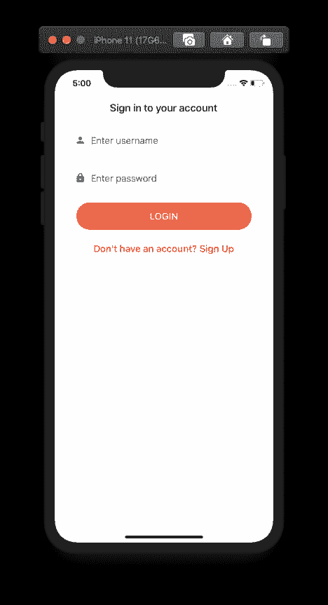

要创建新用户，请转到`SignUp`屏幕。注册成功后，它会要求验证授权码。

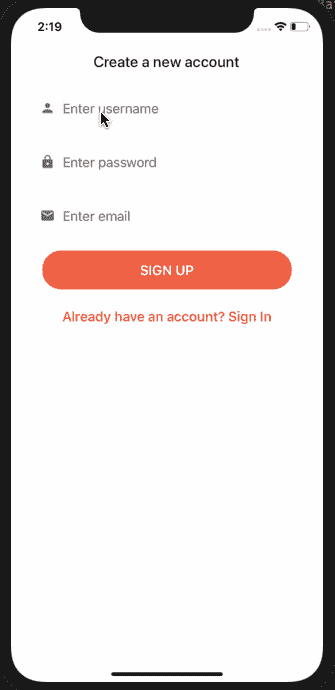

代码通过验证后，您将被重定向至`SignIn`屏幕。成功登录后，您将看到`Home`屏幕。

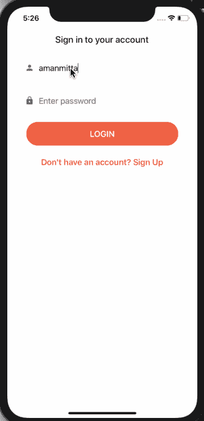

# 摘要

这是一篇很长的帖子，但我们希望涵盖所有方面，以开始使用 AWS Amplify、Expo 和 React 本机应用程序设置和配置用户身份验证。

正如您所看到的，AWS Amplify 框架是一个非常强大的库，它连接了对 AWS 云服务的访问，允许我们只需几行代码就可以立即实现登录、注册和注销等极其安全的功能。

在 [Instamobile](https://www.instamobile.io) ，我们正在构建随时可用的 React 原生应用，由各种后端支持，如 AWS Amplify 或 Firebase，以帮助开发者更快地制作他们自己的移动应用。

## 简单英语的 JavaScript

你知道我们有三份出版物和一个 YouTube 频道吗？在 [**plainenglish.io**](https://plainenglish.io/) 找到所有内容的链接！