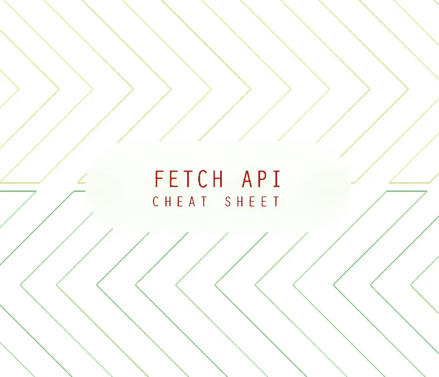

# 最终的 JavaScript 获取 API 清单

> 原文：<https://javascript.plainenglish.io/the-ultimate-javascript-fetch-api-cheatsheet-e60b98c8cdbe?source=collection_archive---------2----------------------->

## JavaScript 获取 API 用法、请求选项、异步等待、拦截、取消请求和全部承诺



获取 API 不再是实验性的，而是 MDN 的生活标准。我们必须在这篇文章中涵盖获取 API 用例以及用法的不同方面。Fetch 提供了请求和响应对象的通用定义，它将涉及网络请求。

函数`fetch()`是全局窗口对象的一部分。它是 XMLHttpRequest 的现代替代品。这几乎可以用在代码上下文的任何部分。

# 取得

`fetch()`需要一个强制参数，即资源的 URL。它返回一个解决响应的承诺。

```
*// GET Request.*
fetch('[https://api.github.com/users/rich-harris](https://api.github.com/users/rich-harris)')
  *// Handle success*
  .then(response => response.json())  *// convert to json*
  .then(json => console.log(json))    *// print data to console*
  .catch(err => console.log('Request Failed', err)); *// Catch errors*
```

## 请求选项

该请求还有一个可选的第二个参数，具有不同的请求选项。如果你发送 JSON 作为主体，它需要使用`JSON.stringify()`

带请求选项的示例`POST`请求

```
fetch('/save/data', {
  method: 'POST',  
  body: JSON.stringify(data),// if sending data as array or object
  headers: {
    'Content-Type': 'application/json'
  }
})
```

如果 HTML 表单作为数据，那么正文将

```
body: new FormData(form), // post body as form data
headers: {
    'Content-Type': 'application/x-www-form-urlencoded'
}
```

## 反应

解析 API 响应将非常重要，有各种方法可以用来处理响应。

响应对象头有`res.headers.get()`来获取响应头的值。

## 捕捉错误

```
fetch('/data.json').then(checkStatus)function checkStatus (res) {
  if (res.status >= 200 && res.status < 300) {
    return res
  } else {
    var err = new Error(res.statusText)
    err.response = res
    throw err
  }
}
```

非 2xx 响应仍然是成功的请求。用另一个函数把它们变成错误。

## 与 Node.js 一起使用

这将`fetch`添加为一个全局变量，这样它的 API 在客户机和服务器之间是一致的。

```
const fetch = require('isomorphic-fetch')
```

参见 npm 包`[isomorphic-fetch](https://www.npmjs.com/package/isomorphic-fetch)`

# 异步等待

处理异步函数是捕捉承诺的一种简单方法。函数`fetch()`可以与一个`await`关键字结合来捕获响应。

异步函数可以用来捕获回调的另一种方式。

```
// Get wrapper
const get = async (url, callback) => {   
  const response = await fetch(url)   
  const status = await response.status      
  if (callback) callback[status](await response.json()) 
} // Get usage based callback
get(url, {   
  200: body => doSomething,   
  401: body => showSignInModal,   
  403: body => redirectToSafeArea,   
  422: body => showModalWithInstruction 
})
```

# 截取

对于多个网络请求，有时我们需要根据我们的需求添加一些逻辑或附加选项。拦截提取可能是有用的。

```
fetch = (function (originalFetch) {
    return function __myFetch(req) {
        var result = originalFetch.apply(this, arguments);
        result.then(functionToDoSomething);
        return result; // or return the result of the `then` call
    };
})(fetch);
```

此外，基于包装的拦截使用了新的`Promise()`

```
const iFetch = (url) => {
    return new Promise((resolve, reject) => { // Here we can do some prerequest actions return fetch(url)
        .then((response) => { return response.json() })
        .then((data) => resolve(data))
        .catch((error) => reject(error))
    }
}
```

# 中止信号

使用附加的`AbortController()`发送信号选项将有助于使用`controller.abort()`取消请求。

# 使用全部承诺

使用`Promise.all()`和`fetch()`调用多个请求将能够通过分割实现的响应和拒绝的响应来处理多个承诺，然后得到一个最终的响应。

# 资源

1.  Mozilla 获取 API(参见[链接](https://developer.mozilla.org/en-US/docs/Web/API/Fetch_API)
2.  WHATWG 获取 API 规范(参见[链接](https://fetch.spec.whatwg.org/))
3.  我可以使用获取 API 浏览器支持吗(参见[链接](https://caniuse.com/?search=fetch)

# 结论

应用程序与外部资源紧密结合，以处理不同格式的数据。我们可以使用`fetch()` API，它是浏览器本身支持的。希望使用备忘单有助于更好地进行`fetch()` API 调用。