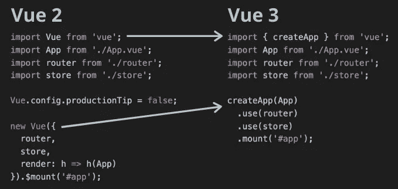
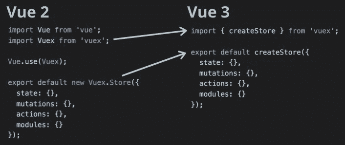
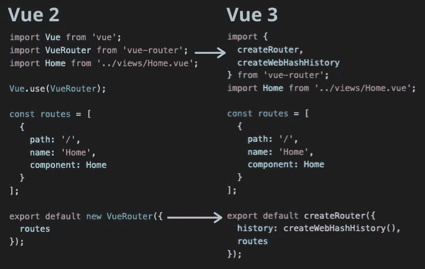

# Vue 3 升级指南

> 原文：<https://javascript.plainenglish.io/the-vue-3-upgrade-guide-a17c562e99c0?source=collection_archive---------2----------------------->

Byte-sized Vue 3

Vue 3 发布在即。我们可以期待一个更快、更小、更易维护的版本，它有很多令人兴奋的新特性。这些大多是对现有 API 的补充和改进。

没有什么能阻止你用 Vue 3 启动你的新应用程序。在本文中，我将向您展示如何领先一步，通过升级您的应用程序开始尝试新的 API。如果你对一个升级的应用程序感兴趣，看看用 Composition API 编写的 [my TodoMVC 应用程序](https://github.com/blacksonic/todomvc-vue-composition-api)或者包含每个新特性的[playground](https://github.com/blacksonic/vue-3-playground)。

# 使用 CLI

我强烈建议对 Vue 项目使用官方 CLI。除了开发和部署工具之外，它还将升级简化为一行命令:
`vue add vue-next`。

Vue 下一个插件不仅升级和安装了新的依赖项，还修改了代码以兼容第三版。

# 属国

安装插件会将`vue`、`vuex`、`vue-router`、`eslint-plugin-vue`和`@vue/test-utils`软件包升级到下一个主要版本。另外，一个名为`@vue/compiler-sfc`的新包出现在开发依赖项中。有什么好处？它将新的 Vue 单个文件组件编译成可运行的 Javascript 代码。

# 代码修改

让我们看看代码中发生了什么变化。您注意到的第一件事是主 Vue 包不再有默认导出。

Entrypoint Upgrade

命名导出`createApp`创建一个新的 Vue 应用程序，就像它在 Vue 2 中创建构造函数一样。插件设置使用`use`方法而不是构造函数的参数移动到应用程序实例。`$mount`方法失去了它的美元符号，但行为方式相同。

Store Upgrade

正如您在应用程序中看到的，插件采用工厂模式:不再有带`new`关键字的构造函数。不需要调用`new Vuex.Store`，而是需要`createStore`工厂方法。不再可能将商店的默认导出作为插件传递。

Router Upgrade

路由器插件遵循相同的模式:`new VueRouter`变成对`createRouter`的调用，必须离开全局插件设置。在新版本中，你必须定义历史的类型。你可以从`createWebHashHistory`、`createMemoryHistory`和`createWebHistory`中选择。

基本上就是这样，应用程序可以在新的 Vue 版本上启动和运行。一切都只需一个 bash 命令。其他任何东西都应该使用旧的语法，因为旧的 API 仍然完好无损。

# 尺寸很重要

如果您检查`build`命令的输出大小，您可以注意到一个轻微的下降:43.75 KiB - > 40.57 KiB。这是保留默认 Vue 实例而选择命名导出的结果。像 Webpack 和 Rollup 这样的构建工具可以对命名导出进行树抖动(删除未使用的代码)，但不能对默认导出进行树抖动。

# 没有 CLI

如果没有 CLI，您必须将`vue-loader`或`rollup-plugin-vue`升级到下一个主要版本，并添加`@vue/compiler-sfc`包。这里没有更多的魔法，你必须手动做所有的事情。你也必须手动修改代码，这里没有搜索代码库和更新语法的工具。

# 在线游乐场

如果你不想修改你的项目，但有兴趣尝试新版本，看看[我的在线游乐场](https://codesandbox.io/s/github/blacksonic/vue-3-playground)。

# 摘要

我们已经完成了升级过程中您必须进行的修改。这些修改由 Vue CLI 自动完成。你现在要做的就是开始尝试 Vue 3 提供的所有新功能:新的反应系统，合成 API，碎片，传送和悬念。

## **说白了**

通过 [**订阅我们的 YouTube 频道**](https://www.youtube.com/channel/UCtipWUghju290NWcn8jhyAw) **来表达爱意吧！**