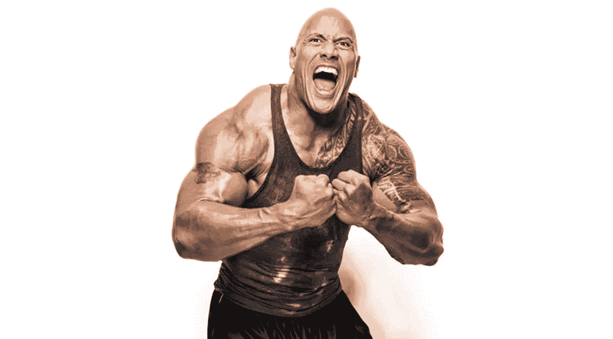
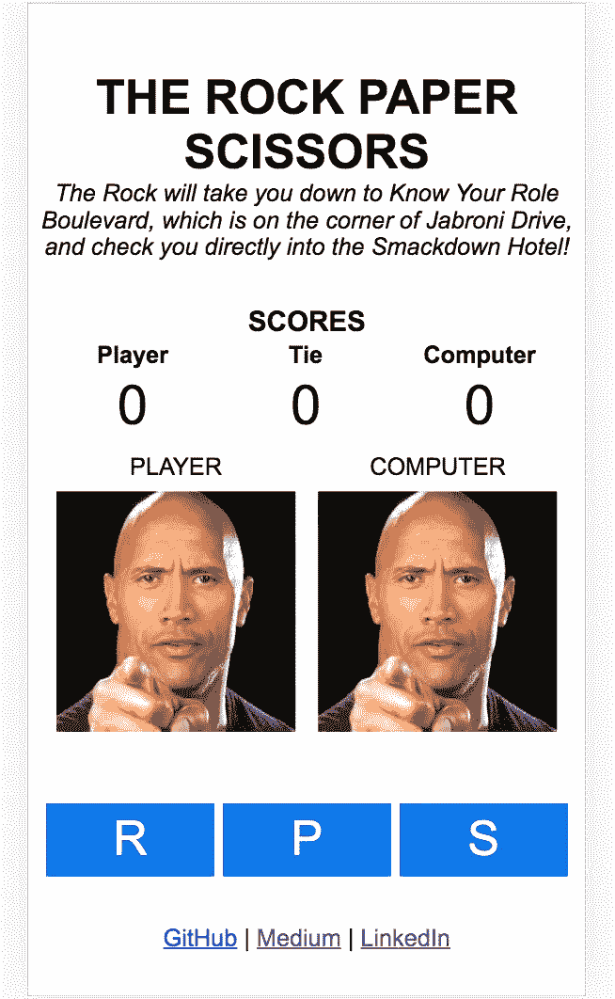
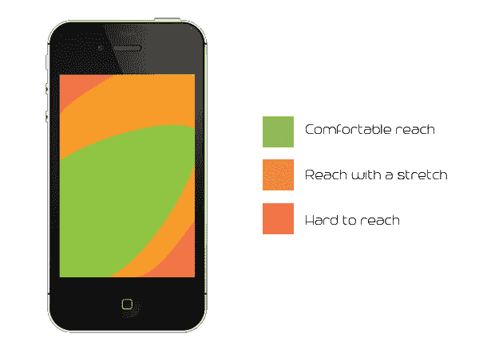
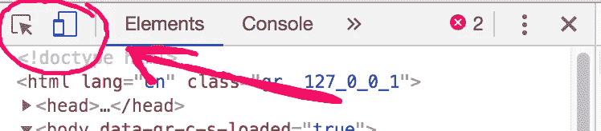
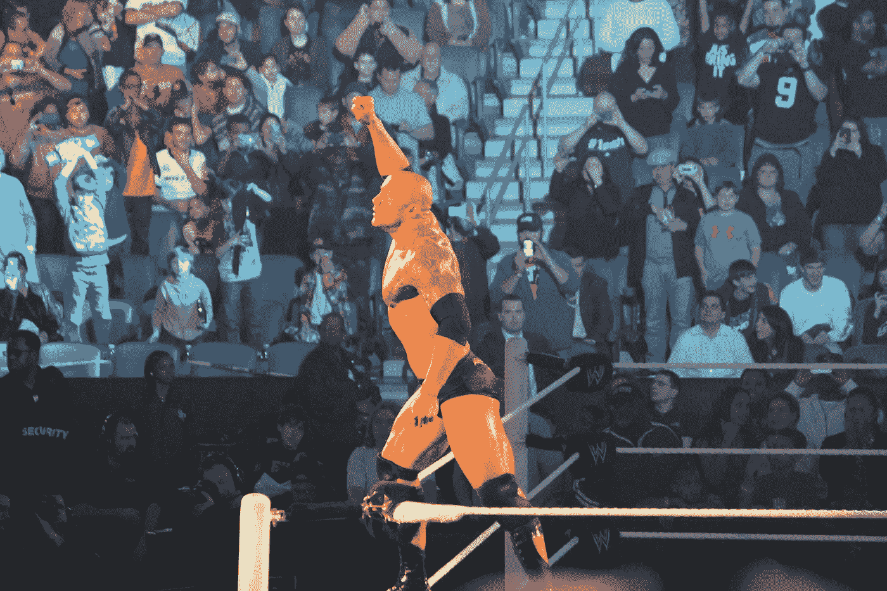
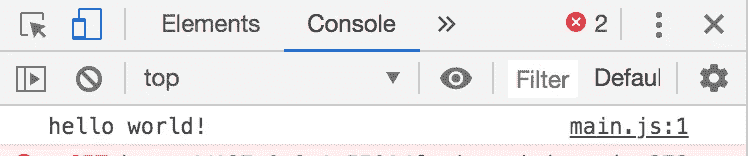
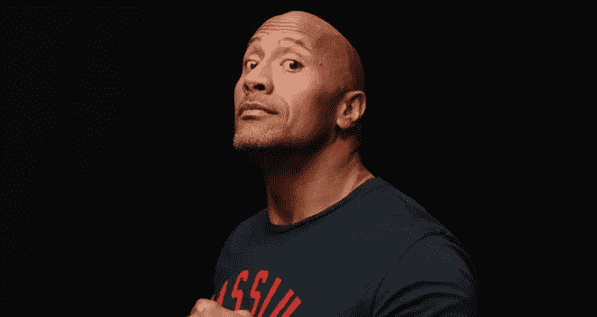

# 世界上最简单的“石头”主题石头剪刀布 JavaScript 教程

> 原文：<https://javascript.plainenglish.io/the-worlds-easiest-the-rock-themed-rock-paper-scissors-javascript-tutorial-ee99b7f83e69?source=collection_archive---------1----------------------->

如果你曾经想让“岩石”德怀恩·约翰逊教你 JavaScript，那么，今天不是你的幸运日，但今天是 ***就像*** *你的幸运日！*



这是旧游戏的新玩法，但我发现成品[非常有趣！最棒的是，你可以在一个下午把这个游戏扔在一起，发给你所有的朋友，让他们开怀大笑。](https://annaelizabeth2019.github.io/the-rock-paper-scissors-2/)

本教程是用普通的 JS、CSS 和 HTML 编写的。它是为一个初学者而写的。如果你不是一个绝对的初学者，无论如何都要玩得开心！请在这里的教程基础上，把你想出的发给我！我很想去看看。最后我们会得到这样的结果:



这里有我在 Github 上的回购和我自己的[完成游戏](https://annaelizabeth2019.github.io/the-rock-paper-scissors-2/)的链接。

# 终于！岩石是家

## 游戏要求:

*   用户有三个选择:石头、布或剪刀
*   用户可以每轮选择一个新的移动
*   电脑可以每轮自动选择一个新的移动
*   游戏将选择一个与玩家的移动选择相关联的随机图像并显示它
*   保持得分
*   显示每一轮的赢家
*   很有趣


Japan — where the world’s most dramatic RPS tournament is held

## 移动优先

> 请原谅岩石一秒钟，他的手机响了。喂？嘿，没什么。他说他认识你！
> ——德韦恩·“岩石”·约翰逊

请考虑为移动用户设计你的游戏。

你可以对这个项目的设计做任何你想做的事情。在向你提供了我的基本 HTML 和 CSS 之后，本教程将重点讨论 JavaScript。然而，我想在我们开始设置的时候加入一个关于移动优先设计的注释。

*Mobile First* 是指在任何其他平台之前为移动设计。大多数用户通过移动设备与网络互动，因此在开发这款游戏时，让这一点来指导我们的选择是有意义的。



[illustration of The Thumb Zone via Darlene Tate](https://medium.com/@BuildMySite1/how-phablets-are-changing-mobile-ux-1bf2949d14b4)

当我们观察用户拇指的自然移动时，我们看到屏幕的底部是最容易触及的。《粉碎杂志》对此有更详细的报道。甚至当我还在上学的时候，我把项目发给的朋友们会希望在他们的智能手机上打开它们。不适合移动应用的项目将很难与他人分享，即使它们很简单。

你需要做的就是使用你的开发工具(在 Chrome 上，点击 *cmd + option + i*



点击上面的图标，你就可以为移动用户设计了！

当需要查看桌面版本时，您可以使用如下代码行自定义 CSS:

```
*@media* only screen and (min-width: 600px)
```

你将能够在我下面提供的简单 CSS 中看到我是如何做到这一点的。

# 你闻到石头在煮什么了吗？

## 文件设置



via [Megan Elice Meadows](https://www.flickr.com/photos/ohhsnap_me/)

你只需要【index.html】、 **main.css** 、 **main.js** ，以及任何你想用的图片。

## HTML 设置

当我建立我的 HTML 时，我喜欢考虑页面的布局，并根据信息的层次结构将它分成几个框。*信息的层级*是一种有趣的说法，说明重要的东西应该是最容易看到的。在我们的游戏中，我希望按钮位于屏幕下方用户的“拇指区”附近，就像你在 Instagram 上看到的那样。我想要每个玩家的选择的图片在动作按钮上面，并且在顶部有一个分数。我们将跟踪玩家的分数，电脑的分数，以及平局。在最上面，我有游戏标题。这个游戏非常直观，所以我不会为方向而烦恼，但是你可以随意选择类似于，*“选择你的武器！”*

为了让这个游戏**更容易被屏幕阅读器访问，更容易被搜索**，我使用了[语义 HTML 元素](https://www.freecodecamp.org/news/semantic-html5-elements/)，而不仅仅是 div。

布局:

body > header，main，旁边还有 RPS 按钮，无耻的自我推销的可选链接

主>分数表，旁边有图片

继续尝试自己设置你的 HTML，完成后回来看看它是否和我的一样。如果你愿意，可以随意修改布局。

我的 HTML 是这样结束的:

HTML

## CSS 设置

我正在使用 [flexbox](https://css-tricks.com/snippets/css/a-guide-to-flexbox/) 让一切居中对齐。我的 CSS 是斯巴达式的，所以，请放开手脚，放弃或保留你认为正确的东西。我只要求你在继续前进之前花一点时间看看我做了什么。

确保在你的 HTML 的`<head>`中用这样的一行链接你的 CSS 和 HTML:

```
<link *rel*=”stylesheet” *href*=”css/main.css” />```
```

您必须更改`href`属性以匹配 CSS 样式表的路径。

> 有两件事你可以做，那就是什么也不做，喜欢它！“岩石”德韦恩·约翰逊

CSS

## JS 设置

接下来，我们想从你的 JS 开始。就像我们链接 CSS 样式表一样，我们需要链接 JS 脚本标签。

```
<script *defer* *src*="js/main.js"></script>
```

一定要包含那个[延迟](https://www.w3schools.com/tags/att_script_defer.asp)标签。在我们得到一个完全解析的 DOM 之前，它会阻止我们的 JS 被加载。

在 JS 文件中，使用控制台日志来确认它正在工作:

```
console.log("hello world!");
```

使用您的开发工具，您可以单击控制台按钮并查看消息！在做任何重要的工作之前，你总是希望建立 JS 和 HTML 的正确链接*，这样你就可以确定你没有忘记你的脚本标签或者使用错误的路径。*



You can ignore any [“errors” from favicon](https://www.w3.org/2005/10/howto-favicon) if you’ve made it this far!

## 图像设置

通常，每个武器只有一张图片，但我不能只选择*和“岩石”德韦恩·约翰逊的一张*照片，所以我打算每回合随机选择一张图片来显示每个武器。这让这个简单的概率游戏变得更加有趣和不可预测。花几分钟(或者几个小时——我不知道你有多少时间)找到有趣的图片用于你的项目，并把它们保存到项目根目录下的图片文件中，或者只使用 URL。随意想出你自己的主题或者在游戏中旋转！你在网上找到的大多数个人非商业用途的照片可能没问题，但你也可以通过版权过滤在 [flickr](https://www.flickr.com/) 和谷歌上的搜索，或者尝试这些免版税的照片网站:

1.  [Unsplash](https://unsplash.com/)
2.  [地形图](https://gratisography.com/)
3.  [内存文件](https://morguefile.com/)
4.  [Pixabay](https://pixabay.com/)
5.  [金库](http://www.stockvault.net/)
6.  [像素](https://www.pexels.com/)
7.  [Picjumbo](https://picjumbo.com/)
8.  [Pikwizard](https://www.pikwizard.com/)
9.  [Rawpixel](https://www.rawpixel.com/)
10.  [重拍](https://www.reshot.com/)

我们的图像元素有几个选项:创建一个

并用 JS 改变它的背景图像，或者创建一个图像并用 JS 改变它的**源**。背景图片很好，因为与不同大小的图片相比，它们不太可能弄乱页面的布局，但是我将使用一个< img >元素并更改来源。我认为这些图像是这个游戏的**内容**的一部分，而不是背景，并且不像 div，图像带有一个 [alt 属性](https://www.w3schools.com/tags/att_img_alt.asp)，允许**屏幕阅读器**更好地工作，所以我们的应用程序更容易访问和搜索。一定要测试你所有的图片，确保尺寸正常，如果需要的话调整你的 CSS。**正方形**~ 500+px 的图像最好。

# 想办法

所以，我要考虑一下我的游戏，把它分成几个不同的部分。仔细检查每个问题，看看你的答案是否与我想出的答案一致。

页面上需要更改什么？(**缓存的元素引用**)

我的回答:

*   形象
*   得分

我们将在内存中记录什么？(**状态**)

我的回答:

*   电脑、玩家和平局的分数
*   赢家，如果有的话
*   与每个武器相关的可用图像
*   可用的武器和他们能打败的对手

我们需要了解哪些用户操作？(**事件监听器**)

我的回答:

*   点击攻击招式

我们需要采取什么行动？(**功能**)

我的回答:

*   响应玩家选择的移动
*   决定获胜者
*   显示结果

计划是将上面的每个要点分解成一段代码。完成后，我们来玩游戏！

# 缓存的元素引用

## 得分

```
*// --- cached element references ---**// SCORES*const pScore = document.getElementById("player-score");
const cScore = document.getElementById("computer-score");
const tScore = document.getElementById("tie-score");
console.log(pScore, cScore, tScore);
```

我包含了一个 console.log，这样我们可以在控制台中看到这些变量的样子，并确保我们在页面上抓取 HTML 元素。

为了使这一部分正常工作，请确保包含分数的元素具有正确的 id 属性，例如:

```
<tr>
  <td id="player-score">0</td>
  <td id="tie-score">0</td>
  <td id="computer-score">0</td>
</tr>
```

现在，如果我这样做:

```
const pScore = document.getElementById("player-score");
const cScore = document.getElementById("computer-score");
const tScore = document.getElementById("tie-score");
console.log(pScore, cScore, tScore);
// new code below
pScore.innerHTML = 1;
cScore.innerHTML = 4;
tScore.innerHTML = 3;
```

我应该会在文档中看到新的分数。

## 形象

```
*// SCORE ELEMENTS* const pScore = document.getElementById("player-score");
const tScore = document.getElementById("tie-score");
const cScore = document.getElementById("computer-score");// ----- NEW CODE BELOW ----*// IMAGE ELEMENTS* const pImgEl = document.getElementById("player");
const cImgEl = document.getElementById("computer");console.log(pImg, cImg); // don't forget to clean up console.logs like this one later! We don't want to clutter the console!
```

我已经将新变量放入我常用的 console.log 中，以确保我得到了我认为我得到的东西。就像分数一样，确保图片的“id”属性是正确的。您应该能够在 js 中用这样一行代码来更改您的图像:

```
pImg.src = "images/paper1.jpg";
```

您可以使用本地文件的路径或您选择的图像的 URL。gif 也可以。在继续之前，不要忘记删除上面的行、console.logs 以及您对分数所做的任何更改。

# 状态

## 得分

我将使用一个对象来创建我的 RPS 图像“库”。每个攻击都有一个字符串数组，代表一个图像的路径。

RPSLibrary

现在，如果您的 js 中有这个，您应该能够看到图像的变化:

```
pImg.src = RPSLibrary.scissors[2];
cImg.src = RPSLibrary.scissors[3];pImg.alt = "scissors";
cImg.alt = "scissors; // you can inspect the element to be sure "alt" attribute changed for screen readers
```

确保**测试每一张图片**以捕捉任何打字错误或断开的链接/路径。

## 胜利逻辑第一部分

我们还需要知道以后哪种武器会打败哪种武器。所以，我要扩建我的图书馆。不是每个攻击持有一个数组，而是持有一个对象。现在我们的对象中有了对象。你能处理好吗？是的，你可以。

RPSLibrary // the next level

请注意，我们现在将像这样更改库中的图像:

```
pImg.src = RPSLibrary.rock.images[3];
```

在继续之前，请确保清理到目前为止您已经控制台记录或更改的值。

等等，我们要改变的那个绝妙的小属性呢？我从没想过你会问！让我们将这个俄罗斯嵌套玩偶对象带到下一个级别，并使每个“图像”成为保存路径和 alt:

RPSLibrary // after second refactor

# 功能

## 选择一件随机武器

对于我们的第一个功能，我需要我的电脑来选择一个攻击。我将使用`Math.floor()`和`Math.random()`来舍入一个随机数。首先，我会选择一种武器，然后是一个图像，并分配给电脑。

```
const randomPicker = () => { const weapon = RPS[Math.floor(Math.random() * 3)]; // selects a weapon at random console.log(weapon)
  return weapon};
```

我们想在 0 和 RPS 的索引)之间选择一个随机武器，所以我们使用 JavaScript 的便利的`[Math.random](https://developer.mozilla.org/en-US/docs/Web/JavaScript/Reference/Global_Objects/Math/random)`函数。`Math.random`会给我们一个 0 到 1 之间的随机浮点数(小数点)。它不会大到 1，但也可能小到 0。接下来，我们将随机小数点乘以 3，这是我们从中选择的可能选项的数量。这将用`Math.floor`来包装，所以它向下舍入到最接近的整数。随机数对各种事情都非常有用，所以这是一个需要记住的很好的函数！

继续在你的控制台上输入`randomPicker()`来看看它是怎么运行的！你得到一些随机数了吗？酷！

## 开始游戏

既然我们有能力选出一个结果，让我们开始一个游戏。我们希望有一个可以每轮更新的**结果**变量。

```
*// --- variables ---*let results;
```

我们需要一个初始化函数来实例化游戏的当前状态:

```
function init() {*// p is for player c is for computer* results = {
    p: "rock",
    c: "rock"
  };}// don't forget to call it! 
init()
```

我们将在整个教程中继续更新这个函数，但这就是我们目前所需要的。不要忘记在你的 JS 中调用`init()`函数。

## 轮流

既然我们已经开始游戏了，让我们轮流试试。我们需要一个函数，把这三个放到你的函数部分:

RPS functions

当用户选择一个攻击时会触发一个回合，因此我们需要使用 eventListeners 来监听点击:

```
*/*----- event listeners -----*/* document.getElementById("rock-btn").addEventListener("click", handleTurnR);document.getElementById("paper-btn").addEventListener("click", handleTurnP);document.getElementById("scissors-btn").addEventListener("click", handleTurnS);
```

单击上的每个 RPS 按钮，确保它们都触发控制台日志。

现在，我们需要做的就是将我们的 results.p 更新为我们之前设置的每个函数中的正确变量:

```
function handleTurnR() { results.p = "rock";}function handleTurnP() { results.p = "paper";}function handleTurnS() { results.p = "scissors";}
```

在我们设置了 results.p 之后，所有这些函数都将做同样的事情:为计算机选择一步棋，确定赢家，并显示比赛的结果，所以让我们在我们要做的地方建立一个函数，并确保在我们的每个`handleTurn()`函数中调用它:

RPS functions

现在您应该得到控制台日志和结果。注意，results.c 还没有改变。让我们确保处理好这个问题:

```
function handleResults() { results.c = randomPicker(); console.log("turn taken!", results, winner);}
```

当你点击按钮，你应该看到你的球员和计算机的结果更新。

## 决定获胜者

为了确定谁是赢家，我们需要一个[全局](https://developer.mozilla.org/en-US/docs/Glossary/Global_scope)赢家变量。全局意味着它对所有其他范围都是可见的，就像我们的结果变量一样。

```
*// --- variables ---*let winner, results;
```

你可能想用 init()实例化 winner，也可能不想，如果你不这样做，它将是未定义的。否则，只需将其设置为等于 null:

```
function init() { *// p is for player c is for computer* results = {
    p: "rock",
    c: "rock"
  }; winner = null; *// null -no winner yet; if 'p' -player wins; if c -computer wins, if t - tie;*}
```

现在我们有了赢家，我们可以写一个函数来更新每一轮的变量。让我们总结一下我们的函数，并考虑它应该如何工作:

```
function getWinner() { // see if player and computer chose the same thing: that's a tie
  // see if player defeats computer: return player
  // only other option is that computer won, sorry player!}
```

该函数需要查看我们玩家的选择，将其与我们计算机的选择进行比较，并基于我们的**结果**返回“平局”、“玩家”或“计算机”。

```
function getWinner() { *// t for tie, p for player, c for computer
  if* (results.p === results.c) {
    *return* "t";
  } *// we can also use brackets to access a property in RPSLibrary that we'll set with a variable* *if* (RPSLibrary[results.p].defeats === results.c) {
    *return* "p";
  }
 *return* "c";}
```

> 你得到了 Spinnerooni，Dipsy Doodle 和 Succotash
> ——Dwayne“岩石”约翰逊

注意，你看不到“ *else* ”或“ *if else* ”，那是因为如果我到达一个 if 块，我就从函数返回，所以“ *else* 是隐式的！当我到达最后一个 return 语句时，我总是想返回 results.c，如果我还没有碰到另外两个块中的一个，那么我不需要另外一个。这叫做[否否则返回](https://www.samanthaming.com/tidbits/23-no-else-return/)。现在你应该可以使用你的控制台输入`getWinner()`，它应该返回`“t”`，但是如果你输入`results.p = "paper"`，`getWinner()`现在应该返回`“p”`，如果你输入`results.p = "scissors"`，`getWinner()`应该返回`“c”`。在继续之前，请确保该方法有效。如果没有，检查错别字或其他错误。

让我们在 handleResults()函数中更新 winner 变量:

```
function handleResults() { results.c = randomPicker(); *// new code below* winner = getWinner();
  console.log("turn taken!", results, winner);}
```

太好了！

## 得分

现在我们有了结果，是时候开始追踪分数了。让我们给全局变量打分:

```
*// --- variables ---*let winner, results, scores;
```

而我们的`init()`功能:

init function

现在在`handleResults()`中，我们想在每一回合中给获胜者的分数加一分:

```
function handleResults() { results.c = randomPicker();
  winner = getWinner(); *// new code below* scores[winner]++;
  console.log("turn taken!", results, winner, scores);}
```

太好了！就一句台词！

在这一点上，我们可以发挥整个游戏的岩石，纸，剪刀从控制台内。随着游戏的进行，我们可以选择移动，获得结果，并保持分数。此时，您已经编写了一个功能完整的游戏。

# 把它照亮真的很好…

> 带着米老鼠纹身和 33 磅重的头的殡仪员
> -德韦恩“摇滚”约翰逊

许多教程可以教你编写这个游戏或类似的游戏。也许他们甚至会用更少的代码行来完成它，但是我经常看到他们**没有**强调定义和操纵状态的方法，然后继续呈现该状态。

我想强调的是，我们的设计是以 ***数据为中心的*** 。许多教程可以教你编写这个游戏或者类似的游戏，但是我经常看到它们**没有**来强调定义和操纵状态的方法，并且在继续渲染该状态之前。有时他们会边走边呈现状态，有时不会，但他们不会向学习者解释他们为什么要这样做。这种以数据为中心的方法是有组织的，可以帮助我们发现程序中的缺陷，并减少不必要的重新渲染。

让我们写一个`render()`函数，为最终用户显示游戏。我将使用一些注释来定义我们的意图，并使用一个简单的控制台日志来验证当我想调用它时它是否被调用。

```
function render() { *// select random images from our RPS library for p and c
  // update scores
  // update images
  // highlight the winner* console.log('render working!')
}
```

让我们确保在`handleResults()`结束时调用该函数:

```
function handleResults() { results.c = randomPicker();
  winner = getWinner();
  scores[winner]++; *// new code below* render();}
```

这里最棘手的部分是随机选择要显示的图片，但幸运的是，我们已经知道如何从随机选取器中获取随机数。

让我们修改我们在那里使用的函数，从 RPSLibrary 的图像部分获取一个随机的索引号。如果这在一开始没有意义，尝试将一些值导出到它们自己的变量中可能会有所帮助。这一次，请确保**不是乘以 3，而是乘以您选择的图像阵列的长度**。

render function

这里的**与**完全相同，但是 *cImgs* 用更易读的变量分解。我会让你来决定你更喜欢哪个版本:

render function with cImgs broken down

请确保检查您的控制台日志中是否有这些图像。好了，让我们开始更新这些 DOM 元素吧！

对于我们的分数，我们将像开始时一样更改它们，但这次我们将使用我们在 state 中保存的值:

render

放松。图像:

render with images

嘿！我们基本上已经有了一个工作游戏！让我们为获胜者添加一个有趣的边框，为我们的用户提供更多的视觉信息，并使用我们的无其他回报策略:

render function final version

全部完成！如果你喜欢这个教程，看看我的第一个，世界上最强大的井字游戏 JavaScript 教程[。](https://medium.com/javascript-in-plain-english/the-worlds-most-empowering-tic-tac-toe-javascript-tutorial-a889e4c20883)



[via flickr](https://www.flickr.com/photos/151401612@N04/34319038303/in/photolist-UhE3qX-26A3vB4-e3bDNU-e35Y1F-e3bE43-2ecrgiM-2g6jvPk-2hUx9yk-2gNGmUs-2hRGhYr-jqAxV-Mhp16k-o2hQHP-sQAhaj-nK7qza-nZA3F9-o2zXwZ-nK6Asj-nK7kL2-nK7n5p-o2ucjE-o4ngsk-T4MBEE-ntfqY3-6vHSNt-2i5GwGe-e3bF8b-o4nih2-2h6utTp-o2udFs-drxZe5-o2zXqX-9EtLqA-9EqRKB-e4GUBo-e4GoGS-e4GoGQ-e4AMVH-dQT6hK-nK7rDe-25qx8Ad-7m8HKQ-2e744nq-24C5cJV-5GPHHX-P7zKEQ-e3bF3j-e3bDBy-e35X2a-e35WBH)

# 还想吃更多吗？

您可以尝试添加到该计划中的 2 级附加功能:

*   在攻击移动被选择之后，在显示结果之前运行的倒数计时器
*   移动时播放的声音效果
*   使用 2 个 ternaries 代替`if`语句设置边框颜色。
*   在 GitHub 页面(或任何地方)上启动，然后把链接发给我！(请这样做！)

## **简明英语 JavaScript**

喜欢这篇文章吗？如果有，通过 [**订阅我们的 YouTube 频道**](https://www.youtube.com/channel/UCtipWUghju290NWcn8jhyAw) **获取更多类似内容！**