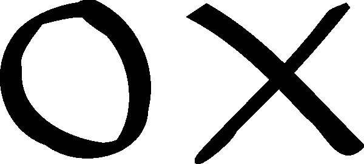

# 世界上最强大的井字游戏 JavaScript 教程

> 原文：<https://javascript.plainenglish.io/the-worlds-most-empowering-tic-tac-toe-javascript-tutorial-a889e4c20883?source=collection_archive---------0----------------------->

## 井字游戏对于任何新程序员来说都是一个很好的入门项目！



本教程是为绝对初学者准备的。我包含了文档的链接。请过目一下。本教程是 100%的普通 JavaScript，只有最少的 CSS 和 HTML。慢慢来，让我知道结果如何。

编辑:如果你真的让*卡住了*，这里是完整的代码:[https://github.com/annaelizabeth2019/tictactoetwo](https://github.com/annaelizabeth2019/tictactoetwo)

**你将需要:**

*   VS 代码
*   互联网(既然你正在阅读在线教程，那么你已经成功了一半！好样的。)

# **入门**

首先在你的电脑中创建一个名为*谢丽尔的井字游戏*的目录，并创建这些子目录: *js* ，*CSS*；还有这三个文件:*index.html*、 *css/style.css* 、 *js/main.js* 。

**复习基础:**

在开始任何编程任务时，总是先明确你想做什么，然后把它分解成小步骤。如果你有足够的时间，一小步可以让你到达任何地方。如果你卡住了，把它分解小一点，女孩！

井字游戏是一种在**3 x 3 格子上进行的**双人游戏**。**选手**轮番上阵**。一个**标记“X”**，另一个**“O”**。当一名玩家能够**将他们的 3 个标记排成一行、一列或对角线**时，就宣布**赢家**。在不再有可用空间并且没有人获胜的情况下，**宣布平局**。分解一下，这是我们的游戏计划:

*   3 x 3 网格
*   留下你的印记
*   轮流
*   “X”和“O”
*   获胜逻辑:将 3 排成一行、一列或对角线
*   宣布平局
*   游戏结束了

# **3×3 网格**

啊，我们游戏的基础！

如果你是在 VS 代码中，通过输入`!` *+ enter* 创建一个 HTML 样板文件(因为我告诉你你是这样的，如果我们不能互相信任，我们就不能做这个教程，现在我们能吗？)

通过将 CSS 和 JavaScript 包含在 HTML 的头部来链接它们:

```
<head><meta *charset*="UTF-8"><meta *name*="viewport" *content*="width=device-width, initial-scale=1.0"><meta *http-equiv*="X-UA-Compatible" *content*="ie=edge"><!-- this is how we link up the stylesheet --><link *href*="css/style.css" *rel*="stylesheet" *type*="text/css">*<!-- And this is how we link up the JS! -->*<script *defer* *src*="js/main.js"></script>*<!-- Be sure to give your game a fun title -->*<title>Empowering Tic Tac Toe for the Good of Humanity</title></head>
```

注意`<script>`标签中的`defer`:单词 *defer* 将告诉浏览器[等待执行](https://developer.mozilla.org/en-US/docs/Web/HTML/Element/script)那个 JS 块，直到 DOM 被完全解析。这样，它可以安全地包含在我们的 HTML 文档的顶部。

**我是你的控制台 AMA:** 通过在 *main.js* 中写下这一行代码来测试你的 *main.js* 是否链接上了:

```
console.log('Your JS is linked up. Be the person you needed when you were little.')
```

如果你打开一个文档的实时服务器并检查你的[开发工具](https://developers.google.com/web/tools/chrome-devtools/)，你应该在控制台看到你的消息。

回到*中的`<body>`index.html*:

```
<h1>Tic-Tac-Toe</h1><h2>It's X's turn!</h2>*<!-- Many websites are just divs on divs on divs. Pay attention to the class and id attributes. We will be using those later to style and find elements in the document -->*<div *class*="flex-container flex-column"><div *class*="flex-container flex-wrap" *id*="board"><div *class*="square"></div><div *class*="square"></div><div *class*="square"></div><div *class*="square"></div><div *class*="square"></div><div *class*="square"></div><div *class*="square"></div><div *class*="square"></div><div *class*="square"></div></div>*<!-- A reset button because users are going to want to play round after round of your glorious game without ever refreshing the browser! -->*<button *id*="reset-button">reset</button></div>
```

许多程序员不喜欢写 CSS。许多人会让我们相信这是因为他们是不想在 CSS 琐事上浪费时间的程序员，然而，我亲爱的谢丽尔或拉里，或者不管你是谁，你对自己的能力很有信心，你知道演示是你产品体验的一个重要部分。因此，我将提供一些基本的**样式，但是你不会害怕让它成为你自己的样式！去吧！让它发光吧，谢丽尔！**

在 *css/style.css* 中:

```
body {text-align: center;font-family: Arial, Helvetica, sans-serif;}h2 {margin: 0 auto;font-size: 35px;margin: 10px;}*.flex-container* {*/* In order to use flex-box we need to first set our display property */*display: flex;*/* center the container horizontally */*justify-content: center;*/* this will center content vertically */*align-items: center;*/* tells the container to align the children in columns rather than rows */*}*.flex-column* {height: 100%;width: 100%;flex-direction: column;}*.flex-wrap* {*/* tells the container to drop down once it reaches max-width */*flex-wrap: wrap;height: 432px;width: 432px;}*.square* {border: 2px solid rgba(0, 0, 0, .75);height: 140px;width: 140px;}*#reset-button* {text-align: center;font-size: 20px;border: 1px solid black;height: 55px;width: 100px;margin: 10px;}
```

如果你没有使用过 flex-box，你应该知道它是一个强大的布局工具。另一个很好的选择是 CSS [网格](https://css-tricks.com/snippets/css/complete-guide-grid/)。不要害怕他们，要变得凶猛，在这里读。

# 留下你的印记

我们有一个华丽的 3 x 3 游戏板，我们的 CSS 和 JS 连接在一起，让我们做我们的标记，好吗？

用这些标题组织你的 *js/main.js* :

```
*/*----- constants -----*/**/*----- app's state (variables) -----*/**/*----- cached element references -----*/**/*----- event listeners -----*/**/*----- functions -----*/*
```

这一点组织将有助于保持我们的代码**干净**和**可读**。它还将帮助我们组织我们的代码，以便我们可以更有效地编写。继续吧，谢丽尔，继续吧。

*做记号是什么意思？*做标记意味着有一个可以做标记的地方:

```
*/*----- app's state (variables) -----*/*let board;
```

做标记意味着游戏已经开始。

让我们使用一个函数将棋盘初始化为一个由 9 个空字符串组成的[数组](https://www.w3schools.com/js/js_arrays.asp)。我们的 JS 对 HTML 文档还一无所知。JS 数组中的每个位置将对应 HTML 板上的一个方块。让我们模仿 HTML 中的 3 x 3 网格来给自己一个视觉辅助。数组的 3 x 3 结构不会改变什么。它可以写在一行上！

```
function init() {board = ['', '', '','', '', '','', '', ''];};//be sure to call the init function!init();
```

做标记意味着渲染游戏中的变化。

让我们建立一个渲染函数:

```
function render() {}
```

现在，让我们想想我们想做什么。这个渲染函数将需要**在我们的棋盘数组上迭代**，并将标记“注入”到正确的 div 中。让我们使用一个叫做[的方便的小功能。forEach()](https://developer.mozilla.org/en-US/docs/Web/JavaScript/Reference/Global_Objects/Array/forEach) 。这个函数接受一个[回调函数](https://developer.mozilla.org/en-US/docs/Glossary/Callback_function)，它将调用数组中的每个元素:

```
function render() {board.forEach(function(mark, index){
console.log(mark, index);
});};
```

调用 render():

```
function init() {board = ['', '', '','', '', '','', '', ''];// new code here
render();};
```

继续打开一个服务器，然后点击 *cmd + opt + i* 查看你的控制台！你应该能看到板上所有的索引号！试着把一些东西扔进棋盘阵列上的空字符串，看看控制台会发生什么。

做标记意味着标记显示在页面上。

抓住我们的方块:

```
*/*----- cached element references -----*/*const squares = Array.from(document.querySelectorAll('#board div'));
```

[Array.from()](https://developer.mozilla.org/en-US/docs/Web/JavaScript/Reference/Global_Objects/Array/from) 函数将从 [querySelectorAll](https://www.w3schools.com/jsref/met_document_queryselectorall.asp) 返回的所有元素中创建一个数组。请注意，querySelectorAll 正在查找 id 为*的元素。board* 并选择**该元素的所有 div 子元素**。这样，我们不必给每个方块一个 id，分别选择它们，然后构建一个新的数组。JavaScript 为我们做到了！相当酷！

将它们传递给 render():

```
function render() {board.forEach(function(mark, index) {*//this sets the text content of the square of the same position to the mark on the board.* squares[index].textContent = mark;});};
```

现在，你做了一个标记，谢丽尔！犒劳自己！

# **轮流**

*轮流是什么意思？*拐个弯就是有个弯。

回到州区，像老板一样抛出你的回合变量:

```
*/*----- app's state (variables) -----*/*let board;let turn = 'X';
```

进行一个回合意味着一个事件(例如“点击”)已经发生。

听黑板上的咔嗒声。我们将需要使用 [getElementById](https://www.w3schools.com/jsref/met_document_getelementbyid.asp) ()来“抓取”一个 HTML 元素，然后将事件监听器链接到它上面:

```
*/*----- event listeners -----*/*document.getElementById('board').addEventListener('click', handleTurn);
```

[addEventListener()](https://developer.mozilla.org/en-US/docs/Web/API/EventTarget/addEventListener) 有两个参数，一个是要监听的事件，另一个是当事件被监听时要执行的回调函数。我们需要编写回调函数:

```
*/*----- functions -----*/*function handleTurn(event) {let idx = squares.findIndex(function(square) {*return* square === event.target;});};
```

“[事件](https://developer.mozilla.org/en-US/docs/Web/API/Event)是点击，“[目标](https://developer.mozilla.org/en-US/docs/Web/API/Event/target)是事件发生的元素——我们点击的方块。 [findIndex()](https://developer.mozilla.org/en-US/docs/Web/JavaScript/Reference/Global_Objects/Array/findIndex) 在我们的 squares 数组中查找与用户点击的方块相匹配的方块的索引！

干得好！你可以改变世界，谢丽尔。

我说世界了吗？我指的是*板*。改变我们持有的状态:

```
function handleTurn(event) {let idx = squares.findIndex(function(square) {*return* square === event.target;});// new code belowboard[idx] = turn;// check your console logs to make sure it's working!console.log(board);};
```

你的状态变了吗？你在这场比赛中和你的人生中都走在正确的轨道上。你能行的。你可以把板子变得更好！

# **“X”和“O”**

我们仍然没有在这个游戏中包含“O ”,这使得它很容易获胜，但玩起来并不有趣。所以，我们用一个三元组来更新这个状态。

名词似乎会使人迷惑。今天就学会写一篇，感谢一直以来的自己。这里是我们的逻辑:*如果是 X 的回合，那么把回合分配给 O；如果不是轮到 X，则将该回合分配给 X。*让我们将该逻辑放入三元结构中:

```
<condition> ? <if condition is true, this> : <else if condition is false, this>
```

将赋值“turn =”放在三元组前面，并尝试通过控制台将其注销。如果这需要一分钟也没关系。深呼吸谢丽尔。完成后，不要忘记调用 render()函数。总的来说应该是这样的:

```
function handleTurn() {let idx = squares.findIndex(function(square) {*return* square === event.target;});board[idx] = turn;// This is tidyturn = turn === 'X' ? 'O' : 'X';// In an if statement it would look like: // if (turn === 'X') {
// turn = 'O' 
// } else {
// turn = 'X' 
// };// writing the ternary saved you from all that. render();};
```

他妈的哒哒！现在我们有一个井字游戏！没有什么能让你内心闪耀的光芒暗淡！

让我们修复我们的

## ,这样我们的用户就能得到正确的信息，并知道什么时候轮到他们了:

```
*/*----- cached element references -----*/*const squares = Array.from(document.querySelectorAll('#board div'));// new code belowconst messages = document.querySelector('h2');
```

我们应该什么时候改变信息？当我们渲染时！

```
function render() {board.forEach(function(val, idx) {squares[idx].textContent = val;});// new code belowmessages.textContent = `It's ${turn}'s turn!`;};
```

反斜线(`)允许我们使用[模板文字](https://developer.mozilla.org/en-US/docs/Web/JavaScript/Reference/Template_literals)在字符串中嵌入 JS 表达式。

# **胜利逻辑**

*胜利意味着什么？*

赢意味着有赢这种东西:

```
*/*----- app's state (variables) -----*/*let board;let turn = 'X';// new code belowlet win;
```

每次玩家走一个回合，我们都需要检查他们是否走了致胜的一步。让我们从第一排开始。它有从 0 到 2 的索引。因此，获胜的逻辑将是:如果在索引 0 中有一个标记，并且它与索引 1 和 2 中的标记相匹配，则存在获胜。一整天。

```
win = board[0] && board[0] === board[1] && board[0] === board[2] ? board[0] : null;
```

请注意，我们首先检查 board[0]中是否有内容。如果我们只是检查所有三个位置是相同的，当它们都是空的时，我们会得到一个赢家。第一个`board[0]`防止了这一点。这个三元组有三个条件，但它仍然是相同的结构:

```
<condition1 && condition2 && condition3 > ? <if all 3 conditions are true, this> : <else, this>
```

通过键入 *win* 并查看您的控制台返回 true 还是 false，使用您的控制台检查您的 win 变量是否正常工作。你可以写下所有这些陈述，这将有助于你的成功逻辑，或者…

## **重构**

我们有 3(行)+ 3(列)+ 2(对角线)= 8 种可能的获胜方式。让我们制作一个获胜组合的索引数组。在这里，你会发现我们的 3 x 3 形状的棋盘阵列有助于找到获胜组合的索引号。制作一个组合数组，其中每个元素都是获胜移动的索引号的嵌套数组:

```
*/*----- constants -----*/*const winningCombos = [[0, 1, 2],[3, 4, 5],[6, 7, 8],[0, 3, 6], [1, 4, 7],[2, 5, 8],[0, 4, 8],[2, 4, 6]];
```

创建一个新的函数来测试每一轮的赢家:

```
*/*----- functions -----*/*function getWinner() {// just stub it up for now.}
```

现在，让我们重构 handleTurn()函数来调用 getWinner()，并将其输出赋给 win 变量:

```
function handleTurn() {let idx = squares.findIndex(function(square) {*return* square === event.target;});board[idx] = turn;// new code herewin = getWinner();render();};
```

谢丽尔，你是一个宝藏。现在，我们需要 getWinner()函数来遍历 winningCombos 数组，并检查是否有一个玩家在棋盘上有获胜的标记组合。我们可以使用 winningCombos.forEach()来做到这一点。这样，我们只需要编写一次获胜逻辑，但它将根据我们所有 8 种可能的获胜组合进行检查。我们的 forEach()回调函数将接受两个参数，数组中的元素和元素的索引:`function(combo, index)`同样，我们可以使用相同的逻辑，但我们将测试是否所有三个标记都匹配获胜组合数组中的组合。试试看！您将得到类似这样的结果:

```
function getWinner() {let winner = null;winningCombos.forEach(function(combo, index) { *if* (board[combo[0]] && board[combo[0]] === board[combo[1]] && board[combo[0]] === board[combo[2]]) winner = board[combo[0]]; }); *return* winner;};
```

这看起来像我们以前的逻辑，但是我们写了一个函数来一次检查所有获胜的组合。使用 console.log()检查您的功能。

Werk！让我们更新我们的消息，以便当有获胜者时，它显示获胜者。这可以用我们的朋友三元组在一行中完成。

```
messages.textContent = win ? `${win} wins the game!` : `It's ${turn}'s turn!`;
```

# 宣布平局

平局是什么意思？这意味着棋盘已满，没有剩余的棋步或获胜的机会。让我们将它放入 getWinner()函数中:

```
function getWinner() {let winner = null;winningCombos.forEach((combo, index) => {*if* (board[combo[0]] && board[combo[0]] === board[combo[1]] && board[combo[0]] === board[combo[2]]) {winner = board[combo[0]];}});// new code below*return* winner ? winner : board.includes('') ? null : 'T';};
```

或者，如果你想看没有三元的:

```
function getWinner() {let winner = null;winningCombos.forEach((combo, index) => {*if* (board[combo[0]] && board[combo[0]] === board[combo[1]] && board[combo[0]] === board[combo[2]]) {winner = board[combo[0]];}});// new code belowif (winner) {
  return winner 
} else if (board.includes('')) {
  return null // if there's an empty space, return null (no winner yet)
} else {
  return 'T' // no winner and no empty spaces? That's a tie!
}
```

现在，让我们更新消息，这样它就不会显示“赢不了游戏”!“如果有平局的话。试着看看这个嵌套的三元组，并把它翻译成通俗易懂的语言:

```
messages.textContent = win === 'T' ? `That's a tie, queen!` : win ? `${win} wins the game!` : `It's ${turn}'s turn!`;
```

消息的文本内容将是:如果`win`不是“那么”，那就是平局，女王！“，如果有赢的话，“<胜者>胜游戏！”，扬手，“该<轮到>了。“乍一看，这可能会令人困惑，但这并不会使你的坏蛋身份减少。再看一遍，或者试着在 if…else 语句中写出等价的语句。如果你卡住了，不要担心！我已经把解决方案写在下面了。

经典 if/else 语句版本:

```
if ( win === 'T' ) {
  messages.textContent = `That's a tie, queen!`
} else if (win) { 
  messages.textContent = `${win} wins the game!`
} else {
  messages.textContent = `It's ${turn}'s turn!`
}
```

Ternaries 很有趣，但需要注意的是:不是每个人都喜欢看到它们嵌套，因为这会降低可读性，但我不希望你在遇到它们时感到困惑。

# 游戏结束了

游戏结束了。让我们按下重置键，这样我们就能有一个新的开始:

```
*/*----- event listeners -----*/*document.getElementById('board').addEventListener('click', handleMove);//new codedocument.getElementById('reset-button').addEventListener('click', init);
```

我只是重用了 init()函数来重置游戏，但你不必这样做。这是你的世界，谢丽尔。

回顾工作游戏，试着挑战自己，寻找改进的方法。以下是一些想法:

*   让玩家可以记录分数
*   让玩家可以选择谁先走(现在，X 总是先走)
*   添加一些更酷的风格
*   当一个正方形被一个标记填满后，它就不能被改变了
*   看看你能否用不同的方式重写一个函数
*   让它对移动用户做出响应
*   拿出你自己的改进，然后把它建出来！

## 继续吧，谢丽尔，继续吧。