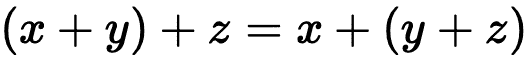
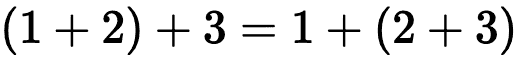
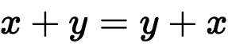
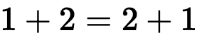
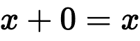
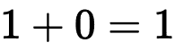
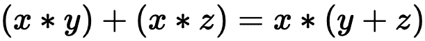
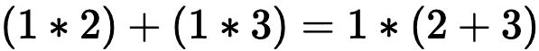

# 世界上最温和的函数式编程介绍

> 原文：<https://javascript.plainenglish.io/the-worlds-most-gentle-introduction-into-functional-programming-930395a00b6f?source=collection_archive---------10----------------------->

您第一次涉足函数式编程可能会让人感到**谦卑**。如果您熟悉面向对象编程或任何类似的衍生工具，那么研究不同的范例需要重新思考，并放松到基础概念。

挑战是意料之中的。我们从事的行业需要坚持学习的艺术。

在今天的帖子中，我将尝试通过实现两个常见的实用函数 **pipe** 和 **compose** 来*让你*慢慢了解一些核心的函数式编程概念。

这篇文章除了理解 JavaScript 和基本算术之外没有其他要求，但是建议你理解`reduce`是如何工作的。

## 单子还是不单子

这就是问题所在。

现在是时候提及因道格拉斯·克洛克福特而声名狼藉的莫纳德格林夫人的诅咒了:

> *“一旦你理解了单子，你马上就无法向任何人解释它们了”*

你可能知道也可能不知道单子。我将留意诅咒的话语，并在开始之前声明我们不会在这篇文章中谈论单子。

这是另一个时间的帖子，但是我要说的关于它们(以及所有其他古怪的函数式编程术语)是这样的:它们被恰当地命名是因为它们源于数学和[集合论](https://plato.stanford.edu/entries/set-theory/)，并且通过构建核心基础，你会自然地理解它们。

那里。我说了。没有疯狂的概念。没有单子，没有贝塔归约，没有阿尔法等价。就目前而言，它们都是流行语。让我们开始讨论基本问题。

## 我们的初恋

让我们回到小学数学，讲讲**加法的故事。**

我们知道`1 + 2 + 3 = 1 + 2 + 3`的左侧和右侧是等价的。

事实上，我们可以进一步简化右侧，通过添加右侧的`1 + 2`来表示`1 + 2 + 3 = 3 + 3`。

我们不需要添加`1 + 2`，我们也可以从右边添加`2 + 3`来代替`1 + 2 + 3 = 1 + 5`。我们可以把这个简化为`1 + 2 + 3 = 6`。

到目前为止，我们还没有任何新的突破。这些都是常识，事实上，我们可能会跳过我提到的中间阶段，直接简化为答案 6。你有没有停止思考*为什么*会是这样？

## 浅谈函数式编程的性质

加法是对函数式编程的一些核心属性的精彩介绍，因为它以一种易于理解的方式展示了它们。

函数式编程有四个重要的特性:

1.  函数必须是**关联的**
2.  函数必须是**可交换的**
3.  一个函数必须有一个**标识**
4.  功能必须是**分布式的**

让我们用加法示例和语言的**力量来探究这些属性。**

## 联合的

“去交往”。快速搜索一下“associate”的起源，我们会发现:

> “……作为动词在‘为了共同的目的而联合’的意义上”

使用单词背后的历史和含义可以帮助我们理解它在编程和数学中的应用。令我惊讶的是，这些领域的命名是如此的贴切，我们应该感谢那些在我们之前对细节如此关注的人。

当我们谈到加法是**关联**时，我们的意思是我们可以用加法运算将变量“分组”和“关联”。

1a. The Associative Property

我们陈述`(x + y) + z = x + (y + z)`定律。对于表现出关联属性的函数，这意味着运算的顺序不会改变结果。

看代数可能是认知负荷，但是我们已经在我们进入加法记忆通道的过程中看到了这一点，当时我们这样陈述:

1b. The Associative Property with integers

根据我们对数学的了解，我们可以编写一个关联的加法函数:

乍一看这个等式，可能会觉得奇怪，但是在左边，我们可以看到`add(add(1, 2), 3)`的值等于`add(3, 3)`，最后我们得到 6。

我们可以在另一边运行类似的逻辑，将我们的答案减少到 6。

就算你不熟悉听到**【结合律】**这个名词，你也已经轻车熟路大半辈子了！

## 交换的

回到我们术语的起源，**可交换的**来源于“通勤”或“四处走动”。

源自中世纪晚期英语:

> "从‘互换’(两件事)的意义上说. "

为了理解它，我们可以把`1 + 2`换成`2 + 1`。

由此，我们可以推导出**交换律**:

2a. The Commutative Property

2b. The Commutative Property with integers

使用我们前面的`add`函数的例子来看看这个结果:

简单的像馅饼！当事物是可交换的时，次序对运算来说并不重要。

> 作者注:我不会做馅饼，所以我不明白这句话。

举个**不可交换**的例子，拿**除法**来说。`1 / 2 != 2 / 1`。除法是许多函数定律的一个很好的反例。

## 身份

当我们谈到**身份属性**时，我记得那是我们希望某些东西“保持其身份”。

此外，你能想出你能给另一个数加上什么使它保持不变吗？如果你说零，那么我称你为算术奇才！

3a. The Identity Property

3b. The Identity Property with integers

我们知道数学中的任何东西加到零都会产生结果。我们设法“保持”了身份。

乘法中的恒等性质是什么？了解这一点可以帮助你真正了解这个属性。提示:它不能为零。

如果你说“一”，那么你是一个真正的奇迹制造者！不过，严肃地说，这些琐碎的例子是**奇妙的例子**，可以帮助你记住这些定律，而无需借助谷歌和 Stack Overflow(或等价的数学交换工具)。*从了解中知道这一切的感觉真好。*

## 分布的

诚然，**分配属性**比其他属性稍微需要更多的脑力，但是你会完全理解它的作用。

至于定义:

> (指运算)满足这样一个条件，即当对已经由另一个运算合并的两个或多个量进行运算时，其结果与对每个量分别进行运算，然后将乘积合并时的结果相同

那句话不只是几句话，所以让我们用一种我们能理解的方式来简化它:

4a. The Distributive Property

左手边和右手边是等价的，我们把`x`抽象出来，然后把`y`和`z`相乘。

4b. The Distributive Property with integers

这是根据我们通过运算顺序理解的代数原理得出的。这个属性在函数式编程中变得非常重要，因为它能够重新安排函数。

> 在这篇文章中，我们不会深入探究分配属性的含义。让我们把它留到我们有更多工具的时候。

现在我们已经了解了四个基本属性，让我们换个话题，开始讨论到目前为止我们一直在使用的`add`函数。

## 卷曲和不卷曲

在编程中，我们从我们的朋友[维基百科](https://en.wikipedia.org/wiki/Currying)那里得到了以下关于阿谀奉承的定义:

> “…currying 是一种将接受多个参数的函数转换为一系列接受单个参数的函数的技术。”

我们之前的`add`函数接受了多个参数。目标是让用户将它转换成“一系列函数，每个函数都有一个参数”。

这看起来像下面这样:

> 为了完整起见，反过来把一个函数从`curriedAdd`取回到上面`add`的形式，就是**解卷积**的过程。

上面的样子怪怪的？为什么我们会想写`add(x)(y)`？像这样运行 curried 函数相当于用非 curried 版本运行`add(x, y)`,但是它给了我们强大的能力将**值部分应用于函数，并给了我们一些确定性的强大工具。**

在我们进入部分应用的力量之前，我认为是时候开始准备我们朝着本教程的目标的最后一次航行了。

## 设置项目

让我们开始一个新项目，开始摆弄这些数字。从项目根目录中，运行:

纱线/NPM `init`将生成`package.json`文件，所以让我们用一个`test`脚本来更新它，以运行 Jest 测试套件。

接下来，在`index.js`内部，让我们导出一个`add`函数。基于之前对 add 函数的理解，我们将使用我们的 curried 版本:

接下来，在`index.test.js`中，让我们导入那个函数并编写一个简单的测试来检查 math 仍然是 math:

从命令行运行`yarn test --watchAll`，我们应该进入观察模式进行测试。如果数学仍然是数学，你应该看到类似下面这样的东西:

太好了！数学还是数学！

让我们理解部分应用程序是如何工作的。

## 部分应用

Currying 函数给了我们一次应用一个参数的能力。这给了我们创建确定性的、灵活的函数的能力，这些函数易于测试并且非常有用。

让我们创建一些部分应用的函数的小例子，看看它们是如何工作的。

这里我们用的是部分应用的思路，分别应用 200 万，1000 万，1000 万。这锁定了一个事实，即如果我们使用`addTwo`函数名来添加剩余的参数，那么**总是确定性地将 2 添加到参数中。**

让我再说一遍。

如果我们使用`addTwo`函数名来添加剩余的参数，那么**总是确定性地将 2 添加到参数中。**这是部分应用概念的**关键要点**。

让我们再次更新我们在`index.test.js`中的测试套件:

在新的三个测试中，我们设置了一些任意的数字来检查这些函数是否按预期运行。

酷！*我们已经设法将参数部分应用于返回确定性函数的定制函数，然后我们可以将另一个数应用于该函数。* **好拗口。**

在这一点上，我不能强调部分应用程序概念对函数式编程的重要性。它可能看起来还不怎么样，但希望我能让你相信它有多棒！

跟着我，我们在最后冲刺阶段！让我们利用我们所应用的东西，看看事情的力量汇集在一起。

## 编写自己的管道和合成函数

既然我们已经处理了我们的`add`函数并部分应用了值，我们就到了测试是确定性的时候了，我们的函数非常清楚它们做什么，并且很难被误用(队列事实是没有类型安全)。

假设我们现在想写一个可以将 12 相加的函数。我们现在要干嘛？嗯，我们可以做的一件事是像以前运行`const addTwelve = add(12)`一样遵循我们的过程，或者我们可以开始看看函数编程的力量，并开始应用我们在开始时学到的规律来创建新的、已经测试过的函数，这些函数可以有力地给我们信心！

假设我们有一个`addTwo`和`addTen`函数，如果数学仍然是数学的话，我们通过定律知道`addTwo(addTen(5))`会运行`2 + 10 + 5`得到 17，但是如果我们不想每次都写垃圾，会发生什么呢？

*进来的是“管”和“缀”。*

Pipe 和 compose 为我们提供了一种方法，使用部分应用程序的能力获取一组函数并在一种数据类型上运行它们。唯一的区别是 pipe 从左到右操作，而 compose 从右到左操作。

一旦我们为 pipe 编写了一些代码，这可能会更有意义。更新我们的 **index.js** 文件，现在取这个:

重要的部分是我们的`pipe`功能。现在看起来很疯狂！让我们来看看它在做什么:

1.  声明作为函数的变量`pipe`
2.  当您调用`pipe`时，它接受任意数量的函数参数。这里的`...fns`使用操作符`...`使我们能够接受不确定数量的参数**。我们可以调用`pipe(addTwo)`、`pipe(addTwo, addTen)`或`pipe(addTwo, addTen, addTenMillion)`，当它接受每个参数并将其添加到数组`fn`时，所有这些都将有效。对于那些给定的例子，它将分别设置`fn`到`[addTwo]`、`[addTwo, addTen]`和`[addTwo, addTen, addTenMillion]`。由于`pipe`是一个 curried 函数，它返回另一个函数。**
3.  **从管道返回的这个函数可以用参数`data`调用。这个实例中的数据将是我们通过管道传递的基数值。**
4.  **最后，在完成我们的部分应用程序后，它将运行函数数组`fns`并调用**累积值** `acc`上的函数，从`data`的值开始。**

**这是大量的信息。但是不要害怕，我们使用下面的函数可以向您展示这一点。**

**哇哦。你刚才看到了吗？我们现在能够获得一个像 2 这样的数，并通过一个管道传递它，这个管道将应用我们赋予它的所有函数！**

**让我们逐步完成`addTwelve`功能。这将使我们在上面走过的步骤有意义！**

1.  **首先，我们调用`pipe(addTwo, addTen)`并将其分配给`addTwelve`。通过`addTwo`和`addTen`，pipe 将把参数`fns`赋值为`[addTwo, addTen]`。**
2.  **我们调用`addTwelve(2)`，然后将 2 分配给`data`。**
3.  **减速器以基值为 2 运行。然后，它从左到右应用函数，并将`acc`分配给响应。这意味着我们运行`addTwo(2)`，返回 4。4 被分配给`acc`，然后将该值传递给`addTwelve(4)`以得到 16。**

**虽然这个例子很琐碎，但是我们所能做的非常惊人。但是真正的问题是:**由于我们在开始时提到的那些定律，我们可以将管道函数的结果通过管道传输回其他管道函数。****

**说什么？**

**我们可以通过向`index.test.js`添加一个测试来验证这一点:**

****那个。是。难以置信。到目前为止，我们一直在使用简单的算法，试着想象在特定数据类型上应用函数的可能性，并开始制作这些令人难以置信的强大管道！****

***那么我们如何构建自己的合成函数呢？*记得我说过`pipe`是从左到右，而`compose`是从右到左吗？良好的...**

**没错！我们简单地使用数组的 [reduceRight](https://developer.mozilla.org/en-US/docs/Web/JavaScript/Reference/Global_Objects/Array/ReduceRight) 原型方法。就是这样！**

**我们可以以相同的顺序将相同的参数传递给`pipe`和`compose`，并得到相同的答案，这要感谢我们在开始时提到的函数式编程的四个属性！**

## **用字符串演示应用程序**

**你厌倦谈论算术了吗？我确实是。我想通过创建小的确定性函数并在现实世界中应用它们，开始向您展示函数的强大功能。**

**字符串是一个很好的地方，因为我们一直都在操作它们，但是你应该注意到这些概念也可以应用到其他类型(这是你开始钻研函数类型的地方，比如你的单子等等)。**

**现在，让我们给我们的`index.js`文件添加一些函数。我不打算解释太多关于这些函数的内容，只需要知道我们期望获取一个字符串，运行某种形式的操作并返回一个字符串。**

**这一次，我们不打算写一个测试。只需运行`node index.js`，您将获得以下输出:**

**简单地从左到右或者从右到左，我们得到了完全不同的答案！**

**虽然上面的例子可能很琐碎，但我一直在使用组合来做一些事情，比如对相似的正则表达式替换函数进行分组，以使它们具有难以置信的可读性。**

**事实上，本周我用它们来帮助我们将代码库中的 300 多个文件转换成 Sass！**

## **结论**

**我们已经讲述了函数式编程的四个核心原则，然后沿着理解 curry、局部应用的轨迹，最后创建了我们自己的简单示例`pipe`和`compose`来看看它们的实际应用！**

****这是一个巨大的努力！****

**功能编程是工具带上可供选择的另一种工具。这只是表面现象，但它为那些有兴趣了解它的人奠定了良好的基础。**

**我们今天讨论的概念在分解函数式编程所需的范式转换方面走了很长一段路，理解它们将是征服下一步的基础。**

**让我们再次回头看看**蒙纳格林夫人的诅咒**作为结束。**

> ***“一旦你理解了单子，你就立刻变得无法向任何人解释它们”***

**下一次，我们将把这个诅咒头拿出来，胜利地出来！**

## **资源和进一步阅读**

1.  **[Currying](https://en.wikipedia.org/wiki/Currying)**
2.  **[集合论](https://plato.stanford.edu/entries/set-theory/)**
3.  **[array . prototype . reduce right](https://developer.mozilla.org/en-US/docs/Web/JavaScript/Reference/Global_Objects/Array/ReduceRight)**
4.  **[已完成项目](https://github.com/okeeffed/build-your-own-pipe-compose)**
5.  **[4 功能程序设计的属性](https://docs.dennisokeeffe.com/manual-functional-programming-hardcore-fp-in-java-script-v2#properties-of-fp)**

***形象信用:* [*费边·荣格*](https://unsplash.com/@errior)**

***最初发布在我的* [*博客*](https://blog.dennisokeeffe.com/blog/2020-07-10-understand-pipe-and-compose-by-implementing-them/) *上。***