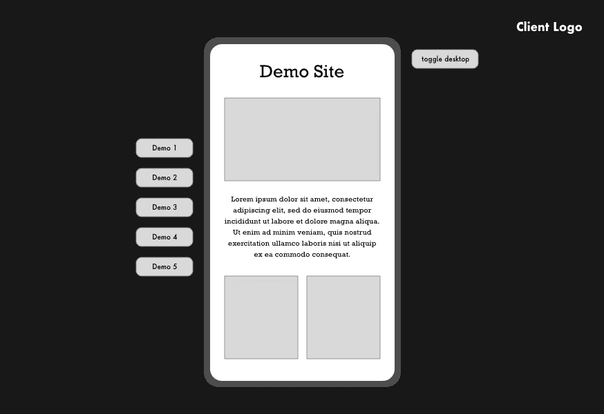
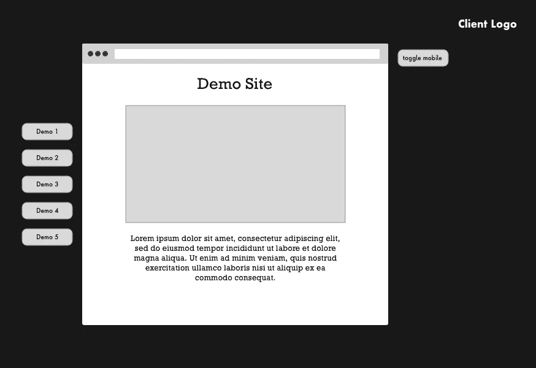
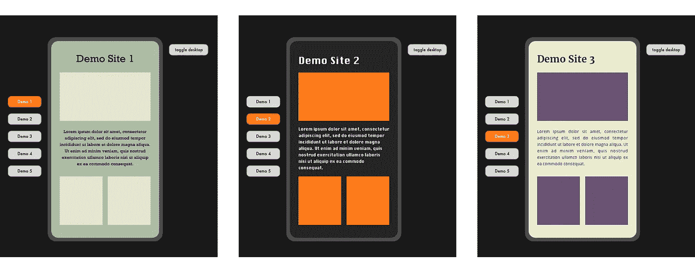
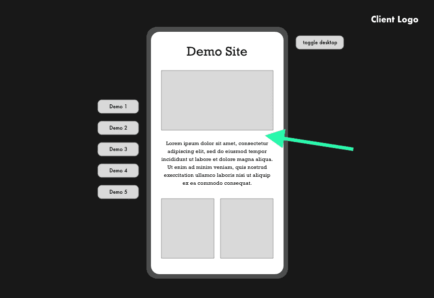

# 包含 React、TypeScript 和 Styled 组件的主题中的主题✨

> 原文：<https://javascript.plainenglish.io/themes-within-themes-with-react-typescript-and-styled-components-e65491e45f5e?source=collection_archive---------2----------------------->

## 你如何构建一个多主题的应用程序？如果这些主题是内的*另一个主题呢？*


Pencils by Jess Bailey

最近的一个项目带来了一些巨大的挑战。客户想要一个演示体验，在一个品牌“容器”中显示一系列不同的网站。这些演示网站将在一个模拟的桌面或移动设备中进行交互，每个都有自己的主题。在本文中，我将深入探讨:

1.  我们如何建立项目文件
2.  使用样式化组件进行主题化

这已经足够具有挑战性了，但是最重要的是，我们需要给用户在模拟的“桌面”显示和“移动”显示模式之间切换的能力，所有这些都在这个静态容器中，*不使用*媒体查询。我将在后续文章中解决这一挑战。

以下是我们制作的两张插图:



Mobile view



Desktop View

# 我们需要多少主题？💭

这里的第一步是弄清楚我们需要多少主题，其次是如何设置这些主题。从一开始我们就正确地设置这一点是至关重要的，从长远来看，这可以让我们避免很多痛苦。

1.  这里我们需要一个静态容器的主题，不管活动的演示是什么，它都将保持不变。这将有一个品牌的黑色主题，以配合客户的风格指南。
2.  我们还需要每个“演示”一个主题，这将取决于哪个演示是活跃的变化。所以三个演示意味着三个以上的主题，等等。

似乎很简单。以下是这种“网站中的网站”应该如何运行的一些基本说明:



Selecting a demo from the left will display a unique styled theme within the mobile frame. The outer container will keep its theme throughout.

# 设置文件📚

我们需要创建的第一个组件是我们的静态演示容器，它将包装模拟设备和所有其他主题。

让我们将其创建为名为“DemoContainer”的 React 组件。就个人而言，当创建使用样式化组件的组件时，我喜欢使用下面的文件结构(这里我们使用的是 TypeScript):

```
src
├── components
│   ├── atoms
│   ├── molecules
│   └── organisms
│       └── DemoContainer
│           ├── DemoContainer.tsx
│           ├── Demo.props.ts
│           └── Demo.style.ts
```

# 添加第一个主题

现在我们有了基本的组件，我们需要用样式化的组件' T0 '来设置它的主题。在这种情况下，我们创建了一个`styles/themes`文件夹来存放所有不同的主题。

这是我们采用的结构:

```
src
├── styles
│   └── themes
│       ├── demoContainer
│       │   ├── colors.ts
│       │   ├── text.ts
│       │   ├── typography.ts
│       │   └── index.ts
│       └── index.ts
```

## /colors.ts🎨

这个文件将包含主题的颜色变量。关于设置颜色的正确方法有很多争论，在我看来，这应该和设计师一起完成。然而，因为我们不在这里讨论这个，这里有一些虚拟变量名称让大家高兴😎

```
***//colors.ts***const colors = {
  primary: {
    primary1: '#172121',
    primary2: '#444554',
    primary3: '#7F7B82',
  },
  secondary: {
    secondary1: '#BFACB5',
    secondary2: '#E5D0CC',
  },
  ...
}export default colors;
```

## /text.ts🔠

这是我们将要为主题存储所有文本变量的地方。这包括:

*   字体系列
*   大小
*   字母间距
*   字体粗细
*   行高

以及你想为你的文本存储的任何其他变量。以下是您可以存储的内容示例:

```
***// text.ts***const text = {
  font: {
    heading: '"Merriweather", Georgia, serif',
    body: '"Open Sans", Helvetica, Arial, sans-serif',
  }
  size: {
    heading: {
      mobile: {
        h1: 40,
        h2: 28,
        ...
      },
      desktop: {...},
    },
    body: {
      mobile: {
        regular: 16,
        ...
      },
      desktop: {
        regular: 24,
        ...
      }
    }
  },
  weight: {
    light: 200,
    regular: 400,
    bold: 700,
  }
}export default text;
```

## /印刷术. ts📝

最后，排版是我们为这个主题设置全局排版规则的地方。我们可以使用 Styled Components ' T0 '来导出一些我们希望在整个主题中使用的集合样式。

```
***// typography.ts****import* { css } *from* 'styled-components';
*import* text *from* './text';const { font, size, weight, lineHeight, letterSpacing } = text;const typography = css`
  font-family: ${font.body};
  font-weight: ${weight.regular}; h1 {
    font-size: ${size.heading.mobile.h1}px;
  }
  ...
`;export default typography;
```

我认为用这种方式导入你的文本样式比把它们添加到父样式组件更简洁。它有效地为主题设置了“全局”文本样式，因此它整理了样式组件，只为特定样式留出了空间。

## /index.ts

现在我们已经为这个主题设置了所有的样式变量，我们可以将它们放在一起，并从索引文件中导出它们，就像这样:

```
**// *index.ts****import* colors *from* './colors';
*import* text *from* './text';
*import* typography *from* './typography';export default {
  name: 'demoContainer',
  colors,
  text,
  typography,
};
```

这里还可以包含许多其他样式变量，比如间距和动画。主要的一点是，我们希望任何特定于每个主题的可重用变量都包含在主题导出中。

## 导出主题

我们知道这里需要不止一个主题，所以让我们提前考虑从`themes/index.ts`文件中导出这些主题:

```
***// index.ts****import* demoContainer *from* './demoContainer';const theme = {
  default: demoContainer,
  demoContainer,
};export default theme;
```

我们还在这里添加了一个“默认”主题，并将其设置为 demoContainer 主题，以防万一我们需要一个后备。

# 使用主题变量🖼

现在有趣的部分来了，看看我们的主题是什么。第一步是将我们的`DemoContainer`组件包装在来自样式化组件的`ThemeProvider`中。

## 添加 ThemeProvider

我们的`DemoContainer.tsx`文件看起来会像这样:

```
***// DemoContainer.tsx****import* React, { FunctionComponent } *from* 'react';
*import* { ThemeProvider } *from* 'styled-components';*import* { DemoContainerProps } *from* './DemoContainer.props';
*import* theme *from* '../../../styles/global/theme';const *DemoContainer:* FunctionComponent<DemoContainerProps> = ({ children }) => {
  return (
    <ThemeProvider **theme={theme.demoContainer}**>
      Demo Container content here!
    </ThemeProvider>
  )
}
```

我们现在成功地将 *demoContainer* 主题传递给我们的`DemoContainer`组件。为了使用主题变量，让我们创建第一个样式化的组件，它将包装容器中的所有内容。

我们将创建一个包装器组件，它将位于我们的`ThemeProvider`中。

```
***// DemoContainer.style.ts****import* styled *from* 'styled-components';export const Wrapper = styled.main``;
```

⚡️

```
***// DemoContainer.tsx****import* React, { FunctionComponent } *from* 'react';
*import* { ThemeProvider } *from* 'styled-components';*import* { DemoContainerProps } *from* './DemoContainer.props';
*import* theme *from* '../../../styles/global/theme';
***import* Wrapper *from* './DemoContainer.style.ts';**const *DemoContainer:* FunctionComponent<DemoContainerProps> = () => {
  return (
    <ThemeProvider theme={theme.demoContainer}>
      <**Wrapper**>Demo Container content here!</**Wrapper**>
    </ThemeProvider>
  )
}
```

## 在我们的样式组件中使用主题变量

现在，因为我们的包装器位于`ThemeProvider`中，它也可以自动访问“主题”道具。因此，我们现在可以使用我们在`/themes`文件夹中设置的变量，使用“主题”道具的对象分解:

```
***// DemoContainer.style.ts****import* styled *from* 'styled-components';export const Wrapper = styled.main`
  *// let's put all our global typography at the top*
  **${({theme}) => theme.typography};** height: 100vh;
  width: 100%;
  padding: 60px;
  background-color: **${({theme}) => theme.colors.primary.primary1}**;
  color: **${({theme}) => theme.colors.secondary.secondary2}**;`;
```

现在，我们已经使用变量对`DemoContainer`进行了样式化。`theme.typography`将确保我们的文本被样式化，所以不需要在我们的包装器中添加额外的文本样式。演示现在应该有一个很好的背景，我们的主要颜色 1，文本将是次要颜色 2。

# 添加第二个主题(以及第三个、第四个……)👯‍♀️

我们的静态容器已经完成并设置了样式，剩下的就是设备内容的动态主题化，下面的箭头优雅地突出显示了这一点:



当用户点击左侧的一个按钮(演示 1、演示 2 等)时。)，我们需要改变模拟设备中的主题。

(我们碰巧使用 Redux 来进行这种状态管理，但是您也可以看看 React 的`useContext`，如果我再做一次，我可能会使用它)

无论哪种方式，为了提供正确的主题，我们只需要从正在使用的提供者那里访问主题的名称或 ID。

## 创建一个新组件来包装动态主题

让我们创建我们的模拟设备组件，并将其命名为`MockDevice`。

```
src
├── components
│   ├── atoms
│   ├── molecules
│   └── organisms
│       ├── DemoContainer
│       └── MockDevice
│           ├── MockDevice.tsx
│           ├── MockDevice.props.ts
│           └── MockDevice.style.ts
```

`MockDevice`将有一个与`DemoContainer`非常相似的设置，它需要自己的`ThemeProvider`。然而，我们将把`ThemeProvider` *放在*两个其他样式组件之间:

1.  `Wrapper`，它将为我们的模拟设备提供“移动效果”样式
2.  `DeviceContent`，它将包含我们希望为该网站提供的任何页面

```
***//*** ***MockDevice******.tsx****import* React, { FunctionComponent } *from* 'react';
*import* { ThemeProvider } *from* 'styled-components';*import* { MockDeviceProps } *from* './MockDevice.props';
*import* { Wrapper, DeviceContent } from './MockDevice.style.ts';const MockDevice*:* FunctionComponent<MockDeviceProps> = () => {
  return (
    <Wrapper>
      <ThemeProvider **theme={???}**>
        <DeviceContent>
          Mock Device content here!
        </DeviceContent>
      </ThemeProvider>
    </Wrapper>
  )
}
```

## 添加新的主题文件

到目前为止，我们还不知道将什么主题传递到我们的新设备组件中，但是我们可以像设置 *demoContainer* 主题一样开始设置这些主题。

```
src
├── styles
│   └── themes
│       ├── demoContainer
│       ├── demo1
│       │   ├── colors.ts
│       │   ├── text.ts
│       │   ├── typography.ts
│       │   └── index.ts
│       ├── demo2
│       │   ├── colors.ts
│       │   ├── text.ts
│       │   ├── typography.ts
│       │   └── index.ts
│       └── index.ts
```

不要忘记导出`themes/index.ts`中的主题:

```
***// index.ts****import* demoContainer *from* './demoContainer';
*import* demo1 *from* './demo1';
*import* demo2 *from* './demo2';const theme = {
  default: demoContainer,
  demoContainer,
  demo1,
  demo2,
};export default theme;
```

## 使用动态主题🧙‍♀️

我们现在可以从我们的提供商那里获得活动主题，并获取正确的样式。根据您使用的是`useContext`还是`Redux`，或者其他状态管理系统，这个位可能会略有不同。这是用 Redux 和 hooks*:

```
***//*** ***MockDevice******.tsx****import* React, { FunctionComponent } *from* 'react';
*import* { ThemeProvider } *from* 'styled-components';
***import* { useSelector } *from* 'react-redux';***import* { MockDeviceProps } *from* './MockDevice.props';
*import* { Wrapper, DeviceContent } from './MockDevice.style.ts';
***import* themes *from* '../../../styles/global/theme';**const MockDevice*:* FunctionComponent<MockDeviceProps> = ({children}) => {
  **const themeName = *useSelector*(
    (state*:* RootState) => state.theme,
  );****const theme = themes[themeName] || themes.default;**return (
    <Wrapper>
      <ThemeProvider **theme={theme}**>
        <DeviceContent>
          {children}
        </DeviceContent>
      </ThemeProvider>
    </Wrapper>
  )
}
```

**以前没用过钩子或者不想包含它们？然后在连接的组件中用经典的*[*mapStateToProps*](https://react-redux.js.org/using-react-redux/connect-mapstate)*替换“useSelector”。*

# 整合应用程序💅

我们知道我们的`DemoContainer`组件将包装整个应用程序。这个主题不会改变，应该保持不变。我们还知道`MockDevice`需要在演示容器中。所以让我们补充一下:

```
***// DemoContainer.tsx****import* React, { FunctionComponent } *from* 'react';
*import* { ThemeProvider } *from* 'styled-components';*import* { DemoContainerProps } *from* './DemoContainer.props';
*import* theme *from* '../../../styles/global/theme';
*import* Wrapper *from* './DemoContainer.style.ts';
**import MockDevice from '../MockDevice';**const *DemoContainer:* FunctionComponent<DemoContainerProps> = ({ **children** }) => {
  return (
    <ThemeProvider theme={theme.demoContainer}>
      <Wrapper>
        <**MockDevice**>
          **{children}**
        </**MockDevice**>
      </Wrapper>
    </ThemeProvider>
  )
}
```

因为`DemoContainer`将保持完全静态，所以我们可以在`MockDevice`中渲染任何 React 子元素。

出于这个原因，我们决定让`DemoContainer`包装我们的`Router`，这样当用户导航到一个新页面时，这个页面将显示在我们的 MockDevice 中，并根据选择的主题进行样式化。

# 结论

我们现在有了主题中的主题！一旦你建立了这个结构，你就可以添加任意多的主题。

*   `DemoContainer`样式将保持不变，并取决于*演示容器*主题变量。这些样式变量都可以在 DemoContainer 的`Wrapper`中访问。
*   在应用程序状态下，`MockDevice`将会用活动主题覆盖*演示容器*样式。任何在`MockDevice`里的孩子都只能访问这个主题。
*   我们可以在任何子样式的组件中使用适当的分解结构来访问活动的主题变量。

# 打字笔记

重要的是，文件结构在所有新主题中保持一致，以避免主题寻找不存在的样式所导致的任何错误。

这里使用 TypeScript 确实很有帮助，因为您可以定义必须包含在每个文件中的属性:

```
***// themeTypes.ts***export interface Text {
  font: {
    heading: string;
    body: string;
  };
  size: {
    heading: {
      mobile: {
        h1: number;
        h2: number;
      };
    };
  };
};**// *text.ts****import* { **Text** } *from* './themeTypes.ts';const text: **Text** = {...}export default text;
```

如果您没有键入，请确保您始终遵循相同的结构。

# 谢谢大家！🤗

我希望你喜欢这篇文章，它在某种程度上帮助了你。你以前遇到过类似的挑战吗？我很想在下面的评论中听到你是如何处理的。

## 进一步阅读

[](https://bit.cloud/blog/theming-in-components-with-react-and-bit-l386casw) [## 使用 React 和 Bit 在组件中进行主题化

### 工程和设计团队面临的一个大的组织问题是分离外观和感觉…

比特云](https://bit.cloud/blog/theming-in-components-with-react-and-bit-l386casw) 

*更多内容看* [***说白了。报名参加我们的***](https://plainenglish.io/) **[***免费周报***](http://newsletter.plainenglish.io/) *。关注我们上* [***推特***](https://twitter.com/inPlainEngHQ) ， [***领英***](https://www.linkedin.com/company/inplainenglish/) ***，***[***YouTube***](https://www.youtube.com/channel/UCtipWUghju290NWcn8jhyAw)***，以及****[***不和***](https://discord.gg/GtDtUAvyhW)*** *对成长黑客感兴趣？检查出* [***电路***](https://circuit.ooo/) ***。***