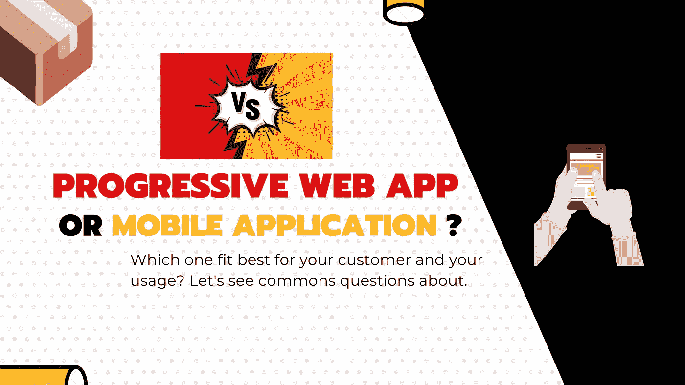

# 他们告诉我，他们想要一个移动应用程序。我说不，你不需要那个。

> 原文：<https://javascript.plainenglish.io/they-told-me-they-wanted-a-mobile-app-i-said-no-you-dont-need-that-c3abbf2148f4?source=collection_archive---------3----------------------->

## Web 开发

## 厌倦了客户不假思索地要求具体的东西？需要手机 app 还是 PWA？让我们看看这是怎么回事。

很多人问我关于渐进式网络应用程序以及如何构建一个…

他们告诉我，他们想要一个移动应用程序，即使他们刚刚开始创业，没有网站…

他们还问我是不是更便宜，是不是更容易…

有的很固执绝对要一个 PWA，有的另一边要一个手机 app…

你需要明白的第一件事是，公共工程许可证本身并不是一种特殊的申请。你可以把任何网站，甚至你的 Wordpress 博客，通过简单地提供一些东西，变成一个 PWA。

我经常问的另一个问题是:**你为什么想要一个 PWA？为什么要手机 app？**

**在开发某样东西之前，了解你的顾客为什么想要某样特定的东西并提出疑问是很重要的。**问他的需求，他想针对哪个平台，他有什么问题。

否则，你最终会浪费时间和金钱，并且你的客户(或者仅仅是你)不会满意，这是很糟糕的事情

**这篇文章旨在回答您可能会向客户提出的一些问题，并帮助您引导客户找到满足需求且经济高效的特定解决方案。**

准备好了吗？让我们从 PWA 开始。

# 简而言之，渐进式网络应用

> 满足某些要求(如 web 清单文件)并针对脱机使用进行了优化的网站。它倾向于成为一个移动应用，但不是。

## 特殊性

*   用 **HTML** 、 **CSS** 和 **Javascript** 构建。
*   依赖于浏览器实现，具体取决于浏览器的版本、平台和渲染引擎。
*   可以利用所有 web 库生态系统并易于实施。
*   通过浏览器中的 URL 直接访问，**可以包装在某种应用程序容器中，以“某种应用程序”的形式出现**。
*   就 UI 呈现和行为而言，几乎不受跨平台特性的影响，尽管也由于浏览器引擎的差异/相似性。
*   它可以使用一些很好的功能，比如网络通知，而且随着时间的推移，它会随着各种增强而变得越来越好。

**要使您的网站被视为 PWA，您需要**

*   **有一个 App Manifest 文件**，描述应用名称，给出一些配置和其他规则，注册一个 SW 文件。
*   **注册一个服务工作者(SW)** ，这是一个小脚本，充当你的网络层和你的服务器之间的中间件。因此，您可以从前端返回缓存的响应，以改善离线体验。可以把它想象成前端的反向代理。

## 去 PWA 之前我应该想些什么？

1.  你需要有一个桌面版的应用程序和一个反应灵敏的网站。您可以利用 CSS 媒体查询轻松地做到这一点，并且只需很少的代码更改。
2.  你不需要超快的性能，也不在乎导航的感觉。因为它通常像一个网站，而且因为它是用一个有点慢的浏览器引擎渲染的。
3.  **你的应用没有依赖于浏览器可能**不支持的特定 API，比如[蓝牙](https://developer.mozilla.org/en-US/docs/Web/API/Web_Bluetooth_API)，目前 2020 年还不是所有浏览器都支持。
4.  您希望利用许多为 web 构建并经过实战检验的库。
5.  你想要一个丰富的生态系统，里面有大量的开发人员在高效地构建 web 应用程序。与跨平台移动开发相比，更容易找到 web 的维护者和开发者。
6.  对于 web 项目来说，你有一个很好的持续集成(CI) /持续交付(CD)平台，而移动平台要实现起来有点复杂。
7.  你需要使用令人敬畏的 web 测试框架，比如奇妙的 [**Cypress**](https://www.cypress.io/) **来为所有平台编写测试。**
8.  您(主要)使用 HTTP 和 REST 与服务器进行交换，否则，使用服务工作器缓存结果会有一些问题。您需要实现自己的离线缓存逻辑，或者为此使用特定的库。(其实很多，所以没什么大不了的)。
9.  **您希望在当时维护应用程序的一个版本，并能够在短期内尽快部署补丁。**

最后一点非常重要，因为使用 web 应用程序，您可以更好地控制应用程序，因为每次启动应用程序时，如果互联网可用，您的用户将直接从 web 服务下载最新版本的文件。我们将会看到，使用移动设备会更复杂一些。

关于 2020 年的今天 IOS 支持，确实不是所有功能都支持。但是，让您的应用程序符合 PWA 对您的客户来说已经是一个很好的增强和价值建议。事实上，在发达国家，大多数时候你有某种互联网连接(我知道美国的一些州或一些国家有一些问题)。这意味着用户不会体验到 IOS 所缺乏的离线功能。

# 手机应用，古老的好应用

> 完全自主的应用程序包，被称为重客户端。它旨在提高速度，减少网络交流，提供良好的用户体验。

## 特殊性

*   使用 Java / Objective-C 通过本机编译的代码进行构建。
*   它可以很容易地跨平台与一些框架，如颤振或反应原生。
*   **超快的表演**
*   最佳离线功能
*   **所有原生 API** 如蓝牙、本地化、NFC 在通知方面也是最好的配置。
*   根据平台的不同，设计和导航在组件方面可能会有所不同(除了 Flutter，它呈现画布)
*   **生活在应用商店**或其他地方，但不要指望跳过 Google Play 或苹果… *，正如我们看到的堡垒之夜应用**[*。*](https://www.theverge.com/2020/4/21/21229943/epic-games-fortnite-google-play-store-available-third-party-software)*
*   *由于商店验证过程和用户下载更新的时刻，从开发到生产有很长的惯性。*
*   ***商店采取的应用内购买政策很疯狂**(每次销售的 15%到 30%)。*

## *去一个手机 App 前应该想好什么？*

*   *你是想扩大你的受众群，出现在应用商店中，还是想在没有任何网站的情况下创业？*
*   *你真的在乎性能和 UI 吗？*
*   *你有很多钱来资助一个 web 应用程序和至少一个跨平台的移动应用程序吗？*
*   *你的应用程序需要快速修复吗？提交前有“军用级”测试吗？*

***一般来说，移动应用是一个好东西，尤其是在新的跨平台框架下**，但总是会询问客户的需求。如果他刚刚开始做生意，他可能更适合先有一个网站，并开始在搜索引擎上排名。*

*当你想要接触新的受众，提供新的服务，以及在移动设备上获得更好的用户体验时，移动应用程序(除了某些情况)是很好的，因为你将设计所有的东西来填充一个小屏幕，仅此而已。*

*但是一部没有使用代码推送功能的手机将会迫使你以不同的方式管理你的发布(T21 ),你可能会同时管理许多不同的版本，这可能会很复杂。*

*你也不能保证人们会更新你的应用程序，而且由于商店提交过程的原因，你也不容易进行修补。*

*最后但同样重要的是…如果你的应用程序崩溃了:你没有简单的方法来修复它或者显示一个警告信息表明你正在处理它。而用户很可能会卸载，永远离开。*

# *总之。*

## *艾滋病患者*

*你的客户正在创业，他需要在搜索引擎上排名，他正在做增长黑客。*

*你需要所有三个平台的支持，需要 SEO 指数化。您想要开箱即用的跨平台。*

*你不需要特别出现在应用商店里。*

*您需要一种简单的方法来管理您的应用程序版本，而不必担心多个版本、热修复问题和非常长的部署惯性。*

*你想在你的应用中销售应用内产品，不想向苹果和谷歌支付 15%到 30%的利润。*

## *移动应用程序*

*你想要一个完全自主构建的应用程序，具有特定的功能，如蓝牙，最佳离线支持。*

*你想要扩大你的受众，为你的客户提供新的服务，并在移动设备上获得最好的体验。*

*您希望出现在苹果应用商店或谷歌 play 等应用商店中。*

*你有一个很好的预算，你可以建立网页版和移动版作为一个单独的项目。*

*你会有更好的用户体验，代价是在提交之前准备好测试你的应用。部署惯性可能是几天的事情，而在 web 上可能是几分钟的事情，在移动设备上有点像“一发不可收拾”。*

*如果你想深入了解，可以看看我的文章，这篇文章比较了 react 本地应用程序和 react web 应用程序。*

* [## 新人应该知道的 React 和 React Native 的区别

### 当你从网络转向手机时，需要记住一些事情，这里有一些想法和提示。

medium.com](https://medium.com/javascript-in-plain-english/differences-between-react-and-react-native-that-newcomers-should-knows-about-4d2ccc3d1d94) 

[**🇫🇷STOP！你是法国人吗🥖？**您也可以访问 ici 网站，接收法国的私人通讯🙂](https://codingspark.io)*