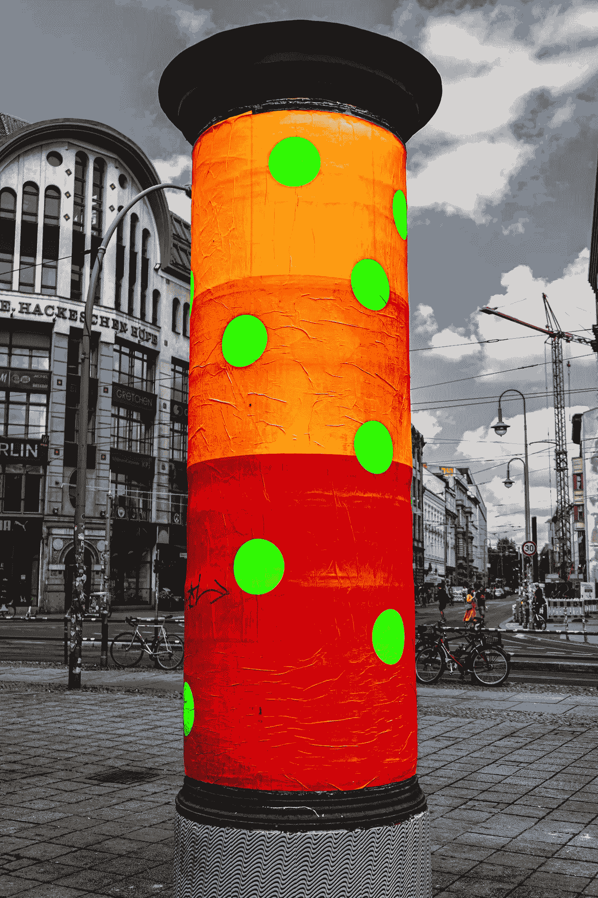

# 我在求职过程中学到的东西

> 原文：<https://javascript.plainenglish.io/things-ive-learned-during-the-job-hunt-1dcb69170e06?source=collection_archive---------2----------------------->

我最近丢失了合同。这是意料之外的，在我被告知这一情况后的几分钟内，我感到震惊。当我们和妻子坐下来，保持沉默，试图弄清楚我们有多少存款，以及在当前的中产阶级社会中获得一个新职位有多困难时，感觉就像过了几个小时。

没有时间浪费了，所以在煮好咖啡(这次比平时浓一点)后，我走向 LinkedIn 发出蝙蝠信号，发现我的简历藏在其中一台设备的某个地方，并开始浏览“工作”类别。

# 你的简历——重要的事情

已经有一段时间没碰了，上次加了现在的角色尽量保持最新。当我告诉妻子我的简历有好几页时，她摆出了一副“非常严肃但充满爱心的脸”。这是你过去从事的高技术工作相对于招聘或招聘经理的劣势的一个标志，招聘或招聘经理通常不涉及技术领域，而是寻找特定的流行语、关键词或匹配的技术。“把它缩短，把最后几个角色和你引以为豪的东西放在一起，去掉描述部分，把其他的东西压缩成更小的，可以快速浏览的大块”——她说。妻子总是对的，所以我有什么好争辩的？经过半个小时的剪切、修整、提取关键词，只是为了确保我能被招聘人员“发现”，我过去 20 年的经验总结已经准备好与世界分享了。

# 下一步——打基础。

在“没有时间浪费”之后，我把新版简历发给了我完全信任的招聘人员，让他们进行校对和查找错误。在他们的帮助下，我能够更好地适应当前的市场需求。我在星期三下午 2 点左右丢失了我的合同。到下午 4 点，我已经把最新版本的简历和个人资料上传到了英国排名前 15 位的求职网站上，接下来我花了半个小时搜索和申请 LinkedIn 上上周发布的职位——只是为了确认一下。同一天晚上，我接到了最初的几个电话和信息，再加上 LinkedIn 上的良好祝愿社区，让我的情绪高涨，并让我迫切需要争取更多。

我妻子让整个求职过程变成了一次非常奇妙的经历。她在所有可能的层面上支持我，在我们的“办公室”里远程处理她的日常工作时，与我击掌庆祝每一个招聘电话，为我的每一次面试欢呼。我甚至无法表达她的支持从头到尾给了我多少快乐、喜悦和能量。她从不允许我低头，总是微笑着，是最好的顾问。我只能总结为——相信你所爱的人，相信其他人。

# 保持你的存在。

有一些技巧没有人提到，可能没有太多人知道，招聘人员不会很快披露，我在过去几年中了解到了这一点。

大多数招聘公司和软件都是根据*关键词*来运作的——把你的简历想象成一份你希望在谷歌上容易找到的文件。加入太多或不受欢迎的关键词没有意义，也会降低阅读的吸引力和挑战性。它也可能给你发送错误的工作邀请。例如，如果你有五年的 Ruby 和 Python 经验，但你是一名不想成为开发人员的 DevOps 工程师(相信我，你会接到很多开发人员的电话)——避免在简历中指明这些，加上“用多种语言编程”。另一方面，如果你从事云技术的工作，通常你需要把它们一个一个地列出来，以便容易找到你。

谈到招聘公司的存在和使用的软件——你需要在周一和周三*早起*，准备好所有的招聘网站链接**重新上传你的简历**，因为那是他们的软件从企业订阅的网站导入简历的时间。我建议在早上 7 点左右开始这一过程，以确保你的简历首先进入招聘公司的数据库。

开始定期在 LinkedIn 上发帖，并确保公众可以看到你的帖子。失业当然不是一件值得高兴的事情，但是发布你在搜索过程中的进展，你正在做的任何新的事情来改善这个过程，或者你正在做的副业项目——将会增加你的可见性，并鼓励其他人(甚至是你网络之外的人)来互动或帮助你。在你的帖子中使用适当的#标签(适度，不要过度)来增加受众的数量，不要忘记参与其他帖子。

最后一点，确实经常被忽视——确保你在社交媒体、求职网站等上的照片是最近的、明亮的，并且你是唯一可见的主体。避免假期、面具或“酷派对”的照片——你可以留给你的脸书和 Instagram 朋友，我们在这里找到让你茁壮成长的新角色。选择一张显示你的照片——诚实可信的人，能够为企业带来经验。

# 他们在呼唤，他们在敲门。

把接听每一个电话、回复每一条信息和电子邮件作为你的目标。离开你的社交媒体，你在狩猎，你必须避免任何干扰。是的，很安静，但是忘掉“网飞几分钟”，你需要准备好在电话铃响时拿起电话(保持大声)。

你还记得上一次给你最好的朋友、家人或配偶打电话是什么时候吗？你很可能能够感受到对方的感受。招聘专员大部分时间都在打电话。在大多数情况下，他们都是非常友好和随和的人(那些不是这样的人，通常会很快离开这个行业)，所以如果你像我一样是一个内向的人——对不起，但你在接电话时必须微笑。每次你有电话要接的时候——想想你梦想的工作，和你的配偶或朋友在一起的最美好的时刻——都没关系——尽一切努力把每个电话当成一个机会，一次又一次地发现自己在那个快乐的地方。默认情况下，这会让你下定决心成功。

在求职过程中，你最不想做的事情就是计划失败。您的个人资料是否受欢迎并不重要，使用传统的电子邮件邀请可能是一种负担，管理和浏览起来很有挑战性，而且很有可能，您会发现压力非常大。我已经决定使用 2020 年的技术来帮我一点忙，并创建了带有可用性插槽的**日历**档案。安排会议、更长时间的电话或采访就像发送你的个性化链接一样简单，让对方选择最适合他们的时间。这是一个真正的救命稻草，帮助我专注于沟通，同时在会议之间有足够的时间来刷新或允许一点点延迟，而不破坏计划。

另一个有些人可能不同意的建议是——对待与招聘专员的每一次接触都要保密并尊重对方。永远不要透露你已经在做的生意，永远不要自己申请。始终询问企业名称并做好记录，以防止重复申请。信任是双向的，透露这些信息不仅会毁掉你被雇佣的机会，还会夺走招聘人员的工作。

# 最后——没有工作是你的新工作。

你还记得起床，准备，通勤，开始工作，午休，然后回到你的工作岗位来结束一天的工作吗？保持并珍惜这个时间表，即使在你失业期间。不要给懒惰和可能的抑郁留下任何潜入的空间。你的新工作是求职，并把它当作全职工作。这不仅能让你随时准备好迎接独一无二的机会，还能让你的头脑保持安全，不至于游离，让“新的现实”接管一切。成为您的项目经理——使用便利贴跟踪您的应用程序、联系人的进度，或者使用免费的 Trello 或 GitHub project board 实现更高科技的自动化流程。定期午休，在下午 5 点完成每天的工作，给自己一些时间放松、充电，醒来后为新的一天的挑战、电话或面试做好准备。掌握每一个联系方式，每一个感兴趣的信号，不要害怕更新或寻求反馈——这是改进的方式，你现在想要的就是从最好中做到最好。

