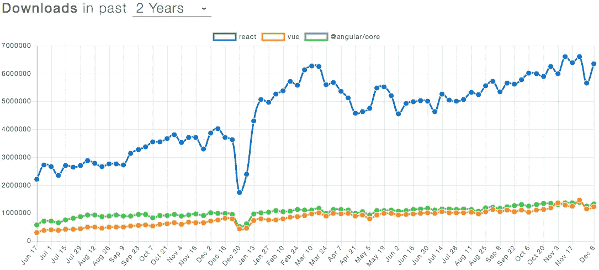

# 使用 React 之前需要考虑的事项

> 原文：<https://javascript.plainenglish.io/things-to-consider-before-working-with-react-7d4652c4995b?source=collection_archive---------9----------------------->

Things to consider before working with React

成为一家总部位于印度的初创企业的所有者并不容易。挑战通常包括不断需要跟上最新的技术变化和更新。这是我想用 React Native 开发一个应用程序的时候了。在同样的过程中，我们学到了以下内容-

## **1。** **反应过来是因为下面的**容易掌握

它是一个 JavaScript 框架，用于编写一个真正的本地移动应用程序。准确地说，它是一个允许你创建自己的库集的库。更简单地说，即使你是一个初学者或者思维发达的人，在使用 React Native 时也没有复杂化的余地。

The above figure shows the react as the preferred choice

上图显示了[**反应为首选 JS**](https://graffersid.com/angular-vs-react-which-is-better-and-how/)

来源- [**Tecla**](https://www.tecla.io/)

## **2。** **路由**

我们可以说，本地路由已经走过了漫长的道路。在 web 浏览器中，页面是独立的，并从堆栈中重新加载。但是说到反应原生，页面是一个叠一个的。因此，当你从一个屏幕导航到另一个屏幕时，它会将它保存在内存中。而且出于同样的目的，建议找一个稳定的路由器。之前，您从应用程序开发过程开始。

## **3。** **App 主题开发**

黑暗模式正在流行。深色主题可以帮助用户在弱光环境中操作时不会使眼睛疲劳。你可以通过下面的过程获得更黑暗的主题-

定义您的:

1.  颜色常数
2.  将所需的颜色融入您的应用中
3.  你也可以设计组件来融入颜色

(如果想去的详细的差不多，可以 [**联系我们**](https://graffersid.com/) 。出于同样的目的，我们将帮助你创建另一个博客。)

但是，无论如何，请记住以下观念:

1.  当您开始应用程序开发过程时，最好在开始时就做
2.  不要过分强调主题

## **4。** **反应恰如其名**

如果我们告诉你，你不需要任何库或框架来开发一个多平台的移动应用程序？

现在，你一定处于震惊状态，会问接下来该怎么办？如果没有库，如何创建移动应用程序？答案很简单。您可以使用 WebView(它是捆绑在上述应用程序中的浏览器)。

但是，这也有一定的缺点。WebView 不保证整体性能。预期的视觉效果并没有出现。而且，处理或照顾这样一个可怕的姿态是很难的。在这种情况下，您可以将它与 React Native 结合使用。它会怎么做？React Native 将编译成应用程序平台的本机代码。

## **5。** **极大的工作效率**

你对效率这个术语的理解是什么？不，我们不参加你的语法测试。我们想要传达的是，在短开发周期内完成一定量的工作时，React Native 排名靠前。react native 如今被财富公司和初创公司所使用。此外，迄今为止，主要的应用程序开发案例有——脸书、Instagram、优步、沃尔玛等等。

为了提高应用程序的性能，您可以记住以下建议:

关键是只保留必要的特性，去掉不需要的特性。

通常，当使用 android 应用程序时，我们会看到有大量的进程在你的后台运行。这可能会导致内存泄漏。在这样的过程中，它会破坏你的应用程序性能的整体质量。在这种情况下，避免使用 ListView，使用滚动列表，如 VirtualList、FlatList 甚至 SectionList。它将增强上述 android 应用程序的性能。

减小应用程序的大小是一个重要的标准。这是因为这些设备对更小的应用程序自然反应更好。您也可以使用 ProGuards 来最小化图形的大小。

## **6。** **用 React 原生的造型**

有一个称为 react-native 扩展样式表的库，它使整体样式更有趣，更具交互性。虽然风格系统有缺陷，但它易于使用且高效。你所要做的就是保持你的组件小。而且，UI 以及样式将适合一个页面。

## **7。** **世博会**

你知道吗，reactive native 拥有数百个几乎可以使用的库。但是，尽管事实如此，它没有得到创作者或开发者的注意。而且，当你尝试动手升级一个更新的 React 原生版本时，事情可能会变得很难看。

世博会在解决这些问题上扮演着至关重要的角色。Expo 是一个众所周知的工具箱，它强调了 React Native 的功能。它之所以有用，是因为它包含许多 API 和工具来构建工具。它通过在云中开发和存储内容来提供帮助。它甚至可以在后台从 app store 或 play store 安装时升级应用程序。

## **8。** **媒体资源**

现在，棘手的部分来了。如果您的应用程序对图像或视频不敏感，那么在开发过程中可能会付出额外的努力。此外，加载任何高质量的图像都会使整个应用程序进程变慢。

## **9。** **剖面仪&其他工具**

您必须知道如何使用 profiler。您可以使用 debug 菜单，查看 fps 运行的位置，并运行一个分析器。您可以这样做来确定问题的根本原因。

## **包装完毕**

react-native 最近人气暴涨。但是，任何工具都有很多优点和缺点。并且，以上的事情我们希望有人能告诉我们或者让我们有所准备。

正如谚语所说，在使用 react-native 开发应用程序之前，最好记住以上几点。

上面的故事发表在我们的网站上，[https://graffers id . com/things-to-consider-before-work-with-react/](https://graffersid.com/things-to-consider-before-working-with-react/)

## 简单英语的 JavaScript

喜欢这篇文章吗？如果有，通过 [**订阅获取更多类似内容解码，我们的 YouTube 频道**](https://www.youtube.com/channel/UCtipWUghju290NWcn8jhyAw) **！**