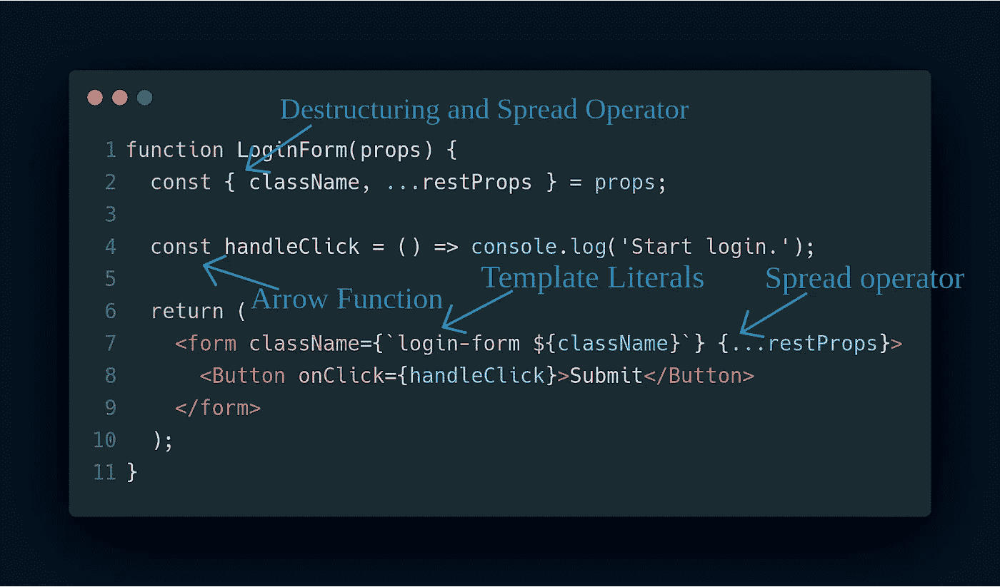

# 学习 JavaScript 框架之前需要了解的事情

> 原文：<https://javascript.plainenglish.io/things-to-learn-before-learning-a-javascript-framework-b7baec310247?source=collection_archive---------3----------------------->

Image Link: [https://www.deepcrawl.com/wp-content/uploads/2019/07/javascript-frameworks.png](https://www.deepcrawl.com/wp-content/uploads/2019/07/javascript-frameworks.png)

如果你熟悉 JavaScript 世界，那么你一定听说过 JavaScript 中的趋势框架，比如 **React** 、 **Vue** 和 **Angular** 。现在，在开始学习这些 JavaScript 框架之前，了解一些 JavaScript 的重要概念会很有帮助，这会让你的学习变得更容易。

因此，在这一系列文章中，我将尝试解释一些我认为对 Web 开发人员来说非常有用的特性和概念，然后再开始学习任何 JavaScript 框架。现在，因为我自己是 React/Node 开发人员，所以我确信这个系列将有助于以一种更简单的方式学习这些技术。

在这个系列中，我将涉及以下主题:

1.  ES6 的重要特性(本文)
2.  [对象和数组方法](https://medium.com/javascript-in-plain-english/object-and-array-methods-to-learn-before-javascript-frameworks-59728dcea306)
3.  [异步 JavaScript 和获取 API](https://medium.com/javascript-in-plain-english/asynchronous-javascript-to-learn-before-javascript-frameworks-9b63972290c2)
4.  [JavaScript 中的 NPM 和导入/导出模块](https://medium.com/javascript-in-plain-english/how-to-use-npm-and-import-export-modules-in-javascript-31a7f66a2064)

让我们首先向您介绍 JavaScript 中的一些最新的 **ES6** 特性，这些特性在框架的代码示例中被大量使用，因此了解这些特性将加速您对 JavaScript 框架的学习。因此，在本文中，我们将讨论 ES6 的重要特性，如:

1.  箭头功能
2.  模板文字
3.  解构
4.  传播和休息运算符

所以，我们先从箭头函数开始。

# 箭头功能

有了箭头函数，我们可以去掉关键字`function`,以更简洁的方式编写函数。

在 ES6 之前，我们通常编写如下函数:

ES6 引入箭头功能后:

现在，如果我们的函数是一行的，那么我们也可以删除`return`语句，可以在一行中编写函数，比如:

这被称为`implicit return`:返回的值不需要使用`return`关键字。现在，这在所有情况下都工作得很好，但是当返回一个对象时，我们应该将花括号括在圆括号中，以避免它被认为是包装函数体括号，就像:

现在，如果我们的函数只有一个参数，我们也可以去掉`function`参数周围的括号。

**注意**:与普通的 JavaScript 函数不同，arrow 函数没有自己的`this`，而是从其父函数或包含 Arrow 函数的代码中继承而来。让我们看一个简单的例子:

如果您有兴趣了解更多关于`arrow functions`的信息，请参考 [**这篇**](https://learn-n-share.hashnode.dev/define-functions-in-javascript-ck989up7j004hcxs11t6qt2h6) 文章。

# **模板文字**

在 ES6 之前，我们习惯于连接字符串，如:

引入模板文字后，

因此，在 ES6 之后，我们开始使用`backtick`字符来定义字符串，因为我们可以在这个`${}`语法中直接使用任何 JavaScript 表达式。

为了更好地理解，我们来看另一个例子:

# 解构

在我看来，析构是 ES6 引入的最有用的特性之一。它允许我们从一个对象中提取属性或者从一个数组中提取元素。我们一个一个来看，从物件开始。

让我们假设我们有一个名为`person`的物体，

现在，要在 ES5 中访问这个对象的元素:

现在，随着析构的引入，使用`{}`提取这些对象属性变得非常容易，所以，让我们使用析构来访问同一个对象的属性:

因此，析构确实使我们的工作更容易提取那些对象属性。现在让我们看看析构如何帮助我们提取数组的元素。

让我们考虑一个名为`fruits`的数组，

现在，使用 ES5 访问元素:

但是通过析构，我们可以使用`[]`以更简单的方式提取数组元素，所以让我们考虑同一个数组，并尝试使用析构来访问元素:

因此，在一行代码中，我们能够提取数组中的所有项。

# 传播和休息运算符

spread 运算符用于将数组中的元素扩展为单个元素，或将对象的属性扩展为单个属性。

为了扩展元素，我们必须在数组或对象的名字前面加上`...`(扩展操作符)。

这次让我们从数组开始，在这种情况下也使用上例中相同的`fruits`数组:

所以，我们使用了 spread 操作符来扩展数组的值，让我们将`fruitsNew`数组打印到控制台中，

所以，果然奏效了。现在让我们看看这个操作符在对象的情况下是如何工作的。让我们考虑一下前面已经定义的`person`对象:

现在，我们来谈谈`rest`运算符。

顾名思义，它允许我们在一个数组中表示不确定数量的参数。这里我们也使用`...`(这里称为 rest 操作符)将剩余的参数放入一个数组中。

让我们考虑一个简单的例子来理解它的工作原理:

因此，它的工作正如我们所料。

**注意:**注意到`spread`和`rest`操作符都使用了与`...`相同的语法，但是根据您使用它们的位置和方式，它们会有所不同。

所以，这就是本文，我们将在接下来的文章中讨论其余的主题。

现在，作为结束，我将留给你们一个简单的`React Component`，它使用了上述 ES6 特性:

此外，请查看该系列的其他部分(如果您还没有查看):

 [## JavaScript 框架之前要学习的对象和数组方法(第 2 部分)

### JavaScript 中可应用于对象和数组的不同类型的方法

medium.com](https://medium.com/javascript-in-plain-english/object-and-array-methods-to-learn-before-javascript-frameworks-59728dcea306)  [## 在 JavaScript 框架之前学习异步 JavaScript(第 3 部分)

### 对异步 javascript 的理解

medium.com](https://medium.com/javascript-in-plain-english/asynchronous-javascript-to-learn-before-javascript-frameworks-9b63972290c2)  [## 如何在 JavaScript 中使用 NPM(和导入/导出模块)(第 4 部分)

### 学习 JavaScript 框架之前要学习的 NPM 命令和导入/导出模块

medium.com](https://medium.com/javascript-in-plain-english/how-to-use-npm-and-import-export-modules-in-javascript-31a7f66a2064) 

如果你想和我联系，请点击下面的链接:

[LinkedIn](https://www.linkedin.com/in/rajat-verma-39458317b/)|[GitHub](https://github.com/rajat2502)|[Twitter](https://twitter.com/rajatverma2502)

## **用简单英语写的 JavaScript 笔记**

我们已经推出了三种新的出版物！请关注我们的新出版物，表达对它们的爱:[**AI in Plain English**](https://medium.com/ai-in-plain-english)，[**UX in Plain English**](https://medium.com/ux-in-plain-english)，[**Python in Plain English**](https://medium.com/python-in-plain-english)**——谢谢，继续学习！**

**我们也一直有兴趣帮助推广高质量的内容。如果您有一篇文章想要提交给我们的任何出版物，请发送电子邮件至[**submissions @ plain English . io**](mailto:submissions@plainenglish.io)**，使用您的 Medium 用户名，我们会将您添加为作者。此外，请让我们知道您想加入哪个/哪些出版物。****