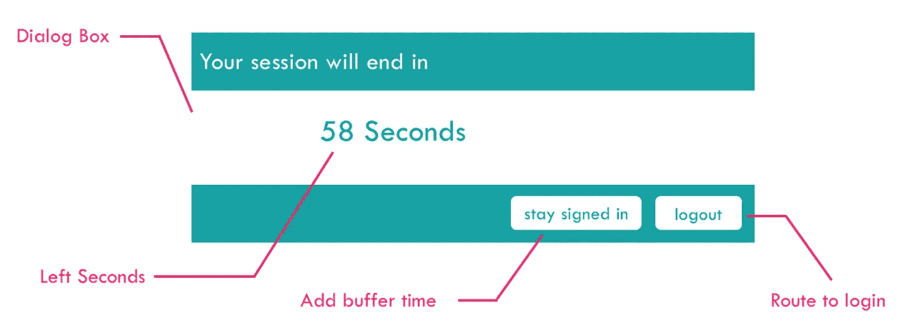
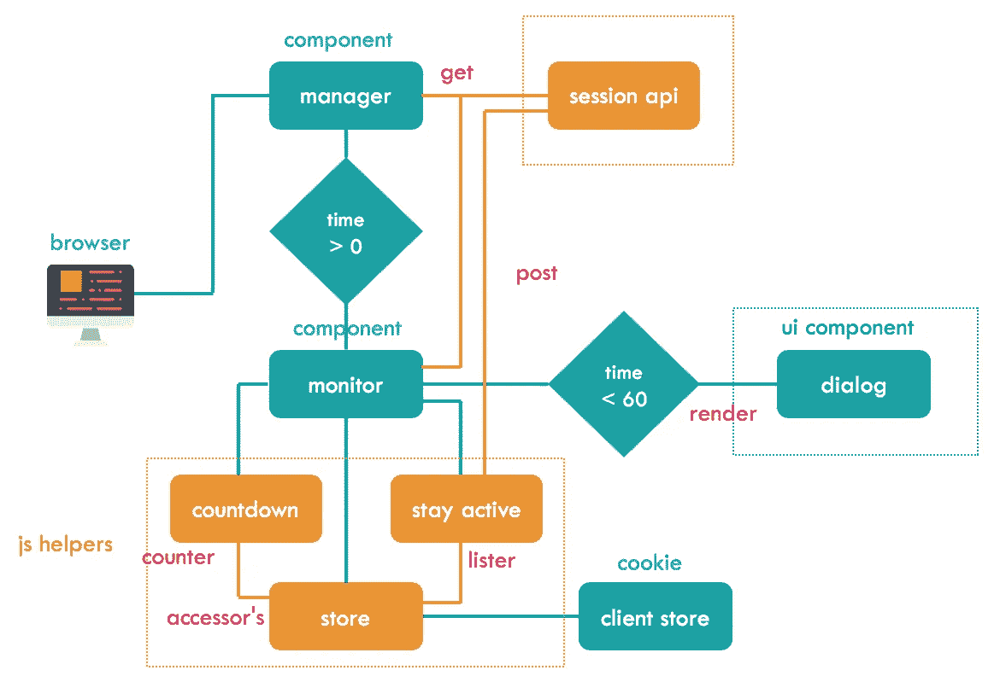

# 在 React 中思考:在 React 应用中管理用户交互

> 原文：<https://javascript.plainenglish.io/thinking-in-react-manage-user-interaction-in-react-apps-611074e004b8?source=collection_archive---------0----------------------->

user inactivity dialog alert on react application

**想法**:

如果我们作为用户在使用它的时候不会被应用程序的警告所困扰，这不是很好吗？我们都讨厌烦人的弹出窗口和对话框。但这个应用程序应该足够智能，知道我什么时候在使用这个应用程序，什么时候没有。嗯…..

**最初的思考过程:**

*   不打扰用户？
*   如果他有一段时间没有主动使用这个应用程序，你一定要担心。
*   如果他没有回应，保护他的隐私。

**要求**:

*   当用户与应用程序交互时，会话不应结束。
*   如果用户注销，会话应该结束。
*   如果用户在一段时间内不活动，提醒用户，并给他们一个恢复活动的机会。
*   如果未得到确认，则结束用户会话并返回登录页面。
*   确保用户会话细节是安全的。

options to store / retrieve user session

**设计理念**:

考虑这将是 react 应用程序的一部分，并在 react 中构建这个组件。所以，设计会描绘出同样的东西，

1.使它*模块化*，所以我们可以用任何其他应用程序来实现它。

2.一旦组件被挂载，就进行 fetch 调用以获取会话数据，因此利用*componentidmount*来避免任何副作用，并将细节存储在状态中。

3.如果我们有*有效数据*，那么只把它传递给有业务逻辑的组件，否则就什么都不呈现。

4.让我们使用单独的*存储助手*方法，该方法主要用于检索和/或保存数据到存储设备，以便快速访问。从主要组件中提取，以便可以轻松更新/更改。

5.通过 store helper 方法将来自 fetch 的响应更新到客户端存储(cookie 或本地存储或会话存储)。

6.让 counter helper 方法每秒检查一次存储，*倒计数*，直到用户初始分配的会话几乎结束。

*注意事项* : ( a)像 setTimeout 一样不断检查客户端存储。(b)如果任何其他共享应用程序更新客户端存储，则我们将始终拥有最新数据(即注销等。)

7.让交互*处理器方法*在用户点击应用和/或按键时更新(发布)用户会话。

*注意事项* : ( a)这应该是独立于第一个提取操作的单独提取操作，在成功的更新响应之后，让我们使用存储助手方法更新客户端存储。(b)客户端存储将始终保持同步。(c)有阻止计时器助手，以避免每次用户点击时发送更新，而是可能会等待 30 秒(可能称之为“重置计时器”)才发送另一个。避免不必要的网络牵引和计算工作。

8.使对话框具有交互性，并允许用户*延长会话*或结束会话。

*注意事项* : ( a)如果扩展，使用与上面相同的获取来发布更新的会话细节。(b)注销应结束会话，一旦成功，将用户页面重定向到登录页面(初始应用程序页面)。(c)只需将 window.location.href 设置为相应的路由器状态，然后执行 window.reload，即可导航回主页。

9.如果用户不确认警告对话框，让*应用程序自行注销*并结束会话。

*注意事项*:(一)会议应该结束了。(b)清除客户端存储的数据。(c)重定向至登录页面。

**设计流程:**

design flow for displaying inactivity dialog