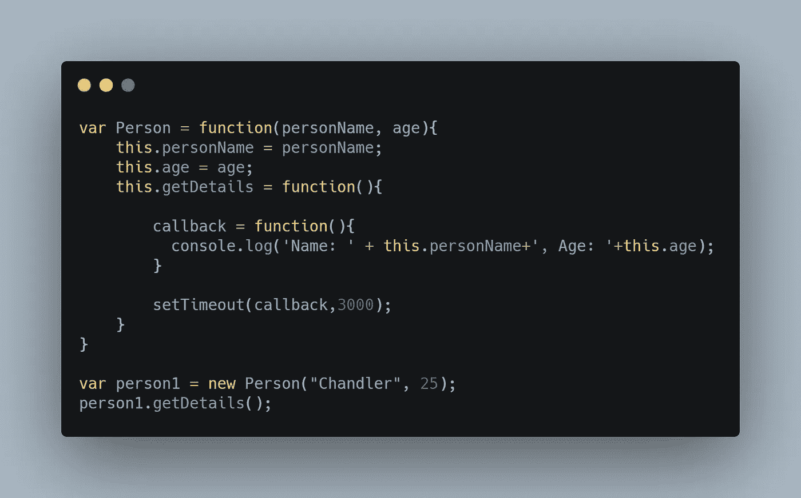
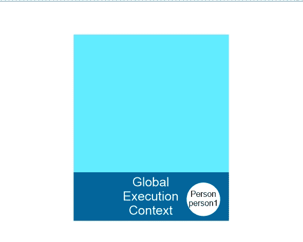
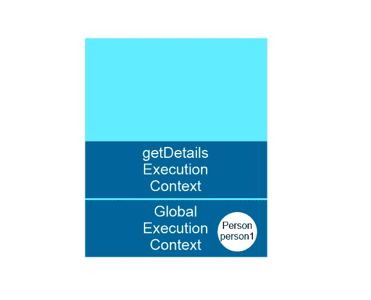
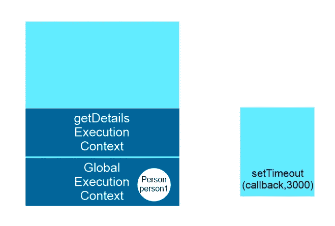
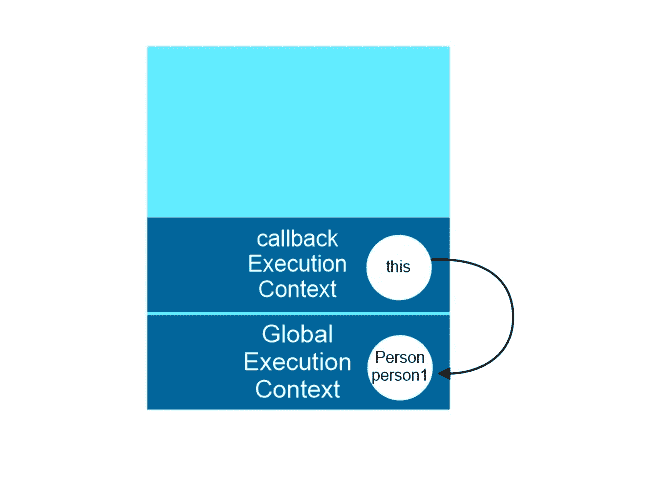
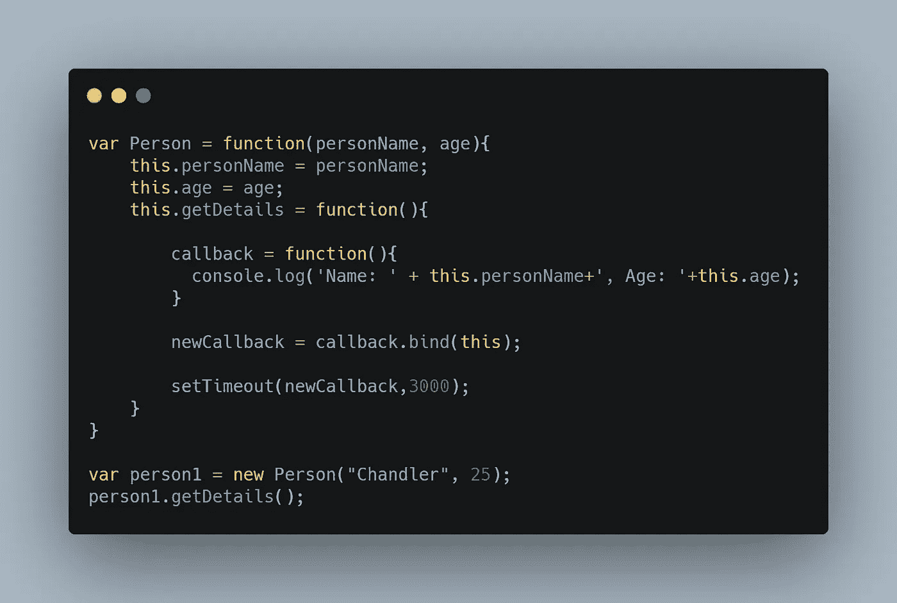
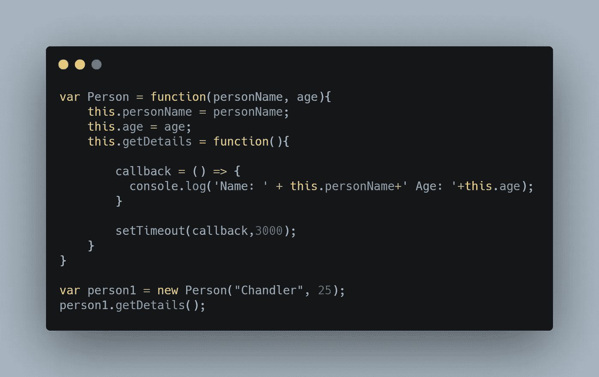

# “this”如何在 JavaScript 中绑定常规函数和箭头函数

> 原文：<https://javascript.plainenglish.io/this-binding-in-es6-arrow-function-70d80e216238?source=collection_archive---------1----------------------->


# Arrow 语法自动将其绑定到周围代码的上下文中。

让我解释一下那是什么意思！为此，我们必须首先了解使用箭头函数可以解决什么问题。

让我们讨论一下使用普通函数而不是箭头函数的场景。



这里的 **Person** 函数是一个构造函数。我们正在通过新的关键字创建一个对象 **person1** 。

```
var person1 = new Person('Joey Smith', 25);
```

1.  当执行这一行时，new 关键字后面的构造函数 Person 被调用，它设置使用 this.property_name 新创建的空对象的属性，该属性包括 **personName** 、 **age、**和函数 **getDetails** 。该构造函数隐式返回一个对象，该对象存储在 **person1** 变量中。
2.  然后，我们可以调用 person1 对象的成员函数 **getDetails** ，通过执行下面一行代码来控制 person 的详细信息。

```
person1.getDetails()
```

3. **getDetails** 有一个 **setTimeout** ，它将在指定时间后执行传递给它的函数(time 作为第二个参数传递给 setTimeout 函数)。在 setTimeout 中传递的回调是引用它的正常函数。

当执行上述代码时，会生成以下输出:

```
Name: undefined, Age: undefined
```

名字和年龄都不确定。哎呀。！这肯定不是你所期望的。

**为什么会这样？**
不需要输出的原因是，在正常函数**中，这个**关键字代表调用该函数的对象。当我们的函数 getDetails 被正常调用**时，这个**关键字表示全局对象，在我们的例子中是窗口对象，并且在全局对象中没有名为 **personName** 或 **age** 的变量，由于这两个变量都是未定义的。

但是在执行堆栈中发生了什么呢？

首先，全局执行上下文进入执行堆栈，在其变量环境中有一个构造函数 Person 和 person1 对象。person 对象是通过 new 关键字由上面解释的步骤创建的，然后存储在 Person 中。



Execution Stack

之后，全局执行上下文调用 getDetails 函数，该函数是 person1 对象的成员函数。当 getDetails 函数被调用时，它的执行上下文被创建并被推送到执行堆栈上。



Execution Stack

getDetails 函数有一个 setTimeout，它有一个回调函数，这个回调函数将进入回调队列(假设它是一个存放回调函数的存储区)，一旦执行上下文而不是全局执行上下文从执行上下文中弹出，这个回调函数就会被执行。



The left side is execution Context and on the right side is the setTimeout function waiting for the specified time to pass

当堆栈变空时(除了全局执行上下文)，回调将被执行，新的执行上下文将被创建。即回调被正常调用，并且**中的这个**关键字代表全局上下文。



Execution Stack

在正常调用函数的情况下，**这个**关键字代表全局上下文，当在全局上下文中没有找到 personName 和 age 变量时，它给出未定义。

这就是我们的问题，正常的函数调用代表的是调用函数的对象，而不是周围的上下文本身。

**这怎么解决？**

JavaScript 中的所有函数都可以独立访问一些特殊的方法，bind()、call()和 apply()就是其中的几个。一种解决方案是使用这些 bind()，call()或 apply()。通过使用这些方法，我们可以控制这个最终代表什么**。**

因此，通过使用这些方法，我们可以将这个人绑定到回调函数，这样我们的问题就解决了。下面是在回调函数上使用 bind 方法并将其绑定到 Person 的示例。



同样，我们可以使用 apply 和 call 方法。

> 但是，当问题可以通过改变语法来解决时，为什么要经历这么多麻烦呢？

在这种情况下，Arrow 函数用其简单的语法来拯救我们。

如果我们使用箭头函数作为回调函数，而不是普通函数，我们的问题就解决了。让我们看看代码。



在执行代码时，我们得到以下输出。

```
Name: Chandler, Age: 25
```

基本上在 arrow 函数中，这总是代表定义 Arrow 函数的对象。Arrow 语法自动将 ***this*** 绑定到周围代码的上下文中。在 Arrow 函数中，它不依赖于它们是如何被调用的，而是依赖于周围的上下文。