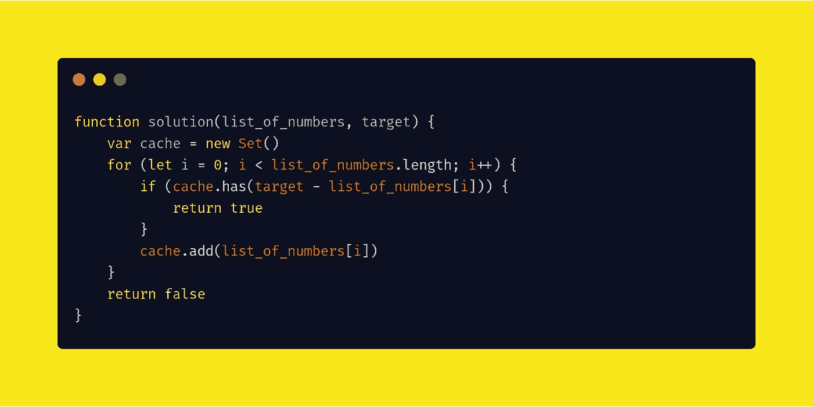
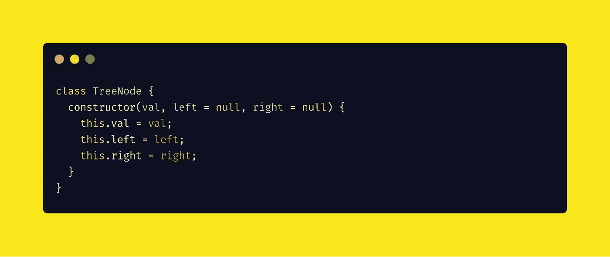
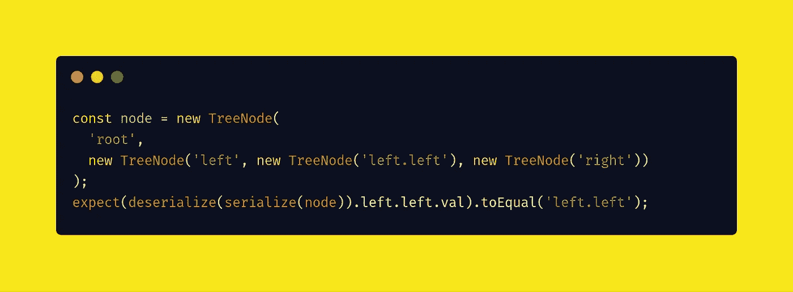
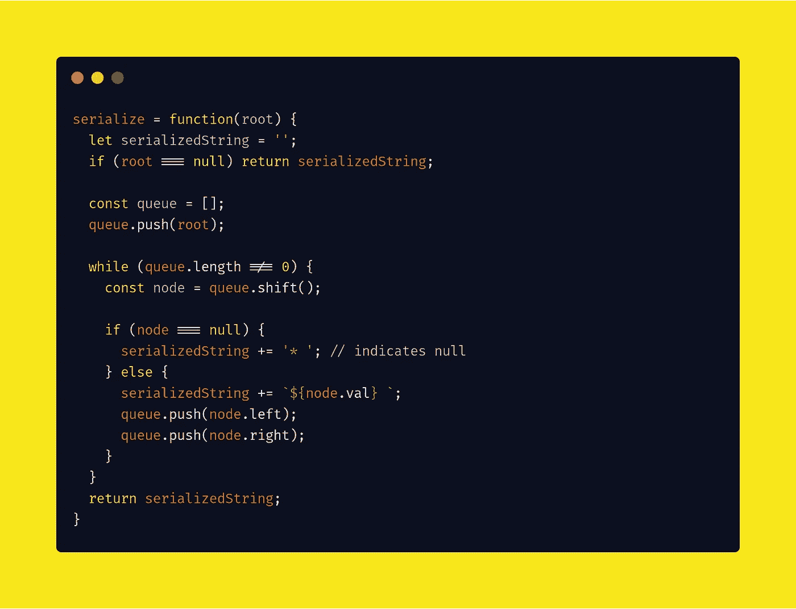
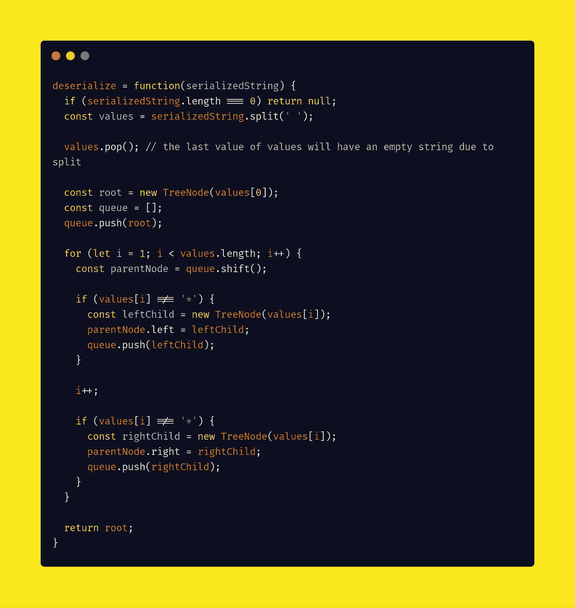

# 谷歌编码面试问题

> 原文：<https://javascript.plainenglish.io/this-coding-problem-was-recently-asked-by-google-81d14742f775?source=collection_archive---------1----------------------->

## 2020 年 5 月 9 日更新


## 日常编码问题

它们是受真实编程面试启发的各种各样的问题，带有深入的解决方案，清晰地带您了解每个核心概念。

> 通过每天解决一个问题，让*格外擅长编写面试代码。*

我们将一起使用 JavaScript 解决这些问题。

# 问题#1 是什么？

## 问题

给定一个数字列表和一个数字 k，返回列表中任意两个数字的总和是否为 k。

例如，给定[10，15，3，7]和 17 的 k，返回 true，因为 10 + 7 是 17。

## 如何用 JavaScript 解决？

首先，编写一个名为“ *solution* ”的函数—保存为“ *solution.js* ”，该函数接受两个参数并返回一个布尔值(true — false)。

这两个参数是 list _ number——数字列表和 target——k 的值。

```
function solution(list_of_numbers, target) {
    return false
}
```

接下来，我们声明一个空集变量来保存临时值

```
var cache = new Set()
```

然后，我们通过使用*循环*来访问数字列表中的每个元素。

```
for (let i = 0; i < list_of_numbers.length; i++) {
}
```

我们尝试测试缓存集是否包含目标减去当前项的值，或者不包含。如果缓存集不包含这个值，我们保存它并继续处理其他元素，否则返回 true。

```
if (cache.has(target - list_of_numbers[i])) {
    return true
} 
cache.add(list_of_numbers[i])
```

如果它不匹配任何元素，我们返回 *false 的值。*

```
return false
```

这个问题的最终源代码。



## 奖金

你能一次完成吗？

# 第二个问题是什么？

## 问题

给定二叉树的根，实现 serialize(root)和 deserialize(s)，serialize(root)将树序列化为字符串，deserialize(s)将字符串反序列化回树。

例如，给定下面的节点类。



以下测试应该通过。



## 解决办法

使用级别顺序遍历进行序列化。



从树的序列化字符串中构建树。



很简单，对吧？

我会更新谷歌周刊在这篇文章中提出的新问题🔖它重新阅读并获得最新的问题和解决方案。

感谢阅读😘，再见👋，别忘了👏跟着走。