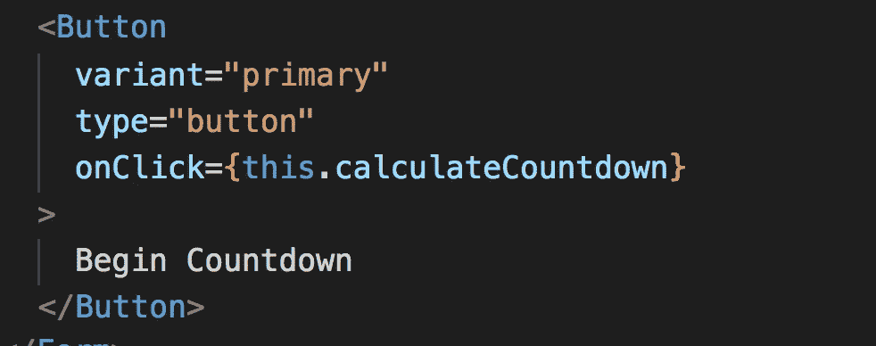

# 这就是我如何在 React 中创建了一个倒计时应用程序

> 原文：<https://javascript.plainenglish.io/this-is-how-i-created-a-countdown-timer-app-in-react-3644afbaabf6?source=collection_archive---------5----------------------->

## 创建一个简单好看的倒计时应用程序


Countdown Timer

被称为**黑色星期五销售**的年度最大销售刚刚结束，你可能已经收到数百封电子邮件，显示在 udemy、Pluralsight 等网站上购买任何课程或在有限时间内购买任何订阅的倒计时定时器。

在本文中，我们将实际构建一个真正的倒计时应用程序，如上图所示

所以让我们开始吧！

1.  使用创建新的 React 应用程序

```
 create-react-app countdown_timer
```

如果您没有安装`create-react-app`,请使用

```
npm install create-react-app -g
```

2.现在像 Visual Studio 代码一样，在您最喜欢的 IDE 中打开`countdown_timer`目录

3.删除`src`文件夹中除`index.js`以外的所有文件

4.在`index.js`中增加以下内容

5.我们将使用`react-bootstrap`进行基本的 CSS 样式设计。我们也将编写自己的 CSS。

6.从终端导航到`countdown_timer`目录并安装软件包

```
npm install bootstrap@4.4.1 react-bootstrap@1.0.0-beta.16
```

7.注意，`react-bootstrap`也需要`bootstrap`用于基本的 CSS，所以我们也添加了它

8.现在您的`package.json`将拥有如下所示的依赖项部分


package.json dependencies

9.为了选择日期和时间，我们将使用`react-datetime-picker`库。它非常容易使用，也非常强大。选择日期时，您可以使用键盘箭头键设置所有日期和时间字段。

你可以在[https://www.npmjs.com/package/react-datetime-picker](https://www.npmjs.com/package/react-datetime-picker)找到所有可用的选项和相关文档

10.安装`react-datetime-picker`包

```
npm install react-datetime-picker@2.8.0
```

11.在`src`文件夹中创建两个新文件，文件名分别为`Timer.js`和`styles.css`

12.在`styles.css`中增加以下内容

13.在`Timer.js`中增加以下内容

14.现在通过从终端运行`npm start`命令来运行应用程序

15.让我们了解一下`Timer.js`中发生了什么

*   在`render`方法中，我们添加了一个选择结束日期的表单和一个启动计时器的按钮
*   在那下面，我们正在显示倒数计时器部分
*   当我们点击`“Begin Countdown”`按钮时，我们正在调用`calculateCountdown`函数，该函数获取当前日期时间和结束日期时间，并找出两个日期之间的差异。



Countdown Start Button

*   在`calculateCountdown`方法中，对于`setState`方法，我们用计算出的值更新日、小时、分钟和秒，一旦状态被更新，我们在 1 秒(1000 毫秒)的延迟后使用`setTimeout`再次调用`calculateCountdown`函数
*   一旦组件被卸载(我们在`componentWillUnmount`方法中正在做),删除所有添加的事件处理程序并清除组件中的超时或间隔总是一个好的做法。

这就对了！我们已经创建了一个简单好看的倒计时应用程序。

Github 源代码:[https://github.com/myogeshchavan97/countdown_timer](https://github.com/myogeshchavan97/countdown_timer)

现场演示:[https://codesandbox.io/s/hopeful-sea-2l3ls](https://codesandbox.io/s/hopeful-sea-2l3ls)

今天到此为止。我希望您在构建这个应用程序时学到了很多东西。

**别忘了直接在你的收件箱** [**这里**](https://yogeshchavan.dev) **订阅我的每周简讯，里面有惊人的技巧、窍门和文章。**