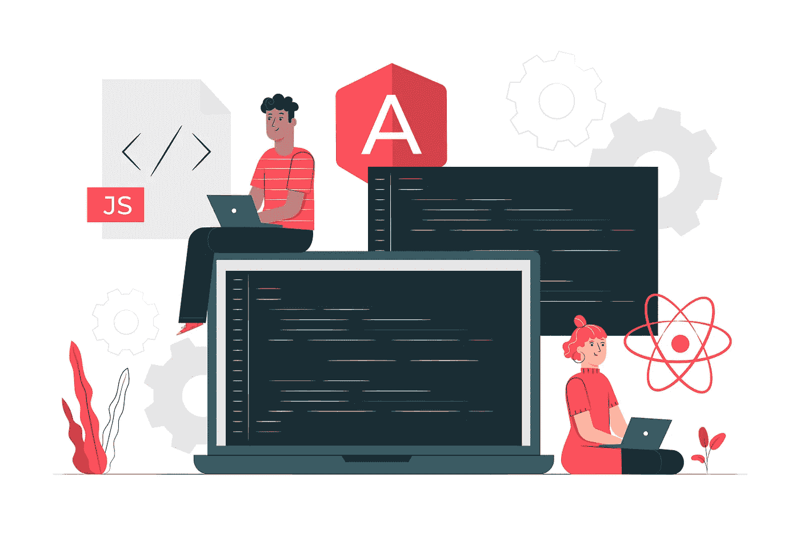

# 这是你在学习框架之前应该了解的 JavaScript 知识

> 原文：<https://javascript.plainenglish.io/this-is-how-much-javascript-you-should-know-before-learning-a-framework-86b32f108eb9?source=collection_archive---------5----------------------->

## 重温一下，让你的学习速度提高 3 倍

Image courtesy thanks to freepik.com

你的下一个职业目标是掌握 React 或 Vue 这样的现代框架吗？你不必花几个月的时间来练习普通的 JS，但是对你来说，对它的核心概念有一个坚实的理解是至关重要的，因为你将要使用的一切都是建立在它们之上的。

回调函数和定时器使用闭包，状态修饰符依赖纯函数，你向后端请求的每一个资源都将被异步发送回来。

所以你可以清楚地看到，掌握下面的概念不仅是必须的，而且更有效。

您可以拥有许多开发人员错过的知识，并且可以将您的学习速度提高三倍。你可以在面试中取得成功，永远不要害怕可能出现的新的未来技术。

 [## 为什么掌握普通的 JavaScript 会让你成为一名优秀的开发人员

### 比经验丰富的开发人员更优秀，因为他们拥有很多人都没有的知识

medium.com](https://medium.com/better-programming/why-mastering-vanilla-javascript-will-make-you-stand-out-as-a-developer-a99ae8c36d38) 

接下来，你会在你的网页开发资料中找到一些你需要的重要概念，以及在哪里可以很容易地学到它们。

## 了解范围界定、提升和关闭

你知道 JavaScript 实际上是一种编译语言吗？您知道它奇怪的编译过程负责创建作用域、变量访问规则和闭包吗？

从循环到定时器和回调函数，这些概念几乎遍布你的代码。理解代码中的变量为什么会以你编写代码时的方式结束是非常重要的。

要了解这一点，我可以推荐的最大资源是第一本书: [*你不知道 JS*](https://github.com/getify/You-Dont-Know-JS/blob/1st-ed/README.md) 指南。不要被单词书吓到，它只有 5 页长，但是它会给你一个到目前为止你所做的一切的新观点。

 [## getify/你不知道

### JavaScript 系列丛书。推特上的@YDKJS。为 getify/You-don-Know-JS 开发做出贡献，创建一个…

github.com](https://github.com/getify/You-Dont-Know-JS/blob/1st-ed/scope%20&%20closures/README.md#you-dont-know-js-scope--closures) 

## 知道如何操作数据

数组和对象是您最常使用的数据结构，尤其是在现代框架应用程序中呈现组件时。你应该牢牢掌握如何按照自己的意愿操纵它们:

*   [JavaScript 数组方法](https://javascript.info/array-methods)。
*   [贴图、缩小、过滤](https://medium.com/poka-techblog/simplify-your-javascript-use-map-reduce-and-filter-bd02c593cc2d)。
*   [JavaScript 对象方法](https://www.digitalocean.com/community/tutorials/how-to-use-object-methods-in-javascript)。

## 了解纯函数

函数式编程似乎是开发领域的下一个大突破。这也是纯函数背后的原理，你可以在 React 中找到，例如在处理减速器时。这是一个如今被越来越多地使用的概念，你应该知道它的原理以及它们是如何在现代框架中被使用的。

*   [掌握 JavaScript 中的函数式编程](https://medium.com/javascript-scene/master-the-javascript-interview-what-is-functional-programming-7f218c68b3a0#:~:text=Functional%20programming%20(often%20abbreviated%20FP,state%20flows%20through%20pure%20functions.)。

## 理解异步 JavaScript

你将不得不在你的 web 应用中不断地处理异步代码，因为前端和后端之间的通信不能简单地立即发生。从这个意义上说，承诺和现在的`asynx/await`是成功的工具:

*   [了解 JS 承诺](https://medium.com/better-programming/understanding-promises-in-javascript-13d99df067c1)。
*   [为什么异步/等待吹掉承诺](https://hackernoon.com/6-reasons-why-javascripts-async-await-blows-promises-away-tutorial-c7ec10518dd9)。

## 重述核心 ES6 概念

在进入下一个前沿框架之前，您应该回顾的其他概念包括常见的 ES6 概念:

*   [let vs const 变量。](https://medium.com/javascript-scene/javascript-es6-var-let-or-const-ba58b8dcde75#:~:text=%60const%60%20is%20a%20signal%20that,always%20the%20entire%20containing%20function.)
*   [箭头功能。](https://medium.com/better-programming/learning-javascript-arrow-functions-36cce13351c2)
*   [模块。](https://javascript.info/modules-intro)
*   [类。](https://www.digitalocean.com/community/tutorials/understanding-classes-in-javascript)
*   [模板文字。](https://developers.google.com/web/updates/2015/01/ES6-Template-Strings)
*   [展开操作符和休息参数。](https://medium.com/@luke_smaki/javascript-es6-spread-operator-and-rest-parameters-b3e89d112281#:~:text=The%20spread%20operator%20allows%20us,access%20them%20in%20an%20array.)
*   [毁灭。](https://javascript.info/destructuring-assignment)

## 结论

每个人都急于了解更多关于现代框架的知识，但往往忘记了从长远来看，扎实掌握普通 JS 是多么有帮助。希望这份指南能激励你更好地学习一些一直以来显而易见但却不公平地势利的东西。

— *皮耶罗*

## 资源

*   [为什么掌握 vanilla JS 会让你成为一名出色的开发人员](https://medium.com/better-programming/why-mastering-vanilla-javascript-will-make-you-stand-out-as-a-developer-a99ae8c36d38)。
*   [你不知道 JS](https://github.com/getify/You-Dont-Know-JS/blob/1st-ed/README.md) 。
*   [JavaScript 数组方法](https://javascript.info/array-methods)。
*   [贴图、缩小、过滤](https://medium.com/poka-techblog/simplify-your-javascript-use-map-reduce-and-filter-bd02c593cc2d)。
*   [JavaScript 对象方法](https://www.digitalocean.com/community/tutorials/how-to-use-object-methods-in-javascript)。
*   [let vs 常量变量。](https://medium.com/javascript-scene/javascript-es6-var-let-or-const-ba58b8dcde75#:~:text=%60const%60%20is%20a%20signal%20that,always%20the%20entire%20containing%20function.)
*   [箭头功能。](https://medium.com/better-programming/learning-javascript-arrow-functions-36cce13351c2)
*   [模块。](https://javascript.info/modules-intro)
*   [类。](https://www.digitalocean.com/community/tutorials/understanding-classes-in-javascript)
*   [模板文字。](https://developers.google.com/web/updates/2015/01/ES6-Template-Strings)
*   [传播算子和休息参数。](https://medium.com/@luke_smaki/javascript-es6-spread-operator-and-rest-parameters-b3e89d112281#:~:text=The%20spread%20operator%20allows%20us,access%20them%20in%20an%20array.)
*   [解构。](https://javascript.info/destructuring-assignment)
*   [了解 JS 承诺](https://medium.com/better-programming/understanding-promises-in-javascript-13d99df067c1)。
*   [为什么异步/等待吹掉承诺](https://hackernoon.com/6-reasons-why-javascripts-async-await-blows-promises-away-tutorial-c7ec10518dd9)。